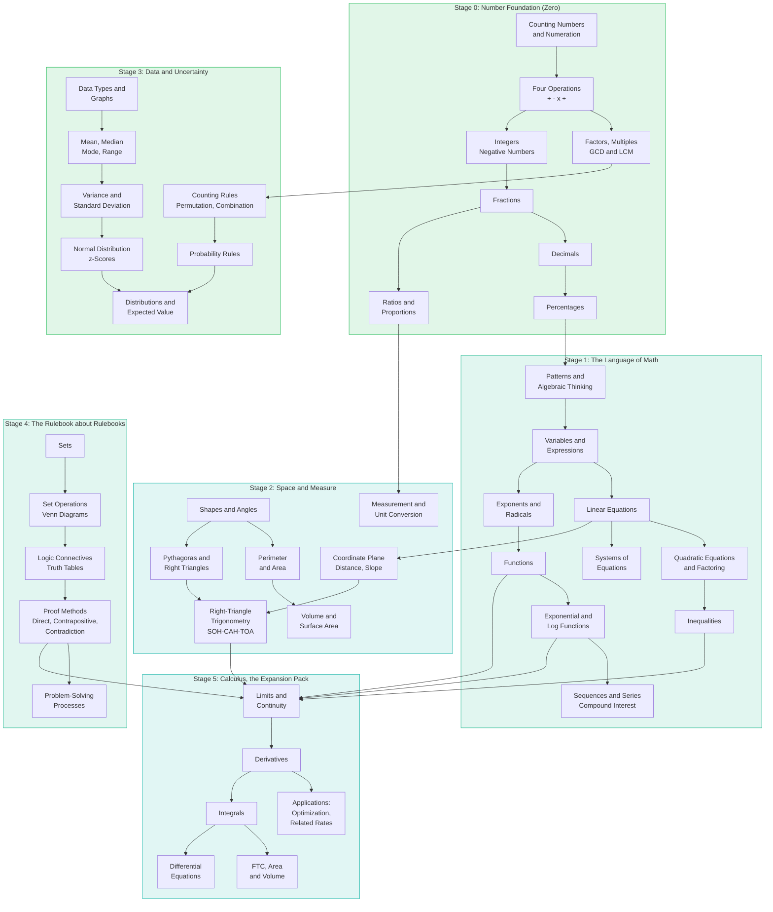
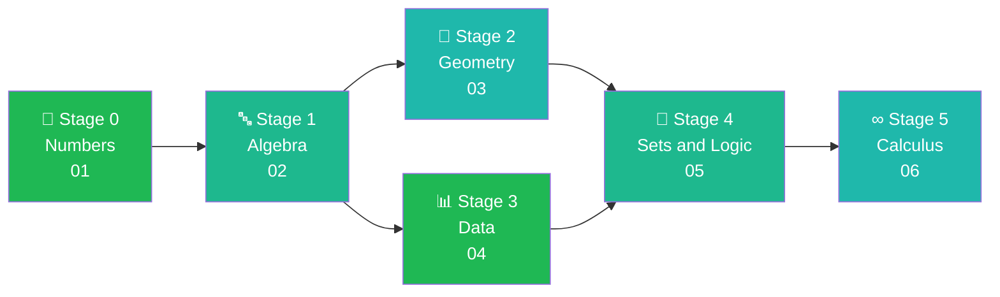

---
tags:
  - mathematics
  - cheatsheet
  - roadmap
level: "Meta: the map of all maps"
sources: ["[[00_Index]]"]
created: 2026-10-02
---

# Math Roadmap: From Counting Numbers to Calculus

> *"The board on the box lid: every piece, where it goes, and in what order you unlock it."*

This roadmap shows the entire journey as **one dependency map**: each node is a topic, each arrow means "learn this first". Click any node to jump to its cheat sheet rulebook.

---

## The Full Map

---

## The Same Journey as a Ladder

**The 5 unlock gates into Calculus** (arrows converging on Limits):

| Gate | Unlocked by | Rulebook |
|---|---|---|
| Algebra fluency | Equations, inequalities, functions | [[02_Algebra_and_Functions]] |
| Function shapes | Exponential, log, trig functions | [[02_Algebra_and_Functions]] |
| Right-triangle trig | SOH-CAH-TOA | [[03_Geometry_and_Measurement]] |
| Proof mindset | Logic, proof methods | [[05_Sets_Logic_and_Processes]] |
| Number maturity | Everything in Stage 0 | [[01_Numbers_and_Arithmetic]] |

---

## Stage Table

| Stage | Name | Topics | Cheat sheet | Source notes |
|---|---|---|---|---|
| 0 | Number Foundation | Numeration, operations, factors, integers, fractions, decimals, percentages, ratios | [[01_Numbers_and_Arithmetic]] | `Fundamental/01`–`09` |
| 1 | Language of Math | Patterns, expressions, equations, inequalities, functions, exponents/logs, sequences | [[02_Algebra_and_Functions]] | `Fundamental/10`–`11`, `Advance/02`–`06`, `08` |
| 2 | Space and Measure | Angles, shapes, area/volume, units, coordinates, right-triangle trig | [[03_Geometry_and_Measurement]] | `Fundamental/12`–`16`, `Advance/07` |
| 3 | Data and Uncertainty | Graphs, statistics, counting, probability, distributions | [[04_Data_Probability_and_Statistics]] | `Fundamental/18`–`19`, `Advance/17`, `19` |
| 4 | Rulebook about Rulebooks | Sets, logic, proofs, problem-solving | [[05_Sets_Logic_and_Processes]] | `Fundamental/17`, `20`, `Advance/01`, `21` |
| 5 | Calculus (expansion pack) | Limits, derivatives, integrals, differential equations | [[06_Calculus]] | `Advance/14`–`16`, `23` |

---

## How to Read This Map

1. **Follow arrows**: an arrow `X → Y` means "X is a prerequisite of Y". You may learn nodes in any order that respects the arrows.
2. **Stages are not strict**: Stage 2 and Stage 3 can be learned in parallel after Stage 1. Only Calculus waits for everything.
3. **Click a node** to open its cheat sheet rulebook; the cheat sheet's own chain links (⬅ · ➡) walk you through in reading order.
4. **The practical finish line is Stage 4**: everything up to here covers everyday math. Stage 5 is the expansion pack for science, engineering, and economics.

---

## Chain Navigation

⬅ [[00_Index]] · ➡ [[01_Numbers_and_Arithmetic]]
