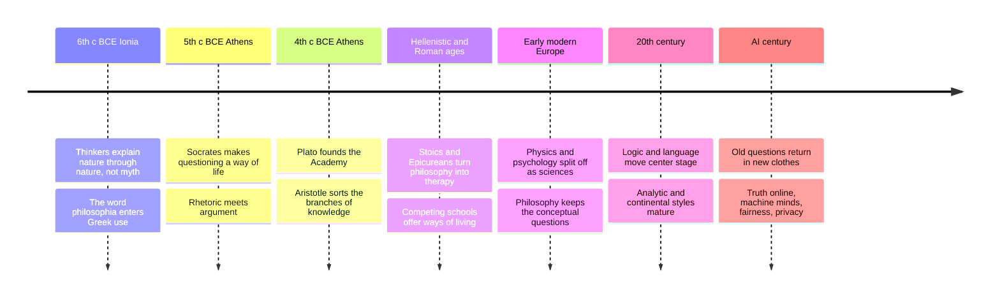

# 01 — What Is Philosophy — ปรัชญาคืออะไร

> *"Philosophy is a battle against the bewitchment of our intelligence by means of language."* : Ludwig Wittgenstein, Philosophical Investigations

Philosophy (ปรัชญา) literally means "love of wisdom": from the Greek philia (love) and sophia (wisdom). A philosopher is therefore not a sage on a mountain but someone who keeps asking "why?" past the point where most people stop. Tradition credits Pythagoras with first refusing the title "wise" and claiming only to be a lover of wisdom.

Why an adult should care: you already do philosophy several times a week without noticing. Every "that's not fair" is ethics. Every "how do we actually know that claim is true?" is epistemology. Every time an advertisement or a political slogan feels slippery and you cannot say why, that is a logic problem waiting to be untangled. This note maps the whole field: its six main branches, the moves philosophers make, and how philosophy differs from science and religion. Later notes in this folder then walk the history; this one hands you the toolbox first.

---

## 1 | Historical Context

The Western tradition begins in Ionia (today's Aegean coast of Turkey) in the 6th century BCE, when a handful of thinkers started explaining the world without stories about gods. They wanted an account a person could question, test, and improve, not merely recite. Greek culture already had mythos (myth, มายธอส), the inherited narrative way of explaining; the newcomers added logos (rational account, โลโกส). The tension between explanation-by-story and explanation-by-argument still drives philosophy today.

Over 2,500 years, philosophy spun off nearly every other discipline. Physics, astronomy, psychology, economics, and computer science all began as branches of "natural philosophy"; Newton's 1687 masterwork is titled Mathematical Principles of Natural Philosophy. When a question becomes answerable by measurement and experiment, it leaves philosophy and becomes a science. What philosophy keeps are the questions that hinge on concepts, values, and the rules of reasoning itself: What is justice? What makes a mind the same mind across forty years? What makes a law binding? Better microscopes cannot answer those; careful argument can make progress on them.

"Western" here is a path through the history, not a claim of superiority. Indian, Chinese, and the Buddhist world built their own rigorous philosophical traditions (note 20 covers them). Thai readers actually begin with an advantage: Pali and Sanskrit analytic vocabulary (ธรรม, อรรถ, เหตุ, ผล) maps onto many Greek distinctions, and this folder will use that repeatedly.

## 2 | Core Concepts

### 2.1 The branch map: six doors into one field

| Branch | Thai | Central question | A question you already ask |
|---|---|---|---|
| Metaphysics | อภิปรัชญา | What is real? What kinds of things exist? | Did numbers exist before humans, or only in minds? |
| Epistemology | ญาณวิทยา | What is knowledge and how do we get it? | When is a belief justified enough to count as knowing? |
| Ethics | จริยศาสตร์ | How should we act? What makes a life good? | Is it wrong to buy things made at someone else's ruinous wages? |
| Logic | ตรรกศาสตร์ | Which inferences are valid, whatever the topic? | If the premises are true, must the conclusion be true? |
| Aesthetics | สุนทรียศาสตร์ | What are beauty, art, and taste? | Can a mass-produced photo be art? |
| Political philosophy | ปรัชญาการเมือง | What makes power legitimate? What is a just society? | Why keep a law you think is wrong? |

### 2.2 What makes a question philosophical

| Test | Meaning | Fails on |
|---|---|---|
| Conceptual | Settled by clarifying ideas, not sampling things | "What time is it?" |
| Normative | About what should be, not only what is | "What do most people do?" |
| Foundational | About the ground other questions stand on | "Which brand is cheaper?" |
| Universal | About anything at all, not one lab specimen | "Is this specific mango ripe?" |

### 2.3 How to ask good questions: five philosopher's moves

| Move | Thai gloss | The question to ask |
|---|---|---|
| Clarify terms | นิยามศัพท์ | What exactly do you mean by "natural", "fair", "fake news"? |
| Surface assumptions | เปิดข้อสมมติฐาน | What must already be true for that argument to work? |
| Test with counterexamples | ตัวอย่างค้าน | Can you picture one case where the rule gives a silly result? |
| Steelman the other side | สร้างฝ่ายตรงข้ามให้เข้มแข็งที่สุด | How would the smartest opponent phrase their view? |
| Trace consequences | ไล่ตามผลต่อไป | If that is true, what else follows? Are you willing to accept that too? |

The goal is never to "win". The goal is to leave a conversation knowing more than you did entering. A useful philosophical result can even be aporia (ความจนปัญญา, the productive impasse of realizing your old answer collapsed): better confused in a new, deeper way than certain in a shallow one.

### 2.4 Philosophy vs science vs religion

| Dimension | Philosophy | Science | Religion |
|---|---|---|---|
| Typical question | What do "cause", "mind", "justice" mean? | What happens, how often, under what law? | What is the meaning of it all, and how should we live accordingly? |
| Method | Analysis and argument from cases | Observation, measurement, experiment: see [[Science/Fundamental/01_Scientific_Method|the Scientific Method note]] | Scripture, tradition, practice, community reasoning |
| What settles it | Whether the argument survives counterexample | Whether prediction survives testing | Faith seeking understanding; arguments vary by tradition |
| Relation | Supplies and audits the concepts science takes for granted | Settles questions once measurable, then leaves the field | Defenders of religion argue science and philosophy are silent on ultimacy; secular philosophers answer that silence is not evidence. Presenting both: no verdict is forced here |

Three ways of asking large questions, not three rival tribes. Many scientists and many religious people do first-rate philosophy informally; plenty of professional philosophers do neither. The boundaries are the interesting part.

### 2.5 Spotting bad arguments in daily media

| Fallacy (ตรรกวิบัติ) | Thai gloss | How it sounds in your feed |
|---|---|---|
| Ad hominem | โจมตีตัวบุคคล | "Why listen to that economist? Her marriage failed." |
| Straw man | หุ่นฟาง | "My opponent wants to gut the budget" (said of a proposal to audit it) |
| False dilemma | ทางเลือกเทียม | "Either you support this law or you support criminals." |
| Slippery slope | ทางลาด | "If teens get one hour of games, they will all drop out of school." |
| Appeal to authority | อ้างคนดัง | A famous singer says this drink cures fatigue. |
| Appeal to emotion | อ้อนความรู้สึก | A sad puppy photo attached to a policy claim with zero evidence |
| Circular reasoning | เหตุผลวน | "It is true because the source says so; the source is reliable because it tells the truth." |
| Correlation as cause | สัมพันธ์ mistaken เป็นเหตุ | "Ice-cream sales and drownings both rise in summer, so ice cream causes drowning." |

## 3 | Timeline

## 4 | Key Thinkers and Ideas

| Thinker | Dates | Big idea for this note | Must-Know Work |
|---|---|---|---|
| Socrates | c. 470-399 BCE | The examined life; questioning as method | Plato's Apology |
| Aristotle | 384-322 BCE | First systematic sorting of the branches; invented formal logic | Organon; Metaphysics |
| René Descartes | 1596-1650 | Doubt everything methodically; see what survives | Meditations on First Philosophy |
| David Hume | 1711-1776 | Showed how much everyday reasoning rests on habit, not proof | An Enquiry Concerning Human Understanding |
| Immanuel Kant | 1724-1804 | Drew the boundary of what we can know, defended what we must still think | Critique of Pure Reason |
| Ludwig Wittgenstein | 1889-1951 | Many philosophical puzzles are misunderstandings of language | Philosophical Investigations |

Socrates matters to "what is philosophy" because he embodies its stance: admit ignorance first, then question everything, and treat the questioning itself as the point. Aristotle matters because every branch list in the world descends from his sorting of knowledge into theoretical, practical, and productive sciences. Descartes and Hume dramatize epistemology at full power; Kant's Critique is the classic negotiation between them. Wittgenstein explains why clarifying words must come before building theories about the world.

## 5 | Thai Terminology

| Thai | English | Notes |
|---|---|---|
| ปรัชญา | Philosophy | From Sanskrit darshana: a view, a way of seeing |
| ผู้รักปัญญา | Philosopher | Literal rendering of the Greek |
| อภิปรัชญา | Metaphysics | Beyond-physics: what is real |
| ญาณวิทยา | Epistemology | Study (วิทยา) of knowledge (ญาณ) |
| จริยศาสตร์ | Ethics | Study of moral conduct |
| ตรรกศาสตร์ | Logic | Study of valid reasoning |
| สุนทรียศาสตร์ | Aesthetics | Study of beauty and art |
| ปรัชญาการเมือง | Political philosophy | Power, legitimacy, justice |
| ข้ออ้าง | Premise | In Thai logic classrooms also เหตุ |
| ข้อสรุป | Conclusion | Also ผล |
| ตรรกวิบัติ | Fallacy | Defective reasoning |
| ตัวอย่างค้าน | Counterexample | One case that breaks a general rule |
| ความเห็นต่างอย่างสมเหตุสมผล | Reasonable disagreement | The state philosophy handles best |

## 6 | Why It Matters Today

**The family group chat.** An aunt forwards a claim about a vaccine, a gold price, or a neighbor's politics. The branch map tells you which question to ask: What exactly is being claimed (logic)? How could we know it (epistemology)? Who benefits from believing it (political philosophy)? You do not need to be rude; you need only the moves from section 2.3.

**Workplace decisions.** Promotion criteria, algorithmic HR, "is this target fair?": these are applied ethics and political philosophy with a lanyard. Digital citizenship training is mostly philosophy with policy bolted on: privacy, consent, and harm are conceptual questions. See [[Science/Advance/Computer Science/12_Digital_Citizenship]].

**Parenting and AI.** When a child asks "what was there before the universe?", that is metaphysics, and answering honestly is a gift. When your family asks whether a chatbot "understands", see note 21. School mathematics and logic share one ancestor with philosophy: validity. See [[Mathematics/Advance/21_Mathematical_Reasoning]].

**Thai civic life.** Debates over the Sufficiency Economy, the duties of citizens, and the limits of speech are moral and political philosophy in motion: see [[Social Studies/02 Civics/12_Media_Literacy|Media Literacy]] and [[Social Studies/01 Religion/04_Moral_Reasoning|Moral Reasoning]]. Philosophy will not pick your candidate. It will clarify what the arguments are actually claiming, which is precisely what a voting adult needs.

## 7 | Further Reading

- *A Little History of Philosophy* by Nigel Warburton: 40 brief chapters, one thinker each; the friendliest door into the tradition and a backbone for this whole folder.
- *Think: A Compelling Introduction to Philosophy* by Simon Blackburn: not history but the branches themselves, each chapter a live problem argued clearly.
- *The Problems of Philosophy* by Bertrand Russell: a 1912 classic on knowledge, short and lucid.

## Related

- [[Philosophy/00_overview|← Philosophy Overview]]
- [[02_Pre_Socratic_Philosophers]]
- [[Science/Fundamental/01_Scientific_Method|the Scientific Method note]]
- [[Mathematics/Advance/21_Mathematical_Reasoning]]
- [[Science/Advance/Computer Science/12_Digital_Citizenship]]
- [[Social Studies/01 Religion/04_Moral_Reasoning|Moral Reasoning]]
