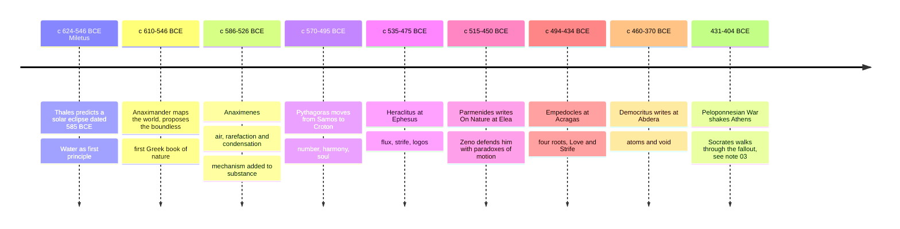

# 02 — Pre-Socratic Philosophers — นักปรัชญายุคก่อนโสกราตีส

> *"You cannot step twice into the same rivers."* : Heraclitus, fragment

The Pre-Socratics (กลุ่มก่อนโสกราตีส) were the thinkers who worked in the Greek world before and alongside Socrates, roughly 610 to 400 BCE. They asked one deceptively simple question: what is everything made of, and what holds it together? Their answer mattered more than its content: an explanation of nature from nature itself (physis, ธรรมชาติ), not from the whims of gods. That single move founded both philosophy and science. Every physicist hunting for a unified theory is still playing their game.

If you remember nothing else: philosophy did not begin with ethics or with "how to live". It began with cosmology (จักรวาลวิทยา), the audacious claim that this vast, terrifying, beautiful whole is one intelligible system that a human mind can describe.

---

## 1 | Historical Context

Miletus (มิเลตัส) was the place: a prosperous, literate Greek trading city on the Ionian coast (today's Turkey) in the 6th century BCE. Daily contact with Egyptian and Babylonian astronomy and mythology, plus sea-trade exposure to utterly different creation stories, supplied the provocation: if every city's gods disagree, maybe the gods-in-stories are not the real explanation.

Homer and Hesiod had supplied the older framework: mythos (มายธอส), the narrative tradition. The Milesians and their successors introduced logos (เหตุผลวาทะ / โลโกส), an account that could be stated, criticized, and revised without offending anyone's piety. They still wrote partly in verse and spoke of "gods" metaphorically, but the method was new: propose a theory, test it against observation, accept counterexamples. No temple, no priesthood, no scripture: just argument in public.

The tradition spread outward from Miletus: to Croton in southern Italy (Pythagoras), to Elea in the west (Parmenides and Zeno), to Abdera in the north (Democritus), and finally to Athens itself, where Pericles' circle absorbed all of it by the mid-5th century.

## 2 | Core Concepts

### 2.1 The arche question: what is the one stuff behind many things?

| Thinker | Approx. dates | Home | The arche (ต้นกำเนิดสสาร, first principle) | Why they thought so |
|---|---|---|---|---|
| Thales | c. 624-546 BCE | Miletus | Water | Life needs moisture; things freeze or dry out; earth floats on water |
| Anaximander | c. 610-546 BCE | Miletus | The apeiron (the boundless, สิ่งไม่มีขอบเขต) | No specific element could dominate the others; the source must be neutral and unlimited |
| Anaximenes | c. 586-526 BCE | Miletus | Air | Air thickens into wind, cloud, water, earth by condensation; thins into fire |
| Xenophanes | c. 570-475 BCE | Colophon | One god; all things earth and water | Critic of anthropomorphic gods: "if oxen had hands, they would draw ox-gods" |
| Heraclitus | c. 535-475 BCE | Ephesus | Fire and the logos | Change is the deep structure; fire measures all things; the logos governs |
| Pythagoras | c. 570-495 BCE | Samos, then Croton | Number (ตัวเลข) | Musical harmony, geometry, astronomy all show that reality is patterned by number |
| Parmenides | c. 515-450 BCE | Elea | Being (สิ่งที่มีอยู่จริง, to on) | Reason alone, not the senses: what-is cannot come from what-is-not, so change is unreal |
| Empedocles | c. 494-434 BCE | Acragas | Four "roots": fire, air, earth, water, mixed by Love and Strife | Change is real but not creation from nothing: recombination of eternal elements |
| Anaxagoras | c. 500-428 BCE | Clazomenae, then Athens | Nous (mind, จิต) arranging infinitely divisible seeds | "Mind" set the original rotation that sorted the cosmos |
| Democritus and Leucippus | 5th c. BCE | Abdera | Atoms (atomos, "uncuttable") and void | Divide stuff far enough and you reach uncuttable bits moving in empty space |

### 2.2 Heraclitus: everything flows

Heraclitus (เฮราคลิตัส) is the philosopher of change. His surviving fragments are deliberately oracular, but the core is clear:

- **Panta rhei (ทุกสิ่งไหลไป):** reality is process, not inventory. You cannot step into the same river twice: the water has moved on and so have you.
- **Strife is justice:** opposites need each other. The bow and the lyre work because the string is pulled both ways.
- **The logos (โลโกส):** change is not chaos.  There is a rational structure, a measure ("fire kindled in measures and going out in measures") that ordinary people sleepwalk through: "though the logos is common, the many live as if they had a private understanding."

This resonates strongly with the Buddhist three marks, especially anicca (อนิจจะ, impermanence), but Heraclitus posits a rational order (logos) underlying flux, whereas early Buddhist analysis declines to posit any such ground. Near twins, not the same thing.

### 2.3 Parmenides: the case against the senses

Parmenides (พาร์เมนิดีส) argued the opposite extreme, in strict verse, and his argument is the first great piece of deductive reasoning in Western thought:

1. What-is (Being) can be thought and spoken; what-is-not cannot.
2. Therefore Being cannot come from what-is-not (that would be something arising from nothing).
3. Being is therefore uncreated, indestructible, whole, continuous, unchanging, and perfectly "like a well-rounded sphere".
4. Change, birth, death, and plurality are therefore illusions of the senses; the way of opinion must yield to the way of truth.

This is the birth of rationalism and of metaphysics (อภิปรัชญา): reality may be radically unlike what it appears, and pure reason, not observation, decides. The rest of ancient philosophy is largely a response: how do you save the phenomena of change without absurdity? Plato's Forms, the atomists' void, and Aristotle's matter and form all answer Parmenides.

### 2.4 The atomists: Democritus and Leucippus

The atomistic answer is elegant. Nothing comes from nothing, and what-is is full and unchanging (both concessions to Parmenides): namely, tiny "atoms" (atomos, ปรมาณู, "the uncuttable"), eternally real, differing only in shape, size, and position, moving through the void, which they dare to call "what-is-not" and claim really exists. Everything you see is atoms aggregating and dissolving, never created or destroyed.

- Qualities like color, taste, and temperature are "by convention"; atoms and void are "in truth", as Democritus put it. Sound modern physics: the color of a leaf is an interaction event, not an intrinsic property.
- Democritus drew ethical consequences: cheerfulness (euthymia, ความสบายใจ) comes from moderation, not sensory feasts.
- Epicurus and Lucretius inherited the physics (see [[06_Hellenistic_Philosophy]]); Gassendi, Newton, and Dalton revived it in the 17th-19th centuries. Modern atomic theory vindicated the *strategy*, not the *details*: atoms are divisible, and the true "stuff" is fields and particles far stranger than Democritus's hooks-and-eyelets shapes.

### 2.5 Pythagoras: reality is mathematical

Pythagoras (พีทาโกรัส) was as much a religious community leader as a theorist: at Croton his brotherhood kept silence, vegetarianism, and mathematical study, holding the soul immortal and transmigrating (metempsychosis, การเวียนว่ายตายเกิด: remindful of Buddhist rebirth, except that the Pythagorean soul is a permanent self, which Buddhist teaching explicitly denies: compare [[Social Studies/01 Religion/01_Buddhist_Principles|Buddhist Principles]]). Philosophically his move was to say the arche is not a stuff but a structure: number. The discovery that musical intervals correspond to whole-number string ratios (the octave 2:1, the fifth 3:2) convinced them the cosmos itself is tuned like a lyre: "all is harmony". Plato absorbs this directly, and physics has never stopped finding nature's arithmetic: symmetry groups, conservation laws, constants.

## 3 | Timeline

## 4 | Key Thinkers and Ideas

| Thinker | Dates | Big Idea | Must-Know Work or Fragment |
|---|---|---|---|
| Thales | c. 624-546 BCE | Nature explains itself; water as arche; first Greek astronomer-geometer | No surviving texts; Aristotle reports him; the story adds the 585 BCE eclipse and the olive-press corner he bought to mock "useless" philosophers |
| Anaximander | c. 610-546 BCE | The boundless (apeiron); life from moisture; speculative evolution; the first sundial | On Nature (title only survives) |
| Heraclitus | c. 535-475 BCE | Flux, unity of opposites, the logos | On Nature: ~130 fragments survive |
| Parmenides | c. 515-450 BCE | Being is one and unchanging; the way of truth vs the way of opinion | On Nature: substantial fragments remain |
| Zeno of Elea | c. 490-430 BCE | Paradoxes (Achilles, the arrow, the stadium) defending Parmenides | Book of arguments quoted by Aristotle and Plato |
| Empedocles | c. 494-434 BCE | Four elements plus two forces: a two-stuff theory of change | On Nature; Purifications |
| Anaxagoras | c. 500-428 BCE | Nous (mind) and "seeds"; "a thing is what it is because of its predominant ingredients" | On Nature fragments |
| Democritus | c. 460-370 BCE | Atoms, void, determinism, euthymia | Over 50 titles survive, fragments only |

Zeno's paradoxes deserve a line because every student meets them: if Achilles must first reach where the tortoise was, and the tortoise keeps moving on, does he ever pass it? Aristotle's answer (a line is not built out of points the way a journey is built out of stops) held for two thousand years; the calculus settled the mathematics without fully closing the philosophy.

## 5 | Thai Terminology

| Thai | English | Notes |
|---|---|---|
| ปรัชญาธรรมชาติ | Natural philosophy | The Pre-Socratics' own project |
| ต้นกำเนิดสสาร / มูลธาตุ | Arche (first principle) | Empedocles' four roots: ดิน น้ำ ไฟ ลม |
| ปรมาณู / อะตอม | Atom | Greek atomos: "uncuttable" |
| สุญญตา / ที่ว่าง | The void | Careful: Buddhist sunnata (สุญญตา) means emptiness of intrinsic existence, not Democritus' empty space |
| โลโกส | Logos | Reason, order, account: cf. เหตุผล |
| การเปลี่ยนแปลง | Change, flux | Panta rhei (ทุกสิ่งไหลไป) matches อนิจจะ (impermanence) |
| สิ่งที่มีอยู่จริง | Being (Parmenides' to on) | Uncreated, unchanging |
| ธรรมชาตินิยม | Naturalism | Explaining nature by nature |
| จักรวาลวิทยา | Cosmology | Study of the cosmos as a whole |
| ความกลมกลืน | Harmony | The Pythagorean key word |
| เหตุการณ์ทางประจักษ์ | Empirical observation | The atomists prized it: "a little knowledge in the real world beats much in the abstract", Democritus |

## 6 | Why It Matters Today

**Modern physics is their descendant.** The Higgs boson, dark matter, string theory: all are attempts at a deeper "stuff", exactly the Milesian project with 2,500 more years of data. When a Thai science journalist writes about "the universe from nothing", Parmenides ("nothing comes from nothing") is the oldest voice in the argument, and cosmologists still negotiate with it.

**Climate and systems thinking.** Heraclitus' insight that reality is process and that opposites co-operate reads like modern ecology: everything flows, everything is connected, extract a river and the whole downstream system changes. Thinking in processes rather than things is exactly what an adult needs to discuss water policy or air quality intelligently.

**"What is real? Convention vs truth."** Democritus' "color by convention, atoms in truth" is the daily news cycle in miniature: which features of the world are in the things and which are in our responses to them (money's value, borders, brand prestige)? See [[Social Studies/02 Civics/12_Media_Literacy|Media Literacy]].

**Science literacy for parents.** Understanding that science began as a tradition of public, revisable explanation (logos over mythos) helps explain to children why "the scientists changed their minds" is not a scandal but the method working: see [[Science/Fundamental/01_Scientific_Method|the Scientific Method note]].

**Argumentation hygiene.** Parmenides shows what pure deduction can do: start from a premise you cannot deny and walk somewhere startling. These are the ancestors of every thought experiment you meet in a modern podcast or courtroom, and reading the originals trains the instinct to hunt for the premise doing the hidden work. Compare [[Mathematics/Advance/01_Sets_and_Logic]].

## 7 | Further Reading

- *The Story of Philosophy* by Will Durant: opens with these figures, written with a novelist's warmth; the reason many adult readers ever met them.
- *The Presocratic Philosophers* ed. Kirk, Raven, and Schofield: the standard English collection of fragments with commentary, for reading Heraclitus himself rather than about him.

## Related

- [[Philosophy/00_overview|← Philosophy Overview]]
- [[01_What_Is_Philosophy]]
- [[03_Socrates_and_the_Socratic_Method]]
- [[Science/Fundamental/01_Scientific_Method|the Scientific Method note]]
- [[Social Studies/04 History/02_World_History_and_Civilizations|World History and Civilizations]]
