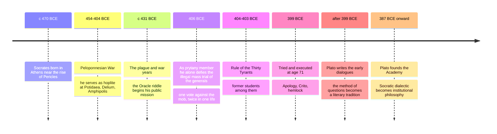

# 03 — Socrates and the Socratic Method — โสกราตีสและวิธีโสกราตีส

> *"The unexamined life is not worth living."* : Socrates, Plato's Apology 38a

Socrates (โสกราตีส, c. 470-399 BCE) is the hinge of the Western tradition. Before him, philosophy mostly studied the cosmos; after him, it had to reckon with the human soul, the meaning of words, and how one ought to live. He wrote nothing: everything we have comes from others, above all his student Plato (เพลโต) and the general Xenophon (เซโนโฟน), so "the historical Socrates" is partly a matter of interpretation. The portrait below follows Plato's early, likely most faithful dialogues.

For an adult reader the value is practical: the Socratic method (วิธีโสกราตีส) is a trainable skill. It is how you find out what you actually believe, how you discover that a confident colleague has a hollow answer, and how you question your own mind before someone else's.

---

## 1 | Historical Context

Socrates lived his entire adult life in Athens through its rise and catastrophic fall. Born around 470 BCE to a stonemason father and a midwife mother, he came of age under Pericles, then watched the 27-year Peloponnesian War against Sparta (431-404 BCE) grind the city down. He served as a hoplite at Potidaea, Delium, and Amphipolis, and was famous for trance-like concentration and for outdrinking anyone without stumbling.

Athens executed him in 399 BCE, at age 71. The political reading of the charge matters: Athens had lost the war, suffered a brutal Spartan-imposed oligarchy (the Thirty Tyrants, 404-403 BCE), and restored its democracy by amnesty. Several of the Thirty had been associates of Socrates (Critias, Charmides). The city could not officially prosecute philosophy, so the indictment was: impiety (not acknowledging the city's gods, introducing new spiritual things) and corrupting the young. The real fear was that the sons of the aristocracy, trained in his style of argument, had become its enemies.

## 2 | Core Concepts

### 2.1 The examined life (ชีวิตที่ไตร่ตรอง)

| Socratic claim | Greek / Thai gloss | What it means |
|---|---|---|
| Care of the soul | epimeleia tes psyches, การบำรุงเลี้ยงจิตใจ | Your character (are you just?) matters more than your property, reputation, or body |
| The unexamined life | ho de anexetotos bios | A life never interrogated about its own values is not fully a human life: it is drift |
| Knowledge is virtue | episteme = arete | Nobody does wrong knowingly; evil is a kind of ignorance, a miscalculation of what truly benefits you |
| Better to suffer wrong than do it | (Gorgias) | Doing injustice damages your soul, the one thing you cannot afford to break |
| "I know that I know nothing" | the Socratic paradox (in Thai usually: ข้ารู้ว่าข้าไม่รู้) | Not modesty theater: he claims only the wisdom of recognizing one's own ignorance, which the oracle's riddle exposed in others |

The paradox deserves unpacking. In the Apology, his friend Chaerephon asks the Oracle at Delphi whether anyone is wiser than Socrates; the Oracle says no. Convinced he knows nothing of the great matters, Socrates tries to disprove it by interviewing politicians, poets, and craftsmen, each of whom claims knowledge beyond their actual craft. Conclusion: he is wisest only in this, that he does not think he knows what he does not know (aporia-awareness, ความรู้ตัวว่าไม่รู้). An invitation, not a boast: join the investigation, since neither of us has the answer.

### 2.2 Elenchus: the cross-examination method

Elenchus (elenchos, การสอบคัดด้วยคำถาม, literally "testing" or "refutation") is Socrates' engine. Its standard moves:

1. Someone asserts a definition: "Courage is X."
2. Socrates asks for the definition, not examples: what makes all courageous acts courageous?
3. Together they accept premises that seem obvious.
4. Socrates shows those premises are inconsistent with the definition.
5. The interlocutor admits the problem (aporia) and they revise; usually the revision fails too, delivering clarity about what any answer must do.

**One fully worked example: "What is courage?"** (from Plato's Laches)

| Step | Who | Utterance / move | What it does |
|---|---|---|---|
| 1 | Socrates | Laches, what is courage itself? Not a list of courageous acts. | Demands the definition (นิยาม), the one form common to all cases |
| 2 | Laches | A man who stands his post in battle and does not run. | Offers an example, not a definition |
| 3 | Socrates | Fine, but people are courageous in shipwrecks, disease, poverty, even pleasure and pain. Is running also sometimes courage (as when cavalry feigns retreat)? | Shows the example excludes cases it must cover |
| 4 | Laches (revise 1) | Then courage is a kind of endurance of the soul. | Now it is a mental state |
| 5 | Socrates | But endurance with ignorance (a soldier who stands because he wrongly thinks reinforcements come) is foolish, not noble. Courage is noble and good. Foolish endurance is bad. So endurance cannot be the whole story. | Undermines with a distinction: blind grit vs wise endurance |
| 6 | Laches (revise 2) | Then it is a kind of quickness of mind, a wisdom about what is and is not to be feared. | Endurance upgraded to knowledge |
| 7 | Socrates | But wisdom about what is to be feared is knowledge of future good and evil, and the same knowledge covers past and present too: medicine, farming, generalship. So this "courage" would be the whole of virtue, not one part of it. | The definition collapses into something larger than itself |
| 8 | All | (Agree to start over.) | Aporia, but productive: courage must be a part of virtue, must be noble, and must relate to fear and confidence: they now know the shape of any adequate answer |

Notice what Socrates never does: he never asserts his own answer. In his own image he is a midwife of ideas: his "barren" questioning helps others deliver thoughts, then tests whether the newborn is a real baby or a wind-egg. The method's honest product is a shared admission of ignorance, plus a better question.

### 2.3 The daimonion and the trial of conscience

Socrates reported a private divine sign (daimonion, สัญญาณศักดิ์สิทธิ์ภายใน), a voice that never told him what to do, only stopped him when he was about to err. The detail matters: it fueled the impiety charge, "introducing new spiritual things". Defenders read it as conscience secularized a generation early; critics heard one man's private god set against the city's gods, an objection worth taking seriously, since religious individualism can dissolve civic bonds. Socrates replies that a sign urging you away from injustice cannot be impious. The exchange is unresolved, and among the deepest in Greek thought.

### 2.4 The trial and the death: Apology and Crito

| Source dialogue | Scene | Core argument |
|---|---|---|
| Euthyphro | Steps of the court | Piety gets defined, and fails to be defined, on the way to the trial |
| Apology | His defense speech (apologia = the legal defense, not an apology in our sense) | Refuses to beg: proposes as his "penalty" free meals at public expense, the honor due a benefactor; later jokes his real penalty is exile: he cannot stop philosophizing, "the unexamined life is not worth living"; tells the jury that death is either dreamless sleep or a migration to meet the old heroes, either of which is a gain |
| Crito | Prison, the night before execution | Crito arranges escape. Socrates refuses: personified Athens (its Laws) argues that destroying the laws because they harmed you is unjust; one must never return injustice for injustice; he spent 70 years enjoying the city and chose to stay; escaping now would wreck his friends, disgrace his city, and confirm the jury. He obeys the verdict while denying its wisdom. |
| Phaedo | The execution day itself | Comforts weeping friends with arguments for the soul's immortality; drinks the hemlock (poison, conium), walks until his legs go numb; his last words ask a friend to owe a rooster to the god Asclepius, probably meaning: death is a healing |

He was sentenced by a jury of 500, offered time to escape, and executed 30 days later when the sacred ship returned from Delos. He refused exile, took the hemlock calmly in front of friends, and became the Western tradition's patron figure of integrity: the philosopher who died for asking questions.

## 3 | Timeline

## 4 | Key Thinkers and Ideas

| Thinker | Dates | Big Idea | Must-Know Work |
|---|---|---|---|
| Socrates | c. 470-399 BCE | The examined life; elenchus; virtue as knowledge; obedience to conscience over the mob or the state | Nothing written; seen through Plato's Apology, Crito, early dialogues, and Xenophon's Memorabilia |
| Plato | c. 428-348 BCE | Invented the philosophical dialogue; built a whole metaphysics on Socratic questions | Apology; Republic |
| Xenophon | c. 430-354 BCE | The other eyewitness: practical, ethical, more mundane Socrates | Memorabilia; Symposium |
| Aristophanes | c. 446-386 BCE | Caricatured Socrates as a Sophist-hustler in The Clouds | The Clouds (423 BCE) |
| The Sophists (Protagoras, Gorgias) | 5th c. BCE | Paid teachers of rhetoric whom Socrates defined himself against: they taught persuasion for success, he taught questioning for truth | Great Speeches; On Non-Being |
| Crito | 5th-4th c. BCE | The loyal friend who offers escape: the voice of conventional gratitude | The dialogue named for him |

Xenophon's Socrates differs from Plato's: more practical, more conventionally pious, more willing to give direct advice. Most scholars weight Plato's early dialogues as closer to the historical man, but the "Socratic problem" (which Socrates is real?) is genuinely unresolved, and it is a live example of how historians weigh sources.

## 5 | Thai Terminology

| Thai | English | Notes |
|---|---|---|
| วิธีโสกราตีส | The Socratic method | Question-driven teaching and inquiry |
| การสอบคัด / การไต่สวนหักล้าง | Elenchus | Cross-examination that tests a claim for consistency |
| ชีวิตที่ไตร่ตรอง | The examined life | From "the unexamined life is not worth living" |
| ความรู้ตัวว่าไม่รู้ | Socratic wisdom / aporia awareness | The paradox "I know that I know nothing": ข้ารู้ว่าข้าไม่รู้ |
| ความจนปัญญา | Aporia | The productive deadlock that starts real inquiry |
| นิยาม | Definition | What Socrates always asks for, instead of examples |
| ตัวอย่างค้าน | Counterexample | His favorite weapon |
| คุณธรรม | Virtue, arete | For Socrates, knowledge: a skill of living |
| จิตใจ / วิญญาณ | Psyche, soul | In the Greek sense: the moral self, not a ghost in a machine |
| ความยุติธรรม | Justice | The central question of Crito and Republic |
| กฎแห่งเมือง | The Laws of the city | The personified argument in Crito |
| ยาพิษเฮมล็อก | Hemlock | The death sentence he refused to evade |

## 6 | Why It Matters Today

**Parenting and teaching.** The fastest way to kill a teenager's thinking is to answer too fast. Socratic questioning, three genuine questions before one opinion, is practical respect for a developing mind, and it works on your own biases too: ask "what would I say if challenged on this?" before you post.

**Meetings, medicine, law.** Good interviewers, therapists, and trial lawyers all use elenchus: pin down what the person actually means, test for consistency, expose the premise quietly doing the work. "What would have to be true for that plan to succeed?" is Socrates in a boardroom. Compare [[ภาษาไทย/การอ่าน/07_การอ่านวิเคราะห์|การอ่านวิเคราะห์]]: Thai critical-reading pedagogy and the elenchus do the same job, on a page instead of in a forum.

**Media diet.** The Sophists charged fees to teach persuasion without truth; Socrates refused and called it miseducation. Every influencer, ad campaign, and propaganda channel is a Sophist classroom. Socratic reading asks of every persuasive text: what definition is being smuggled in? who benefits? is this speaker's confidence evidence of knowledge? The habit is worth building deliberately, whatever the cost.

**Citizenship.** The Crito argument (obey the verdict, keep condemning the error, stay and improve the city rather than flee it) is the philosophical blueprint for nonviolent civic integrity, the same logic behind Gandhi's and Martin Luther King Jr.'s writings on civil disobedience. A citizen weighing when to accept, protest, or leave an unjust system gets more tools from these 40 pages of Plato than from most commentary.

## 7 | Further Reading

- *Apology* by Plato (any good translation, Grube or Waterfield): 30 pages, the founding document of the philosopher as public conscience.
- *Crito* by Plato: shorter still, the argument about justice and obligation to law that invents social-contract thinking a century before Hobbes (see [[12_Enlightenment_and_Social_Contract]]).
- *The Clouds* by Aristophanes: the hostile contemporary review, and one of the funniest plays about philosophy ever written.

## Related

- [[Philosophy/00_overview|← Philosophy Overview]]
- [[02_Pre_Socratic_Philosophers]]
- [[04_Plato]]
- [[ภาษาไทย/การอ่าน/07_การอ่านวิเคราะห์|การอ่านวิเคราะห์]]
- [[Social Studies/01 Religion/04_Moral_Reasoning|Moral Reasoning]]
