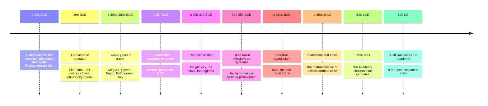

# 04 — Plato — เพลโต

> *"Until philosophers are kings... cities will never have rest from their evils."* : Plato, Republic 473c

Plato (เพลโต, c. 428-348 BCE) is the philosopher you cannot avoid. Whitehead's famous quip that all later European philosophy is "a series of footnotes to Plato" is exaggerated but not wrong: metaphysics, epistemology, political theory, philosophy of mind, aesthetics, even the idea of a university all take their first systematic form in his dialogues. He was Socrates' most brilliant student, and his whole career can be read as an answer to the question his master's execution posed: if the best man Athens ever produced was killed by a democratic vote, what is knowledge, and who should rule?

He also wrote the best philosophy in the world. His texts are dramas, not treatises: arguments staged as conversations with irony, comedy, and myth. If you read one ancient philosopher, read him.

---

## 1 | Historical Context

Plato was born into the old Athenian aristocracy around 428 BCE, during the Peloponnesian War. He considered poetry, then politics; the war's loss, the tyranny of the Thirty (two relatives among them), and the restored democracy's execution of Socrates in 399 BCE disillusioned him with politics as usual. Tradition says he then traveled for twelve years: Megara, Cyrene (geometry), Egypt, and Pythagorean communities in southern Italy, whose mathematical mysticism visibly shaped his metaphysics.

Around 387 BCE he founded the Academy (อะคาเดมี) in a sacred grove outside Athens' walls: in effect the first research university, running roughly 900 years until 529 CE. Its supposed inscription, "let none ignorant of geometry enter", marks its method: mathematics as training for abstract thought. Aristotle joined at about 17 and stayed twenty years.

Three visits to Syracuse (Sicily), trying to educate the tyrant Dionysius II into a philosopher-king, ended badly (tradition says he was briefly sold into slavery), and the failure deepens the Republic's realism about power. Plato died around 348 BCE; his last works (Statesman, Laws) are more cautious and legalistic than the Republic.

## 2 | Core Concepts

### 2.1 The Theory of Forms (ทฤษฎีรูปธรรม, also "idea": eidos/idea)

Plato's master claim: the things you see and touch are not fully real. They are changing, imperfect copies of eternal, unchanging originals (Forms or Ideas: the Form of Justice, the Form of Beauty, the Form of a Circle) grasped only by intellect (noesis), not the senses.

| Feature | The sensible world (โลกแห่งสัญชาติ) | The intelligible world (โลกแห่งรูปธรรม) |
|---|---|---|
| Accessed by | Senses, opinion (doxa, ความเห็น) | Reason, knowledge (episteme, ความรู้แท้) |
| Character | Becoming: arises, decays, conflicts | Being: eternal, unchanging, pure |
| Status | Copies, "shadows" | Originals, the real |
| Example | Many beautiful girls, sunsets, sonatas | Beauty itself, which none of them is, though all "participate" in (metechei) it |
| Analogy | A painting of a circle, wobbly | The circle a geometer proves theorems about |

Why believe it? Plato's arguments: (1) mathematics: geometers reason infallibly about objects that are not physical circles, which are always imperfect; (2) moral progress: judging acts "more or less just" seems to require a standard that is not one more opinion; (3) knowledge needs a stable object (you cannot "know" what keeps changing). Aristotle objected hardest: the Forms duplicate the explanatory work without adding to it, a critique that has kept metaphysicians busy since.

Ethical upshot: the Form of the Good (the agathon, พระบรมดี) crowns the system, "beyond being", the source of reality and intelligibility the way the sun is of sight and growth. Knowing the good, for Plato, transforms desire: vice is ignorance of what is genuinely good for you, an inherited Socratic thesis.

### 2.2 The Allegory of the Cave (อุปมาเรื่องถ้ำ) and the divided line

Republic Book VII opens with the most-used image in philosophy. Prisoners are chained in a cave since birth, facing a wall; behind them a fire casts puppets' shadows on the wall, and the shadows are their entire world. One is freed, climbs out dazzled, and at last sees the sun itself: the Form of the Good. He returns to free the others; they ridicule him and, if he insists, would kill him. (The fate of Socrates is inside the image, and Plato's readers saw it.)

| Stage in the allegory | Stage of mind | Object |
|---|---|---|
| Shadows on the wall | Eikasia, conjecture (การคาดเดา) | Images, reflections |
| Puppets and statues | Pistis, belief (ความเชื่อ) | Physical things |
| Things outside, then the sun | Dianoia, understanding (การคิดเชิงเหตุผล) | Mathematical objects, then |
| The sun itself | Noesis, knowledge (ปัญญาเครื่องรู้แจ้ง) | The Forms, the Good |

**The modern version: the cave is your feed.** Replace the cave with a group chat or algorithmic timeline. The shadows are curated content: clips chosen for engagement, headlines engineered to enrage, images doctored to confirm what you already feel. The puppet-masters are whoever profits from your attention. The chained prisoners are all of us mid-scroll, confidently naming the shadows, correcting anyone who says "that's a crop". The ascent is media literacy and slow thinking: reading past the headline, checking sources, noticing who benefits from your anger (compare [[Social Studies/02 Civics/12_Media_Literacy|Media Literacy]] and [[Science/Advance/Computer Science/12_Digital_Citizenship]]). And the return to the cave is the hard part every honest citizen knows: tell people their reality is manufactured and they will defend the shadows, because the shadows are how they belong. Deepfakes and AI-generated images are the allegory's final twist: shadows with no puppet at all.

### 2.3 The Republic: the just city and the soul

The dialogue's question: is justice good only for its rewards, or in itself? Socrates answers by writing justice large (a city), then reading it small (a soul).

| Part of the city | Virtue | Class (functional, not racial) | Part of the soul |
|---|---|---|---|
| Producers (farmers, traders) | Temperance (sophrosyne, ความพอดี) | Business | Appetite (epithumia) |
| Auxiliaries (soldiers, police) | Courage (andreia, ความกล้า) | Guardians | Spirit (thumos: honor, anger, drive) |
| Rulers | Wisdom (sophia, ปัญญา) | Philosopher-kings | Reason (logos) |

Justice (dikaiosyne, ความยุติธรรม) is each part doing its own work under reason's guidance: the just person's appetites and ambitions are governed by understood good, and the unjust soul is a civil war, a tyranny of craving. Book II sharpens the stakes with Glaucon's social-contract challenge (people practice justice only for fear and reputation), which the rest of the Republic answers by proving justice intrinsically healthy.

The philosopher-kings: only the person who has seen the sun (the Good) can order a city by what is, not by shadow-bargaining; they rule unwillingly, which is why they can be trusted. The "noble lie" (myth of the metals: citizens born with gold, silver, or iron in them) is Plato's uncomfortable admission that even good order may need a founding story. His proposals shock readers ancient and modern: no private property or family for guardians, women training and ruling alongside men (proto-egalitarian for 380 BCE), state censorship of poetry, and banishment of most imitative art from the ideal city.

### 2.4 The four (plus one) regimes: how cities decay (Book VIII)

| Regime | Greek | Ruling love | Corresponding soul | Fate |
|---|---|---|---|---|
| Timocracy | timokracia (time: honor) | Honor and victory | Spirit-dominated | Hardens into oligarchy |
| Oligarchy | oligarcia (the few rich) | Money | Appetite with a leash | The rich impoverish the many; revolution |
| Democracy | demokracia | Freedom and variety ("equality of unequals") | Appetite off the leash, desires treated as equal | Excess of liberty breeds contempt for all authority |
| Tyranny | tyrannis | Lawless appetite (eros as master-craving) | The enslaved self | Born from democracy's chaos; the worst life and the unhappiest man, the book's final answer to Thrasymachus |

The analysis is a genuine political science of decay: each regime's virtue becomes its crack. His warning that extreme democracy invites the strongman is quoted on every continent; defenders of democracy reply that Plato's alternative (rule by the certified-wise) has a worse track record. The argument stays open, and that is the Republic's real legacy. See [[Social Studies/02 Civics/01_Democracy_and_Government|Democracy and Government]].

## 3 | Timeline

## 4 | Key Thinkers and Ideas

| Thinker | Dates | Big Idea | Must-Know Work |
|---|---|---|---|
| Plato | c. 428-348 BCE | Forms; the cave; justice as order of soul and city; philosopher-kings | Republic; Apology; Symposium; Phaedo |
| Socrates | c. 470-399 BCE | The questioner whose death Plato spends a lifetime answering | Plato's early dialogues |
| Aristotle | 384-322 BCE | Student who separated the Form from the thing | Metaphysics A (critique of the Forms) |
| Thrasymachus | 5th c. BCE | "Justice is the advantage of the stronger": the challenge the Republic must beat | Republic Book I |
| Glaucon | 5th-4th c. BCE | Sophisticated contract theorist for a day (Book II); asks for justice proved in itself | Republic |
| Diotima (as reported) | 5th c. BCE | Priestess who teaches Socrates that love (eros) is ascent to Beauty itself | Symposium |

Plato's dialogues are usually grouped as early (the questioning Socrates: Apology, Crito, Euthyphro), middle (positive metaphysics: Republic, Phaedo, Symposium), and late (self-criticism and legislation: Theaetetus, Statesman, Laws).

## 5 | Thai Terminology

| Thai | English | Notes |
|---|---|---|
| รูปธรรม / แบบอย่าง | Form (eidos) | Plato's eternal original; the Buddhist use of รูปธรรม (conditioned phenomena) is not this |
| โลกแห่งประสาทสัมผัส vs โลกแห่งรูปธรรม | Sensible vs intelligible world | The divided line |
| ความรู้แท้ | Episteme | Contrast opinion (doxa, ความเห็น) |
| พระบรมดี / ความดีสูงสุด | The Form of the Good | Sun-analogy: source of all reality and knowing |
| อุปมาเรื่องถ้ำ | The Allegory of the Cave | Book VII of the Republic |
| เงา | Shadows | The prisoners' "reality" |
| จิตมีสามส่วน | The tripartite soul | Reason, spirit, appetite |
| ความยุติธรรม | Justice (dikaiosyne) | Each part doing its own work |
| ปราชญ์ผู้ปกครอง | Philosopher-king | Rule by the one who has seen the Good |
| อภิชนาธิปไตยเงิน | Oligarchy (Plato's sense: rule of the rich) | Note his usage differs from modern "oligarchy" |
| ประชาธิปไตย | Democracy | In Plato: the desire-equalizing regime, not a term of praise |
| ระบอบเผด็จการ | Tyranny | The endpoint of unchecked appetite |
| ความรักแบบเพลโต | Platonic love | From the Symposium: eros as ascent, not mere asexuality |

## 6 | Why It Matters Today

**Feed literacy.** The cave reading in 2.2 is not decoration: the attention economy manufactures shadows at industrial scale, and prisoners are comfortable. The freed man looks ridiculous to them, which explains why correction and "just log off" rarely work: you are not fighting ignorance, you are fighting belonging. See [[Science/Advance/Computer Science/11_Artificial_Intelligence]]: an AI image is a shadow with no human puppet behind it.

**Money, status, and the soul.** The Republic's four decay-personalities map everyday experience: the overachiever who cannot stop, the miser, the person who treats every preference as equally valid until none is, the desire installed as dictator of a life. Thai readers meet the same diagnosis in Buddhist terms (craving, ตัณหา); Plato adds the structural point: a self with no governing reason is not free, it is a city at war.

**Politics and decay narratives.** Every generation rediscovers Book VIII on the decline of democracies into strongman rule, and every generation should also re-read the defenders' reply: unfalsified prophecy is not analysis, and Plato's proposed medicine (philosopher-kings) carries its own disease. The honest use of Plato is as a diagnostic vocabulary, not a prescription.

**Education and the Academy.** The idea that study should reorient what you love, not just what you can do, is Platonic, and lives on in every defense of liberal education in the AI century: "knowing how to make" is increasingly automatable, "knowing what to want" is not. See [[Mathematics/Advance/21_Mathematical_Reasoning]].

## 7 | Further Reading

- *The Republic* by Plato (Grube/Reeve or Waterfield translations): the tradition's first masterpiece; start with Books I-II and VI-VII.
- *Five Dialogues* (Euthyphro, Apology, Crito, Meno, Phaedo, trans. Grube): the fastest route into Plato's voice.
- *Plato: A Very Short Introduction* by Julia Annas: rigorous, kind to newcomers, corrects common misreadings.

## Related

- [[Philosophy/00_overview|← Philosophy Overview]]
- [[03_Socrates_and_the_Socratic_Method]]
- [[05_Aristotle]]
- [[Social Studies/02 Civics/12_Media_Literacy|Media Literacy]]
- [[Social Studies/02 Civics/01_Democracy_and_Government|Democracy and Government]]
