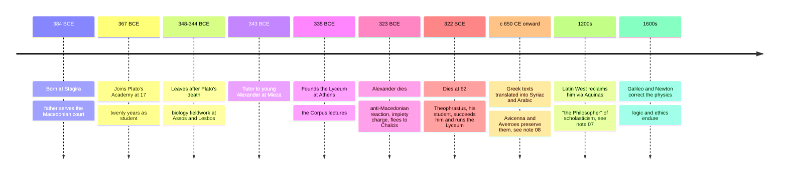

# 05 — Aristotle — อริสโตเติล

> *"Excellence, then, is not an act but a habit."* : paraphrase of Aristotle, Nicomachean Ethics 1106a (the phrasing is Will Durant's summation, not Aristotle's own words)

Aristotle (อริสโตเติล, 384-322 BCE) was the tradition's great systematizer: logic, biology, physics, metaphysics, ethics, politics, and poetics all received their first textbooks from him. He was Plato's student for twenty years and his most serious critic: "Plato is dear to me, but dearer still is truth" (as the tradition puts it). Where Plato looked up from the cave to eternal Forms, Aristotle looked hard at the world in front of him: dissecting cuttlefish, cataloguing constitutions. (Plato note: [[04_Plato]])

For a Thai adult reader he is the single most useful ancient philosopher: he invented the logic behind every "therefore", and his ethics (the golden mean) is a practical psychology of character that needs no metaphysics to work.

---

## 1 | Historical Context

Born in Stagira in 384 BCE, son of the Macedonian court physician, Aristotle combined Greek intellectual culture with an empirical family trade. At 17 he joined Plato's Academy and stayed until Plato's death (348/347 BCE), then traveled through Asia Minor and Lesbos, where his marine-biology observations became the most accurate natural history for the next 1,800 years. Around 343 BCE he tutored the 13-year-old Alexander (อเล็กซานเดอร์มหาราช), later the Great.

In 335 BCE he founded his own school in Athens, the Lyceum (ไลเซียม), whose "walking about" style gave us the label peripatetic. His surviving works are lecture courses, not books. After Alexander died (323 BCE), anti-Macedonian feeling turned on Aristotle (an impiety charge eerily like Socrates'), and he fled "lest Athens sin twice against philosophy", dying in 322 BCE, aged 62.

## 2 | Core Concepts

### 2.1 Against Plato: form in the thing

| Question | Plato | Aristotle |
|---|---|---|
| Where is the real? | In a separate realm of Forms | In this world: form (morphe) exists embodied in matter (hyle) |
| What explains change? | Participation in eternal patterns | Four causes: potentiality becoming actuality |
| The human soul | A passenger using a body | The "form of a body that has life potentially", as an axe's cutting is inseparable from the axe |
| Method | Dialectic ascent to first principles | Collect phenomena, define, divide |

The four causes (เหตุสี่ประการ): material (what it's made of), formal (what it is: the defining pattern), efficient (what made it), final (what it's for: telos, จุดหมายปลายทาง). His worldview is teleological: nature does nothing in vain, and acorns are "for" oaks. Modern biology dropped the cosmic purpose but kept explaining organs by function: the final cause wearing a lab coat.

### 2.2 Logic: the invention of validity

Aristotle wrote the first logic textbook (later collected as the Organon, ออร์แกนอน, "tool"). His central instrument is the syllogism (ตรรกบทสามส่วน, syllogismos): two premises sharing a middle term, yielding a necessary conclusion.

| Pattern | Example |
|---|---|
| All B are C; all A are B; therefore all A are C | All humans are mortal; all Greeks are humans; therefore all Greeks are mortal |
| Validation test | Can you make the premises true and the conclusion false? If no, the form is valid |
| Key distinction | Validity (form) vs soundness (form + true premises): a perfect form can still rest on a false premise |

He also gave us the categories (10 fundamental kinds of predication), the square of opposition, and the laws of non-contradiction and excluded middle. Frege's predicate logic later extended (not replaced) the Organon; syllogisms remain the easiest way to teach validity. See [[Mathematics/Advance/01_Sets_and_Logic]].

### 2.3 Ethics: eudaimonia and the golden mean

Aristotle's ethics is practical, not theoretical: we study it "in order to become good" (NE 1103b). Key moves:

- **Everything aims at some good** (NE I.1), but one end is chosen for its own sake: eudaimonia (ยูไดโมเนีย: flourishing, ความสำเร็จแห่งชีวิต, better than "happiness"). Pleasure, honor, and wealth serve something else.
- **The function argument:** a good knife cuts well; a good human does distinctively human activity (rational activity) well, over a complete life. Eudaimonia is "activity of soul in accordance with virtue (arete, คุณธรรม)": excellence performed, not a mood felt.
- **Virtue is a hexis (habit state, ความคุ้นชินที่ดี):** we become just by doing just acts, like a lyre player learning by playing. Character is built by repetition, so parenting and law habituate before they explain. Compare the Buddhist cultivation of sila (ศีล) through practice: habit forming character is a shared insight, but Aristotle's self is a substantial thing while non-self (anatta, อนัตตา) analyzes it as process. Near twins, not the same.
The golden mean (ทางสายกลาง, mesotes): every virtue is a mean between excess and deficiency, hit by practical wisdom (phronesis, ปัญญาประจำตัว): the right thing, toward the right person, at the right time, for the right reason. It is not mediocrity: hitting it can demand heroic action.

| Sphere of feeling/action | Deficiency (vice) | The mean (virtue) | Excess (vice) |
|---|---|---|---|
| Fear and confidence in danger | Cowardice (ความขี้ขลาด) | Courage (ความกล้าหาญ) | Rashness (ความบ้าบิ่น) |
| Giving and taking money | Meanness / stinginess | Generosity / liberality (ความใจกว้าง) | Prodigality / extravagance (ความสุรุ่ยสุร่าย) |
| Honor, small scale | Small-spiritedness (underclaiming) | Proper ambition | Vanity |
| Anger | Spiritlessness (never angry at injustice) | Good temper (ความสุภาพควบคุมอารมณ์) | Irascibility (ความโกรธง่าย) |
| Pleasure and bodily enjoyments | Insensibility (rare: a boor of the negative kind) | Temperance (ความพอประมาณ) | Self-indulgence (ความมักมาก) |
| Truth-telling about oneself | Self-deprecation | Honesty / truthfulness | Boastfulness |
| Amusement and wit | Boorishness (kills the joke) | Wittiness (tact in play) | Buffoonery (can't stop clowning) |
| Spending on grand occasions | Shabbiness | Munificence (taste for the great) | Vulgarity |

NE II.9: each person drifts to a characteristic extreme, so the advice is "bend the stick toward the opposite extreme". Thai readers will notice that "ทางสายกลาง" is also the Buddha's Middle Way (มัชฌิมาปฏิปทา): the resemblance is real (both reject indulgence and self-mortification), but the contents differ: Aristotle's mean is defined per-sphere by reason; the Buddha's is a path defined by the end of suffering.

### 2.4 Politics: the animal with logos

"Man is by nature a political animal" (zoon politikon): the polis (นครรัฐ, city-state) exists for the sake of living well, and humans alone have logos: not just voice but reasoned speech about the just and the beneficial. Ethics ends by pointing to politics: you cannot flourish reliably in a corrupt city. The Politics classifies correct rule (monarchy, aristocracy, polity) versus deviant (tyranny, oligarchy, democracy), and argues the best stable state rests on a broad middle class. His defense of private property ("what is owned in common gets the least care") and his notorious defense of natural slavery are the dark chapters; read both, and note that his own empiricism, applied honestly, is the best argument against the second. See [[Social Studies/02 Civics/01_Democracy_and_Government|Democracy and Government]].

### 2.5 Physics: the best-preserved wrong theory in history

Aristotle's natural science held for nearly two millennia: motion toward natural places (heavy falls, fire rises), incorruptible heavens of aether moving in circles, motion requiring a mover, and qualitative change via the four elements (see [[02_Pre_Socratic_Philosophers]]). Where later science corrected him:

| Aristotle said | Corrected by | Now says |
|---|---|---|
| Heavier bodies fall faster | Galileo (late 1500s) | All bodies fall with equal acceleration in vacuum; air resistance explains feathers |
| A mover is needed to keep motion going | Galileo's inertia, Newton's first law (1687) | Uniform motion persists on its own; force causes acceleration |
| Celestial and terrestrial physics differ | Newton's universal gravitation | Same laws for apples and moons |
| Species fixed in a ladder of nature | Darwin (1859) | Common descent with modification |
| Heat and fire as elements | Lavoisier's chemistry (late 1700s) | Elements are chemical substances, not qualities |

Yet his biology was unmatched until the 1800s, his logic ran rational thought until Frege, and his ethics is a live research program. See [[Science/Fundamental/01_Scientific_Method|the Scientific Method note]].

## 3 | Timeline

## 4 | Key Thinkers and Ideas

| Thinker | Dates | Big Idea | Must-Know Work |
|---|---|---|---|
| Aristotle | 384-322 BCE | Logic, four causes, virtue ethics, politics as the master science | Nicomachean Ethics; Politics; Metaphysics; Organon; Poetics |
| Plato | c. 428-348 BCE | The teacher whose Forms Aristotle relocated into things | Republic |
| Alexander the Great | 356-323 BCE | The student who spread Greek learning across Asia | (His conquests enabled Aristotle's collecting programs) |
| Theophrastus | c. 371-287 BCE | Successor; founded botany | Enquiry into Plants |
| Aquinas | 1225-1274 CE | Read Aristotle into Christianity; the medieval synthesis | Summa Theologiae |
| Anscombe / MacIntyre | 1919-2001; b. 1929 | Revived virtue ethics in the 20th century | After Virtue (1981) |

The Nicomachean Ethics is named, probably, for his son Nicomachus, who edited it. His Poetics (the tragedy-and-catharsis book that still scripts Hollywood's three-act structure) rounds out a corpus with almost no minor work.

## 5 | Thai Terminology

| Thai | English | Notes |
|---|---|---|
| ตรรกศาสตร์ / ตรรกวิทยา | Logic | His Organon founded the field |
| syllogism: ตรรกบท / อนุมาณ | Syllogism | Three-part deductive argument |
| ความถูกต้องของรูปแบบ | Validity | Distinguished from soundness (ความสมเหตุสมผลที่ครบถ้วน) |
| คุณธรรม | Virtue (arete) | Excellence, both moral and intellectual |
| ทางสายกลาง | The golden mean (mesotes) | Literally "middle way" in Thai, shared word with Buddhism |
| ความขี้ขลาด / ความบ้าบิ่น | Cowardice / rashness | The two ends of courage |
| ความใจกว้าง / ความสุรุ่ยสุร่าย | Generosity / prodigality | The two ends of giving |
| ปัญญาประจำตัว | Phronesis (practical wisdom) | The master virtue that finds the mean |
| ความสำเร็จแห่งชีวิต | Eudaimonia | Flourishing: living and faring well (eu prattein) |
| จตุรเหตุ | The four causes | Material, formal, efficient, final |
| จุดหมายปลายทาง | Telos | End, purpose, completion |
| สิ่งมีชีวิตในทางการเมือง | Political animal (zoon politikon) | The polis as human nature's arena |
| นครรัฐ | Polis | The city-state |

## 6 | Why It Matters Today

**The meeting-room syllogism.** Every audit, post-mortem, and fact-check runs on his distinction: is the form valid, and are the premises true? Confusing "logically follows" with "must be so" (valid but unsound) is the single most common media fallacy, from investment pitches to election promises.

**Habits, character, and parenting.** "We become builders by building" is now behavioral science: identity is what repeated action teaches you to believe about yourself. Modern habit design (small reps, streaks) is Aristotle with apps; so is the hardest parenting lesson: children learn from watching what you do daily, not from being lectured. Compare sila (ศีล) cultivated through practice in Thai Buddhism.

**The golden mean at work.** The vices table is a management tool: the under-confident star, the workaholic, the manager who never gets angry at wrong things and the one who explodes, the generous spender and the miser: each is an extreme a competent leader helps others (and themselves) steer off, bending the stick the other way.

**AI-era ethics of function.** The function argument asks what a thing is *for*: a feed that optimized attention instead of understanding betrays its proper telos. Ask that of any new tool before adopting it. See [[Science/Advance/Computer Science/11_Artificial_Intelligence]].

## 7 | Further Reading

- *The Nicomachean Ethics* (trans. Ross/Urmson): the Western tradition's first great ethics textbook; readable at speed.
- *Aristotle: A Very Short Introduction* by Jonathan Barnes: the full range in 150 pages.
- *After Virtue* by Alasdair MacIntyre: why the modern world keeps drifting back to Aristotle for an ethics that works.

## Related

- [[Philosophy/00_overview|← Philosophy Overview]]
- [[04_Plato]]
- [[06_Hellenistic_Philosophy]]
- [[Mathematics/Advance/01_Sets_and_Logic]]
- [[Science/Fundamental/01_Scientific_Method|the Scientific Method note]]
- [[Social Studies/02 Civics/01_Democracy_and_Government|Democracy and Government]]
