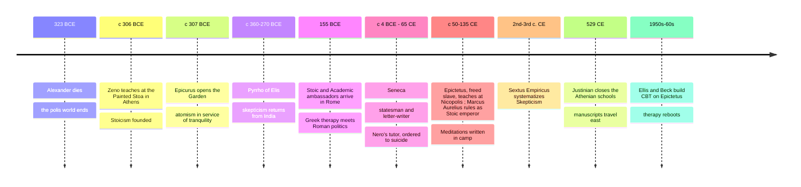

# 06 — Hellenistic Philosophy — ปรัชญายุคเฮเลนิสติค

> *"It is not things that disturb us, but our judgments about things."* : Epictetus, Enchiridion 5

After Alexander's empire fractured (from 323 BCE), the city-states lost political independence, and philosophy changed jobs. Plato and Aristotle had asked how to build the just city; the Hellenistic schools (ลัทธิเฮเลนิสติค) asked the question the age actually posed: how do you live well when forces bigger than you run the world? Their shared answer: philosophy is therapy for the soul (การรักษาใจ), a set of daily exercises aimed at tranquility (ataraxia, อะตะรักเซีย, ความสงบใจ) and freedom from destructive passions.

This is the most immediately useful note in the ancient section: Stoicism underlies modern cognitive therapy, Epicureanism funds our best science communication, and Skepticism is the oldest antidote to certainty-addiction. All three were born in the same century, in the same city, answering the same anxiety: yours.

---

## 1 | Historical Context

The era runs from Alexander's death (323 BCE) to Rome's absorption of the Greek east (31 BCE), though the schools flourished for centuries under Rome, source of most surviving texts. Three changes made the new philosophy necessary:

| Change | Consequence for philosophy |
|---|---|
| The polis's independence ended; empires decided lives | Ethics turned inward: the good life must survive exile, slavery, tyranny |
| Greeks, Egyptians, Persians, Jews mixed in new cities | Identity shifted from citizen-of-a-city to "cosmopolites", citizen of the world |
| Fortune could crush anyone (war, plague, piracy) | The central problem became what is "up to us" and what is not |

The old Academy and Lyceum kept teaching, but the new centers were the Stoa Poikile (the Painted Porch, where Zeno taught: hence "Stoicism") and Epicurus' Garden (the Kepos), open to women and slaves: scandalous enough to feed centuries of gossip.

## 2 | Core Concepts

### 2.1 Stoicism (ลัทธิสโตอิก): the dichotomy of control

| Doctrine | Greek / Thai | Content |
|---|---|---|
| Dichotomy of control | ta eph' hemin, สิ่งที่อยู่ในอำนาจเรา | Up to us: judgment, intention, desire, aversion. Not up to us: body, reputation, property, other people, outcomes. Freedom comes from working only the first field |
| Passions as errors | pathos as pseudos doxa | Anger, envy, panic are not forces that happen to you: they are bad judgments, so they can be reasoned out |
| Virtue is the only good | arete monon agathon | Health, wealth, and comfort are "preferred indifferents": choose them when available, never trade tranquility for them |
| Live according to nature | kata physin | The cosmos is a rational whole (logos); humans flourish by exercising reason and justice within it |
| Amor fati / the view from above | heimarmene, acceptance | Not grim endurance: Marcus practices greeting each act, each person, each event as material the good can use; "the obstacle becomes the way" (Meditations 5.20 in effect) |

The Stoic schedule: morning preparation, evening review (Seneca audited his day nightly). The three disciplines: desire (want only what is in your power), action (do your duty regardless of outcome), assent (withhold judgment from first impressions). The "reserve clause" ("I will sail, fate permitting") lets you act fully while holding outcomes lightly.

### 2.2 Epicureanism (ลัทธิเอพิคิวรัส): the art of stable joy

Epicurus (เอพิคิวรัส, 341-270 BCE) took atomism from Democritus (see [[02_Pre_Socratic_Philosophers]]) and aimed it at peace of mind.

| Doctrine | Content | Common misreading |
|---|---|---|
| Pleasure is the beginning and end of the happy life | Pleasure means absence of pain (aponia) and turmoil (ataraxia): a stable joy | "Epicure" today means gourmet or hedonist: the reverse. The Garden's feast was bread, water, cheese, friends |
| The tetrapharmakos (four-part remedy, ยารักษาใจ ๔ ข้อ) | (1) Don't fear god: the blessed ones neither need nor harm us. (2) Don't worry about death: where death is, we are not; sensation is all we are, and death is its absence. (3) What is good is easy to get: security and friendship are cheap. (4) What is terrible is easy to endure: chronic pain is light, acute pain short | Sounds nihilistic until you notice it was prescribed as therapy against real terror: the era's suicide rates were a genuine public-health problem |
| Desires ranked | Natural and necessary (food, shelter: cheap to satisfy); natural but not necessary (luxury: enjoy sometimes, need never); vain and empty (fame, power: endless, so avoid) | The first "enough" analysis in history |
| Withdraw and build a circle | "Live unnoticed": politics is a desire machine; friendship (philia) is the greatest instrument of the happy life | Critics read it as selfish; Epicurus called friendship sacred |

The school's voice survives loudest in Lucretius' De Rerum Natura (On the Nature of Things).

### 2.3 Skepticism (ลัทธิสงสัยนิยม): the peace of suspending judgment

Pyrrho (ไพล์รอน, c. 360-270 BCE) followed Alexander's armies to India, met the Gymnosophists ("naked wise men"), came home saying nothing could be decided about anything, and lived serenely. The school's argument: for every appearance there is an equal counter-appearance (isostheneia), so the wise response is suspension of judgment (epoché, การยังไม่ตัดสิน), which "just happens" to bring ataraxia, "as sleep follows weariness". Skeptics still lived by appearances (honey tastes sweet: act accordingly) without claiming anything is really sweet. Sextus Empiricus (2nd-3rd c. CE) systematized the modes of doubt; the tradition's honest joke is that even "nothing can be known" is not asserted as knowledge. Hume and modern scientific agnosticism are its children.

### 2.4 Philosophy as therapy

The shared frame: a theory is judged like medicine, by whether it cures. Three techniques, all now in evidence-based therapy:

- Prosoche: sustained attention to your own mind: ancestor of mindfulness practice (Buddhist sati, สติ, sits in a different soteriology: near twins again).
- Premeditatio malorum: pre-rehearsing loss and death so fortune cannot ambush you: exposure therapy, ancient edition.
- The view from above: shrinking your troubles against the map of the world: cognitive defusion, ancient edition.

### 2.5 Stoicism and Thai Sufficiency Economy (เศรษฐกิจพอเพียง): near twins, different cultures

King Rama IX's Sufficiency Economy Philosophy (SEP, ปรัชญาเศรษฐกิจพอเพียง) is usually presented as Buddhist economics; read beside Stoicism, the family resemblance is striking. Treat them as near twins raised in different households, not as one doctrine:

| Theme | Stoicism (Zeno to Marcus) | Sufficiency Economy (พอเพียง) |
|---|---|---|
| What is enough | Natural desires are cheap; luxury is a vain desire with no terminus | Moderation (ความพอประมาณ): produce and consume to the middle, not the maximum |
| Control of desire | Desire spends freedom on what is not yours to control; its discipline is the core exercise | The Middle Path (ทางสายกลาง) with reasonableness and self-restraint: greed is the engine of risk |
| Immunity to shocks | Externals are preferred indifferents, never the foundation of a life | SEP's third condition is explicitly "immunization" (ภูมิคุ้มกัน): savings, diversity, no all-in bets on credit |
| Reason and the whole | Live kata physin: your good is bound to the common fund of a rational cosmos | Decisions weighed for family, community, and long-term effect |
| Self-sufficiency | Autarkeia of the sage: need little to be free | Household and community resilience: freedom from the debt treadmill |
| Where they part company | A rational cosmos you must love; the sage's tranquility is the goal | SEP is a development philosophy for a nation, framed by Buddhist merit and the common good: its audience is policy as much as soul |

Two cultures, different metaphysics, one hard-won observation: a desire with no ceiling is a machine for manufacturing suffering, and "enough" is a skill, not a number. You can use both ladders without pretending they are one tree. See [[Social Studies/03 Economics/03_Sufficiency_Economy_Philosophy|Sufficiency Economy Philosophy]].

## 3 | Timeline

## 4 | Key Thinkers and Ideas

| Thinker | Dates | Big Idea | Must-Know Work |
|---|---|---|---|
| Zeno of Citium | c. 334-262 BCE | Founded the Stoa: virtue alone is the good | Reported in Diogenes Laertius VII |
| Chrysippus | c. 279-206 BCE | Systematized Stoic logic and physics | 700+ books lost |
| Epicurus | 341-270 BCE | Atomism plus the tetrapharmakos: pleasure as tranquility, friendship as top good | Letter to Menoeceus; Vatican Sayings |
| Pyrrho | c. 360-270 BCE | Suspension of judgment brings ataraxia | Known through Timon and Sextus |
| Lucretius | c. 99-55 BCE | Poetry as therapy against the fear of death | De Rerum Natura |
| Seneca | c. 4 BCE-65 CE | Stoicism about time: "life is long if you know how to use it" | Letters to Lucilius; On the Shortness of Life |
| Epictetus | c. 50-135 CE | The slave's manual of freedom: only what is "up to you" is yours | Discourses; Enchiridion |
| Marcus Aurelius | 121-180 CE | An emperor's private notes on duty and mortality | Meditations |

A useful asymmetry: Seneca wrote Stoicism for the wealthy, Epictetus for a slave, Marcus for an emperor. Read together they close most loopholes.

## 5 | Thai Terminology

| Thai | English | Notes |
|---|---|---|
| ลัทธิสโตอิก | Stoicism | From the Stoa Poikile, the Painted Porch |
| สิ่งที่อยู่ในอำนาจเรา | Dichotomy of control | Epictetus' opening move |
| ความสงบใจ / อะตะรักเซีย | Ataraxia | Tranquility: shared goal of several schools |
| ลัทธิเอพิคิวเรียน | Epicureanism | The Garden: careful, not "epicure the foodie" |
| ยารักษาใจสี่ข้อ | Tetrapharmakos | Four-part remedy of Epicurean therapy |
| การยังไม่ตัดสิน | Epoché (suspension of judgment) | The Skeptic's tool |
| ไพล์รอน / เซกซ์ตัส | Pyrrho / Sextus | Skepticism's founder and systematizer |
| การโอบรับชะตา | Amor fati | Loving what the whole requires of you (Nietzsche coined the Latin phrase later; the practice is Stoic) |
| ภูมิคุ้มกัน | Immunization | SEP's third condition; the Stoics would sign |
| ความพอประมาณ | Moderation (SEP) | cf. sophrosyne (ความพอประมาณ) |
| ความมีเหตุผล | Reasonableness (SEP) | cf. Stoic living kata physin |
| การทบทวนวัน | Evening review | Seneca's nightly self-audit |
| การเตรียมใจรับความพลัดพราก | Premeditatio malorum | Voluntary exposure to feared outcomes |

## 6 | Why It Matters Today

**Your nervous system and CBT.** Aaron Beck cited Epictetus directly when building cognitive therapy: the chain event > interpretation > emotion is the dichotomy of control in clinical form (see [[Health-PE/01 Health Education/04_Mental_Health|Mental Health]]). When a boss's email spikes your pulse, the Hellenistic move is not to suppress the feeling but to audit the judgment underneath it: "this means I'm finished" is the thing to question, not the deadline.

**Debt, ads, and "enough".** The Epicurean ranking of desires is the sharpest personal-finance tool of antiquity: what you need, what you would enjoy once, and what no amount satisfies (status). Every ad sells the third category as the first. Read with SEP and Stoic immunization, you get a Thai-European grammar for resisting the credit treadmill. See [[Social Studies/03 Economics/03_Sufficiency_Economy_Philosophy|Sufficiency Economy Philosophy]].

**Online certainty.** Every comment section is a Skepticism seminar: opposing viral "facts" of equal weight, the epoché that would defuse them, the ataraxia of not performing certainty you don't have. Living by appearances while withholding ultimate judgment is the calmest way to be a citizen of the internet.

**Grief, aging, and control.** Hellenistic philosophy was built for a world where empire and plague overruled plans, so it speaks directly to adult life: aging parents, business shocks, pandemics. Marcus' nightly meditations on impermanence rhyme with maranasati (มรณสติ, recollection of death): near twins, different metaphysics, and neither converts the other.

## 7 | Further Reading

- *Meditations* by Marcus Aurelius (Gregory Hays translation): the most powerful man on earth coaching himself on patience, duty, and death. Start here.
- *Letters to Lucilius* by Seneca (Graver/Long selection): the best-written therapy book in Latin.
- *The Enchiridion* by Epictetus: 53 paragraphs of the dichotomy of control; the most concentrated self-help text ever written.
- *The Hellenistic Philosophers* vol 1 by Long and Sedley: fragments in translation with clean commentary, when you want primary voices.

## Related

- [[Philosophy/00_overview|← Philosophy Overview]]
- [[05_Aristotle]]
- [[07_Medieval_Philosophy]]
- [[Social Studies/03 Economics/03_Sufficiency_Economy_Philosophy|Sufficiency Economy Philosophy]]
- [[Health-PE/01 Health Education/04_Mental_Health|Mental Health]]
- [[Social Studies/01 Religion/01_Buddhist_Principles|Buddhist Principles]]
