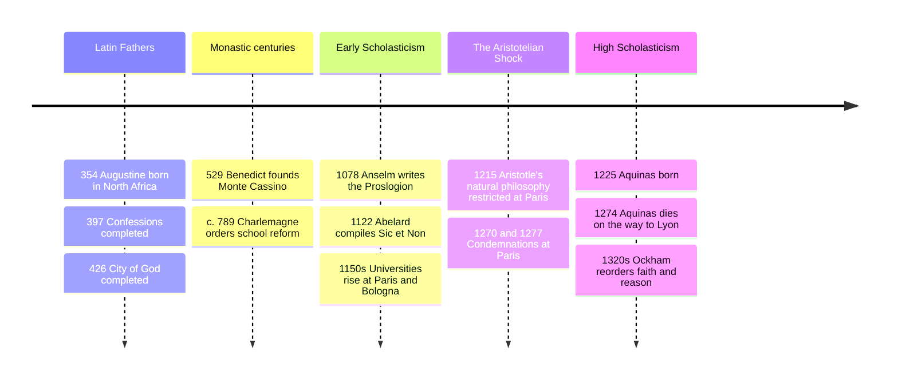

# 07 — Medieval Philosophy — ปรัชญาสมัยกลาง

> *"What has Athens to do with Jerusalem?" (Tertullian, c. 200 CE)*

"Medieval Philosophy" (ปรัชญาสมัยกลาง) is the thousand-year conversation, roughly 200 to 1400 CE, about the single question Tertullian's slogan names: what does Athens, the home of unaided human reason, have to do with Jerusalem, the home of divine revelation? Christian thinkers in Europe, working alongside (and often in dialogue with) Muslim and Jewish philosophers covered in [[08_Islamic_and_Jewish_Philosophy]], refused to answer with either pure faith or pure reason. They argued that faith and reason (ศรัทธาและเหตุผล) belong together, in some order and tension that each generation had to renegotiate.

An adult should care because this era built furniture most of us still sit on: the university, the debate format, the idea that a law can be "natural" and therefore judge human statutes. The period is usually caricatured as "the dark ages" of blind belief; the actual texts are startlingly argumentative, and the medieval insistence on stating an opponent's case at full strength before answering it is a discipline worth stealing.

---

## 1 | Historical Context

After Rome's political collapse in the West, literacy and learning survived mainly in monasteries and cathedral schools, while the eastern Mediterranean and then the Islamic world (see [[08_Islamic_and_Jewish_Philosophy]]) kept Greek philosophy alive. Latin Europe's real intellectual explosion came in the 11th and 12th centuries: cathedral schools grew into the first universities at Bologna, Paris, and Oxford, and Aristotle's works returned to the West through Arabic translations and commentaries, often arriving in Latin via translation centers like Toledo.

That arrival was destabilizing. Aristotle's world-picture (an eternal universe, a soul tied to the body, a cosmos governed by necessity) clashed with Genesis at several points. The medieval project, from Augustine through Aquinas, was to decide which parts of that philosophy were tools for understanding faith, which were errors to refute, and how reason and revelation each get a vote.

| Phase | Rough dates | Signature event |
|---|---|---|
| Latin Fathers | 200-500 CE | Augustine writes the Confessions and City of God |
| Early scholasticism | 1000-1150 | Anselm refines faith-seeking-understanding; universities form |
| High scholasticism | 1200-1300 | Aristotle floods in; Aquinas builds the great synthesis |
| Late scholasticism | 1300-1450 | Ockham and others pull faith and reason apart again |

## 2 | Core Concepts

### 2.1 The Athens-versus-Jerusalem problem

Three stably different medieval answers, all worth knowing:

| Position | Motto | Representative |
|---|---|---|
| Reason serves faith | "I believe in order to understand" | Anselm's fides quaerens intellectum (faith seeking understanding) |
| Harmony of two truths | Grace perfects nature, it does not destroy it | Aquinas: some truths (Trinity) exceed reason, others (God exists) reason can reach |
| Reason's limits | Faith is not on trial before philosophy | Tertullian's suspicion; later, Ockham's nominalism |

The point for a modern reader: nobody in this era simply "believed without thinking." The interesting medieval history is the argument.

### 2.2 Augustine of Hippo (354-430 CE)

Augustine's *Confessions* (c. 397-400 CE) invented a genre: philosophical autobiography, a search for truth told through one soul's memory. Three ideas dominate his afterlife in Western thought. **Original sin** (บาปกำเนิด): the doctrine, hardened in his debate with Pelagius, that human will is damaged by inheritance from Adam and cannot straighten itself without grace. **The two cities**: *City of God* (413-426 CE), written after Visigoths sacked Rome in 410, distinguishes the earthly city built on self-love from the heavenly city built on love of God, and argues that no political order is ultimate, a deflating lesson for emperor-worship then and nationalism now. **Time and memory**: Confessions Book 11 asks what time even is, noting the past no longer exists, the future does not yet exist, and the present is a knife-edge, so time must be a "distention of the mind" (distentio animi), measured in memory and attention. His confession, "what is time? If nobody asks me, I know; if I want to explain to someone who asks, I know nothing," remains the honest description of the puzzle, and his analysis shaped the philosophy of time through Einstein's era.

### 2.3 Anselm and the ontological argument, stated neutrally

Anselm of Canterbury (1033-1109), in the *Proslogion* (c. 1078), offers an argument that tries to prove God exists from the definition of God alone, no observation of the world needed. Define God as "that than which nothing greater can be conceived." Even the fool who denies God has this idea in his mind. But something that exists in reality as well as in the mind is greater than something existing only in the mind; so if "that than which nothing greater can be conceived" existed only in the mind, we could conceive something greater, a contradiction. Therefore God exists in reality. Status report, neutrally: Anselm's contemporary Gaunilo replied that the same trick could "prove" a perfect lost island existing, since an existing perfect island would be greater than an imaginary one. Aquinas accepted the reasoning fails because finite minds do not grasp God's essence. Kant's famous objection is that existence is not a predicate you add to a thing's description, a hundred real thalers contain no coin more than a hundred imagined ones. Defenders reply, most recently in modal versions (Plantinga, 1974), that the argument is about necessary existence, which Gaunilo's island lacks. Two centuries of serious disagreement means the honest summary is: logically elegant, premises contested, and still taught.

### 2.4 Aquinas: the Five Ways, essence and existence, natural law

Thomas Aquinas (1225-1274), Dominican friar, wrote the *Summa Theologiae* (1265-1274), the scholastic tradition's masterpiece. He holds that some truths about God are reachable by natural reason from creation, and lists five arguments, the "Five Ways" (ห้าวิธี), each stated as an inference from something he thinks is obvious about the world, with standard objections attached:

| The Way | The argument as Aquinas frames it | Standard objection |
|---|---|---|
| Motion | Things change; change requires something already actual; an endless chain of movers is explanatorily empty, so a first mover, which everyone understands to be God | Why can't the chain just be endless? Infinite series are standard equipment in later mathematics |
| Efficient cause | Every effect has a cause; causes do not cause themselves; remove the first cause and you remove intermediate causes too | Same regress worry; plus the question of why the whole series needs what a member needs |
| Contingency | Things can be or not be; if everything could fail to exist, at some time nothing existed; then nothing would exist now, so something necessary exists | Hume: the necessity may lie in the system of ideas, not in things; the universe as a whole may simply brute-exist |
| Degrees | We call things better, truer, more real, which implies a maximum by reference to which we judge, the cause of all being | Degrees can be compared pairwise without any limit-point; and "most perfect" may be a projection |
| Governance | Natural bodies act for ends without knowing them, like an arrow guided by an archer, so an intelligent guide exists | Modern evolutionary and physical accounts explain apparent design through selection and laws, no designer assumed |

Two deeper pieces of his metaphysics: in every creature, **essence and existence** (สาระกับการมีอยู่) are distinct, what a thing is differs from that it is, so creatures receive existence; only in God are they identical, God is subsistent existence itself (ipsum esse). From this flows **natural law** (กฎธรรมชาติ): moral knowledge begins in the human grasp of basic goods, life, knowledge, sociability, and the first precept "do good and pursue evil," with human law legitimate only insofar as it derives from this. Aquinas is also the theorist of the **just war**, criteria later secularized into international law.

### 2.5 The scholastic method

Scholasticism (ปรัชญาสำนักโรงเรียน) was less a doctrine than a method: *lectio* (reading an authority), *quaestio* (extracting a genuine question with opposing sides), *disputatio* (arguing both sides, then resolving). Every Summa article runs: objection, contrary authority, response, replies to each objection, the opponent always answered on his own turf. This is the ancestor of the adversarial legal brief and of peer review's spirit.

> **Comparative aside.** The faith-reason debate has Buddhist analogues: the Kalama Sutta (กาลามสูตร) at Kesaputta advises not accepting teaching on authority, tradition, or mere reasoning alone but testing what conduces to welfare, and Buddhist scholasticism distinguishes confident trust (saddhā) from blind credulity, with wisdom (ปัญญา) as its partner. The parallels are structural, about how much weight tradition can carry, not identities; the medieval debate is with revelation as a given, while the Buddhist framing is soteriological and empiricist-leaning. See [[Social Studies/01 Religion/01_Buddhist_Principles|Buddhist Principles]].

## 3 | Timeline

## 4 | Key Thinkers and Ideas

| Thinker | Dates | Big Idea | Must-Know Work |
|---|---|---|---|
| Augustine | 354-430 | Restless heart, original sin, two cities, time as distention of mind | Confessions |
| Anselm | 1033-1109 | Faith seeking understanding; ontological argument | Proslogion |
| Abelard | 1079-1142 | Dialectic applied to authorities; intention makes sin | Sic et Non |
| Aquinas | 1225-1274 | Five Ways; essence-existence; natural law and just rule | Summa Theologiae |
| Ockham | c. 1287-1347 | Nominalism; parsimony; faith and reason decouple | Summa Logicae |

**Augustine** remains the most modern ancient writer: his psychology of memory, habit, and divided will anticipates everything from Pascal to psychotherapy. **Anselm** shows what pure a priori argument looks like, and what happens to it. **Abelard** shifted moral evaluation from the act to the intention, an idea now embedded in every legal code. **Aquinas** synthesized Aristotle and Christian doctrine so thoroughly that Catholic teaching still names him the Angelic Doctor, while his natural-law ethics reaches secular rights discourse. **Ockham**, famous for the razor, later cut the synthesis: if universals are just names, reason cannot climb to God, and fideism opens the door the era was built to guard.

## 5 | Thai Terminology

| Thai | English | Notes |
|---|---|---|
| ศรัทธาและเหตุผล | faith and reason | the period's master opposition |
| การไขแสดง | revelation | truth disclosed by God, not discovered |
| เทววิทยา | theology | reasoning about the content of faith |
| ปรัชญาสำนักโรงเรียน | scholasticism | the university method of quaestio and disputatio |
| บาปกำเนิด | original sin | inherited damage of the will (Augustine) |
| นครของพระเจ้า | City of God | the two cities of love rightly and wrongly ordered |
| การรำลึกถึงพระเจ้า | memory | for Augustine, where God is found within |
| ข้อพิสูจน์เชิงมีอยู่ | ontological argument | Anselm's a priori proof, contested |
| ห้าวิธี | the Five Ways | Aquinas's five cosmological-style arguments |
| สาระกับการมีอยู่ | essence and existence | distinct in creatures, identical in God |
| กฎธรรมชาติ | natural law | moral knowledge accessible to reason |
| สงครามยุติธรรม | just war | Aquinas's three criteria |
| ความมัธยัสถ์ของอธิบาย | explanatory parsimony | Ockham's razor, later name |

## 6 | Why It Matters Today

When someone argues that a law is "unjust" because it degrades human dignity, that instinct is natural-law shorthand, inherited through medieval thought and written into the post-1945 human rights declarations. When a court asks whether a defendant meant it, Abelard's move from act to intention is still working. When a physicist or philosopher asks "why is there something rather than nothing," that is the contingency Way restated. And when a university seminar reads a text, states the strongest objection, answers each point, and cites opponents accurately, the classroom is running scholastic software. For Thai readers navigating family religious expectations and modern education, the medieval menu, faith serving understanding, harmony of two kinds of truth, or reason's limits, is still a live map of the options people actually choose between.

## 7 | Further Reading

- *Confessions* by Augustine (Henry Chadwick translation): the founding spiritual autobiography, readable in a weekend, Book 11 alone worth the trip.
- *Summa Theologiae* (select portions, Fathers of the English Dominican Province or McCabe): read the First Part on the Five Ways and the treatise on law.
- *Aquinas: A Very Short Introduction* by Eleonore Stump: rigorous, fair, no apologetics and no dismissal.
- *Medieval Philosophy: A Very Short Introduction* by John Marenbon: compact, covers the Latin, Arabic, and Jewish strands together.

## Related

- [[Philosophy/00_overview|← Philosophy Overview]]
- [[06_Hellenistic_Philosophy]]
- [[08_Islamic_and_Jewish_Philosophy]]
- [[Social Studies/01 Religion/01_Buddhist_Principles|Buddhist Principles]]
