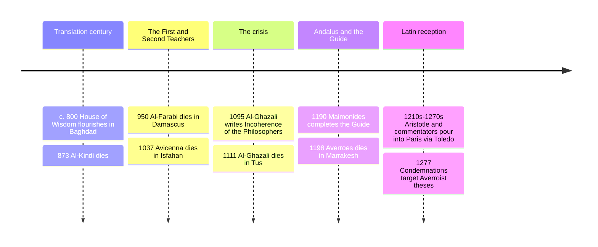

# 08 — Islamic and Jewish Philosophy — ปรัชญาอิสลามและยิว

> *"The truth does not contradict truth." (Averroes, Kitab fasl al-maqal, paraphrase)*

Between the fall of Rome's West and the European Renaissance, the center of the world's philosophical life ran from Baghdad to Córdoba and Cairo, in Arabic and Hebrew. Islamic and Jewish Philosophy (ปรัชญาอิสลามและยิว) is at once a great tradition in its own right, producing original metaphysics, psychology, and political theory, and the bridge by which Greek thought, above all Aristotle, reached Latin Europe. Without this bridge, [[07_Medieval_Philosophy]] has no Aristotle for Aquinas to argue with, and Europe's scientific awakening starts several centuries further back.

The cast is genuinely cosmopolitan: Muslim philosophers reading Greek, Jewish philosophers writing in Arabic under Muslim rule, Christian Latin scholars translating all of it, sometimes via Hebrew intermediaries. A Thai reader meeting this tradition should hold two thoughts at once: these were devout believers who took revelation seriously, and they were technical philosophers who followed arguments wherever they led, at real personal cost. Averroes was exiled; Maimonides wrote esoterically to avoid mob trouble; al-Kindi's library was confiscated. Ideas had stakes.

---

## 1 | Historical Context

After the Arab conquests, the Abbasid caliphate made Baghdad the largest city on earth and built the **House of Wisdom** (bayt al-hikma, บ้านแห่งปัญญา), where from roughly 800 to 900 CE teams, notably Hunayn ibn Ishaq's, translated Greek medicine, mathematics, and philosophy into Arabic, usually from Syriac. This was not photocopying: translators and commentators built a scholarly vocabulary for a new language and then, within two generations, stopped merely echoing Aristotle and began arguing with him.

Westward, al-Andalus (Muslim Spain) and the Maghreb produced the second great flowering: Avempace, Ibn Tufayl, and Averroes in Córdoba. Jewish communities, long Greek-speaking (Philo of Alexandria, 20 BCE-50 CE, is the ancient precedent), now wrote philosophy in Arabic Judaeo-Arabic, in Fez, Cairo, and Provence. When Toledo fell to Christian kings in 1085, it became Europe's translation hub: scholars like Gerard of Cremona rendered Arabic texts, Greek-with-commentary bundled together, into Latin. The term "Averroism" names the Latin European vogue for reading Aristotle through Ibn Rushd's commentaries in the 1200s.

## 2 | Core Concepts

### 2.1 The reception project: philosophy as heir, not rival

The earliest movement asked whether Greek philosophy was compatible with monotheism at all. **Al-Kindi** (c. 801-873), "the philosopher of the Arabs," answered yes: we should gratefully accept truth from whomever it comes, even foreign nations, because nothing should shame us in acquiring truth except neglecting to acquire it. He harmonized Plato's and Aristotle's metaphysics with creation from nothing, and wrote on cryptanalysis and medicine too, the model of the polymath philosopher.

**Al-Farabi** (c. 872-950) earned the title "the Second Teacher" (al-mu'allim al-thani, ครูลำดับที่สอง, Aristotle being the First) for making logic a standard formation in Islamic education. His political philosophy, especially *The Virtuous City* (المدينة الفاضلة), recasts Plato's Republic: the ideal ruler is philosopher-prophet, whose imagination clothes in symbols the truths the intellect grasps directly, so revelation is philosophy in imagistic dress, adapted for a whole people. He also built the first systematic theory of the sciences and of happiness as the highest human end.

### 2.2 Avicenna: the flying man and essence-existence

**Ibn Sina / Avicenna** (980-1037), Persian physician-philosopher, wrote the *Canon of Medicine* (standard European textbook until the 1600s) and *The Book of Healing*, a vast encyclopedia. His *flying man* thought experiment (the man floated in air, limbs spread, sensing nothing, no body, no location) asks what self-awareness would be like with zero external input: Avicenna's answer, the person would still affirm his own existence, so the soul's awareness of itself is primitive and not derived from the body. It is a medieval ancestor of Descartes's cogito and of modern debates about whether self-consciousness requires a body. See [[10_Rationalism]].

His metaphysics introduced a distinction the whole later tradition inherited: **essence and existence** (ماهية and وجود; what-a-thing-is versus that-it-is). For contingent beings, existence is added to essence, it comes from outside, from a Necessary Existent (wujib al-wujud) whose essence just is existence. Aquinas's version in [[07_Medieval_Philosophy]] is widely read as received, through translation, from Avicenna. He also theorized the **active intellect**, the external cosmic intelligence that makes human minds able to think universals, and distinguished "necessary in itself" from "necessary through another," a move that made possible the entire later essence-existence debate.

### 2.3 The famous duel: al-Ghazali versus Averroes

**Al-Ghazali** (1058-1111), the great theologian of Ash'ari occasionalism, after a personal crisis wrote *The Incoherence of the Philosophers* (تهافت الفلاسفة). Its thesis: the philosophers (mainly Avicenna and Farabi) are brilliant within logic and mathematics but go unguarded in metaphysics, and at three points their positions are outright heretical, denial of bodily resurrection, claim that the world is eternal, and claim that God knows universals only, not particulars like you and me. Occasionalism, the doctrine that no created thing has genuine causal power and God recreates each event directly, was his counter to necessity in nature, a position that later historians (wrongly but influentially) blamed for arresting Islamic science.

**Ibn Rushd / Averroes** (1126-1198), Córdoba judge-physician and history's great Aristotle commentator, answered line-by-line with *The Incoherence of the Incoherence* (تهافت التهافت). His defense: the Qur'an obliges the literate to investigate beings by demonstration (burhan); if scripture's plain sense seems to conflict with a demonstrated conclusion, scripture admits figurative interpretation (ta'wil); philosophy therefore is not merely permitted but commanded for those able to do it. His psychology insisted the possible intellect is one and eternal for all humans, the reading Latin Europe dubbed "monopsychism," and his double-theory of truth, demonstration and scripture teaching the same reality in different registers, underlies the slogan opening this note. His commentaries were so thorough that Latin Aristotle was read through him for two centuries.

### 2.4 Maimonides: the guide for the perplexed

**Moses Maimonides** (1138-1204), born Córdoba, died Cairo, court physician to Saladin's family, wrote in Arabic. The *Guide for the Perplexed* ( Dalālat al-ḥā'irīn; c. 1190) addresses a specific reader: a Jew raised on Torah and on Aristotle-and-Avicenna who cannot square them. His moves: much biblical language about God is **negative theology** (เทววิทยาเชิงลบ, via negativa), God has no attributes except existence and unity, all other predicates are denied or reinterpreted as descriptions of effects; prophecy is overflow of the active intellect onto a perfected imagination; miracles were built into creation's original constitution, so the world's lawfulness and God's sovereignty do not compete; and the commandments of the Law mostly target idolatry by counter-practice, the Temple cult reorganizing Israel away from the superstitions of its neighbors. A controversial, esoteric work, written to be misread by the casual and decoded by the careful, it is the bridge between the Arabic falasifa and Jewish philosophy proper; before him, note **Saadia Gaon** (882-942) as the first systematic Judaeo-Arabic thinker, and **Judah Halevi** (c. 1075-1141) as the tradition's internal critic, whose *Kuzari* defends revelation from the philosophers' own premises.

> **Comparative aside.** These faith-and-reason negotiations rhyme structurally with the Buddhist one in the Kalama Sutta (กาลามสูตร) and Abhidhamma scholasticism, canon plus analysis, authority plus testing, but the contents are not the same, and the comparison is best kept as a pointer rather than a claim of identity. See [[Social Studies/01 Religion/03_Other_Religions|Other Religions]] for the traditions' own accounts of God, revelation, and law.

## 3 | Timeline

## 4 | Key Thinkers and Ideas

| Thinker | Dates | Big Idea | Must-Know Work |
|---|---|---|---|
| Al-Kindi | c. 801-873 | Truth has no passport: Greek wisdom fits monotheism | On First Philosophy |
| Al-Farabi | c. 872-950 | Second Teacher; the Virtuous City; revelation as symbolized philosophy | The Virtuous City |
| Avicenna (Ibn Sina) | 980-1037 | Flying man; essence-existence; Necessary Existent | The Book of Healing |
| Al-Ghazali | 1058-1111 | Demonstration's limits; occasionalism; theology's verdicts | The Incoherence of the Philosophers |
| Averroes (Ibn Rushd) | 1126-1198 | Philosophy commanded by scripture; unity of intellect; commentary corpus | The Incoherence of the Incoherence |
| Maimonides | 1138-1204 | Negative theology; prophecy as intellect-plus-imagination | The Guide for the Perplexed |

**Al-Kindi** set the tone: appropriation, not apology. **Al-Farabi** built the political and scientific scaffold. **Avicenna** is the system-builder whose metaphysics, taught at European universities until 1600, quietly supplied the vocabulary later scholastics argued over. **Al-Ghazali** remains the deepest internal critic of philosophy's reach, and his *Deliverance from Error*, an autobiography of skepticism and recovery, belongs beside Augustine's *Confessions* in [[07_Medieval_Philosophy]]. **Averroes** defended philosophy as a public discipline with its own standards, and his trial in 1195, books burned, exiled, the core cost of that stance in his world. **Maimonides** showed how a believer reads a tradition's texts maximally seriously and maximally rationally at once, and shaped Christian scholastics (Aquinas cites him) as much as Jewish thought.

## 5 | Thai Terminology

| Thai | English | Notes |
|---|---|---|
| บ้านแห่งปัญญา | House of Wisdom | Abbasid translation institute in Baghdad |
| ครูลำดับที่สอง | the Second Teacher | al-Farabi's honorific, after Aristotle |
| ผู้จำเป็นอย่างยิ่ง | the Necessary Existent | Avicenna's term for God |
| สาระกับการมีอยู่ | essence and existence | Avicenna's distinction, inherited by Aquinas |
| ชายผู้ลอยในอากาศ | the flying man | Avicenna's self-awareness experiment |
| ปัญญากระทำ | the active intellect | Farabi/Avicenna/Averroes: cosmic agent of thought |
| ความไม่สอดคล้องของปราชญ์ | Incoherence of the Philosophers | al-Ghazali's book title |
| การโต้กลับความไม่สอดคล้อง | Incoherence of the Incoherence | Averroes's answer |
| การพิสูจน์ | demonstration | burhan: strict syllogistic science |
| การตีความเปรียบเทียบ | ta'wil | figurative reinterpretation when needed |
| เทววิทยาเชิงลบ | negative theology | Maimonides: say what God is not |
| ผู้ชี้ทางสู่ผู้สับสน | Guide for the Perplexed | Maimonides's masterwork |

## 6 | Why It Matters Today

The translation movement is the best historical argument that knowledge is a relay, not a national possession: Athens to Baghdad to Córdoba to Paris to everywhere, each leg adding commentary, correction, and transmission cost, and the whole chain nearly broke several times. For a Thai reader, the relay mirrors how Sanskrit, Pali, and Chinese learning were received, digested, and re-exported across Asia, and it is the model for how science transfers today, translation plus original work, not copying. When a workplace or school debates whether religion and science must fight, al-Ghazali, Averroes, and Maimonides offer three mature, opposed, non-cartoon answers, and the occasionalism-versus-natural-law dispute anticipates modern debates about determinism, see [[11_Empiricism]]. And the etiquette of the Ghazali-Averroes exchange, quote the opponent exactly, then answer, is a vanishing internet skill worth recovering.

## 7 | Further Reading

- *Islamic Philosophy: A Very Short Introduction* by John Marenbon: fair, compact, starts from the Qur'anic context.
- *The Incoherence of the Philosophers* by Al-Ghazali (Michael E. Marmura translation): the actual duel, readable.
- *The Guide for the Perplexed* by Maimonides (Pines translation): dense but rewarding; pair it with a companion.
- *Arabic Thought and its Place in History* by De Lacy O'Leary: dated in some theses, still useful for the transmission story.

## Related

- [[Philosophy/00_overview|← Philosophy Overview]]
- [[07_Medieval_Philosophy]]
- [[09_Renaissance_and_Humanism]]
- [[Social Studies/01 Religion/03_Other_Religions|Other Religions]]
