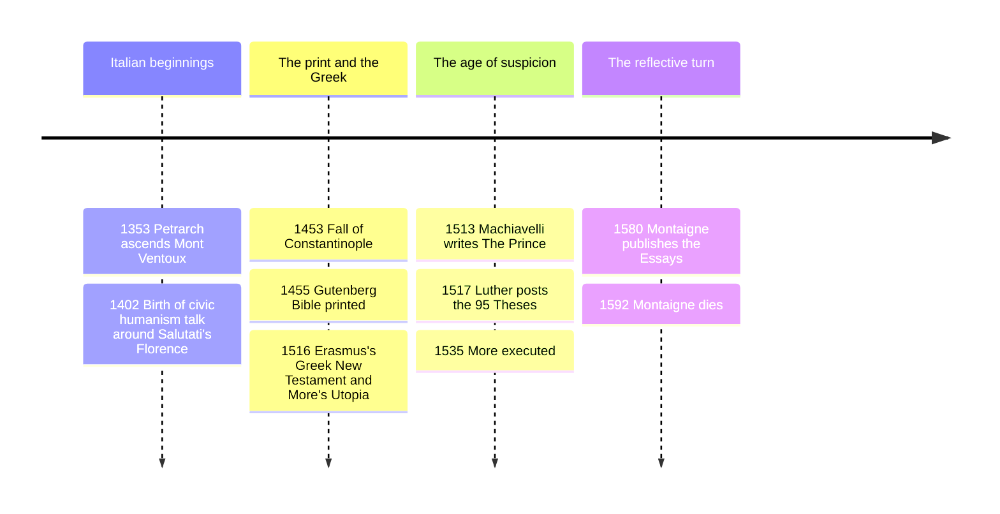

# 09 — Renaissance and Humanism — เรเนซองส์และลัทธิมนุษยภาพ

> *"I am a human being; I consider nothing human alien to me." (Terence, quoted by Erasmus and Montaigne alike)*

The Renaissance (เรเนซองส์, "rebirth," roughly 1350-1600 in Italy, spreading across Europe after) was the moment the human being moved to the center of intellectual attention: not replacing God exactly, but shifting the question from "what should we believe?" to "what should a human life, with its talents and its brevity, actually be for?" Its engine was **humanism** (ลัทธิมนุษยภาพ, studia humanitatis), a program of education in grammar, rhetoric, history, poetry, and moral philosophy aimed at producing eloquent, virtuous citizens rather than specialist logicians.

Why an adult should care: modern ideas of the well-rounded person, of education forming character, of reading classics to meet minds across centuries, of satire as a civic tool, and of politics analyzed by what is, not what ought to be, all run through this period. The humanists invented the intellectual culture most educated Thai readers already live in: the essay, the bestseller via the printing press, the public intellectual, the gap year abroad in pursuit of old manuscripts.

---

## 1 | Historical Context

Italy's crash course in the classical began with disaster and money. The Black Death (1347-1351) killed a third of Europe and shook confidence in inherited institutions; meanwhile, city-states like Florence, Venice, and Milan grew rich on trade and banking, and their lay elites wanted an education for merchants, magistrates, and diplomats, not just clergy and lawyers. Scholars hunting Latin manuscripts rediscovered Cicero, Quintilian, and Lucretius; after Constantinople's fall to the Ottomans in 1453, Greek émigrés brought Plato and the corpus Hermeticum west, and the printing press (c. 1450) made texts cheap and heresies faster-moving than ever.

The Church sponsored much of this: popes were patrons, and humanism was not atheism: Erasmus remained a devout Catholic, More died a Catholic martyr. What changed was tone and method: **ad fontes** ("to the sources") meant studying original texts philologically, which quietly dethroned the commentary tradition of [[07_Medieval_Philosophy]]. And the Italian Wars after 1494, France invading a fragmented peninsula, created the audience for hard-edged political analysis: states were falling; somebody explain how.

## 2 | Core Concepts

### 2.1 The humanist program: eloquence in service of virtue

| Feature | Scholastic norm | Humanist ideal |
|---|---|---|
| Core texts | Aristotle via manual and commentary | Cicero, Seneca, Plutarch, the Bible in Hebrew and Greek |
| Skill prized | Valid argument | Eloquent persuasion, elegant Latin, good judgment (prudentia) |
| Aim of study | Specialist knowledge | The virtuous citizen who can act |
| Method | Disputatio | Reading, imitation, letter-writing, history as "philosophy teaching by examples" |

**Petrarch** (1304-1374) kicked it off: crowned poet, letter-writer to the ancients as if they were friends, and author of the *Canzoniere*, love poems to Laura that made inner conflict, desire against self-knowledge, a literary subject. His "Ascent of Mont Ventoux" (1353), where he reads Augustine mid-hike and scolds himself for admiring landscapes while neglecting his soul, is the period's thesis in one anecdote: the rediscovery of antiquity in the service of self-examination.

### 2.2 Erasmus and More: satire and the imagined alternative

**Desiderius Erasmus** (1466-1536), the Dutch "prince of the humanists," made his living on wit and friendship across confessional lines. *In Praise of Folly* (Moriae Encomium, 1511) is an oration by Folly herself praising war-obsessed princes, greedy monks, and hair-splitting theologians, a joke so effective that attacking it admitted you were the target. His Greek New Testament (1516), philology applied to scripture, gave the Reformation its ammunition and outlived his wish that nobody fire it.

**Thomas More** (1478-1535), chancellor of England, humanist household man, and later executed by Henry VIII, wrote *Utopia* (1516): a traveler describes an island where property is abolished, everyone works six hours, religious toleration is law, and gold is made into chamber pots so citizens learn to despise it. The book's genius is its ambiguity, the name means "no-place," and whether More endorses the island, Irony detector off, readers still argue, and five centuries later the genre of the imagined society, from socialist commonwealths to science fiction, descends from it. See also [[Social Studies/03 Economics/05_Economic_Systems|Economic Systems]].

### 2.3 Montaigne: the essay and "what do I know?"

**Michel de Montaigne** (1533-1592), a Bordeaux mayor and retiree, locked himself in a tower with a library and began observing his own mind with total candor: his fears of kidney stones, his sex life, his habits, his doubts. *Essays* (1580) means "attempts": no system, no verdicts, thought in motion. His personal motto, scratched on a medal, was **Que sais-je?** (อะไรคือสิ่งที่ฉันรู้? "what do I know?"), and his skepticism, inherited from Sextus Empiricus via [[06_Hellenistic_Philosophy]], was practical: the man who really believes he knows is dangerous; the one who examines himself is civilizable. "On the Education of Children" proposed judgment over memory; "Of Experience" ended the tradition by trusting a cultivated life over any book. The essay, the entire modern genre of reflective nonfiction, is his invention.

### 2.4 Machiavelli: political realism, not villainy

**Niccolò Machiavelli** (1469-1527), Florence's second chancellor for fourteen years, handled diplomacy at the courts of Cesare Borgia, France, and the papacy, then was tortured, exiled, and wrote *The Prince* (1513, published 1532) in a country house in a day, he claimed, by "conversing with the ancients." Read it in context: Italy was a knife-fight of five states inviting French and Spanish armies, and Machiavelli's stated audience was the Medici who could unify, or at least save, Florence.

His move is methodological, not demonic: he proposes to follow "the effectual truth of the matter" rather than "the imaginary republic," to describe principalities as they are kept, not as they should be governed. A prince cannot always be virtuous in the Christian sense: liberality bankrupts, cruelty misused destroys, and the fox must sometimes break promises because men are wretched and would not keep theirs. The two load-bearing concepts are **virtù** (ความสามารถเข้มแข็ง: not "virtue" but energy, skill, boldness, adaptability) and **fortuna** (โชคชะตา: circumstance, luck), which he pictures as a flooding river, unpreventable in flood, but manageable if dikes were built in calm weather, better, he says, to be impetuous than cautious. "It is better to be feared than loved, if you cannot be both" is advice about reliability of human motives, not a celebration of terror, and he draws the line clearly: a prince must avoid being *hated*, which seizing subjects' property and women guarantees. His contemporaries called the book a school for tyrants; scholars still fight over whether he was a republican teacher of how not to be free, the reading that the *Discourses on Livy* and his Florence history support. Either way, the discipline of asking "what works, and at what cost" before "what is nice to say" founded modern political science. See also [[Social Studies/02 Civics/01_Democracy_and_Government|Democracy and Government]].

## 3 | Timeline

## 4 | Key Thinkers and Ideas

| Thinker | Dates | Big Idea | Must-Know Work |
|---|---|---|---|
| Petrarch | 1304-1374 | Return to sources; inner conflict as subject | Canzoniere; Letters |
| Erasmus | 1466-1536 | Satire against superstition; philosophy of Christ, plain and lived | In Praise of Folly |
| Thomas More | 1478-1535 | The imagined society as a mirror held to property and pride | Utopia |
| Montaigne | 1533-1592 | Self-examination as philosophy; moderate skepticism | Essays |
| Machiavelli | 1469-1527 | Political realism: virtù versus fortuna; effectual truth | The Prince; Discourses on Livy |

**Petrarch** taught Europe to read the ancients as companions rather than authorities. **Erasmus** proved a joke could do the work of a council, and his philology made scripture everyone's text. **More** risked his life for the humanist principle that conscience is not the king's property. **Montaigne** lowered philosophy's voice to conversation height and made the ordinary self a laboratory. **Machiavelli** said what states do, not what they claim, and paid with four centuries of name-calling, "Machiavellian" as insult, while every campaign office and strategy memo quietly quotes him.

## 5 | Thai Terminology

| Thai | English | Notes |
|---|---|---|
| เรเนซองส์ | Renaissance | "rebirth" of classical learning |
| ลัทธิมนุษยภาพ | humanism | the studia humanitatis program |
| กลับสู่ต้นแหล่ง | ad fontes | "to the sources," the philological slogan |
| วาทศิลป์ | rhetoric | persuasion, the humanists' core science |
| ความรอบด้าน | the well-rounded person | the courtier/ideal citizen ideal |
| การสรรเสริญความเขลา | In Praise of Folly | Erasmus's satirical masterpiece |
| ยูโทเปีย / ดินแดนในฝัน | Utopia | literally "no-place" |
| เรียงความ / Essays | essays | Montaigne: "attempts" of a thinking mind |
| อะไรคือสิ่งที่ฉันรู้ | Que sais-je? | Montaigne's mediating skepticism |
| หลักการเมืองเชิงปฏิบัติ | political realism | Machiavelli's "effectual truth" |
| คุณธรรมแบบแข็งกร้าว | virtù | skill, energy, adaptability (not meek virtue) |
| โชคชะตา | fortuna | circumstance the prince builds dikes against |

## 6 | Why It Matters Today

Every Thai office that values "communication skills" alongside technical skill is running the humanist curriculum's latest version, the claim that eloquence and judgment are trainable, and the liberal-arts defense of broad education over narrow training is still the *studia humanitatis* argument. Montaigne's self-examination is the ancestor of the reflective-practice movement in medicine and teaching, and his question "what do I know?" is the right first move against confident outrage on social media, a stance that pairs with [[Social Studies/02 Civics/12_Media_Literacy|Media Literacy]]. Erasmus shows why satire survives censorship: mock the powerful well enough and they cannot answer without confirming the joke. Machiavelli, read correctly, is the case for evidence-based policy evaluation: ask what a measure actually does to a regime's stability, who bears the cost, and whether the leader's virtue or the institution's design keeps the state standing, questions every Thai political commentator should have the honesty to ask and the context not to answer cynically.

## 7 | Further Reading

- *The Prince* by Niccolò Machiavelli (W. K. Marriott or Quentin Skinner/Price translation): short enough for one evening; read the *Discourses* next if it surprises you.
- *Essays* by Montaigne (M. A. Screech translation): start with "On Experience" and "On the Education of Children."
- *In Praise of Folly / Utopia* (any combined edition): the two great northern humanist provocations in one sitting.
- *Machiavelli: A Very Short Introduction* by Quentin Skinner: the best antidote to cartoon readings.

## Related

- [[Philosophy/00_overview|← Philosophy Overview]]
- [[08_Islamic_and_Jewish_Philosophy]]
- [[10_Rationalism]]
- [[Social Studies/04 History/02_World_History_and_Civilizations|World History and Civilizations]]
