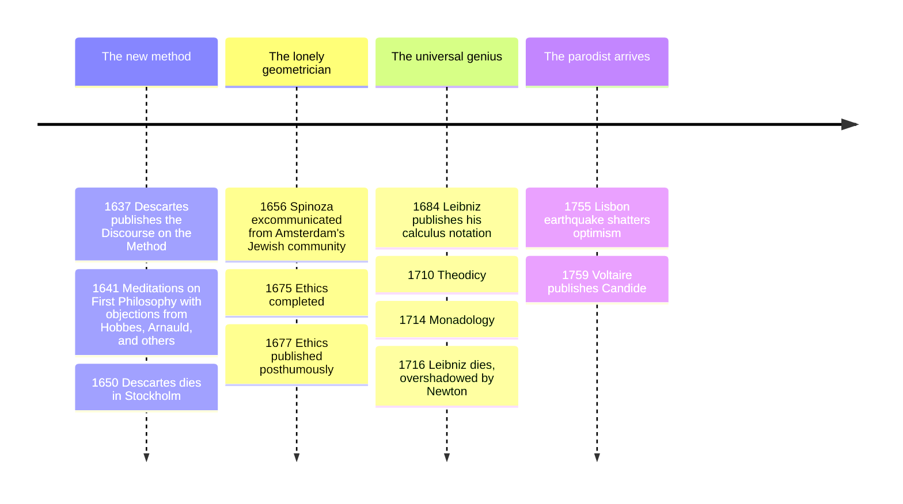

# 10 — Rationalism — ลัทธิเหตุผลนิยม

> *"I think, therefore I am." (Descartes, Discourse on the Method, 1637, and Meditations, 1641)*

Rationalism (ลัทธิเหตุผลนิยม) is the epistemological stance that reason, not sensory experience, is the foundation of the most important knowledge: that some truths, mathematics, the laws of thought, the structure of the self, perhaps God, can be known *a priori*, by deduction from ideas the mind already possesses, with an authority no experiment can overrule. In its 17th-century flowering, the "continental rationalism" of Descartes, Spinoza, and Leibniz, it was the modern philosophy's opening move: after the Renaissance scattered old certainties, can we rebuild knowledge from the ground up, the way geometry builds a theorem?

An adult should care because the rationalists set the agenda everyone since has answered to. The mind-body problem they posed now runs through every AI and neuroscience debate; the "method of doubt" is the ancestor of first-principles thinking and of the debugging mindset; Spinoza's determinism and his ethics of understanding emotions anticipated modern psychology directly (Cognitive Behavioral Therapy's founders cite him by name); and Leibniz dreamed a universal symbolic language for reasoning that became, three centuries later, the formal logic underpinning computation, see [[Mathematics/Advance/01_Sets_and_Logic|Sets and Logic]] and [[Mathematics/Advance/21_Mathematical_Reasoning|Mathematical Reasoning]].

---

## 1 | Historical Context

The backdrop is the Scientific Revolution collapsing the medieval synthesis: Copernicus and Galileo displaced the Earth, Kepler and Newton rewrote the heavens in mathematics, and the Thirty Years' War (1618-1648) made Europe's old authorities look, at minimum, unreliable. The rationalists wanted for philosophy what Galileo had found for physics: foundations so secure that conclusions built on them could not shake, a "mathesis universalis," universal mathesis of ideas.

All three figures lived against that collapse personally. Descartes (1596-1650), a Frenchman who spent his most productive years in the Dutch Republic, volunteered the year he wrote his method, "I resolved to seek for no other science than the knowledge of what I would find in myself or in the great book of the world." Spinoza (1632-1677), Amsterdam's excommunicated Jewish lens-grinder, was banned from his community at 23 for "heretical beliefs" and refused a Heidelberg professorship to keep his freedom to write. Leibniz (1646-1716), a German diplomat-librarian-mining-engineer, corresponded with all of Europe, independently invented calculus alongside Newton (the priority dispute embittered his last years), and died receiving funeral orations for his patrons but none for himself.

## 2 | Core Concepts

### 2.1 Descartes: doubt everything that can be doubted

The *Meditations on First Philosophy* (1641) is a six-day demolition and rebuild, written as autobiography:

| Step | Move | Purpose |
|---|---|---|
| Methodical doubt | Reject any belief with even a hint of uncertainty | Clear the foundation |
| The senses deceive | A stick bends in water; dreams feel real | Undermine empiricism as a foundation |
| The evil demon | Suppose an all-powerful deceiver makes 2+3=5 and extension seem real | Push doubt to its maximum |
| Cogito ergo sum | Even deceived, I exist: the "I am" survives every doubt | The one indubitable truth |
| Criterion of truth | What I perceive clearly and distinctly must be true | A method rule to rebuild on |
| God veracious | A perfect being would not systematically deceive me, so clear and distinct ideas are guaranteed | Escape the "Cartesian circle" |
| Dualism | I am a thinking thing (res cogitans), essentially unextended; body is extended stuff (res extensa) | Mind and body really distinct |

The **cogito**'s real lesson is not "proof of self" so much as *foundationalism*: knowledge needs one self-certifying truth, then a method. The **mind-body dualism** (ทวิภาวะของจิตกับกาย) left the notorious problem, how does an unextended thought move a hand? Descartes guessed the pineal gland; no one has done much better, and the difficulty is the living core of [[21_Philosophy_of_Mind_and_AI]]. His mechanistic physics, animals as automata, the universe as matter in motion, gave the succeeding century its science, and his geometry-ization of algebra, coordinates and all, still shapes every graph your phone plots.

### 2.2 Spinoza: God or Nature

Benedict de Spinoza's *Ethics* (published 1677, months after his death) is written "in geometrical order," definitions, axioms, propositions, proofs, about the most un-geometric subject, how to live. Its first move: **deus sive natura** (พระเจ้าหรือธรรมชาติ, "God or Nature"): there is exactly one substance, infinitely attributes deep, self-caused, necessary, which Spinoza calls God, and the universe of things is not its creation but its expression. "Mind and body are one and the same thing, conceived now under the attribute of thought, now under extension": the Cartesian interaction problem dissolves because there were never two things to interact.

From this follows rigorous **determinism** (ลัทธิกำหนดนิยม): "men believe themselves free simply because they are conscious of their actions and unconscious of the causes that determine them," the statement a modern neuroscientist would barely edit. Nothing is contingent; everything follows from divine nature with the necessity with which "it follows from the nature of a triangle that its three angles equal two right angles." The ethics grows out of this: human emotions are "lines, planes, and bodies" to be understood, not vices to be cursed; we are passive (acted upon) when we do not grasp our causes and active when we do. The free person, his portrait in Part Four, does not envy, does not despair, and "we strive neither to laugh nor weep, but to understand"; and the "intellectual love of God" at the end, joy accompanied by the idea of God-as-cause, is mysticism stated as theorem, Nietzsche and Einstein both confessed its influence.

### 2.3 Leibniz: monads and the best of all possible worlds

Gottfried Wilhelm Leibniz rejected the cogito's lonely starting point and Spinoza's single substance: reality is a plurality of windowless **monads** (Monadology, 1714), simple soul-like substances, each a living mirror of the whole universe from its own perspective, each developing by its own inner program. Since windowless things cannot push each other, how do mind and body agree? **Pre-established harmony** (ความลงรอยกันล่วงหน้า): God, choosing creation, tuned every monad's unfolding to every other like an infinity of clocks set to agree without touching, the doctrine he offered against occasionalism and interactionism alike.

His **optimism** came from the same engine: among all composable worlds a perfect mind could conceive, the actual one contains the maximal variety at the simplest laws, so it is, strictly, the best of all possible worlds, and evil is partial and perspectival, like ugliness in a distant city in a good map. His theodicy (1710) tried to answer Lisbon's 1755 earthquake and Job's complaint with that answer. **Voltaire's parody** *Candide* (1759), Dr. Pangloss propagating "all is for the best" through rape, slavery, syphilis, and auto-da-fé, is the most devastating rebuttal in literature's history, and it hardened into the phrase "Panglossian," but the serious point Leibniz was making, that a world with lawful regularity will contain local costs no finite creature can reconcile to the total ledger, remains live in every actuarial, epidemiological, and AI-safety optimization debate.

**Innate ideas** (แนวคิดติดตัว) close the cluster: rationalists across the school held that the mind brings content to experience, the ideas of substance, cause, infinity, mathematical truth, not being a blank slate. Locke's attack is [[11_Empiricism]]'s opening chapter.

## 3 | Timeline

## 4 | Key Thinkers and Ideas

| Thinker | Dates | Big Idea | Must-Know Work |
|---|---|---|---|
| René Descartes | 1596-1650 | Methodical doubt; cogito; mind-body dualism | Meditations on First Philosophy |
| Baruch Spinoza | 1632-1677 | God-or-Nature; one substance; determinism; understanding the emotions | Ethics |
| Gottfried Leibniz | 1646-1716 | Monads; pre-established harmony; best possible world; calculus | Monadology; Theodicy |

**Descartes** is the hinge figure: the modern self, certain of itself before anything else, is his invention, and the problems he bequeathed, other minds, the external world's guarantee, mind and matter's marriage, define subsequent philosophy. **Spinoza**, dismissed for a century as "a drunk atheist," became the 19th century's most dangerous philosopher, and the 20th rediscovered him in psychology, deleuzian philosophy, and neuroscience (Damasio's *Looking for Spinoza*). **Leibniz** anticipated logic, computing, biology (cells as micro-machines), and physics (his vis viva fights Newton's momentum, and the dispute was partly resolved in his favor by energy conservation), and his dream of a calculus of reasoning, the *characteristica universalis*, is acknowledged by every designer of a formal language.

## 5 | Thai Terminology

| Thai | English | Notes |
|---|---|---|
| ลัทธิเหตุผลนิยม | rationalism | reason as foundation of key knowledge |
| ความรู้ก่อนประสบการณ์ | a priori | knowledge independent of experience |
| ความสงสัยอย่างเป็นระบบ | methodical doubt | Descartes' demolition tool |
| ปีศาจผู้หลอกลวง | the evil demon | the maximal skeptical hypothesis |
| ฉันคิด ฉันจึงมีอยู่ | cogito ergo sum | the indubitable first truth |
| สสารคิดได้ / สสารกินที่ | res cogitans / res extensa | mind-stuff and body-stuff |
| ทวิภาวะจิต-กาย | mind-body dualism | the interaction problem's parent |
| พระเจ้าหรือธรรมชาติ | deus sive natura | Spinoza's one substance |
| ลัทธิกำหนดนิยม | determinism | no contingency in nature |
| โมนาด | monad | Leibniz' windowless simple substance |
| ความลงรอยกันล่วงหน้า | pre-established harmony | synchronized clocks, not interactions |
| แนวคิดติดตัว | innate ideas | the mind's built-in content |

## 6 | Why It Matters Today

Descartes' method survives as "first-principles reasoning," the startup and engineering habit of discarding analogy and deriving from ground truths, and his doubt is exactly the epistemic hygiene a media-literate reader needs: before trusting a claim, ask whether any deceiver, algorithm, incentive, or deepfake could produce it. See [[Social Studies/02 Civics/12_Media_Literacy|Media Literacy]]. The dualism he left is the frame half the public still uses for AI: can a machine think, or does it merely move matter, the hard problem of consciousness, why there is "something it is like" to be a bat, or a chatbot, is Descartes' bequest to [[21_Philosophy_of_Mind_and_AI]]. Spinoza is the quiet ancestor of emotional intelligence and CBT: you change an emotion by understanding its cause, not by shaming it, a sentence that could be on a Thai hospital pamphlet, and it is also a reasonable modern reading compatible with Buddhist practice of clear comprehension (สัมปชัญญะ), though the metaphysics, one substance versus no-self, differ sharply, see [[Social Studies/01 Religion/01_Buddhist_Principles|Buddhist Principles]]. Leibniz's perspective-taking monads, each a whole-world mirror at its own resolution, are an uncannily good picture of what a modern neural model is: windowless parameter sets trained toward harmony with data.

## 7 | Further Reading

- *Meditations on First Philosophy* by Descartes (Willing or Cottingham translation): 60 pages, still the best philosophy book you can read in a week; read the objections too, they are part of the work.
- *Ethics* by Spinoza (Curley or Shirley translation): strange at first, geometrical order takes one chapter to feel; pair with Damasio's *Looking for Spinoza*.
- *Philosophical Essays* by Leibniz (Rescher or Loemke): includes the Monadology and the Theodicy preface.
- *Candide* by Voltaire: the parody, and the best single argument that philosophy must answer to suffering.

## Related

- [[Philosophy/00_overview|← Philosophy Overview]]
- [[09_Renaissance_and_Humanism]]
- [[11_Empiricism]]
- [[Mathematics/Advance/01_Sets_and_Logic|Sets and Logic]]
