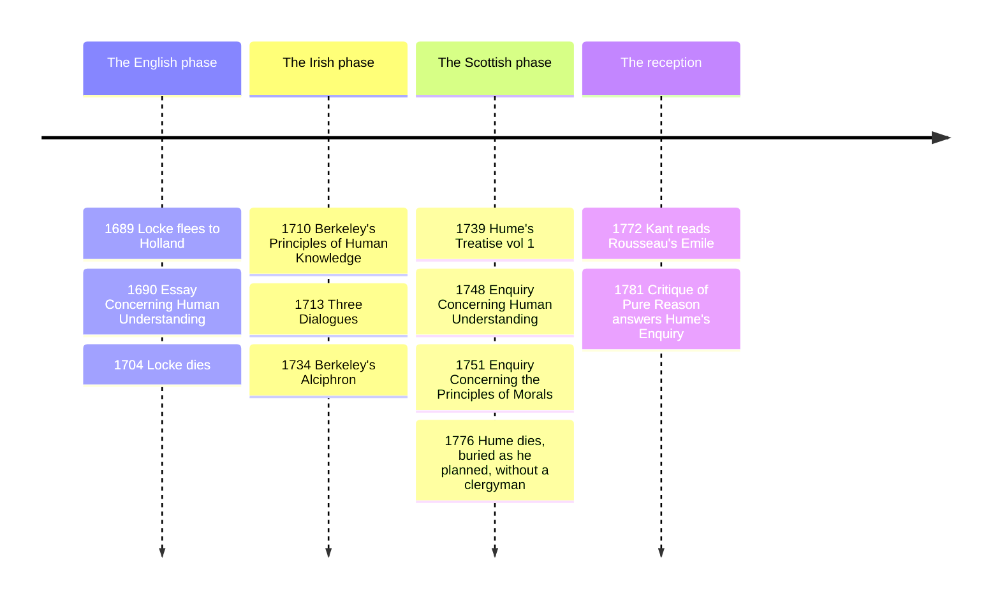

# 11 — Empiricism — ลัทธิประสบการณ์นิยม

> *"The sun will rise tomorrow. Why? Because it always has. Is that proof? No, it is custom." (after Hume)*

Empiricism (ลัทธิประสบการณ์นิยม) is the epistemological stance that all knowledge of matters of fact comes, directly or indirectly, from experience: the mind at birth is no treasure vault of innate ideas but material to be worked up from what the senses and inner reflection deliver. Where [[10_Rationalism]] sought certainty by deducing from pure ideas, the British empiricists, Locke, Berkeley, and Hume, traced every claim back to its experiential pedigree, and Hume followed the trace far enough to shake philosophy awake, in his own admiring phrase Kant would later quote: to break the "dogmatic slumber."

An adult should care because empiricism is the epistemology of modern science and of everyday evidence culture: its demand that claims cash out in observation underwrites the clinical trial, the audit, the fact-check, see [[Science/Fundamental/01_Scientific_Method|the Scientific Method note]]. And its most unsettling child, Hume's problem of induction, is the hidden assumption behind every weather forecast, investment model, and machine-learning system: that the future will resemble the past, a premise no past has ever proven.

---

## 1 | Historical Context

The school arose in Restoration and Augustan England and Scotland, deliberately anti-Cartesian in tone: where Descartes retired to a stove-heated room to think, the empiricists were physicians, secretaries, travelers, and clerics steeped in the experimental culture of the Royal Society (founded 1660, Francis Bacon's *Novum Organum*, 1620, its manifesto). Locke (1632-1704), Oxford physician and political exile, drafted the *Essay Concerning Human Understanding* (1690); its opening book is a direct assault on innate ideas. Berkeley (1685-1753), an Irish Anglican bishop and later a would-be colonizer of Bermuda, pushed the sensory premise to its limit in the *Principles of Human Knowledge* (1710). Hume (1711-1776), an Edinburgh merchant's son who failed at business and succeeded at skepticism, wrote the *Treatise of Human Nature* (1739-1740) at 26, found it "dead-born," and recast its arguments in the cleaner *Enquiries*.

The sequence forms philosophy's textbook dialectic: Locke grounds knowledge in experience but keeps matter; Berkeley notices "matter" has no experiential content and drops it; Hume notices "cause," "self," and "induction" have none either, and the rebuild stalls, waiting for Kant to restart it, see [[13_Kant_and_German_Idealism]].

## 2 | Core Concepts

### 2.1 Locke: the blank slate and the two qualities

Locke's opening move against rationalism: there are no **innate ideas** (แนวคิดติดตัว); children and "ideots" (his period word) do not think the axioms of logic; universal assent is therefore empty, and everything in the mind arrives by **sensation** (external sense-data) or **reflection** (the mind watching itself), the two "fountains of knowledge." The mind at birth is a **tabula rasa** (กระดานว่าง, "blank table"), and its whole furniture is simple ideas compounded, compared, and named by these operations.

His distinction between **primary and secondary qualities** then set the agenda for 300 years of science-and-philosophy debate:

| Quality | Locke's account | Example |
|---|---|---|
| Primary | really inseparable from the body; solidity, extension, figure, motion | the wax's shape and bulk survive melting |
| Secondary | nothing in the object but a power to produce sensations in us via primary qualities | the wax's color, sweetness, warmth |
| Result | science describes the primary world truly; the sensory world is our presentation of it | "red" is a transaction, not a property |

Defenders of the distinction still run the argument; opponents (Berkeley first) ask how any "quality" can be known except as experienced, which quietly collapses primary into secondary.

### 2.2 Berkeley: esse est percipi

George Berkeley's *Treatise Concerning the Principles of Human Knowledge* (1710) argued that Locke's "material substance" is a meaningless phrase: try to form an idea of an extended solid thing with no color, no hardness, no secondary quality left, and you cannot, because to have an idea just is to have a sensory presentation. Therefore **esse est percipi** (การมีอยู่คือการถูกรับรู้, "to be is to be perceived"): physical objects are nothing but collections of ideas in minds, and the table is the dining-room experience, analyzed not denied. The obvious objection, does the forest fall when no human hears?, gets Berkeley's famous answer: God, the infinite perceiver, is always perceiving, so the world's continuity is divine attention; his idealism (จิตนิยม) is in his own mind the most anti-skeptical system possible, and he wrote the *Alciphron* and traveled to Rhode Island chasing a Bermuda college that never materialized, while the university of California bears his name as a gift from a gold-rush donor who never visited it.

### 2.3 Hume: impressions, the fork, and the demolition of necessity

David Hume divides perception into **impressions** (vivids: sensing, feeling, angry now) and **ideas** (the faint copies memory and thought reuse), then issues his checking rule, the copy principle: an idea with no impression behind it is counterfeit, and "cause," "substance," and "self" are about to get audited.

**Hume's fork** sorts all objects of reason into two camps:

| Relation | Content | Certainty | Examples |
|---|---|---|---|
| Relations of ideas | logic, mathematics, geometry | intuitively or demonstratively certain; deny them and you contradict | 3x5 = half of 6x5; the Pythagorean theorem |
| Matters of fact | existence, the world, the future | never demonstrable; the contrary is always possible | the sun rises tomorrow; bread nourishes |

With the fork in hand, he audits **causation**. We never observe in billiard-ball collisions any "necessary connection," only constant conjunction (A always followed by B) plus contiguity and priority in time. What we call causal power is a *feeling*, the mind's customary transition (จารีตของใจ) after repetition: custom, not insight, is the great guide of life. Then the **problem of induction** (ปัญหาอุปนัย) detonates: every prediction that the future will resemble the past either argues from experience, which presupposes the very resemblance being proven, begging the question, or claims the principle is a relation of ideas, which it is not, for "it is no contradiction to say the sun will not rise tomorrow." Hume is not saying induction is stupid, he says it is *natural*, hard-wired expectation we cannot help using, and cannot help justifying, the place where rational justification runs out. See also [[Mathematics/Advance/21_Mathematical_Reasoning|Mathematical Reasoning]].

Two further audits. **Is-ought** (ความเป็น-ควรเป็น): every moral writer slides, unnoticed, from what is to what ought to be, yet no "ought" can be deduced from "is" without a bridging sentiment: reason is, and ought to be, the slave of the passions (เหตุผลเป็นทาสของอารมณ์), morality is felt approval and disapproval, not discovered in the act. And the **self** (ตัวตน): introspecting, Hume reports he always stumbles on some particular perception, heat or cold, love or hatred, and never catches "myself" behind them, so the person is "a bundle or collection of different perceptions" in perpetual flux, a fiction of imagination, like a republic whose unity lies in laws and memories, not a soul-substance.

> **Honest comparison.** The bundle theory is the closest thing in European philosophy to the Buddhist **non-self** (อนัตตา, anattā) doctrine of the five aggregates (ขันธ์ 5), person as converging processes, no owner behind them, see [[Social Studies/01 Religion/01_Buddhist_Principles|Buddhist Principles]]. The parallels are real at the analytical level, both dissolve the unitary inner substance, and the differences are equally real: for Hume the bundle is a psychological conclusion inside a naturalistic project, for the Buddha the analysis is soteriological, aimed at uprooting clinging, and Buddhism keeps a continuity-of-process (vijñāna/viññāṇa stream) doing work Hume assigns to memory and imagination. Keep both columns in view; do not call them the same doctrine.

## 3 | Timeline

## 4 | Key Thinkers and Ideas

| Thinker | Dates | Big Idea | Must-Know Work |
|---|---|---|---|
| Francis Bacon (precursor) | 1561-1626 | Knowledge must be built from patient induction | Novum Organum (1620) |
| John Locke | 1632-1704 | Tabula rasa; no innate ideas; primary vs secondary qualities | Essay Concerning Human Understanding |
| George Berkeley | 1685-1753 | Esse est percipi; immaterialism; God as cosmic perceiver | Principles of Human Knowledge |
| David Hume | 1711-1776 | Impressions/ideas; the fork; custom; induction; is-ought; bundle self | Enquiry Concerning Human Understanding |

**Bacon** is the movement's herald: his *Novum Organum* proposed that nature be interrogated by experiment rather than syllogized from authorities. **Locke** supplied the theory of mind empiricism still assumes, ideas as copies and concepts as constructions, and his *Two Treatises* also made his epistemology politically explosive, see [[12_Enlightenment_and_Social_Contract]]. **Berkeley** proved empiricism could be consistent: one can take "experience all the way down" seriously, and his positive case, the world as divine communication, is the most underrated system in the canon. **Hume** is the crisis: he gave naturalism its program, causation and self as human constructions, gave Kant his trigger, and left induction a standing problem that every AI trained on historical data inherits, see [[Science/Advance/Computer Science/11_Artificial_Intelligence|Artificial Intelligence]].

## 5 | Thai Terminology

| Thai | English | Notes |
|---|---|---|
| ลัทธิประสบการณ์นิยม | empiricism | experience as the source of factual knowledge |
| กระดานว่าง | tabula rasa | Locke's blank slate |
| แนวคิดติดตัว | innate ideas | the rationalist thesis Locke attacks |
| คุณภาพปฐมภูมิ / ทุติยภูมิ | primary / secondary qualities | shape and motion vs color and taste |
| การมีอยู่คือการถูกรับรู้ | esse est percipi | Berkeley's idealist slogan |
| จิตนิยม | idealism | reality as mind and its ideas |
| ความประทับใจ / ภาพจำลอง | impressions / ideas | Hume's vivacity distinction |
| ส้อมของฮิวม | Hume's fork | relations of ideas vs matters of fact |
| ความเกี่ยวเนื่องสม่ำเสมอ | constant conjunction | what causation observably is |
| จารีตของใจ | custom | the felt glue of cause and effect |
| ปัญหาอุปนัย | the problem of induction | past-to-future, unjustified |
| คู่ความเป็น-ควรเป็น | is-ought gap | no moral conclusion from pure facts |
| กอรวมของการรับรู้ | bundle theory | the self as a collection, not a substance |
| อนัตตา | non-self (anattā) | Buddhist analogue, kept distinct |

## 6 | Why It Matters Today

Every Thai newsreader who asks "who says so, and how do they know?" is running Hume's copy principle on a headline. Evidence-based medicine, policy randomized trials, insurance actuarial tables, and the entire data economy rest on induction, and Hume is the reason statisticians say "confidence level," not "proof": a model that predicts the stock from yesterday's prices embeds the sun-rise assumption and should be priced accordingly, the caution behind terms like "black swan" risk. Locke's primary/secondary split is the working metaphysics of every app: your phone renders color, haptic feedback, and sound as interfaces to invisible voltages, exactly his transactional picture, and user experience design is the art of managing secondary qualities. Berkeley, caricatured as the man denying the table, is the patron saint of virtual worlds: a multiplayer game *is* esse est percipi, persistence guaranteed by servers, the divine perceiver replaced by the infrastructure, see [[Science/Advance/Computer Science/01_Computational_Thinking|Computational Thinking]]. And the is-ought gap disciplines every policy argument: "GDP grew 3 percent" (see [[Social Studies/03 Economics/10_Economic_Indicators|Economic Indicators]]) never, by itself, entails "therefore the policy is good," and a citizen who can spot the hidden "ought" is harder to campaign-manipulate, see [[Social Studies/02 Civics/12_Media_Literacy|Media Literacy]].

## 7 | Further Reading

- *An Enquiry Concerning Human Understanding* by David Hume (any edition; Selby-Bigge's is standard): 100 pages, the best skeptical provocation ever written in English, and readable as an essay collection.
- *An Essay Concerning Human Understanding* by John Locke (Woolhouse abridged edition): the full book is 600 pages; Book I, the innate-ideas takedown, and Book II are the payoff.
- *The Principles of Human Knowledge* by George Berkeley: short, and watching Hume answer it afterwards is the fun.
- *Bertrand Russell, The Problems of Philosophy* (1912): a first-rate analytic tour that starts by relitigating Locke, Berkeley, and Hume.

## Related

- [[Philosophy/00_overview|← Philosophy Overview]]
- [[10_Rationalism]]
- [[12_Enlightenment_and_Social_Contract]]
- [[Science/Fundamental/01_Scientific_Method|the Scientific Method note]]
