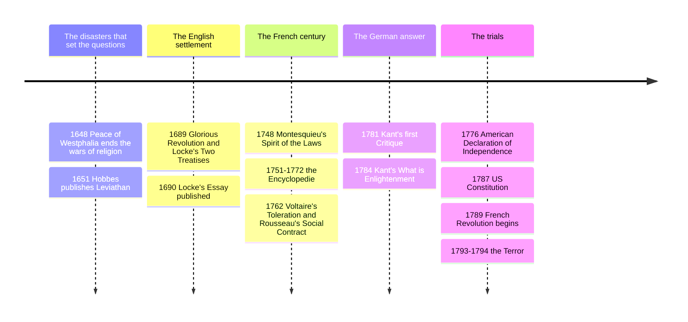

# 12 — Enlightenment and Social Contract — ยุคสว่างทางปัญญาและสัญญาประชาคม

> *"Sapere aude! Have the courage to use your own understanding." (Kant, What is Enlightenment?, 1784)*

The Enlightenment (ยุคสว่างทางปัญญา, "the century of philosophy," roughly 1685-1815) was not a doctrine but a program: extend the age's confidence in reason and evidence, see [[10_Rationalism]] and [[11_Empiricism]], from nature to society, religion, law, and politics, and do it publicly, in salons, coffeehouses, and pamphlets. Its defining civic word was **public use of reason** (การใช้ปัญญาอย่างสาธารณะ): the duty of a literate people to debate the rules they live under. Kant's 1784 essay set the movement's bar: enlightenment is humanity's emergence from "self-incurred immaturity," letting books, pastors, and princes do your thinking for you.

Its most consequential practical invention was the **social contract** (สัญญาประชาคม): the idea that political authority is constructed, explicitly or hypothetically, from below, by mutual agreement for mutual benefit, not ordained from above. Every argument about democracy, rights, constitutions, or the duty to obey law is conducted on terms this century wrote. For a Thai citizen, this is the philosophical ancestry of every civics classroom debate about the cabinet's mandate and the courts' limits, see [[Social Studies/02 Civics/01_Democracy_and_Government|Democracy and Government]].

---

## 1 | Historical Context

Three shocks built the mood. The wars of religion had made Europe sick: the Thirty Years' War (1618-1648) and the English civil wars killed on confession, so "what may we disagree about without killing?" became the urgent question. Newton (1643-1727) made the universe look lawful and intelligible, and his popularizers asked why society could not be studied the same way. And print plus rising literacy created a reading public that could argue with governments: the *Encyclopédie* (1751-1772, Diderot and d'Alembert, seventeen volumes, smuggled past censors) was the movement's flagship, systematized knowledge as a public good.

The geography ran London (Hobbes 1651, Locke 1689), Paris (the salons, Voltaire, Montesquieu, Rousseau), Edinburgh (Hume, Adam Smith), Königsberg (Kant), and finally Philadelphia and Paris in 1776 and 1789, when the theories went to trial in revolutions.

## 2 | Core Concepts

### 2.1 Kant's definition: the age of public reason

Kant's essay distinguishes private use of reason (obedient function: the officer follows orders, the citizen pays taxes) from public use (the scholar addressing "the entire reading public" to argue the orders were wrong), and insists only the latter is always free and essential. Enlightenment, in his account, is institutional as much as personal: freedom to publish plus a public trained to use it. This is the philosophical charter of the editorial page and the modern university, and the civics test every society eventually faces: whether dissent and disloyalty are the same act.

### 2.2 Voltaire and Montesquieu: tolerance and structure

**Voltaire** (1694-1778), the century's most famous pen, fought *l'infâme*, organized intolerance, with wit and litigation. The **Calas affair** (1761-1762) was his crusade: Jean Calas, a Toulouse Protestant, was tortured and executed for the supposed murder of his son to stop his conversion, on evidence that collapsed on inspection. Voltaire's *Treatise on Toleration* (1763) turned the miscarriage into Europe's debate: persecutors cannot know heretics' hearts, civil law punishes acts, not beliefs, and a plural society's only operating manual is mutual allowance. His slogan, from his letters, was *écrasez l'infâme*, "crush the infamous thing," the infamous thing being fanaticism, not faith itself. See [[Social Studies/01 Religion/03_Other_Religions|Other Religions]] for how traditions ground tolerance internally.

**Montesquieu** (1689-1755), in *The Spirit of the Laws* (1748), asked not "what is the best regime" but "what makes any regime preserve itself," a behavioral science of politics: each government runs on a governing passion, republics virtue, monarchies honor, despotism fear, and outcomes follow institutional incentives, not speeches. His prescription, the founding generation's most-cited secular authority, is the **separation of powers** (การแบ่งแยกอำนาจ): legislative, executive, judicial in different hands, "power must check power" (อำนาจต้องยับยั้งอำนาจ), because every man with power abuses it until he meets a limit.

### 2.3 The three social contracts, compared

The **contract tradition** imagines a **state of nature** (สภาพธรรมชาติ: politics without politics) and asks what rule rational people in that condition would agree to, then derives the state's legitimacy and limits from the deal. Hobbes, Locke, and Rousseau run the same experiment with opposite findings, and the differences map onto the constitutions they influenced:

| Element | Hobbes (Leviathan, 1651) | Locke (Second Treatise, 1689) | Rousseau (Social Contract, 1762) |
|---|---|---|---|
| Human starting point | Roughly equal in body and mind; competitive, diffident, glory-hungry | Social and reasonable; natural law is knowable to reason | Solitary, self-sufficient, pitiable; corrupted by society's comparisons |
| State of nature | "War of every man against every man"; life "solitary, poor, nasty, brutish, and short" | Not war but "inconveniences": property exists, but each is judge in his own cause, so disputes spiral | Pre-moral innocence; the real misery is the existing social order, inequality |
| The contract | Each authorizes an absolute sovereign to keep peace; subjects do not contract with the ruler | Community contracts with trustees of government to protect **life, liberty, and estate** | Each gives himself to all, receiving himself again under the **general will** (เจตจำนงทั่วไป / สัญญาประชาคมเพื่อส่วนรวม) |
| Sovereignty | Indivisible, irrevocable, absolute (though no one can be contracted out of self-defense) | Conditional, fiduciary, split from executive; parliament is the real trustee | Inalienable and indivisible in the people; representatives cannot substitute for citizens' vote |
| Right of resistance | Only when the sovereign cannot protect you | Full **right of revolution** when government violates trust: "where law ends, tyranny begins" | The people may always reassert the general will against corrupt particular-will regimes |
| Legacy | Modern state monopoly on legitimate force; security-first politics; realism | American founding: life, liberty, and the pursuit of happiness; judicial review; bills of rights | French Revolution and democratic republicanism; popular sovereignty; welfare-state legitimacy |

A neutral reading: each theory answers a different emergency. Hobbes wrote during civil war and feared anarchy more than tyranny; Locke wrote to justify a Glorious Revolution that had just deposed a king; Rousseau, watching luxury and inequality, feared that tame order was itself the danger. None is "the" contract theory; they are three diagnoses of the same disease with different prescriptions, and every Thai debate about stability versus participation quietly relitigates them, see [[Social Studies/02 Civics/06_Government_Structure|Government Structure]].

### 2.4 The revolutions: theory on trial

The American founding documents are Lockean with Montesquieu's wiring: the Declaration of Independence (1776) lists "Life, Liberty and the pursuit of Happiness" and a right "to alter or to abolish" destructive government almost verbatim from the *Second Treatise*, and the 1787 Constitution is separation-of-powers engineering. The French Revolution (1789) leaned Rousseau: the Declaration of the Rights of Man and Citizen made sovereignty the national will, and Robespierre governed in the name of the general will, which is also how the Terror justified itself, the sharpest object lesson that a sovereignty defined as the people's "true" will can be claimed by whichever faction seizes the platform. In *The Conflict of the Faculties* (1798) Kant conceded the Revolution could be "abandoned as a great and painful enterprise," yet the enthusiasm it aroused in impartial spectators proved, for him, a moral disposition of humanity.

## 3 | Timeline

## 4 | Key Thinkers and Ideas

| Thinker | Dates | Big Idea | Must-Know Work |
|---|---|---|---|
| Thomas Hobbes | 1588-1679 | State of nature as war; the absolute covenant for security | Leviathan |
| John Locke | 1632-1704 | Natural rights; government as trust; right of revolution | Two Treatises of Government |
| Voltaire | 1694-1778 | Toleration as civic technology; crush fanaticism | Treatise on Toleration |
| Montesquieu | 1689-1755 | Separation of powers; power checks power | The Spirit of the Laws |
| Jean-Jacques Rousseau | 1712-1778 | General will; popular sovereignty; society's corruption of natural goodness | The Social Contract |
| Immanuel Kant | 1724-1804 | Public use of reason; enlightenment as maturity | What is Enlightenment? |

**Hobbes**, terrified of the English civil war, made politics a matter of interests and institutions rather than divine rank, a modern method even though his answer, absolutism, aged badly. **Locke** gave the liberal state its grammar: rights, representation, revolution; his *Essay* supplied empiricism, see [[11_Empiricism]]. **Voltaire** proved a single writer could reroute public opinion: the Calas campaign is history's first celebrity human-rights case. **Montesquieu** founded comparative politics and constitutional engineering. **Rousseau** made participation the test of legitimacy ("no law the people has not ratified in person is void"), and his *Émile* and *Confessions* invented modern education theory and autobiographical honesty. **Kant** finished the era's self-description and then transcended it, see [[13_Kant_and_German_Idealism]].

## 5 | Thai Terminology

| Thai | English | Notes |
|---|---|---|
| ยุคสว่างทางปัญญา | Enlightenment | the 18th-century reason program |
| สัญญาประชาคม | social contract | authority constructed by agreement |
| สภาพธรรมชาติ | state of nature | the pre-political starting condition |
| การแบ่งแยกอำนาจ | separation of powers | legislative, executive, judicial apart |
| อำนาจต้องยับยั้งอำนาจ | power must check power | Montesquieu's engineering rule |
| เจตจำนงทั่วไป | general will | Rousseau: the people's common good, not a tally |
| อธิปไตยของประชาชน | popular sovereignty | legitimacy flows upward, not down |
| สิทธิธรรมชาติ | natural rights | life, liberty, property before constitutions |
| สิทธิปฏิวัติ | right of revolution | when trust is broken, the people resume power |
| สงครามทุกฝ่าย | war of all against all | Hobbes's bellum omnium contra omnes |
| เลไวอาธาน / อภิรัฐ | Leviathan | Hobbes's commonwealth as mortal god |
| การใช้ปัญญาอย่างสาธารณะ | public use of reason | Kant: the scholar's address to the world |
| ภาวะไม่บรรลุนิติภาวะด้วยตนเอง | self-incurred immaturity | Kant's diagnosis of unenlightened adulthood |
| ความอดทนทางศาสนา | religious toleration | Calas affair's practical lesson |

## 6 | Why It Matters Today

The Enlightenment inheritance is the operating system of Thai public life whether or not anyone names it: the constitution is a social contract in Locke's sense, a document of powers and rights; the separation of powers is Montesquieu's, see [[Social Studies/02 Civics/06_Government_Structure|Government Structure]]; the right to criticize government is Kant's public use of reason; and a free press is the institutionalized Calas campaign, see [[Social Studies/02 Civics/12_Media_Literacy|Media Literacy]]. The three contracts are also three permanent political temperaments a voter recognizes in any election: security-first (Hobbes), rights-and-procedure-first (Locke), participation-and-equality-first (Rousseau); good citizenship is knowing you are choosing among trade-offs, not between truth and error. Toleration remains a live civic craft in plural societies: Voltaire's argument was never "all beliefs are equal" but "persecution is worse than error, and the state is bad at judging souls." And Kant's essay is a daily-life test: are the people around you mature by your design, or kept immature because it is convenient, and does your news diet exercise public reason or outsource it?

## 7 | Further Reading

- *Leviathan* by Thomas Hobbes (Tuck or Macpherson edition, Parts I and II): brutal, funny, and the deepest argument for the state most readers have never actually read.
- *The Second Treatise of Government* by John Locke (Laslett or Dunn): short; read it with the Declaration of Independence open beside it.
- *The Social Contract* by Jean-Jacques Rousseau (Gourevitch or Cole): Books I-III are the core; pair with Voltaire's hostile margins.
- *What is Enlightenment?* by Immanuel Kant (in *Kant: Political Writings*, ed. Reiss, trans. Nisbet): the 15-page essay, plus his philosophy-of-history companions.

## Related

- [[Philosophy/00_overview|← Philosophy Overview]]
- [[11_Empiricism]]
- [[13_Kant_and_German_Idealism]]
- [[Social Studies/02 Civics/01_Democracy_and_Government|Democracy and Government]]
