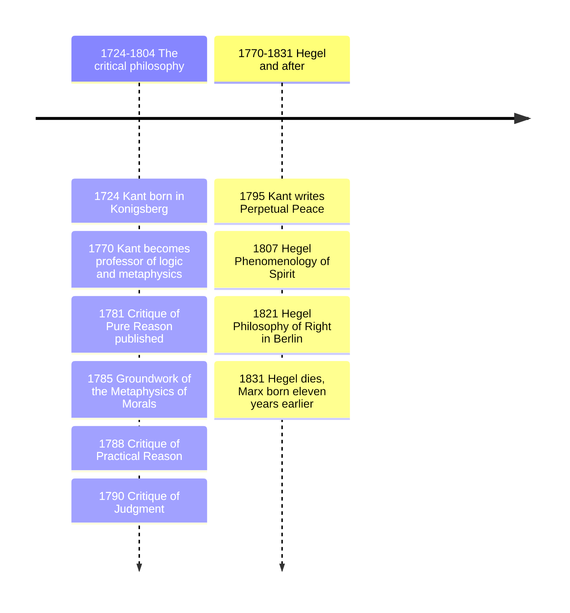

# 13 — Kant and German Idealism — คานต์และปรัชญาอุดมคติเยอรมัน

> *"Two things fill the mind with ever new and increasing admiration and awe: the starry heavens above me and the moral law within me."*

Immanuel Kant (อิมมานูเอล คานต์) is the hinge of modern philosophy. Before him, thinkers asked whether the mind faithfully copies reality; after him, that question looks naive. Kant's move, which he called his Copernican turn (การพลิกความคิดแบบโคเปอร์นิกัน), is that objects must conform to the mind, not the mind to objects: the structure we find in the world is partly the structure we bring to looking. His ethics is equally bold: morality is not about happiness, God, or feelings, but a law every rational being gives itself (กฎจริยธรรมเด็ดขาด, the categorical imperative).

Why an adult should care: nearly every later position in this vault, from utilitarianism to existentialism to analytic philosophy, builds on Kant, borrows his vocabulary, or reacts against him. And in daily life, whenever you test a rule by asking "what if everyone did this?", you are running Kant's moral engine.

---

## 1 | Historical Context

Kant lived 1724-1804 his whole life in Königsberg, then a Prussian trading city (now Kaliningrad). He wrote late: the first Critique (Critique of Pure Reason) appeared in 1781, when he was 57. He was responding to a standoff: rationalists (note 10) claimed pure reason could prove God, freedom, and the soul; empiricists (note 11), especially Hume, had shown that causality and the self cannot be derived from experience at all. Hume woke him from his "dogmatic slumber": if Hume is right, science loses its footing, and with no causality there is no room for duty either. Kant's critical philosophy (ปรัชญาวิพากษ์) tries to save both Newtonian science and morality by redefining what reason can claim.

After Kant came German Idealism (อุดมคติแบบเยอรมัน): Fichte and Schelling pushed the active mind further, and Hegel (1770-1831) built the century's grandest system, reading reality and history as Spirit (Geist, จิตสากล) coming to know itself through conflict and resolution, one family of ideas with three very different heirs: Marx (flipped it to materialism, note 18), Kierkegaard (reacted against it), British Idealism (before the analytic revolt, note 17).

## 2 | Core Concepts

### 2.1 The Copernican turn: mind as organizer

We can never take off the "glasses" of our own cognitive equipment, so everything we see is already shaped by them. Space and time are not things "out there" we discover; they are the pure forms of our sensibility (รูปแบบของความรู้สึก), the way experience is organized from the start. The understanding then synthesizes the stream under categories (มโนทัศน์พื้นฐานของปัญญา) such as substance and causality: causality is not, as Hume thought, a habit inferred from repeated events but a rule we impose to have a world of objects at all.

| Concept | Thai | Meaning | Everyday analogy |
|---|---|---|---|
| A priori | ความรู้ก่อนประสบการณ์ | Knowledge the mind contributes, not read off experience | The rules that make a score possible |
| Forms of intuition | รูปแบบของความรู้สึก | Space and time as the framework of all perception | The screen every app must be drawn on |
| Categories | หมวดมโนทัศน์ | Concepts like cause and substance used to think objects | Sorting tags on email |
| Phenomenon | ปรากฏการณ์ | The world as structured by that equipment | The dashboard's reading |
| Noumenon / thing-in-itself | สิ่งในตัวเอง | Reality apart from our form of access to it | The engine itself, never on the dashboard |

The key line: we know things as they appear, never as they are in themselves. This is not skepticism about daily life; Kant thinks science delivers certain knowledge about the phenomenal world. It is a limit claim about going beyond all possible experience, which is exactly what traditional metaphysics tried to do, and the same limits "make room for faith": freedom cannot be refuted theoretically, because the noumenal is beyond theoretical reach.

### 2.2 Ethics: the categorical imperative, worked

Kant's moral philosophy is deontology (จริยธรรมแบบยึดหน้าที่): the rightness of an act lies in its principle, never its consequences. Hypothetical imperatives (ข้อบังคับแบบมีเงื่อนไข) say: if you want X, do Y; they are skills, not morality. The moral command is categorical: do Y, whatever you want. Its master formula, from the Groundwork of the Metaphysics of Morals (1785):

> "Act only according to that maxim whereby you can at the same time will that it should become a universal law."

Worked case one, Kant's own, the false promise. You need cash; you know you cannot repay, yet you consider borrowing on a promise to repay. Maxim: when in difficulty, I will promise what I do not intend to keep. Universalize it: everyone in difficulty promises falsely. Result: promises become a ritual no one believes, so the act of "promising to repay" self-destructs. The maxim fails not because the outcome is unpleasant but because it generates a contradiction in conception: you borrow from an institution you secretly hope others make impossible.

Worked case two, a modern one: ticking "no infectious disease, no criminal record" on a visa or check-in form while knowing it is untrue, because everyone does it and officials skim. Universalize it and the attestation institution evaporates, taking with it the legal category your own entry relies on. Notice how the test works on the structure of the act, not the size of the harm: Mill (note 14) would instead count the aggregate damage; both tests are useful, they measure different things.

Duty vs inclination (หน้าที่ vs ความโน้มเอียง): an act has genuine moral worth only when done from duty, not merely in conformity with it. Two shopkeepers both charge fair prices: one because it is good for business, one because honesty requires it; only the second has moral worth. Severe but honest: doing right while grumbling still counts, doing right for praise may not.

The second great formulation: treat humanity, in yourself and others, always at the same time as an end, never merely as a means (ศักดิ์ศรีของมนุษย์). The false promiser uses the lender as a tool, excluding his purposes. From this flows the modern language of dignity and rights: persons have a worth beyond price, so cannot simply be traded off.

Standard objections to carry honestly: (1) Rigorism: the famous "murderer at the door" case, where Kant seems to forbid lying even to save a friend; most Kantians today accept a duty of care that can override veracity. (2) Empty formalism: any cleverly worded maxim passes; Hegel charged Kant's morality is an endless "ought" that never reaches concrete content. The best reply: the test targets principles you could coherently share with everyone, which is a genuinely useful filter, not a vacuous one.

### 2.3 Hegel: dialectic, Spirit, history

Hegel (เฮเกล) rejected Kant's leftover dualisms, phenomenon vs noumenon, duty vs desire, as marks of an unfinished picture. His engine is the dialectic (วิภาษวิธี): every determinate position (in Hegel's own terms, abstract) generates its own limitation or opposite (negative), and the tension resolves in a richer, more concrete standpoint (concrete) that preserves both moments. Fichte popularized the simpler labels thesis-antithesis-synthesis; Hegel himself rarely used them, so prefer "abstract-negative-concrete". In the Phenomenology of Spirit (1807) consciousness tests each shape of knowing, sense certainty, perception, understanding, and through the famous master-slave dialectic (เจ้า-ทาส) learns that self-consciousness needs recognition by another. Spirit (Geist) is not a ghost but the collective, historically developing life of mind and culture: law, art, religion, philosophy. History is rational in Hegel's famous phrase: what is actual is rational, what is rational is actual, meaning the long arc shows increasing self-consciousness, which Hegel identifies with the progress of the sense of freedom: the ancient world knew that one is free, the Germanic modern world that all are free.

## 3 | Timeline

## 4 | Key Thinkers and Ideas

| Thinker | Dates | Big Idea | Must-Know Work |
|---|---|---|---|
| Immanuel Kant | 1724-1804 | Copernican turn; phenomena vs noumena; categorical imperative; dignity; cosmopolitan right | Critique of Pure Reason; Groundwork |
| Johann G. Fichte | 1762-1814 | The self-positing I; the not-self as obstacle enabling moral striving; thesis-antithesis-synthesis labels | Foundations of the Science of Knowledge (1794) |
| F. W. J. Schelling | 1775-1854 | Philosophy of identity; nature as visible spirit, spirit as invisible nature | System of Transcendental Idealism (1800) |
| G. W. F. Hegel | 1770-1831 | Dialectic; Spirit; history as progress of freedom; recognition | Phenomenology of Spirit (1807) |

Kant: the three Critiques map reason's three questions: what can I know, what ought I do, what may I hope. Morality binds through autonomy (การปกครองตนเองของเหตุผล), self-legislation: you are free precisely because you obey a law you could will for all, which is what heteronomy, rule by appetite or authority, is not.

Fichte radicalized the thing-in-itself away (ethics as the I's endless striving against its not-self); Schelling gave nature its own story. Hegel absorbed both: reason is not a tribunal outside history (Kant) nor an act of will (Fichte) but history's own self-unfolding.

### Kant the cosmopolitan

Kant's essay Toward Perpetual Peace (1795) proposes a federation of free states, republicanism, and a cosmopolitan right (มนุษย์โลก) of hospitality for foreigners: the ancestor of the League of Nations, the UN, and human-rights law, and of the idea that peace is a design problem, not a natural state.

## 5 | Thai Terminology

| Thai | English | Notes |
|---|---|---|
| การพลิกความคิดแบบโคเปอร์นิกัน | Copernican turn | Mind structures experience, not vice versa |
| ก่อนประสบการณ์ | A priori | Known independent of any particular experience |
| รูปแบบของความรู้สึก | Forms of intuition | Space and time as how we receive |
| หมวดมโนทัศน์ | Categories | Concepts like causality the understanding contributes |
| ปรากฏการณ์ / สิ่งในตัวเอง | Phenomenon / noumenon | As it appears vs as it is |
| กฎจริยธรรมเด็ดขาด | Categorical imperative | Moral command with no if |
| ข้อบังคับแบบมีเงื่อนไข | Hypothetical imperative | Skill-rules: if you want X, do Y |
| หน้าที่ / ความโน้มเอียง | Duty / inclination | Motive of respect for law vs desire |
| ศักดิ์ศรี | Dignity | Worth beyond price in persons |
| ปรัชญาวิพากษ์ | Critical philosophy | Kant's project of testing reason's limits |
| วิภาษวิธี | Dialectic | Abstract-negative-concrete movement |
| จิตสากล | Spirit (Geist) | Mind developing through history |
| การรับรอง | Recognition | Self-consciousness needs another |
| มนุษย์โลก | Cosmopolitanism | Rights crossing state borders |

## 6 | Why It Matters Today

Policy and workplace rules: the universalizability test dodges self-serving exceptions. Drafting an expense policy or a family rule, ask the Kant question: could this coherently be everyone's rule, or does it quietly feed on others following a different one?

Dignity as a live issue: data brokers, dark-pattern UIs, and manipulative recommendation feeds treat attention as a resource to mine without the user's endorsable consent; the humanity-as-end formulation is the philosophical backbone of consent culture, GDPR-style data rights, and anti-trafficking law, all of which speak the language of dignity even when quoting no one.

Thai daily life: the unpriceable worth of a person rhymes with Buddhist emphasis on not treating beings as instruments, while differing in metaphysics: Kant anchors morality in rational law, Buddhism in intention (เจตนา) and the end of craving, so a Buddhist reading of a dutiful act cares about the quality of mind, where Kant grants moral worth precisely to duty done against inclination. Useful contrast, not an identity.

The cosmopolitan thread matters whenever Thailand debates refugee resettlement or migrant-worker rights: the stranger's claim on your attention began with a man who never left Königsberg.

## 7 | Further Reading

- *Groundwork of the Metaphysics of Morals* by Immanuel Kant (trans. Gregor): the ethics in 80 pages; read the false-promise passage yourself.
- *Critique of Pure Reason* by Kant: read the Preface; the whole is a mountain, the Preface the view from its base.
- *Hegel: A Very Short Introduction* by Peter Singer: a clear entry to dialectic and Spirit.
- *Kant* by Roger Scruton: the best compact tour of the whole philosophy.

## Related

- [[Philosophy/00_overview|← Philosophy Overview]]
- [[12_Enlightenment_and_Social_Contract]]
- [[14_Utilitarianism_and_Ethical_Theories]]
- [[Social Studies/01 Religion/04_Moral_Reasoning|Moral Reasoning]]
