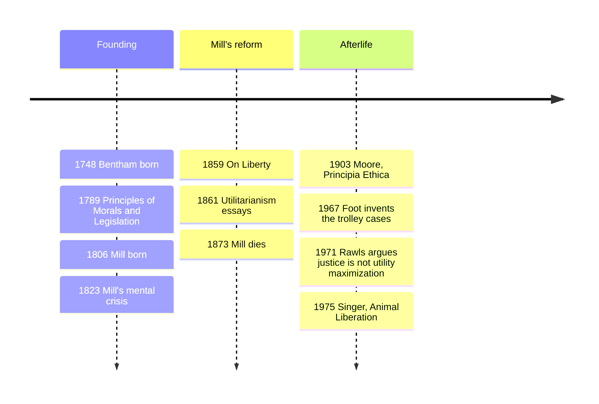

# 14 — Utilitarianism and Ethical Theories — ลัทธิประโยชน์นิยมและทฤษฎีจริยธรรมสามตระกูล

> *"The greatest happiness of the greatest number is the foundation of morals and legislation."* (Bentham)

Ethics has three big families, and almost every argument you overhear, about vaccines, about tax rates, about a company laying off 500 people, is one family talking past another. This note lays out the map (consequentialism, deontology, virtue ethics), then digs into utilitarianism (จริยธรรมประโยชน์นิยม), the most influential and most-argued-about member, from Bentham's pleasure arithmetic through Mill's defence to the trolley cases everyone now meets online.

Why an adult should care: policy is made in utilitarian language (cost-benefit analysis), business in its cruder cousin ("greatest good for the greatest number of stakeholders"), and your own intuitions constantly test them. Knowing which theory you are invoking is a practical kind of literacy.

---

## 1 | Historical Context

Jeremy Bentham (1748-1832), an English lawyer surrounded by legal nonsense dressed up as tradition, asked one question of every law: does it increase or diminish the happiness of those affected? "Nature has placed mankind under two sovereign masters, pain and pleasure"; ethics and legislation should be built on them, not on appeals to rights or divine order.

The program passed to John Stuart Mill (1806-1873), raised by his father on Bentham's ideas, who rebuilt it at a new level of breadth after a mental crisis at twenty: humane, cultured, protective of individuality against the "tyranny of the majority." Utilitarianism appeared as essays in 1861, On Liberty in 1859. Meanwhile Kant had already staked the rival ground (note 13: duty and dignity regardless of outcomes), and the ancient tradition of virtue (note 05: character, flourishing) never went away, so the modern field is a three-way conversation.

## 2 | Core Concepts

### 2.1 The three families compared

| Dimension | Consequentialism | Deontology | Virtue ethics |
|---|---|---|---|
| Thai | จริยธรรมแบบเน้นผล | จริยธรรมแบบยึดหน้าที่ | จริยธรรมแบบเน้นคุณธรรม |
| What makes an act right? | Only its outcomes: the best balance of good over bad, counted impartially | Conformity to rules or duties: truth-telling, promise-keeping, respecting persons, even at cost | Whether a person of good character, acting from settled disposition, would do it |
| Moral motive | Producing good states of affairs | Respect for the moral law (Kant: duty for its own sake) | Love of the noble (Aristotle: acting well because it is fine/kalon) |
| Unit of assessment | States of the world | Acts and maxims | Persons and characters over a lifetime |
| Signature strength | Clear, impartial, practical: fits cost-benefit reasoning; demands equal weight for every life | Protects the individual from being sacrificed; explains why promises and rights feel binding | Explains moral education, moral emotions, and why "what should I be?" precedes "what should I do?" |
| Signature objection | Licences horrific acts if the math is rigged; demands too much (never buy coffee while a child is poor) | Rigid: may forbid a lie that saves a life; where do duties come from? | Vague action-guidance; "virtuous" can encode a culture's prejudices |

The pattern: consequentialism looks forward to outcomes, deontology at the act's principle here and now, virtue ethics wide at the whole life. Most adults are pluralists; the theories make the mix explicit.

### 2.2 Bentham: the felicific calculus and the circle of concern

Bentham's principle of utility (หลักการประโยชน์): an action is right in proportion as it promotes happiness, happiness being pleasures and the absence of pains. He proposed measuring any pleasure by intensity, duration, certainty, propinquity, fecundity (chance of more pleasure after), purity, and extent (how many affected): the felicific calculus (การคำนวณสุขภาวะ). In practice nobody computes; the point is that ethics should be public, quantitative, and impartial, "each to count for one, and none for more than one." Reform followed: he attacked natural rights rhetoric as "nonsense upon stilts" and argued for prisoners' welfare, decriminalization of private consensual acts, and women's suffrage on utilitarian grounds.

His most startling line, a footnote about animals: the question is not "Can they reason? nor, Can they talk? but, Can they suffer?" (พวกเขาทุกข์ได้ไหม). Sentience, not species, draws the moral line, the founding text of modern animal-ethics debates, echoed by Peter Singer (note 22). Thai readers will sense a bridge to Buddhist metta and the first precept; the difference is methodical: Bentham counts suffering in an aggregate calculus, Buddhism cultivates non-harming as a quality of mind, not a maximization function.

### 2.3 Mill: higher pleasures, harm principle

Mill accepted the greatest-happiness principle but qualitative hedonism (สุขนิยมเชิงคุณภาพ) within it: some pleasures are higher in kind, not merely more intense. "Better to be a human being dissatisfied than a pig satisfied; better to be Socrates dissatisfied than a fool satisfied," the test being the verdict of those who have experienced both. The move saves utilitarianism from being "a doctrine worthy only of swine," but competent judges quietly appeal to something other than pleasure-quantity.

On Liberty (1859) asks when society may coerce: only to prevent harm to others (หลักความเสียหาย, the harm principle), never for the individual's own good nor for public morality as such; over himself, his body and mind, the individual is sovereign. Hence his case for free speech: truth suppressed is truth lost, and true belief unchallenged becomes dead dogma rather than living knowledge. Defenders of censorship reply with harassment, misinformation, and social peace; that is the live argument Mill's gift keeps.

### 2.4 Act vs rule utilitarianism

Act utilitarianism (ประโยชน์นิยมระดับเจตนา) says: do whichever particular act produces the most good right here. Rule utilitarianism (ประโยชน์นิยมระดับกฎ) says: follow the set of rules whose general acceptance maximizes good, then act by rule even when breaking it would help this once. The rule version is the response to the classic objections (punishing the innocent, breaking promises when convenient): a society that knows the rule may be broken is worse off than one that mostly keeps it, so keeping it is itself utility-maximizing at rule level. Critics reply the position either collapses into rule-worship (irrational devotion to a rule you know is hurting people now) or slides back into act utilitarianism.

## 3 | Timeline

## 4 | Key Thinkers and Ideas

| Thinker | Dates | Big Idea | Must-Know Work |
|---|---|---|---|
| Jeremy Bentham | 1748-1832 | Principle of utility; felicific calculus; impartial counting; animal sentience | An Introduction to the Principles of Morals and Legislation (1789) |
| John Stuart Mill | 1806-1873 | Qualitative hedonism; harm principle; free speech; individuality as component of happiness | Utilitarianism; On Liberty |
| Henry Sidgwick | 1838-1900 | Systematized classical utilitarianism; the dualism of practical reason | The Methods of Ethics (1874) |
| Philippa Foot | 1920-2010 | Revived virtue ethics; invented the trolley cases as tests | "The Problem of Abortion and the Doctrine of the Double Effect" (1967) |

Bentham: the public accountant of happiness, genuinely radical, an architect of evidence-based policy thinking.

Mill: the humanizer, who made utilitarianism compatible with culture, liberty, and the claim that happiness requires more than contentment.

Sidgwick: the honest one. He showed the deep tension between utilitarian impartiality and common-sense rules, and concluded that morality's two voices cannot be fully reconciled, a conclusion the field is still digesting.

Foot: philosopher of ordinary examples. Her trolley cases were designed to probe whether consequences are all that matter, and they have become the shared property of psychology, law, and AI alignment discussions.

### The trolley family, and what each theory says

| Case | What happens | Utilitarian verdict | Deontologist verdict | Virtue-ethics read |
|---|---|---|---|---|
| Switch (the trolley) | A runaway trolley will kill five; you can pull a lever diverting it to a track where it kills one | Pull: one death beats five; the numbers decide without drama | Permissible and often praiseworthy: you redirect a threat, you do not use anyone as a means; killing vs letting die, double effect (เจตนาทางอ้อม) does the work | The agent acts under triage pressure; a good person would not freeze in callousness nor revel in the choice |
| Footbridge | Same trolley; push one large man off a bridge to stop it; his body saves five | Most utilitarians bite the bullet: pushing is morally equivalent to pulling if it saves more lives; the squeamishness is a bias to audit | Forbidden: you physically use a person as a tool without his consent, violating the end-in-itself duty, even for five | Pushing expresses contempt for a person; the virtue-ethics answer agrees with intuition without needing a rule |
| Transplant | A healthy traveler's five organs would save five dying patients | The crude act version struggles: killing him and getting away with it maximizes lives | Absolutely forbidden: killing the innocent is the paradigm rights violation | The act is monstrous: it corrupts medicine itself, the trust on which healing depends |
| Hidden rule twist | Suppose everyone knew doctors sometimes harvest travelers | Now even the numbers turn against it: institutional trust collapses, more die | Rights were never going to allow it anyway | The practice destroys the virtues and trust that make healthcare a good |

The transplant sequence is the point: act utilitarianism looks monstrous, rule utilitarianism intuitive, deontology steady, and each camp claims the others rationalize intuitions. No agreed winner; a better-graded way to think.

## 5 | Thai Terminology

| Thai | English | Notes |
|---|---|---|
| จริยธรรมประโยชน์นิยม | Utilitarianism | Right = maximizes overall good |
| จริยธรรมแบบเน้นผล | Consequentialism | Outcomes determine rightness |
| จริยธรรมแบบยึดหน้าที่ | Deontology | Duty/rules determine rightness |
| จริยธรรมแบบเน้นคุณธรรม | Virtue ethics | Character determines rightness |
| หลักการประโยชน์ | Principle of utility | Greatest-happiness standard |
| การคำนวณสุขภาวะ | Felicific calculus | Bentham's seven dimensions of pleasure |
| สุขนิยมเชิงคุณภาพ | Qualitative hedonism | Some pleasures higher in kind |
| หลักความเสียหาย | Harm principle | Coercion only to prevent harm to others |
| ประโยชน์นิยมระดับเจตนา / ระดับกฎ | Act / rule utilitarianism | The two versions |
| ผลที่ตามมาทางอ้อม | Double effect | Foreseen but unintended side-effects |
| การนับอย่างเสมอภาค | Impartial counting | Each to count for one |
| สัตว์รู้สึกทุกข์ได้ | Animal sentience | Bentham's boundary line |

## 6 | Why It Matters Today

Public health is the clearest arena: lockdowns and vaccine allocation are explicit utilitarian calculations, five lives against livelihoods, and every objection to them is deontological or Millian-liberty language. Understanding the families turns shouting matches into locatable disagreements: how many livelihood-years equal one statistical life, and who decides? That is what cost-benefit analysis actually measures.

AI-era ethics reuses the trolley directly: self-driving car dilemma scenarios, hospital triage algorithms, and recommendation systems that trade engagement against wellbeing are utilitarian calculi written in code, with the same objection: who audits the function, and does an algorithm ever owe the one sacrificed a duty it cannot feel?

Everyday reasoning: notice which family you are in when you decide. Tipping your regular stall vendor generously because "the family would suffer if I switched" is consequentialist; paying properly because a promise or fair price binds you regardless is deontological; paying well because you want to be the kind of customer who notices is virtue language. A good life uses all three; a thoughtful one knows which one it just used.

Mill's harm principle remains the best first question for any culture war, including Thai ones about speech and lifestyle regulation: is this about preventing harm to others, or enforcing someone's picture of the good life? Defenders of the second reply that shared morality is itself a harm-preventing commons; that is the honest version, worth having.

## 7 | Further Reading

- *Utilitarianism* and *On Liberty* by John Stuart Mill (Hackett ed.): 150 pages total, the most rewarding philosophy you can read in a weekend.
- *An Introduction to the Principles of Morals and Legislation* by Jeremy Bentham: chapters 1-4 for the calculus in his own voice.
- *Practical Ethics* by Peter Singer: how a modern utilitarian applies the view to animals, disability, and global poverty.

## Related

- [[Philosophy/00_overview|← Philosophy Overview]]
- [[13_Kant_and_German_Idealism]]
- [[15_Existentialism]]
- [[Social Studies/01 Religion/04_Moral_Reasoning|Moral Reasoning]]
