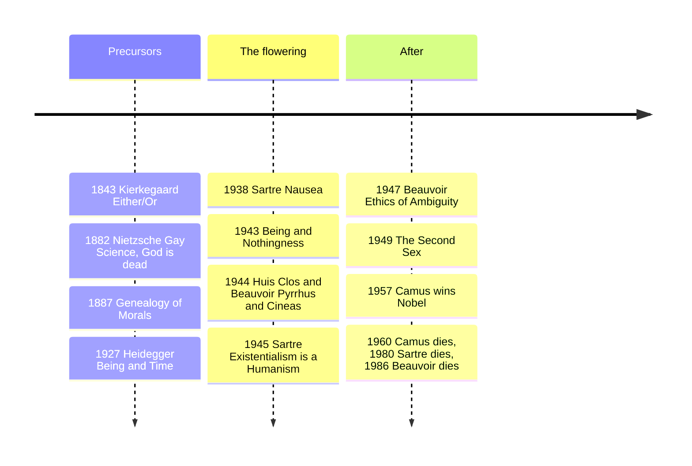

# 15 — Existentialism — ปรัชญาอัตถิภาวนิยม

> *"Man is condemned to be free; because once thrown into the world, he is responsible for everything he does."* (Sartre)

Existentialism (อัตถิภาวนิยม) is not a doctrine with articles of faith but a mood and a method: start from the living, choosing individual, not systems, essences, or statistics. Sartre's slogan "existence precedes essence" (การมีอยู่มาก่อนสาระ) says there is no pre-written human nature you are fulfilling; you exist first, then define yourself through choices, and its emotional weather, anxiety, nausea, absurdity, is philosophical data.

Why an adult should care: every "is this all there is?", every decision about children, marriage, or quitting, is an existential question in plain clothes. The tradition names the freedom you cannot escape and the excuses you can avoid.

---

## 1 | Historical Context

The roots are nineteenth-century revolts against Hegel's system (note 13), which swallowed the individual into World-Spirit's march. Kierkegaard (1813-1855) in Copenhagen called the system an enormous palace you lived nowhere in: what matters is the truth I would die for, the single individual before God. Nietzsche (1844-1900) proclaimed the death of the Christian God and asked what becomes of value without it. Then the crash: Weimar, Vichy, the camps, Hiroshima. Sartre (1905-1980), Beauvoir (1908-1986), and Camus (1913-1960) made a Parisian café philosophy a world movement in the late 1940s: groundlessness, freedom, and responsibility fit a century that had lost its guarantees. Structuralism superseded it; it returns whenever scripts (career, marriage, algorithm) press on people.

## 2 | Core Concepts

### 2.1 Existence precedes essence: the paper-cutter

Sartre's 1945 lecture Existentialism is a Humanism opens with an artisan's object: a paper-cutter (ที่ตัดกระดาษ) is conceived first, its purpose and design (its essence) in the maker's mind before any specimen exists. If humans were like paper-cutters, made by a divine craftsman, we would have a pre-set nature; without a maker, says the atheist, there is no blueprint: man first exists, then defines himself. The catch Sartre insists on: this is not optimistic self-help. You cannot choose not to choose, you choose without excuse, and "condemned to be free" packs the whole view: anguish is the name of that weight. The religious existentialists, Kierkegaard, Marcel, Buber, deny the atheist premise but keep the structure: faith is not a theorem you assent to but a commitment you stake your life on, so subjectivity, not objectivity, is where existence's meaning lives (compare [[07_Medieval_Philosophy]]).

### 2.2 Kierkegaard: anxiety and the leap

Kierkegaard wrote under pseudonyms so no one could hide behind the author. His stages of existence (ขั้นของชีวิต) run from the aesthetic (novelty and pleasure) through the ethical (commitment, universal rules) to the religious (the individual before God). The transition is not reasoned through; it is a leap (การกระโดดแห่งความเชื่อ, the leap of faith), because reason runs out where the decision matters most: Abraham and the sacrifice of Isaac, faith that cannot be justified to universal morality. Anxiety (ความกังวลใจ) is not fear of a thing but the vertigo of realizing the next moment is undetermined: "anxiety is the dizziness of freedom," like looking over a cliff, where your terror is partly your own possibility of jumping. The single individual (den enkelte) can be higher than the crowd; the crowd, he said, is untruth.

### 2.3 Nietzsche: the death of God, revaluation, the overman

Nietzsche's diagnosis, put in the mouth of a madman in The Gay Science (1882): "God is dead... and we have killed him." Not a triumph but an earthquake: European morality ran on a foundation its educated class no longer believes in, and the after-shock is nihilism (สุญนิยม), the highest values devaluing themselves. The Genealogy of Morals (1887) then asks where our good-and-evil came from. Answer, in his telling: master morality (ศีลธรรมของนาย) honored the noble, strong, affirmative self as "good," with "bad" meaning merely contemptible; slave morality (ศีลธรรมของทาส) was born of ressentiment (ความแค้นแฝง), the weakness of the powerless re-described as goodness, humility, patience, their oppressors re-named evil. This is provocative moral history, not a simple condemnation of Christianity: his target is any morality that flourishes by teaching the injured to call their injury a virtue. The positive ideal is the overman (übermensch, อติมนุษย์), who creates values affirmatively after the death of God, tested by eternal recurrence (การหวนกลับชั่วนิรันดร์): would you will to live this life, pain included, endlessly? Say yes and you have passed.

An honest footnote: Nietzsche's sister Elisabeth Förster-Nietzsche, an anti-Semite, controlled his estate after his 1889 collapse, doctored his unpublished notes into The Will to Power, and courted the Nazis, who happily used him. Scholarship from Walter Kaufmann in the 1950s restored the texts and showed Nietzsche despised nationalists and anti-Semites personally. Reading Nietzsche means reading past his sister.

### 2.4 Heidegger, briefly: Dasein and being-toward-death

Being and Time (1927) asks the forgotten question: what does it mean to be? The entity that asks is Dasein (ความมีอยู่นั่น, "being-there"), whose own being is an issue for it. Everyday Dasein is lost in "the They" (das Man, คนเขา) doing what one does: inauthenticity (ความไม่แท้). What jolts Dasein awake is anxiety before its ownmost possibility: death. Being-toward-death (การมีอยู่เพื่อตาย) is not morbidity but taking finitude into life so that choices become mine rather than the They's. The shadow to name: Heidegger joined the Nazi party in 1933 and served as Rector of Freiburg; his thought's relation to his politics remains debated, and his mentor Husserl was purged by the regime.

### 2.5 Sartre: freedom, bad faith, the Look

Being and Nothingness (1943) divides reality into the in-itself (things, coincident with themselves) and the for-itself (consciousness, a gap, able to negate: imagine, doubt, refuse). Human reality is what it is not yet and is not what it is: radical freedom. Bad faith (mauvaise foi, การหลอกลวงตนเอง) is flight from that weight, pretending you are a thing with a fixed nature: the waiter who plays at being a waiter "in stone," the person who says "that's just how I am" or "it's my role in the family." It lies to oneself while knowing the truth. Being-for-others (การมีอยู่เพื่อผู้อื่น) completes the picture: the Look (le regard) of the Other freezes my freedom into an essence, and shame proves I cannot finalize myself. "Hell is other people" (Huis Clos, 1944): not that people are annoying, but that we are hostage to meanings others make of us.

### 2.6 Beauvoir: the situation, and becoming

The Second Sex (1949) puts those categories to revolutionary work: "One is not born, but rather becomes, a woman" (คนไม่ได้เกิดเป็นผู้หญิง แต่กลายเป็นผู้หญิง). Biological sex is facticity, the given; "woman" is a situation and a meaning a civilization imposes, treating the male as subject and the default and woman as the Other (ผู้อื่น/ฝ่ายถูกมอง). Women have been kept in immanence (ชีวิตซ้ำอยู่), denied projects through which every human earns transcendence (ภาวะพ้นตน), and much apparent "feminine nature" is what enclosure produces. Her analysis of complicity is as honest as her account of oppression: any ethics must fight the conditions, work, law, reproduction, that make some people's transcendence someone else's immanence. In The Ethics of Ambiguity (1947) she argued I owe my freedom only if I will everyone else's.

### 2.7 Camus: the absurd and Sisyphus

Camus refused the existentialist label; his question in The Myth of Sisyphus (1942) is narrower: "There is but one truly serious philosophical problem, and that is suicide," whether life is worth living once you see the absurd (ความไร้ความหมาย, meaning-hunger colliding with the universe's silence). His three probes of the absurd life: revolt, freedom, passion. The verdict: neither physical suicide (surrender) nor philosophical suicide, Kierkegaard's leap, which Camus calls an escape; the way is lucid defiance, without appeal. The image: Sisyphus, rolling his rock forever, the absurd hero; "one must imagine Sisyphus happy" (ต้องจินตนาการว่า ซิซิฟัสมีความสุข), because the struggle toward the heights is enough to fill a man's heart.

## 3 | Timeline

## 4 | Key Thinkers and Ideas

| Thinker | Dates | Big Idea | Must-Know Work |
|---|---|---|---|
| Søren Kierkegaard | 1813-1855 | Leap of faith; anxiety as freedom's dizziness | The Concept of Anxiety (1844) |
| Friedrich Nietzsche | 1844-1900 | Death of God; master/slave morality; overman; eternal recurrence | On the Genealogy of Morals (1887) |
| Martin Heidegger | 1889-1976 | Dasein; the They; being-toward-death | Being and Time (1927) |
| Jean-Paul Sartre | 1905-1980 | Existence precedes essence; freedom; bad faith | Being and Nothingness (1943) |
| Simone de Beauvoir | 1908-1986 | Situation; woman as Other; entangled freedoms | The Second Sex (1949) |
| Albert Camus | 1913-1960 | The absurd; revolt; happy Sisyphus | The Myth of Sisyphus (1942) |

Kierkegaard wrote as a Christian against Christendom's official religion; his target is not faith but the certainty that never had to be risked. Nietzsche's death of God is a diagnosis and a dare. Heidegger shifted philosophy from "the subject" to "being-in-the-world," the human always already engaged. Sartre made it public philosophy, refusing the Nobel in 1964 because a writer should not become an institution. Beauvoir is the bridge: existentialist freedom needs a social analysis of situations or it is privilege dressed as insight. Camus kept philosophy close to honesty; his 1952 quarrel with Sartre over revolutionary violence split the movement publicly.

## 5 | Thai Terminology

| Thai | English | Notes |
|---|---|---|
| อัตถิภาวนิยม | Existentialism | Existence precedes essence |
| การมีอยู่มาก่อนสาระ | Existence precedes essence | Sartre's slogan |
| ความกังวลใจ (angst) | Anxiety / dread | Dizziness of freedom (Kierkegaard) |
| การกระโดดแห่งความเชื่อ | Leap of faith | Beyond what reason can carry |
| ความแค้นแฝง | Ressentiment | The poison that writes slave morality |
| อติมนุษย์ | Übermensch / overman | Self-legislating affirmer of life |
| ความมีอยู่นั่น (Dasein) | Being-there | The entity for whom being is an issue |
| คนเขา / เขาว่า | The They (das Man) | Anonymity of public interpretation |
| ความไม่แท้ | Inauthenticity | Living on loan from the They |
| การมีอยู่เพื่อตาย | Being-toward-death | Finitude taken into life |
| การหลอกลวงตนเอง | Bad faith | Pretending to be a thing with a nature |
| ความไร้ความหมาย | The absurd | Meaning-hunger vs silent world |

## 6 | Why It Matters Today

Work and identity: "this job is who I am" is bad-faith shorthand; the role is sustained by your choices, so it can also be changed by them, and the anxiety about quitting is the price of freedom, not evidence you are doing it wrong.

Social media is das Man industrialized: algorithms offer a frozen essence, "you are the type who engages with this," then sell it back. "Existence precedes essence" is a ready-made maxim against profile-determinism: you are not your interest graph, and the discomfort of being categorized is philosophically informative.

Thai family life: "why didn't you become a doctor?", "at your age people marry" are the They speaking through parents. Beauvoir's script-plus-situation frame lets an adult child take the situation seriously, economics, caregiving, gratitude, without conceding the script is nature. The careful parallel is Buddhism: both press on unexamined habit, but existentialism finds too little self-ownership where anattā (อนัตตา) finds too much self-grasping. Comparison, not merger.

Meaning after loss: this tradition does not rush you back to comfort; Kierkegaard's anxiety, Nietzsche's revaluation, Camus's revolt are maps of rebuilding without guarantees. Compare [[13_Kant_and_German_Idealism]]: Kant grounds meaning in the moral law within; the existentialists ask what it costs to will a law before you have chosen it, a question that leads straight into [[22_Applied_Ethics_Today]].

## 7 | Further Reading

- *Existentialism is a Humanism* by Sartre: 70 pages stating the position.
- *The Myth of Sisyphus* by Camus: the absurd, argued rigorously and beautifully.
- *On the Genealogy of Morals* by Nietzsche: his most disciplined book.
- *The Second Sex* by Beauvoir: the most alive philosophy of situation written.

## Related

- [[Philosophy/00_overview|← Philosophy Overview]]
- [[14_Utilitarianism_and_Ethical_Theories]]
- [[16_Pragmatism]]
- [[07_Medieval_Philosophy]]
- [[13_Kant_and_German_Idealism]]
- [[22_Applied_Ethics_Today]]
