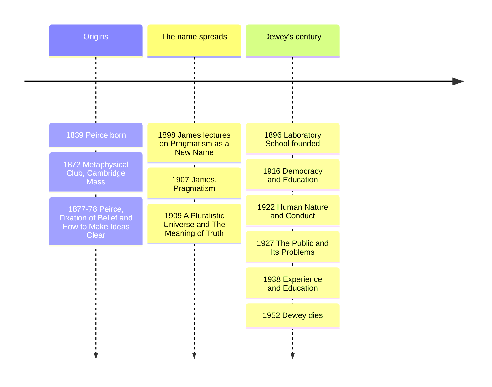

# 16 — Pragmatism — ลัทธิปฏิบัตินิยม

> *"The true is the name of whatever proves itself to be good in the way of belief, and not good for a limited time only but all round."* (William James)

Pragmatism (ลัทธิปฏิบัตินิยม) is the philosophy the United States actually produced on its own: ideas are not mirrors of reality but tools, and the meaning and truth of a belief are found in the concrete difference believing it makes in practice. It grew from a 1870s Cambridge, Massachusetts discussion club, the Metaphysical Club, and its three founders read like a spectrum of seriousness about that one thought: Peirce the logician, James the psychologist-provocateur, Dewey the educator who tried to rebuild American schools and democracy around it.

Why an adult should care: it is the grandparent of almost everything modern about how we say we think: A/B testing, learning by doing, "show me what changes," and the instinct that an idea that never touches the ground is worth little. For parents, Dewey is why "project-based learning" exists at all.

---

## 1 | Historical Context

Post-Civil War America was a laboratory of new wealth, new schools, mass immigration, and Darwin (note 19), which made species, habits, and knowledge look like adaptive processes rather than eternal essences. Classical European philosophy, in this mood, seemed to ask the same unanswerable questions forever with no cash payout. Charles Sanders Peirce (1839-1914) formulated the pragmatic maxim around 1870-78 and named the school, later insisting on the ugly label "pragmaticism" to distinguish it from James's popularized version; his life ended obscure and broke, his work mostly unpublished. William James (1842-1910), professor at Harvard, brother of novelist Henry, lectured Pragmatism into a bestseller in 1907. John Dewey (1859-1952) took it out of the seminar: founded the University of Chicago Laboratory School in 1896, wrote dozens of books, advised Turkey's education ministry, and remained America's public philosopher until his death. The movement's later chapters run through Richard Rorty and contemporary neopragmatism, and it quietly shaped legal realism (Oliver Wendell Holmes: "the life of the law has not been logic: it has been experience") and the design-and-testing sensibilities of Silicon Valley and Lean Startup methodology.

## 2 | Core Concepts

### 2.1 Peirce: the pragmatic maxim, doubt and belief, fallibilism

Peirce's pragmatic maxim (ปฏิญญาปฏิบัตินิยม): consider what practical effects the object of your concept might involve, and the concept of those effects is the whole of your concept of it. If two proposed differences would produce no possible difference in experience, then "the dispute is not about the thing, but only about words," a central Peircean move later adopted by logical positivism (note 17). Meaning lives in its bearings on action.

In "The Fixation of Belief" (1877) he describes inquiry as the struggle from doubt (ความคลางแคลง, an irritation that stops when you settle) to belief (ความเชื่อ, a habit of action). Four ways to settle belief: tenacity (cling to what you hold), authority (the state or church decides), the a priori method (taste for what is refined, which is fashion in a study), and his preferred fourth, the method of science, a self-correcting social process of testing against experience. This is the birth of the community-of-inquiry model that science and good engineering organizations still run on.

Fallibilism (หลักความอาจผิดพลาดได้): no belief is guaranteed beyond all future correction. Peirce insisted this does not imply "anything goes," because practices of testing genuinely improve beliefs over time. His sign theory, semiosis, every thought a sign interpreted by another sign, is the starting point of American semiotics.

### 2.2 James: truth as what works, cash value, pluralism

James's Pragmatism (1907) is a series of talks that read like an essayist's provocation, deliberately. Core claim: truths are made in the currency of experience, an idea becomes true by being assimilated, validated, corroborated, verified. "Truth happens to an idea. It becomes true, is made true by events." His slogan: the true is what is "expedient in the way of thinking," not expedient for whatever I want (that is the caricature his critics drew), but what eventually holds up under the total pressure of experience. He also gave us "cash-value": ask what concrete difference a belief makes in anyone's actual life, and you have its meaning; so "God exists" means something real if believing it verifiably changes a life for the better. The test applies to metaphysics and theology, not just science.

The Will to Believe (1897) defends a right to a genuine option, a live, forced, and unprovable choice, before intellectual evidence, when the evidence itself depends on your commitment (you cannot prove you are likable before you risk being seen; many goods of life, marriage, courage, faith, are epistemically downstream of acting). Pluralism (พหุนิยม): James's universe is a "pluralistic" one, still in the making, with real novelty and genuine risk, against the "block universe" of determinism and the tidy idealisms he inherited. His final essay A Pluralistic Universe (1909) makes it a full metaphysics of "many," and it is the doorway from this note to William James's radical empiricism, where pure experience, before the subject-object cut, is the primal stuff, a theory that also fed into Whitehead and into some philosophy-of-mind circles today.

### 2.3 Dewey: learning by doing, instrumentalism, democracy

Dewey (ดิวอี้) turned the pragmatic maxim into pedagogy and politics. Instrumentalism (เครื่องมือวิทยา): ideas, theories, institutions are instruments for resolving the problematic situations we find ourselves in, tools whose worth is their worked consequences, not copies of reality. His model of thinking, "reflective thinking" (การคิดอย่างไตร่ตรอง), has five phases: felt difficulty; its location and definition; suggestion of possible solution; development by reasoning of the bearings of the suggestion; further test by observation and experiment. That template is in every design brief, every debugging loop, and every good case-study method.

Learning by doing (เรียนรู้ด้วยการลงมือ): his Laboratory School at Chicago, 1896, refused both the old rote-drill and the laissez-faire "follow the child" romanticism. Children learn arithmetic by cooking and building, biology by gardening, writing by publishing a class paper, because knowledge is the skill of transforming situations, and schooling that never touches situations trains only recall. Democracy and Education (1916) is the book that made "progressive education" the most-used and most-abused phrase in schooling, and his analysis of why direct instruction, properly used, still matters is subtler than either the myth ("Dewey destroyed rigor") or the marketing ("Dewey discovered projects") suggests.

Democracy as a way of life (ประชาธิปไตยในฐานะวิถีชีวิต): democracy is not first a procedure for voting but a form of living together where every member's experience is in communication and no authority is exempt from consequences-testing. His critique of mass-mediated public opinion anticipates almost the entire modern media-literacy debate.

## 3 | Timeline

## 4 | Key Thinkers and Ideas

| Thinker | Dates | Big Idea | Must-Know Work |
|---|---|---|---|
| Charles S. Peirce | 1839-1914 | Pragmatic maxim; doubt-belief and the method of science; fallibilism; semiotics | "The Fixation of Belief" (1877) |
| William James | 1842-1910 | Truth as verification-in-the-long-run; cash-value; right to believe; pluralism | Pragmatism (1907); The Will to Believe (1897) |
| John Dewey | 1859-1952 | Instrumentalism; reflective thinking; learning by doing; democracy as way of life | Democracy and Education (1916); The Public and Its Problems (1927) |
| Richard Rorty | 1931-2007 | Neo-pragmatism: drop "truth" as a goal, keep solidarity and justification | Philosophy and the Mirror of Nature (1979) |

Peirce: the one who did not want the movement; his logic (quantifiers, relational algebra) anticipated Frege and Russell and his maxim became the school's banner only once James seized it, and his life's work, thousands of unpublished pages, is still being edited today.

James: the most readable and the most mocked. "True = whatever helps me" is the version his critics invented; he meant what survives the total friction of experience over time, and for him religious belief was "live, forced, and momentous," not a convenience.

Dewey: the civic engine, and the one whose reputation swings with the political weather, vilified by Cold War conservatives as the destroyer of standards, claimed by every education ministry that has ever written the phrase "student-centered."

Rorty: the twentieth-century revival, arguing we should drop the representational picture of mind entirely; contested, but proof that pragmatism is a living tradition, not a museum.

## 5 | Thai Terminology

| Thai | English | Notes |
|---|---|---|
| ลัทธิปฏิบัตินิยม | Pragmatism | Ideas as tools, meaning as practical difference |
| ปฏิญญาปฏิบัตินิยม | Pragmatic maxim | Peirce's test of conceptual clarity |
| ความคลางแคลง / ความเชื่อ | Doubt / belief | The engine of inquiry |
| หลักความอาจผิดพลาดได้ | Fallibilism | No belief is beyond correction |
| ชุมชนแห่งการสืบค้น | Community of inquiry | Self-correcting method of science |
| มูลค่าเป็นตัวเงิน | Cash-value | James's test of a belief's meaning |
| สัจจะเกิดกับความคิด | Truth happens to an idea | Verification, not static correspondence |
| พหุนิยม | Pluralism | An unfinished, many-centred universe |
| สิทธิ์ที่จะเชื่อ | The will / right to believe | Genuine options before proof |
| เครื่องมือวิทยา | Instrumentalism | Theories as tools |
| การคิดอย่างไตร่ตรอง | Reflective thinking | Dewey's five-step pattern |
| เรียนรู้ด้วยการลงมือ | Learning by doing | Dewey's pedagogy |
| ประชาธิปไตยในฐานะวิถีชีวิต | Democracy as a way of life | More than elections |

## 6 | Why It Matters Today

Product and startup culture is applied pragmatism with the philosophy stripped out: minimum viable product, A/B test, "strong opinions, weakly held" are Peircean fallibilism and Deweyan reflective thinking in office clothing. Knowing the lineage is genuinely useful: it lets you argue not just that "we should test it" but why testing beats the alternative epistemologies (tenacity, authority, taste) in the exact terms Peirce set out.

Parenting and school choices: every Thai parent eventually hears "rote learning versus active learning." Dewey's own analysis, in Experience and Education (1938), is the antidote to the bad version of both: activity without structured accumulation of adult knowledge is just noise, and knowledge without connection to experience is inert. That single book gives the family a vocabulary for the choice between a drill-heavy school and a project-heavy one that is neither "rigor" nor "fun" but which one actually connects understanding to doing.

Personal life management: the pragmatic maxim is a superb argument-triage tool for the endless metaphysics of modern discourse (is the algorithm "conscious"? does "real" gender or "real" nation mean something beyond what it does to lives?). Before you debate the word, ask what observable difference the position makes: Peirce's test, run on your group chat, is often the most efficient philosophy in it.

AI era: pragmatism's focus on verified practical difference is exactly how we now debate whether large language models "understand": James's cash-value question, what concrete change in possible experience, is the right one to press a company with when it says its model "reasons," and it disciplines us against both hype and reflexive dismissal (see [[21_Philosophy_of_Mind_and_AI]]). Dewey's reflective-thinking loop and Peirce's self-correcting method are the philosophical ancestors of iteration-and-feedback, which links naturally to [[Science/Advance/Computer Science/01_Computational_Thinking|Computational Thinking]] and [[Mathematics/Advance/21_Mathematical_Reasoning|Mathematical Reasoning]].

## 7 | Further Reading

- *Pragmatism* by William James (1907; Harvard ed.): the lectures, still the wittiest entrance into the whole school.
- *Democracy and Education* by John Dewey, chapters 6-7 and 20: the pedagogy argument made precisely.
- *Philosophical Writings of Peirce* (ed. Buchler): the maxim, the fixation-of-belief essay, fallibilism.
- *The Metaphysical Club* by Louis Menand: the best narrative of how all three founders intersected, and why Gilded Age America produced this school.

## Related

- [[Philosophy/00_overview|← Philosophy Overview]]
- [[15_Existentialism]]
- [[17_Analytic_Philosophy]]
- [[Science/Advance/Computer Science/01_Computational_Thinking|Computational Thinking]]
