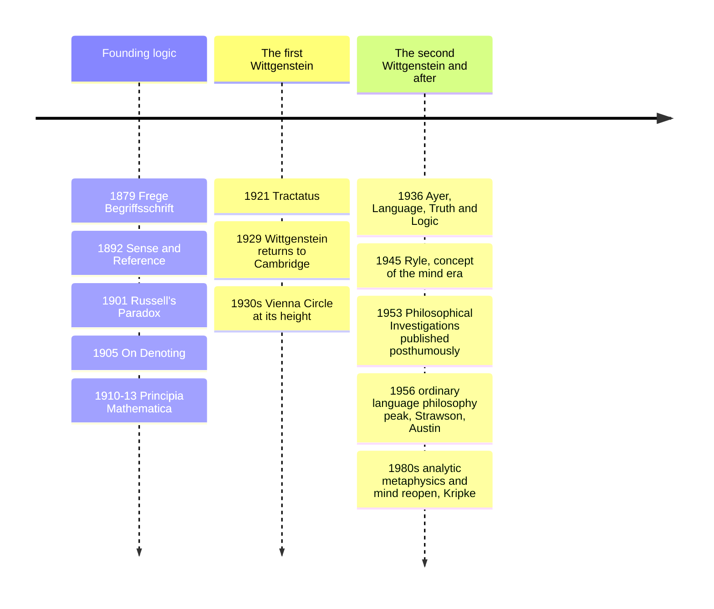

# 17 — Analytic Philosophy — ปรัชญาวิเคราะห์

> *"The limits of my language mean the limits of my world."* (Wittgenstein, Tractatus)

Analytic philosophy (ปรัชญาวิเคราะห์) is not a set of answers but a style and a turn: philosophy gets done by analyzing language and argument with the precision logic makes possible, because many traditional puzzles turn out to be about how we talk, not the structure of the cosmos. Its founding insight, the "linguistic turn" (การพลิกสู่ภาษา), reshaped philosophy wherever English is spoken, and its tools, formal logic, truth-conditions, reference, meaning-as-use, are now buried inside the software that writes and reads language for a living.

Why an adult should care: every fight about what a contract, constitution, prompt, or headline "really says," and the central mystery of our era, whether a machine that manipulates words flawlessly understands anything, is an analytic-philosophy question in working clothes.

---

## 1 | Historical Context

The revolt began against British Idealism (the Hegel-popularization dominant at Oxford). Around 1900 G.E. Moore and the young Bertrand Russell argued that philosophy should proceed by analyzing propositions into their constituents, ordinary language clarified by logic. The deeper engine was older: Gottlob Frege, a Jena schoolteacher, had published Begriffsschrift in 1879, the first complete modern predicate logic, unknowingly replacing Aristotle's syllogistic apparatus. Russell, with Principia Mathematica (1910-13, with Whitehead), tried to found mathematics on logic. The young Wittgenstein, an Austrian engineer who came to Cambridge to learn from Russell and then surpassed him, produced the Tractatus in 1921, and the Vienna Circle turned fragments of it into logical positivism (ลัทธิประจักษ์นิยมเชิงตรรก). After Wittgenstein's later self-refutation, Oxford spent the 1940s-60s doing ordinary-language philosophy; from the 1970s the style reopened metaphysics, ethics, and philosophy of mind. The split with continental philosophy (Husserl, Heidegger, Sartre, note 15), hardened by Carnap's famous 1950 attack on Heidegger, has largely melted.

## 2 | Core Concepts

### 2.1 Frege: sense and reference, and logic modernized

Frege's two gifts. First, a quantifier-and-variable logic that could formalize relational reasoning Aristotle's syllogisms could not ("every circle has a center" requires the modern apparatus: for every x, if x is a circle then there exists a y such that y is the center of x), the language that became the operating system of mathematics and computer science. Second, the 1892 distinction sense vs reference (ความหมาย vs สิ่งที่อ้างอิง, Sinn und Bedeutung): two expressions can pick out the same object yet present it differently. "Morning Star" and "Evening Star" both refer to Venus (same reference), but their senses differ, which is why "the Morning Star is the Evening Star" can inform you while "Venus is Venus" cannot. The puzzle it solves: how can identity statements inform you, when "Venus is Venus" cannot, if true/false is all a sentence has? Sense is the mode of presentation, the way the world is given; reference is the object reached. That is the kernel of the whole theory of meaning that follows.

### 2.2 Russell: descriptions, the paradox, and philosophy as analysis

Russell's "On Denoting" (1905) is arguably the most influential single paper of the century: a definite description like "the present King of France" appears to refer, but there is no such person. Russell's theory of descriptions dissolves the appearance: "the F is G" analyzes into: there exists exactly one F, and it is G. No mysterious non-existent entity needed, and empty names ("the King of France is bald") are not false-but-meaningful but strictly false: existential uniqueness fails. The move is the paradigm case of analytic method: a grammatical form disguises a logical form; do the logic, and the metaphysical embarrassment evaporates. Frege's alternative, empty names as bearing a sense without reference, remains live.

Russell's Paradox (1901) then shook set theory itself: consider the set of all sets that do not contain themselves; does it contain itself? Either answer contradicts. The naïve comprehension principle, every condition carves a set, is false; repairing it (type theory, ZFC) became the foundation work of modern mathematics. Russell also wrote the best philosophy primer ever, The Problems of Philosophy (1912), still in print because it teaches the method rather than a sect.

### 2.3 Early Wittgenstein: the Tractatus

The Tractatus Logico-Philosophicus (1921), written in a trench and published with an introduction by Russell, is one book of numbered propositions and a whole cosmology of the sayable. Its picture theory (ทฤษฎีภาพ): a proposition is a logical picture of a state of affairs; it shares logical form with what it depicts, the way a map shares structure with terrain; this is how language hooks onto world at all. Its boundary: what shows itself cannot be said; ethics, aesthetics, "the mystical" lie outside what propositions can express; the closing line: "Whereof one cannot speak, thereof one must be silent" (สิ่งที่พูดไม่ได้ ต้องนิ่ง). The self-undermining is deliberate: the book is a ladder you throw away after climbing, nonsense that helps you see the limits of sense.

### 2.4 Later Wittgenstein: language games and family resemblance

Philosophical Investigations (published 1953, written 1936-48) is the counter-book to his own first one. Meaning is not a pictured correspondence but use in a form of life (การใช้คือความหมาย, meaning-as-use in a Lebensform): language is a motley of activities he calls language-games (เกมภาษา), giving orders, reporting, joking, praying, thanking, each with its own rules, and philosophy's confusion is a "language on holiday," the picture holding us captive when we generalize one game (naming objects) into a theory of all of them. Family resemblance (ความคล้ายในตระกูล): no single essence runs through "games," board, card, ball, ring-a-ring; instead overlapping similarities, like the features of a family face. Private-language argument: a language whose words mean whatever I privately point inward at could sustain no correctness conditions (no difference between thinking I am right and being right), so even inward experience is expressible only within shared practices. The method: when philosophers ask "what is time? knowledge? the self?", look at how the words are used in their home games before inventing theories that dissolve into paradox.

### 2.5 Logical positivism and its death

The Vienna Circle (Schlick, Carnap, Neurath; Ayer's 1936 popularization Language, Truth and Logic) fused the Tractatus with anti-metaphysical fury: the verification principle (หลักการพิสูจน์ได้) says a sentence is cognitively meaningful only if analytic (true by logic or meaning) or empirically verifiable; theology, traditional ethics, and Heideggerian metaphysics are literal nonsense, ethics rescued as expression of emotion. It was a liberation to a generation and a technical failure on inspection: the principle itself is neither analytic nor empirically verifiable, "verifiable" was never defined without excluding the distant past or admitting almost anything, and Quine's 1951 "Two Dogmas of Empiricism" dismantled the analytic/synthetic distinction it ran on. The circle was scattered by the Nazis; the movement died of its own standard. What survived is the temperament: argumentative clarity, suspicion of unearned depth, and the demand that claims be pinned down.

Popper (note 19) belongs to the same argument: he replaced verification with falsification and called the positivists' demarcation question the wrong question.

## 3 | Timeline

## 4 | Key Thinkers and Ideas

| Thinker | Dates | Big Idea | Must-Know Work |
|---|---|---|---|
| Gottlob Frege | 1848-1925 | Modern predicate logic; sense vs reference | "On Sense and Reference" (1892) |
| Bertrand Russell | 1872-1970 | Theory of descriptions; paradoxes of set theory; philosophy as analysis | "On Denoting" (1905); Problems of Philosophy (1912) |
| G.E. Moore | 1873-1958 | Common sense vs idealism; open-question argument in ethics | "A Reply to My Critics" era work; Principia Ethica (1903) |
| Ludwig Wittgenstein | 1889-1951 | Picture theory and the sayable/unsayable; then language-games and meaning-as-use | Tractatus (1921); Philosophical Investigations (1953) |
| Rudolf Carnap | 1891-1970 | Logic of science, principle of tolerance, meaning and necessity | The Logical Syntax of Language (1934) |
| J.L. Austin | 1911-1960 | Speech acts: saying is doing | How to Do Things with Words (1962) |

Frege: the most important logician since Aristotle; Russell's paradox letter struck at his system, which he published with admirable honesty, and his later hostility to democracy is the biography's dark aside.

Russell: the tradition's public intellectual (Nobel 1950), whose analytic style never stopped wanting to be read by everyone, which is why this note can still cite his primer.

Moore: famous for holding up two hands ("here is one hand...") against skepticism, and the open-question argument that good is not what is desired.

Wittgenstein: the rare figure who founded two philosophies and refuted the first with the second; he gave away his inheritance, taught school, designed a house, and worked as a hospital porter.

The ordinary-language school (Ryle, Austin, Strawson) dissolved several Cartesian ghosts (Ryle's "ghost in the machine", note 21) and built speech-act theory, now underwriting everything from linguistics to law to dialogue systems.

## 5 | Thai Terminology

| Thai | English | Notes |
|---|---|---|
| ปรัชญาวิเคราะห์ | Analytic philosophy | The style, not one doctrine |
| การพลิกสู่ภาษา | Linguistic turn | Philosophy as clarification of language |
| ตรรกะภาคฐาน | Predicate logic | Frege's quantifier logic |
| ความหมาย / สิ่งที่อ้างอิง | Sense / reference | Sinn / Bedeutung |
| ทฤษฎีวลีระบุ | Theory of descriptions | Russell on "the F" |
| การวิเคราะห์เชิงตรรก | Logical analysis | Surface grammar to logical form |
| ทฤษฎีภาพ | Picture theory | Proposition as logical picture |
| สิ่งที่พูดได้ / แสดงได้ | Sayable / showable | The Tractatus boundary |
| เกมภาษา | Language-game | Rule-governed use-practice |
| ความคล้ายในตระกูล | Family resemblance | No essence in "games" |
| รูปแบบชีวิต | Form of life | The practice a game lives in |
| หลักการพิสูจน์ได้ | Verification principle | The positivists' test, which failed |
| อรรถกิริยา | Speech act | Austin: uttering as doing |

## 6 | Why It Matters Today

The AI connection is no longer a metaphor: large language models are engineered out of this tradition's descendants, Frege's compositionality, truth-conditional semantics, and the distributional intuition that "you shall know a word by the company it keeps," the slogan of every embedding model, while Wittgenstein's meaning-as-use is what "the context window is the meaning" repeats. When you ask whether an LLM "understands," the honest answer is to press on which language-game your word "understands" was earned in, exactly the Investigations move.

Prompts and specifications are mini Tractatus: the ambiguity that makes a prompt fail, a requirement that contradicts another, a pronoun whose antecedent is contested, is surface grammar outrunning logical form, and the skill of writing unambiguous instructions is applied Russell. Anyone who has ever been burned by "I thought you meant X" in a work chat is living the theory of descriptions; and reading a policy or insurance clause is a family-resemblance lesson: do not force one definition on a word that earns its meaning across different uses (see [[Science/Advance/Computer Science/01_Computational_Thinking|Computational Thinking]] for the algorithmic twin).

Media and law: "privacy" and "hate speech" debates stall whenever each side assumes the word has one essence; state the sense, test the reference, expose the language-game, and the argument becomes tractable, the practical cousin of [[Social Studies/02 Civics/12_Media_Literacy|Media Literacy]]. The positivist caution is evergreen: any slogan that cannot say what experience would make it false deserves the skepticism that killed verificationism, except that we learned, with Popper (note 19), to demand falsifiability rather than meaninglessness.

## 7 | Further Reading

- *The Problems of Philosophy* by Russell: the friendliest on-ramp to the method, 120 pages, still unmatched.
- *Tractatus Logico-Philosophicus* by Wittgenstein (Pears/McGuinness trans.): read as poetry of limits, then as argument.
- *Philosophical Investigations*, first 133 paragraphs: the language-game material in his own examples.
- *Language, Truth and Logic* by A.J. Ayer: the positivist manifesto, and a case study in how a powerful wrong theory educates everyone.

## Related

- [[Philosophy/00_overview|← Philosophy Overview]]
- [[16_Pragmatism]]
- [[18_Political_Philosophy_and_Justice]]
- [[Mathematics/Advance/01_Sets_and_Logic]]
- [[Science/Advance/Computer Science/11_Artificial_Intelligence]]
