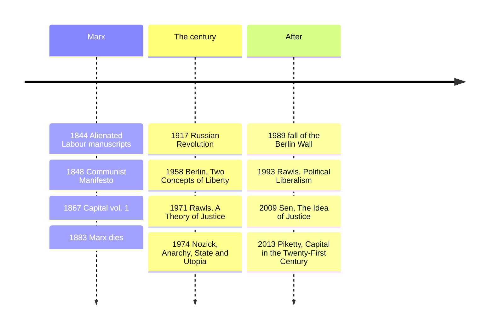

# 18 — Political Philosophy and Justice — ปรัชญาการเมืองและความยุติธรรม

> *"Each with an equal say in a game whose rules he helped make without knowing who would win."* (the spirit of Rawls' thought experiment)

Political philosophy asks what a just society owes its members and why the state may coerce them. The modern argument runs through four voices: Marx, who indicted capitalism as alienating even when it enriches; Rawls, who rebuilt the social contract with one device, the veil of ignorance (ม่านแห่งความไม่รู้); Nozick, who answered that redistribution is itself the injustice; and Berlin, who showed "liberty" is at least two rival ideas (เสรีภาพเชิงลบ vs เชิงบวก).

Why an adult should care: every tax debate and "the state should/should not" claim in your family line group is a move in this game.

---

## 1 | Historical Context

Marx (1818-1883) wrote against the industrial misery his friend Engels described in Manchester: child labor, boom-bust crises, free contracts between parties with unequal power. After the 1917 revolution, versions of his program became state religions of half the world, and the century's deaths made his reputation swing accordingly. The modern debate reopened in 1971 when Rawls (1921-2002) published A Theory of Justice at Harvard and made liberal egalitarianism respectable again; Nozick's Anarchy, State, and Utopia (1974) answered it from Berkeley; Berlin's 1958 lecture Two Concepts of Liberty had already drawn the line that "liberty" is at least two rival ideas (เสรีภาพเชิงลบ vs เชิงบวก). Thai readers bring their own grammar: the Kingdom's tradition ranks harmony and "sufficient economy" (เศรษฐกิจพอเพียง, see §6) alongside liberty and equality, not beneath them, so the conversation has more than two axes.

## 2 | Core Concepts

### 2.1 Marx: alienation and the critique of capitalism

Marx's analysis comes in layers. Historical materialism (วัตถุนิยมเชิงประวัติศาสตร์): production first, then politics and ideas built on it, the base and superstructure; modes of production succeed one another as their internal contradictions mature. Surplus value (มูลค่าส่วนเกิน): the worker is paid for a day's labor-power but produces more value in that day than the wage covers; the gap, appropriated by the owner of the means of production, is profit. Exploitation, for Marx, is thus not an abuse of the market but its normal function under these property rules, and the system is crisis-ridden: competition forces wage cuts until demand cannot buy what supply produces.

Alienation (ความแปลกแยก), his more durable category, from the 1844 Manuscripts: the worker is alienated from the product (it belongs to another), from the activity (work is forced, not expressive), from "species-being" (creative self-development reduced to mere survival), and from other people (relations become competitive). Capital's (1867) commodity-fetishism chapter adds: social relations between people appear as price relations between things.

Standard critiques, stated fairly: the labor theory of value lost ground to marginal-subjective value theory ([[Social Studies/03 Economics/05_Economic_Systems|Economic Systems]]); the predicted immiseration never arrived in the rich world, where democracy redistributed what Marx said could only be taken; the "dictatorship of the proletariat" produced one-party terror states, and the calculation problem (no prices without markets) killed central planning. What survives: alienation as a description of deskilled, surveilled gig work; the insight that contract freedom and real bargaining power differ; crisis theory's kinship with business-cycle study; and the Feuerbach thesis, "the philosophers have only interpreted the world... the point is to change it," praxis (จริยธรรมเชิงปฏิบัติ) in one line.

### 2.2 Rawls: the veil of ignorance, worked

Rawls' device is a thought experiment you can run. Original position (จุดยืนดั้งเดิม): you choose a society's fundamental rules, constitution, property regime, safety net, behind a veil of ignorance (ม่านแห่งความไม่รู้) that hides your place in it: class, talents, gender, race, religion, conception of the good. You know general economics, nothing about which card you will be dealt.

Work it. You choose between: (a) strict equality; (b) a rigid hierarchy with a chance of being at the top; (c) inequality permitted only where incentives raise everyone's productivity, over a strong floor of education, health, and a sufficient minimum. Behind the veil you are risk-averse, because you might be the poorest, the sickest, the least talented. Rawls argues you reject (b) and choose (c) over (a): if paying surgeons more produces more surgeons and longer lives for the bottom decile, that inequality is not merely tolerable but just, because the bottom is better off than under any alternative. That is the difference principle (หลักความแตกต่าง): inequalities are just only if they work to the greatest benefit of the least advantaged. Prior to it come equal basic liberties (conscience, political voice, rule of law): you would never trade a chance at wealth for a chance of being persecuted, so liberty cannot be sold for growth.

Objections on both flanks: libertarians (Nozick below) say the principle requires continuous interference with consenting adults; utilitarians call maximin irrational pessimism; the left says the model ignores global structure; communitarians say a self with no attachments cannot choose at all. In Political Liberalism (1993) Rawls narrowed the theory to a module compatible with many moral doctrines.

### 2.3 Nozick: entitlement theory and Wilt Chamberlain

Nozick (1938-2002) starts from individual rights, not the social contract: a minimal state (รัฐขั้นต่ำ), limited to protection against force, theft, fraud, and contract enforcement, is justified; anything more treats people as means to others' ends (Kant's formula, note 13, flipped against redistributors). Justice in holdings is historical, not patterned: just acquisition, just transfer, plus rectification of past injustice.

The Wilt Chamberlain argument (1974) is the most economical critique of patterned justice written: start from any distribution you like, call it just. Chamberlain signs a contract: a quarter of each ticket goes to him, and a million fans pay it voluntarily. The new distribution departs from your pattern yet arose entirely by consent; enforcing the pattern means forbidding consenting adults from choosing freely with what is theirs. Liberty upsets patterns: justice is history and consent, not a snapshot of who has how much. Defenders reply that the aggregate outcome is a structure no one consented to, and that entitlement with weak rectification is silent about how the starting distribution got its lands and patents, where most real-world grievance lives.

### 2.4 Berlin: two concepts of liberty

| Type | Thai | Definition | Guards against | How it is abused |
|---|---|---|---|---|
| Negative liberty | เสรีภาพเชิงลบ | Absence of interference: how large is the area where I am left to do what I want? | The coercive state, censorship, arbitrary arrest | The rich call power over the poor "freedom," since no one legally interferes |
| Positive liberty | เสรีภาพเชิงบวก | Self-mastery, self-rule: who governs me, my real self or my true community? | Dependence, being ruled by appetite or advertising | An authority claims to force you to be free "in your true will" (Rousseau's clause, which Berlin traces toward totalitarianism) |

Berlin's deeper thesis is value pluralism (พหุนิยมแห่งคุณค่า): liberty and equality, justice and mercy, truth and kindness are all genuinely good and cannot be fully harmonized; the temptation of a final solution is what makes monistic politics dangerous. Liberalism, for Berlin, is the temper of trading without pretending the tragic choice away.

## 3 | Timeline

## 4 | Key Thinkers and Ideas

| Thinker | Dates | Big Idea | Must-Know Work |
|---|---|---|---|
| Karl Marx | 1818-1883 | Historical materialism; surplus value; alienation | Capital vol. 1 (1867); 1844 Manuscripts |
| John Rawls | 1921-2002 | Justice as fairness; veil of ignorance; difference principle | A Theory of Justice (1971) |
| Robert Nozick | 1938-2002 | Entitlement; minimal state; Wilt Chamberlain | Anarchy, State, and Utopia (1974) |
| Isaiah Berlin | 1909-1997 | Two liberties; value pluralism | Two Concepts of Liberty (1958) |
| Amartya Sen | 1933- | Capability approach: judge societies by what people can be and do | The Idea of Justice (2009) |

Marx: even critics concede he is capitalism's greatest diagnostic writer.

Rawls: the contract's modern architect; his two principles are the baseline left-liberal programs cite or dispute.

Nozick: the counter-architect, who later conceded many critics' points; his rectification clause is what libertarians quote least.

Berlin: the Cold War's subtlest liberal, a refugee from Riga, for whom the road to coercion ran through single-idea certainty.

Sen: the bridge out of the deadlock, asking not "what institutions would we choose" but "what are people actually able to do and be," the way the HDI tradition thinks, a link to [[Social Studies/03 Economics/10_Economic_Indicators|Economic Indicators]].

### The liberty vs equality quadrant

A compact way to place positions (axes idealized; real thinkers qualify):

|  | High equality | Low equality |
|---|---|---|
| **High liberty (negative)** | Left-libertarianism, market-for-all: hard to sustain, since equal freedom without redistribution lets fortunes freeze into caste | Right-libertarianism: Nozick's minimal state, property unpatterned |
| **State-directed equality** | Left-Marxist planning: positive liberty run as command (Berlin's warning) | Social-democratic mixed state (Nordic model): strong floor, market engine, regulated liberty |

The quadrant maps argument, not a menu: every cell has real thinkers and real failures, and workable polities sit inside cells with asterisks.

## 5 | Thai Terminology

| Thai | English | Notes |
|---|---|---|
| วัตถุนิยมเชิงประวัติศาสตร์ | Historical materialism | Production shapes law and ideas |
| มูลค่าส่วนเกิน | Surplus value | Profit as unpaid labor-time |
| ความแปลกแยก | Alienation | Worker severed from product, act, kind, others |
| การบูชาสินค้า | Commodity fetishism | Social relations appear as price relations |
| ม่านแห่งความไม่รู้ | Veil of ignorance | The original position's blindfold |
| จุดยืนดั้งเดิม | Original position | Where the social contract is chosen |
| หลักความแตกต่าง | Difference principle | Inequality justified only by the bottom's gain |
| ลำดับก่อนของเสรีภาพ | Priority of liberty | No trading rights for growth |
| ทฤษฎีสิทธิสมบูรณ์ | Entitlement theory | Justice as history plus consent |
| รัฐขั้นต่ำ | Minimal state | Night-watchman government |
| เสรีภาพเชิงลบ / เชิงบวก | Negative / positive liberty | Non-interference / self-rule |
| พหุนิยมแห่งคุณค่า | Value pluralism | Genuine goods conflict irreducibly |
| แนวทางขีดความสามารถ | Capability approach | Justice measured by real freedoms to live |

## 6 | Why It Matters Today

Every Thai election runs the Rawls question in local costume: health cover, farm subsidies, cash handouts, at what cost? Rawls asks what you would design not knowing whether you were beneficiary or taxpayer; Nozick, whether the tax-taker had a right to take; Berlin, whether each side means the same by "freedom." Three frames locate the argument.

Marx's alienation language fits gig and platform labor: the rider whose app sets price, pace, and rating; the moderator doing a platform's dirty work from a low-wage country; the worker on a dashboard. The 1844 four-column checklist still fits whatever one makes of surplus-value economics, and the same lens sharpens the AI debate: not only "will jobs disappear" but who owns the machine's gains.

Sen's capability approach explains why a rich province can still hold little real freedom for its women or disabled residents ([[Social Studies/02 Civics/01_Democracy_and_Government|Democracy and Government]]).

Sufficiency-economy philosophy (เศรษฐกิจพอเพียง) intersects here honestly: moderation, reasonableness, and self-immunity through good governance are neither a Rawlsian contract nor a Marxist critique but a third grammar, virtue and prudence as the basis of a stable life; comparing what each grammar makes visible and invisible is illuminating, compare [[Social Studies/03 Economics/03_Sufficiency_Economy_Philosophy|Sufficiency Economy Philosophy]].

## 7 | Further Reading

- *A Theory of Justice* by John Rawls: the debate's center; the original-position chapters are load-bearing.
- *Anarchy, State, and Utopia* by Robert Nozick: the Wilt Chamberlain argument, worth a hundred culture-war essays.
- *Two Concepts of Liberty* by Isaiah Berlin: permanently useful whenever someone says "free."
- *Capital*, vol. 1 part 1, by Marx: reading him is not agreeing.

## Related

- [[Philosophy/00_overview|← Philosophy Overview]]
- [[17_Analytic_Philosophy]]
- [[19_Philosophy_of_Science]]
- [[Social Studies/03 Economics/05_Economic_Systems|Economic Systems]]
- [[Social Studies/02 Civics/01_Democracy_and_Government|Democracy and Government]]
