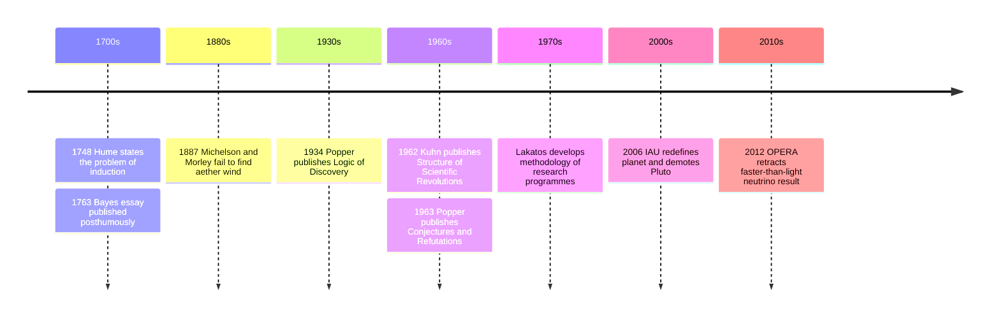

# 19 — Philosophy of Science — ปรัชญาวิทยาศาสตร์

> *"Science is a way of thinking much more than it is a body of knowledge."*

Science is the most successful way humans have found of describing the world, and yet ordinary life treats it as a machine that simply prints facts. Philosophy of science (ปรัชญาวิทยาศาสตร์) asks the questions underneath: Why should believing the sun will rise tomorrow count as knowledge when all you have is habit? What separates a scientific claim from a confident-sounding one? And if a theory survives a century of testing, what does that prove?

These questions decide how you read a headline. Knowing the machinery, the problem of induction (ปัญหาการอุปนัย), falsification (การหักล้างทฤษฎี), paradigms (กระบวนทัศน์), and Bayesian updating, turns "the scientists changed their minds again" into "the system worked as designed." This note builds on [[Science/Fundamental/01_Scientific_Method|the Scientific Method note]], which describes the day-to-day procedure; here we ask why the procedure is trustworthy.

---

## 1 | Historical Context

The crisis starts in Scotland in the 1740s. David Hume pointed out that every piece of evidence about the future is an argument from past regularity, and no amount of past regularity logically guarantees future regularity. "This food nourished me before, therefore it will nourish me tomorrow" smuggles in the assumption that nature is uniform. Hume's conclusion was not that science is worthless, but that its foundation is custom and habit (นิสัย), not pure reason.

In 1920s and 1930s Vienna, the Logical Positivists tried to save science by tying meaning to verification. Karl Popper argued this got it backwards: verification is cheap, almost any theory can be massaged into agreement with some observations, so what matters is a theory's willingness to be destroyed by observation. His Logik der Forschung (1934, English translation 1959) made falsifiability the line between science and non-science.

Then a physicist-turned-historian changed the conversation. Thomas Kuhn's The Structure of Scientific Revolutions (1962) argued that working science rarely looks like Popper's fearless refutation: most scientists solve puzzles inside an accepted framework, a "paradigm," and revolutions happen when anomalies pile up. Imre Lakatos bridged the two pictures with research programmes, while Bayesian confirmation theory, revived from Thomas Bayes's posthumous 1763 essay, became the modern account of how evidence moves belief in degrees.

## 2 | Core Concepts

### 2.1 | The Problem of Induction: Hume's Legacy

| Element | Thai | Meaning | Example |
|---|---|---|---|
| Induction | การอุปนัย | Reasoning from observed to unobserved cases | Every swan seen here is white, so all swans are white |
| Uniformity of nature | ความสม่ำเสมอของธรรมชาติ | The hidden assumption that the future resembles the past | The sun will rise tomorrow |
| Circularity | วนเวียนเป็นวงกลม | Justifying induction by induction's past success | "Induction works because it has worked before" |

No philosopher has found a non-circular deduction proving induction. The responses define later philosophy of science: Popper denied that science needs induction at all; Bayesians say it is probability estimation, never certain, always graded; pragmatists say it is a habit we cannot abandon, so we refine it. Practical lesson: "proven by data" almost always means "supported to some degree by data."

### 2.2 | Popper: Conjectures and Refutations

| Concept | Thai | Popper's Claim |
|---|---|---|
| Falsification | การหักล้างทฤษฎี | A theory is scientific only if some possible observation could refute it |
| Demarcation | เส้นแบ่งวิทยาศาสตร์ | Falsifiability, not verifiability, separates science from pseudoscience |
| Conjecture | การเดาอย่างกล้าหาญ | Theories are bold guesses, never derived passively from observations |
| Corroboration | การยืนยันชั่วคราว | Surviving severe tests earns temporary acceptance, never proof |

Popper admired Einstein, whose general relativity risked refutation by predicting starlight bending during the 1919 eclipse expedition. He dismissed Adlerian psychology and orthodox Marxism as unfalsifiable: any human behavior could be fitted to them after the fact. A theory you cannot imagine being wrong about has already forfeited its claim to describe the world. His 1963 collection's title, "Conjectures and Refutations," is the whole method: guess boldly, attack ruthlessly, keep what survives, for now.

### 2.3 | Kuhn: Paradigms and Scientific Revolutions

Kuhn studied actual laboratory practice and found a cycle rather than a straight line:

| Stage | Thai | What Happens |
|---|---|---|
| Pre-science | ยุคก่อนกระบวนทัศน์ | Competing schools, no shared framework |
| Normal science | วิทยาศาสตร์ปกติ | Puzzle-solving inside one paradigm |
| Anomaly | ความผิดปกติ | Results that resist the paradigm's explanations |
| Crisis | วิกฤตการณ์ | Anomalies accumulate; foundational doubts spread |
| Revolution | การปฏิวัติวิทยาศาสตร์ | A new paradigm wins the field |

A paradigm (กระบวนทัศน์) is the whole package of theory, instruments, standards, and textbook examples a community shares; normal science is conservative, treating anomalies as puzzles to be absorbed rather than threats. Kuhn's most controversial word was incommensurability: proponents of rival paradigms "see" the same world differently and convert through evidence combined with persuasion. Copernicus replacing Ptolemy, Lavoisier replacing phlogiston, and Einstein replacing Newtonian absolute space are his model cases. Critics still argue whether Kuhn made science look irrational or merely realistic.

### 2.4 | Lakatos: Research Programmes (briefly)

Imre Lakatos (1922-1974) proposed a compromise. Science evaluates not single theories but research programmes (ชุดโปรแกรมวิจัย): a hard core of protected commitments surrounded by a belt of adjustable auxiliary hypotheses. A programme is progressive when its predictions anticipate novel facts, degenerating when it only patches surprises after the fact. Copernican astronomy at first explained less than Ptolemy's; judged by Popper's instant falsification, young sciences would be strangled early. Lakatos wanted criticism with historical patience.

### 2.5 | Bayesian Confirmation: The Modern Workhorse

| Element | Thai | Meaning |
|---|---|---|
| Prior | ความเชื่อก่อนเห็นหลักฐาน | Probability assigned to a hypothesis before the new evidence |
| Likelihood | ความน่าจะเป็นของหลักฐาน | How expected the evidence is, given each hypothesis |
| Posterior | ความเชื่อหลังเห็นหลักฐาน | Updated probability of the hypothesis |
| Confirmation | การยืนยันด้วยหลักฐาน | Evidence E confirms H when P(H given E) exceeds P(H) alone |

Bayesianism reframes Hume honestly: you can never reach certainty about the unobserved, but you can update degrees of belief correctly. It explains what Popper disliked admitting: why several independent confirmations of relativity mattered, why precise predictions count for more than vague fit, and why priors matter (a 99 percent accurate test for a one-in-ten-thousand disease is still more likely to produce a false alarm than a true case). Modern statistics and evidence-based medicine run on this logic.

### 2.6 | Why Science Revises Itself: The Adult Payoff

Two famous public moments show the machinery working as designed.

**Pluto demoted (2006).** For 76 years, "nine planets" was schoolroom fact. When the International Astronomical Union voted to define "planet" formally, Pluto was reclassified as a dwarf planet. The trigger was not that Pluto changed; new telescopes kept finding icy bodies in the Kuiper belt, including Eris, comparable in size to Pluto. The old list had been a habit, not a discovery. Science had to decide what "planet" was for: a historical family of objects, or a physical category meaning "region-clearing dominant body." People called the change embarrassing; it is the opposite. Categories in science serve investigations, and when discoveries strain a category, a real science revises the category.

**The faster-than-light neutrino that wasn't (2011-2012).** The OPERA experiment at Gran Sasso announced muon neutrinos arriving about 60 nanoseconds early, which would have violated one of physics' most secure pillars. Instead of burying the anomaly, the collaboration published and asked the world to find their error. Other labs failed to reproduce it; the cause was a loose fiber-optic connector and an oscillator fault; OPERA retracted. Bold measurement, transparent publication, independent replication, correction without humiliation: the entire social technology at once. The lesson: revision is not weakness, it is the product.

## 3 | Timeline

## 4 | Key Thinkers and Ideas

| Thinker | Dates | Big Idea | Must-Know Work |
|---|---|---|---|
| David Hume | 1711-1776 | Induction rests on habit, not logic | An Enquiry Concerning Human Understanding, 1748 |
| Karl Popper | 1902-1994 | Science is falsification, not verification | The Logic of Scientific Discovery, 1934; Conjectures and Refutations, 1963 |
| Thomas Kuhn | 1922-1996 | Science moves through paradigms and revolutions | The Structure of Scientific Revolutions, 1962 |
| Imre Lakatos | 1922-1974 | Judge research programmes, not isolated theories | The Methodology of Scientific Research Programmes, 1970s |
| Thomas Bayes | 1701-1761 | Belief updates by degrees with evidence | Essay published posthumously, 1763 |

Hume wanted humility, not paralysis: keep observing, keep expecting the sun to rise, but know the ground you stand on. Popper, fleeing 1930s Vienna and the unfalsifiable certainties of fascism and communism, made risk of refutation the measure of intellectual honesty. Kuhn forced philosophers to look at what scientists actually do. Lakatos, a Hungarian exile who debated both giants, tried to keep Popper's standards and Kuhn's realism in one room.

## 5 | Thai Terminology

| Thai | English | Notes |
|---|---|---|
| ปรัชญาวิทยาศาสตร์ | Philosophy of science | Name of the field |
| การอุปนัย | Induction | From observed cases to general claims |
| การนิรนัย | Deduction | From general premises to necessary conclusions |
| การหักล้างทฤษฎี | Falsification | Popper's exposure-to-refutation criterion |
| เส้นแบ่งวิทยาศาสตร์ | Demarcation | The boundary between science and non-science |
| กระบวนทัศน์ | Paradigm | Kuhn's shared framework of a scientific community |
| วิทยาศาสตร์ปกติ | Normal science | Puzzle-solving within a paradigm |
| ความผิดปกติ | Anomaly | A result the framework cannot absorb |
| ความน่าจะเป็น | Probability | Core of Bayesian confirmation |
| ความเชื่อก่อนเห็นหลักฐาน | Prior | Starting probability in Bayesian updating |
| การปรับความเชื่อ | Updating | Revising belief as evidence arrives |
| การทบทวนตัวเอง | Self-correction | Science's defining social feature |

## 6 | Why It Matters Today

- **Reading health news.** "Coffee causes cancer" and "coffee prevents cancer" both ran in the same year. With Hume and the Bayesians in mind, you weigh each as a graded update from one study design, not a verdict. With Popper, you ask what result would have disproved the claim; if the answer is "none," lower your trust accordingly.
- **Evaluating everyday claims.** Miracle supplements and energy-healing pitches mostly fail demarcation: they are worded so no observation counts against them. Unfalsifiable does not mean false, it means unscientific; the boundary can be set without sneering.
- **Climate, vaccine, and policy debates.** Reversed guidance feels like hypocrisy; through Kuhn and Bayes it reads as normal science plus updating under genuine uncertainty. Disagreeing about the prior is honest; pretending certainty was ever available is not.
- **At work.** Good analytics runs on the same structure: a metrics dashboard is normal science, a market shock is the anomaly, and companies that treat every anomaly as total refutation, or as noise to explain away, both fail. Lakatos's question, "is this programme predicting anything new?" is a fair test for pet projects and quarterly narratives alike.

## 7 | Further Reading

- *Conjectures and Refutations* by Karl Popper: the clearest defense of the idea that bold guesses attacked by evidence, not patient data collection, drive knowledge.
- *The Structure of Scientific Revolutions* by Thomas Kuhn: the book that changed how everyone, including scientists, talks about their own history.
- *Theory and Reality* by Peter Godfrey-Smith: the best single modern guide to Popper, Kuhn, Lakatos, and Bayes together.
- *The Demon-Haunted World* by Carl Sagan: scientific thinking as a civic habit, warm and readable for non-specialists.

## Related

- [[Philosophy/00_overview|← Philosophy Overview]]
- [[18_Political_Philosophy_and_Justice]]
- [[20_Eastern_Philosophy_Beyond_Thailand]]
- [[Science/Fundamental/01_Scientific_Method|the Scientific Method note]]
- [[11_Empiricism]]
