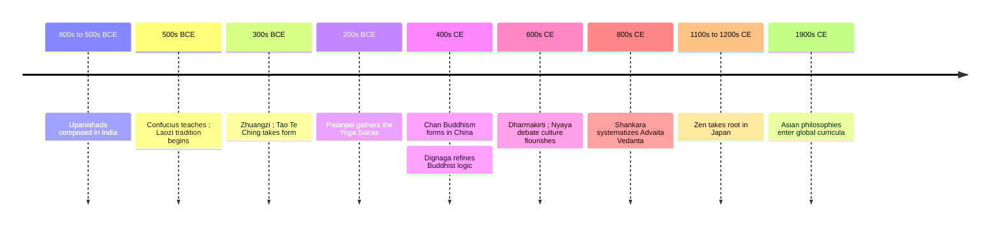

# 20 — Eastern Philosophy Beyond Thailand — ปรัชญาเอเชียเพื่อนบ้าน

> *"The Dao that can be spoken is not the eternal Dao."*

Thailand's dominant wisdom tradition, Theravada Buddhism, arrived from India and Sri Lanka, and most of Asia's other philosophies (ปรัชญาเอเชีย) either grew up arguing with Buddhism, borrowing from it, or both. China developed Confucian role ethics and Daoist naturalism; Japan refined Zen; India produced Vedanta and a rigorous science of logic. A Thai reader knows the Buddhist side from the inside; this note maps the neighbors, because each asks questions the others quietly skip.

These traditions shaped every society around Thailand for two millennia: the Chinese family-and-face ethics that color Thai-Chinese business culture, the Japanese management ideas that entered global work life, and the yoga-and-meditation economy that reaches every Bangkok gym. Meeting the source ideas, not the wellness-app versions, is how you hold your own in conversations about "Confucian values" or "Daoist calm."

---

## 1 | Historical Context

The Chinese traditions crystallized during the Warring States period (roughly 475-221 BCE), when collapsing feudal order forced thinkers to ask how life could be rebuilt without the old rites. Confucius (ขงจื๊อ, 551-479 BCE) answered with moral cultivation and ritual propriety; disciples compiled his sayings as the Analects. Daoism (ลัทธิเต๋า) gathered around the semi-legendary Laozi and the Tao Te Ching (compiled around the 4th-3rd centuries BCE), and around the parables of Zhuangzi (c. 369-286 BCE).

Indian philosophy is older and vaster. The Upanishads (c. 800-500 BCE) set the agenda of Brahman and Atman that nearly every later school, Hindu or Buddhist, had to address. The six orthodox Hindu schools took shape over centuries, while Buddhist and Jain thinkers, themselves fully part of Indian philosophy, broke with Vedic authority. The logicians Dignaga (c. 480-540 CE) and Dharmakirti (c. 600-660 CE) built a Buddhist theory of knowledge debated by Hindu schools for eight hundred years.

Zen (นิกายเซน) is the meeting point: Indian dhyana meditation reached China as Chan around the 5th-6th centuries CE, merged with Daoist sensibility, and reached Japan by the 12th century, shaping samurai culture and tea.

## 2 | Core Concepts

### 2.1 | Confucianism: Roles Before Rules

| Concept | Meaning | Example |
|---|---|---|
| Ren (humaneness) | Benevolence; the core virtue of care between people (เมตตา) | Weighing how a decision lands on the junior person |
| Li (ritual propriety) | The forms and etiquette that make cooperation graceful | Greeting elders first; hosting and gift customs |
| Xiao (filial piety) | Devotion and respect owed to parents and ancestors (ความกตัญญู) | Caring for aging parents as a first claim |
| Junzi (exemplary person) | Nobility by character and learning, not by birth | A leader trusted for fairness, not rank |

Confucianism is a philosophy of relationships: you are never an abstract individual but a son, parent, neighbor, colleague, and ethics is the art of filling those roles well. The Analects teach cultivation through study and ritual rather than commandments. Its political idea was radical for its age: meritocratic governance, rulers tested by virtue and learning, and officials obliged to remonstrate with a wrong-headed sovereign; China's civil-service exam system embodied this for over a millennium. Critics say it can harden into rigid hierarchy, and feminist scholars note its patriarchal framing; defenders reply that humane ren, not blind obedience, was always its center.

### 2.2 | Daoism: The Way That Is Not a Roadmap

| Concept | Meaning | Example |
|---|---|---|
| Dao (เต๋า, "the Way") | The unnamed source and pattern of everything | The flow a skilled craftsperson stops fighting |
| Wu-wei (non-coercive action) | Acting without forcing; effective effortlessness (การไม่ฝืน) | Letting a negotiation find its shape instead of driving it |
| Yin-yang | Complementary opposites; each carries the seed of the other (หยิน-หยาง) | Rest and work cycles; loss that turns out to be gain |

The Tao Te Ching, eighty-one short poems, counsels rulers and readers alike to stop interfering with what would work on its own: "govern a great state as you would cook a small fish," too much poking and it falls apart. Zhuangzi dreamed he was a butterfly; waking, he could not tell whether he was a man who dreamed a butterfly or a butterfly dreaming a man, a playful skeptical puzzle about identity. His butcher carves an ox for nineteen years without dulling the blade, following natural seams: wu-wei as mastered skill, not passivity. Daoism is neither nature-worship nor laziness; it is a theory of fit.

### 2.3 | Zen: Direct Pointing

| Concept | Meaning | Example |
|---|---|---|
| Zazen | Seated meditation practiced as its own aim | Silent sitting with no goal-chasing |
| Koan (ปริศนาธรรม) | A paradox case used to exhaust discursive thinking | "What was your face before your parents were born?" |
| Satori | Sudden insight; "seeing one's nature" | The shift when the koan stops being a puzzle |
| Lineage | Transmission master to student, traced to the Buddha | The Rinzai and Soto schools of Japan |

Zen simply means "meditation" (from Sanskrit dhyana, via Chinese chan to Japanese zen), and its signature claim is direct pointing outside scriptures. State the relation to Thai Theravada carefully: both are schools (นิกาย) of one broad Buddhist family, not opposites. Theravada anchors on the Pali Canon, a gradual path, and monastic discipline; Zen anchors on sitting, teacher-student encounter, and sudden insight, and it absorbed Daoist naturalness along the way. A Thai forest master and a Zen roshi would recognize each other's warnings against book learning, while disagreeing about which texts to trust. Different methods on shared ground: impermanence, non-self, release from craving.

### 2.4 | Hindu Philosophy and Vedanta: One Reality, Many Paths

The Upanishads ask: what is the ground of everything, and what in me answers to it? Their vocabulary became standard: Brahman (พรหมมัน), the absolute reality, and Atman (อาตมัน), the innermost self. Vedanta (เวทานตะ, "the end of the Vedas") interprets that question. Shankara (c. 788-820 CE) defended Advaita, strict non-duality: Atman is Brahman, "that thou art"; Ramanuja and Madhva held that soul and God remain real and distinct.

The six classical schools, briefly: Samkhya maps reality as consciousness and matter; Yoga is its practical twin; Nyaya is logic and evidence; Vaisheshika an early atomism; Mimamsa the philosophy of ritual and duty; Vedanta the metaphysics above. Notably, yoga (โยคะ) here is not exercise but an epistemology: Patanjali's Yoga Sutras (c. 2nd century BCE-4th century CE) define it as "the stilling of the fluctuations of the mind," a testable method of knowing.

### 2.5 | Indian Logic and Debate: Nyaya and the Buddhists

Nyaya (ไนยาย) built one of the world's oldest systematic theories of evidence: perception, inference, analogy, and testimony as the valid means of knowledge, plus a syllogism designed for public debate, where a claim must carry an example, not just a premise. Buddhist logicians Dignaga and Dharmakirti pushed further: only perception and inference are genuinely valid, they argued, and words refer by exclusion (apoha), by ruling out what a thing is not. Hindu, Buddhist, and Jain scholars debated in rule-governed public tournaments for centuries, part of why Buddhism eventually declined in India. Readers of [[Mathematics/Advance/01_Sets_and_Logic|sets and logic]] use the distant descendants of this argument culture.

### 2.6 | A Contrast with Thai Theravada, Done Honestly

| Question | Thai Theravada | Confucianism | Daoism | Advaita Vedanta |
|---|---|---|---|---|
| What am I? | Anatta: no fixed self (อนัตตา) | A web of roles to perfect | A temporary expression of the Dao | Atman, identical with Brahman |
| How to live well? | The middle way: sila, samadhi, panna (ศีล สมาธิ ปัญญา) | Ren and li; cultivate, fulfill roles | Wu-wei; fit, force less | Know the self; act without clinging |
| Society's glue? | Sangha, generosity, merit culture | Ritual, filial piety, remonstrance | Small, quiet, self-governing villages | Dharma and duty (contested today) |
| Death? | Rebirth without a transmigrating soul | Ancestors and lineage continue | Return to the Dao | Atman passes on or merges |
| How we know? | Careful observation of mind; canon | Study, practice, worthy teachers | Emptiness, paradox, poetry | Upanishadic testimony plus realization |

Honest cautions. These borders are porous because the traditions actually met: Zen is Buddhism filtered through Daoism; Vedanta and Buddhism debated for a millennium; Confucian states patronized or suppressed Buddhism by turns. The sharpest genuine line is self versus non-self: Vedanta's Atman and the Buddha's anatta disagree at the foundations. "Ritual propriety vs sila" is a resemblance, not an identity: li polishes social order; sila trains intention toward liberation. And wu-wei is not the middle way: the middle way is a choice between extremes; wu-wei declines the choice-frame. One Thai footnote: the Brahma shrines at street corners (ศาลพระพรหม) belong to Thai Brahmanism, a living folk layer related to, but distinct from, scholastic Vedanta. See also [[Social Studies/01 Religion/01_Buddhist_Principles|Buddhist Principles]] and [[Social Studies/01 Religion/03_Other_Religions|Other Religions]].

## 3 | Timeline

## 4 | Key Thinkers and Ideas

| Thinker | Dates | Big Idea | Must-Know Work |
|---|---|---|---|
| Confucius | 551-479 BCE | Ethics of roles, ritual, and cultivated humanity | The Analects (compiled by disciples) |
| Laozi | Semi-legendary, text c. 4th-3rd c. BCE | The Dao; the strength of softness | Tao Te Ching |
| Zhuangzi | c. 369-286 BCE | Relativity of perspectives; freedom through non-striving | The Inner Chapters |
| Dignaga and Dharmakirti | c. 480-540; c. 600-660 CE | Buddhist epistemology: perception and inference only | Nyaya-mukha; Pramana-varttika |
| Shankara | c. 788-820 CE | Non-dual Vedanta: Atman is Brahman | Commentary on the Brahma Sutras |

Confucius called himself a transmitter, not an inventor, and his influence is civilizational: school, family, and state from Seoul to Singapore still speak his grammar. Laozi may be a title more than a person; the little book under his name is among the most translated in history. Zhuangzi is the wisest humorist in philosophy. Shankara's Advaita survived a millennium of objection to become the default face of Hindu metaphysics worldwide. The Buddhist logicians built a full theory of knowledge inside a religion aimed at liberation.

## 5 | Thai Terminology

| Thai | English/Source | Notes |
|---|---|---|
| ปรัชญาขงจื๊อ | Confucianism | Also ลัทธิขงจื๊อ |
| ความกตัญญู | Filial piety (xiao) | Thai-native value; Confucius made it a system |
| มารยาท | Ritual propriety (li) | Etiquette as moral training |
| ลัทธิเต๋า, เต๋า | Daoism, the Dao | "The Way" |
| การไม่ฝืน | Wu-wei | Non-coercive action; no neat Thai single word |
| หยิน-หยาง | Yin-yang | Complementary opposites |
| นิกายเซน | Zen school | From Sanskrit dhyana via Chinese chan |
| ปริศนาธรรม | Koan | Dhamma riddle; cuts discursive thought |
| พรหมมัน, อาตมัน | Brahman, Atman | Standard transliterations of the Upanishadic terms |
| เวทานตะ, อัทไวตะ | Vedanta, Advaita | Non-dual reading of the Upanishads |
| ไนยาย | Nyaya | The Indian school of logic and evidence |
| ทางสายกลาง | The middle way | Theravada's own answer, for contrast |

## 6 | Why It Matters Today

- **Work and management.** Japanese kaizen and "effortless excellence" talk is Zen and Daoism laundered through industry; Korean and Chinese workplace hierarchy is Confucian role ethics. A Thai employee in a Thai-Chinese family firm reads both scripts daily, and the originals tell you when borrowed words are used honestly.
- **Parenting across generations.** Filial duty collides with modern individualism at almost every Thai Sunday lunch. The Confucian lens ("respect is built through daily forms") and the Buddhist lens ("where is the line between gratitude and clinging?") give two mature ways to frame the same argument.
- **Wellness consumption.** "Tao" coffee mugs, yoga as gym class, and "zen" cafes sell shells. This note lets you ask what Advaita actually claims about the self and what Patanjali defines yoga as.
- **Being literate about neighbors.** China, Japan, Korea, Vietnam, and India are Thailand's partners; friction runs along these frameworks: face and hierarchy, harmony and effortless action, duty and karma. See [[Social Studies/02 Civics/01_Democracy_and_Government|Democracy and Government]] for the Western inheritance this region never passed through.

## 7 | Further Reading

- *Tao Te Ching* by Laozi (trans. D.C. Lau or Stephen Mitchell): short, strange, inexhaustible; a chapter a week, not a sitting.
- *The Analects* by Confucius (trans. D.C. Lau): the founding book of role ethics, more humane than its reputation.
- *The Inner Chapters* by Zhuangzi (trans. A.C. Graham): the butterfly, the butcher, and philosophy as comedy.
- *An Introduction to Indian Philosophy* by Chatterjee and Datta: a clear survey of the six schools and their debate with Buddhism.

## Related

- [[Philosophy/00_overview|← Philosophy Overview]]
- [[19_Philosophy_of_Science]]
- [[21_Philosophy_of_Mind_and_AI]]
- [[Social Studies/01 Religion/01_Buddhist_Principles|Buddhist Principles]]
- [[Social Studies/01 Religion/03_Other_Religions|Other Religions]]
