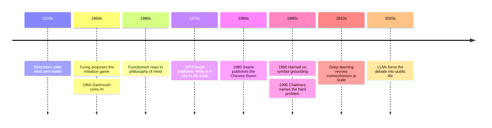

# 21 — Philosophy of Mind and AI — ปรัชญาจิตและปัญญาประดิษฐ์

> *"We cannot be sure that a machine suffers; we can be sure we do not know."*

Philosophy of mind (ปรัชญาจิต) asks what consciousness is and where it fits in a physical world. For most of history it was an abstraction; with artificial intelligence, it became a consumer question. Every week someone declares that a chatbot is conscious, or that it is "just autocomplete." Both claims outrun what anyone actually knows, and the arguments behind them were worked out decades before the current systems existed, in papers by Turing, Searle, Nagel, and Chalmers.

This note gives you those arguments in plain terms, connected to [[Science/Advance/Computer Science/11_Artificial_Intelligence|the Artificial Intelligence note]], which covers the engineering. The payoff: when someone says "AI is thinking" or "AI is faking," you will know exactly which question they are smuggling past, and what is genuinely settled, what is contested, and what nobody knows.

---

## 1 | Historical Context

The modern frame comes from Descartes (see [[10_Rationalism]]): mind as thinking substance, matter as extended stuff, and the puzzle of how they interact in one body. That inheritance left two permanent camps, dualism (ทวินิยม), mind and matter are genuinely different, and physicalism (สสารนิยม), there is only the physical world and mind is something happening inside it. Both have modern defenses; neither has been refuted.

Functionism arrived in the 1960s through computer science itself: what makes a mental state a mental state is not what it is made of but what it does. Pain is pain because of its causal role, caused by damage, causing wincing and avoidance, whether it runs in neurons or silicon. This was the philosophical opening for machine minds, and it is the working assumption of most AI research today.

The counterattacks came fast. In 1950 Alan Turing proposed, in "Computing Machinery and Intelligence," replacing "Can machines think?" with a test: if a machine's written conversation is indistinguishable from a human's, on what grounds do we deny it? In 1974 Thomas Nagel argued that consciousness means "what it is like" to be something, and no objective description captures that. In 1980 John Searle published the Chinese Room, aimed directly at functionism and the Turing test. And in 1995 David Chalmers named the residual puzzle the hard problem of consciousness (ปัญหาที่ยากของจิตสำนึก), which has dominated the field since. Large language models, arriving in the 2020s, walked straight into this centuries-old argument and are still being scored against it by all sides.

## 2 | Core Concepts

### 2.1 | The Mind-Body Problem, Recapped

| Position | Thai | Claim | Main Difficulty |
|---|---|---|---|
| Dualism | ทวินิยม | Mind and matter are two different kinds of stuff | How does non-physical mind move physical neurons? |
| Physicalism | สสารนิยม | Only the physical exists; mind is brain activity | Does it explain subjective experience, or only behavior? |
| Functionism | ฟังก์ชันนิยม | A mental state = its causal role, whatever the material | Allows minds in machines; but is role alone enough? |

Functionalism is why "could a machine be minded?" is even a live question: if mentality is about organization, not meat, substrate should not matter. If it is about something else, a very convincing behavior can be a very empty shell. Searle's thought experiment is exactly about that gap.

### 2.2 | Consciousness: The Hard Problem

| Idea | Who | Meaning |
|---|---|---|
| Qualia | Debate tradition | The raw feels: redness of red, the taste of lemongrass |
| Nagel's bat | Thomas Nagel, 1974 | A bat echolocates; there is something it is LIKE to be a bat, and our objective science can never reach that "like" |
| Mary's room | Frank Jackson, 1982 | Mary knows every physical fact about color but has never seen red; shown a red apple, she learns something; so physical facts are not all the facts (defenders disagree strongly) |
| The hard problem | David Chalmers, 1995 | Why is there experience at all? Explaining functions and behavior is the "easy" part; explaining why any of it feels like something is the hard part |

Chalmers does not argue for ghosts; he argues that the explanatory gap is real and that physicalism needs an account of experience, not a denial of it. Illusionists (Dennett and others) reply that the "hard problem" is confused, that once you explain discrimination, reporting, and integration, there is no extra ingredient left to explain. This is a live, respectful disagreement among careful people; a reader should distrust anyone who announces a winner.

### 2.3 | The Turing Test and Its Critics

Turing's "imitation game" replaces an unanswerable question ("Can machines think?") with an empirical one ("Can a machine converse indistinguishably as a human?"). His own prediction, that by 2000 machines would fool interrogators 30 percent of the time, proved roughly right on schedule for constrained domains.

Critics: (1) it rewards style, not substance, a system can ace it by being evasive, funny, and human-like about things it has no grip on; (2) passing is not sufficient for understanding (Searle, below), and failing is not sufficient for absence, an alien or a dog would fail too; (3) it measures mimicry of humans rather than intelligence of any kind, and we have since built machines that beat us at chess without being conversational at all. Turing's real point survives: we have no honest non-behavioral test of mindedness even for other humans.

### 2.4 | Searle's Chinese Room, Step by Step

1. Searle, who speaks no Chinese, is locked in a room with an enormous filing cabinet of index cards.
2. Slips of paper with Chinese characters are pushed under the door (questions arrive).
3. The rules tell him: given this symbol pattern, push out that symbol pattern. He never asks what the symbols mean; he only matches shapes.
4. People outside read his replies and conclude the room understands Chinese fluently.
5. But Searle himself understands none of it; he is shuffling meaningless shapes.
6. Conclusion: running a program, however perfect the output, is symbol manipulation; symbol manipulation is not understanding. Syntax is not semantics.

The "systems reply," the standard defender's answer: the room as a whole understands, even if the man inside doesn't, just as your neurons don't understand English though you do. Searle replies he has internalized the rules, memorized the whole cabinet, still zero Chinese. The disagreement is never quite settled; what everyone concedes is that the intuition ("there must be something missing") is powerful but is doing real philosophical lifting.

### 2.5 | Symbol Grounding

Stevan Harnad (1990) sharpened the room: dictionary words are defined by more words, which are defined by more words, symbols pointing only at symbols, a closed loop never touching the world. Grounding happens, he argued, when some symbols connect directly to sensorimotor experience, to what a cat actually looks like. This matters for AI because a purely text-trained system inherits the loop: it may relate "wet" to "water" perfectly without ever being rained on. Whether vast multimodal training (images, audio, robot sensors) counts as grounding, or only as a bigger loop, is exactly today's argument.

### 2.6 | Connectionism vs GOFAI, in Plain Terms

| Approach | Era | How it works | Analogy |
|---|---|---|---|
| GOFAI (Good Old-Fashioned AI) | 1956-1980s | Hand-written logic, rules, and symbol manipulation | A clerk following a manual of if-then cards, Searle's room |
| Connectionism | roots 1940s-60s, dominant since 2012 | Learning: huge networks of simple weighted units tuned by data | Learning to swim by swimming, coached by feedback, not by memorizing fluid dynamics |

Modern LLMs are connectionism scaled up: statistical networks trained to predict the next token in text. They are neither the symbol-shufflers of GOFAI nor rulebooks of logic; the interesting question is what emerges at scale, which brings us to the honest middle on the current generation of systems.

### 2.7 | What Modern LLMs Do and Do Not "Think"

What they clearly do: compress the statistical structure of enormous text corpora into weights; carry on coherent conversation; reason reliably on well-practiced problem shapes; write code; and, visibly to users, model the listener's likely intent.

What nobody has shown: persistent goals, episodic memory across sessions without scaffolding, or a felt inner life. Whether any current system has "something it is like" to be it is, strictly speaking, unknown, not denied, unknown. There is no accepted test for it, and the honest framing is neither hype ("it's conscious") nor dismissal ("it's a calculator"): a calculator's output you check digit by digit; a fluent LLM's output you check because it sounds like a person, which is a new and specific kind of responsibility for the user. The philosophy of mind's practical gift here is category hygiene: competence without comprehension is observable in every chatbot interaction; comprehension without certainty about feeling is the open question; hype and doom both collapse the distinction.

## 3 | Timeline

## 4 | Key Thinkers and Ideas

| Thinker | Dates | Big Idea | Must-Know Work |
|---|---|---|---|
| René Descartes | 1596-1650 | Mind-matter dualism; the problem we still inherit | Meditations on First Philosophy, 1641 |
| Alan Turing | 1912-1954 | Replace "can machines think" with a behavioral test | Computing Machinery and Intelligence, 1950 |
| Thomas Nagel | 1937- | Consciousness is subjective character; objectivity misses it | What Is It Like to Be a Bat?, 1974 |
| John Searle | 1932-2025 | Programs manipulate symbols; minds have intentionality | Minds, Brains, and Programs, 1980 |
| David Chalmers | 1966- | The hard problem: why is there experience | The Conscious Mind, 1996 |

Descartes made the puzzle; Turing refused to answer it and changed the subject to something testable. Nagel argued that changing the subject is all science can do from the outside. Searle claimed behavior-perfect syntax still isn't semantics. Chalmers systematized what remains unexplained after all of that and turned the leftover into a research field. Each one, in different ways, protects the same claim: first-person experience is data, not poetry.

## 5 | Thai Terminology

| Thai | English | Notes |
|---|---|---|
| ปรัชญาจิต | Philosophy of mind | The field |
| ปัญญาประดิษฐ์ | Artificial intelligence | The standard Thai term for AI |
| จิตสำนึก | Consciousness | Also used in meditation contexts; here it means experience as such |
| ทวินิยม | Dualism | Mind and matter as two substances |
| สสารนิยม | Physicalism / materialism | Only the physical is fundamental |
| คุณภาพเชิงประสบการณ์ | Qualia | The raw feels; no settled Thai term, so philosophy texts transliterate |
| ปัญหาที่ยากของจิตสำนึก | The hard problem of consciousness | Chalmers's term |
| ห้องภาษาจีน | The Chinese Room | Searle's thought experiment |
| การทดสอบของทัวริง | The Turing test | Behavioral test of machine intelligence |
| การเชื่อมโยงเชิงเครือข่าย | Connectionism | Neural-network approach |
| สัญลักษณ์ไร้ความหมาย | Ungrounded symbols | The symbol-grounding problem |
| จิตใจ | Mind | Everyday word; philosophical usage is narrower |

## 6 | Why It Matters Today

- **Judging chatbots you already use.** A Thai bank's customer bot answers fluently and confidently and sometimes invents policy terms. Whether it "understands" is philosophy; that you must verify its claims is engineering, and the Chinese Room explains in one image why fluency is not a reason to trust: the clerk can produce perfect Chinese without knowing any.
- **Work and AI tools.** Summarizing meeting notes, drafting emails, translating: competence with no comprehension is the operating model. Staff and managers who internalize that use these tools as fast assistants who are never on duty, and stay responsible for what they sign.
- **Family conversations about "smart" machines.** Children grow up calling devices alive. A parent who can hold the middle line, neither "it's just a machine" nor "it's alive," and can say "we genuinely don't know whether it feels anything, and here's why that's hard," is giving the family a rarer gift than either confident answer.
- **Meditation and mind.** Thai readers coming from [[Social Studies/01 Religion/01_Buddhist_Principles|Buddhist Principles]] will notice the odd alliance: Buddhist analysis of experience as momentary processes, no owner, overlaps with the Western denial of a Cartesian soul, yet Buddhist practice claims first-person investigation of consciousness itself, exactly the method physicalism finds embarrassing. The hard problem reads differently after an Abhidhamma class.

## 7 | Further Reading

- *Minds, Brains, and Programs* by John Searle: nine pages; the Chinese Room is philosophy's most usable argument.
- *The Conscious Mind* by David Chalmers: the serious book that made the hard problem a field.
- *Artificial Intelligence: A Guide for Thinking Humans* by Melanie Mitchell: the best non-hyped, non-scary tour of what current AI does and doesn't do.
- *I Am a Strange Loop* by Douglas Hofstadter: one thinker's attempt to dissolve the hard problem into self-reference; persuasive, contested, illuminating either way.

## Related

- [[Philosophy/00_overview|← Philosophy Overview]]
- [[20_Eastern_Philosophy_Beyond_Thailand]]
- [[22_Applied_Ethics_Today]]
- [[Science/Advance/Computer Science/11_Artificial_Intelligence]]
- [[17_Analytic_Philosophy]]
