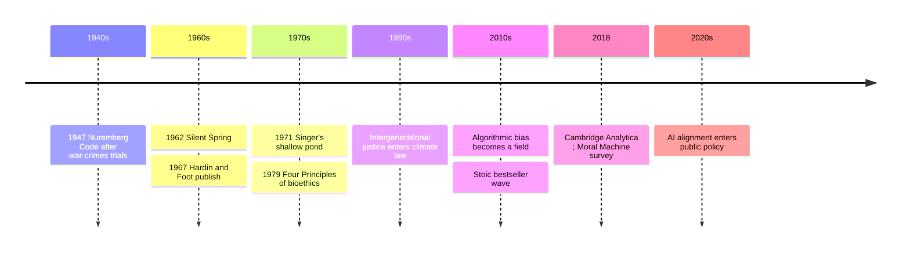

# 22 — Applied Ethics Today — จริยธรรมประยุกต์ในยุคปัจจุบัน

> *"Ethics is not only what you do when no one is looking; it is what a society decides, on the record."*

Applied ethics (จริยธรรมประยุกต์) is philosophy off the page: the moment ethical theory, utility, duty, virtue, justice (from [[14_Utilitarianism_and_Ethical_Theories]] and [[18_Political_Philosophy_and_Justice]]), must answer a specific question with a deadline. Who gets the donor heart? What should the car do when the brakes fail? Does an app owe you your attention back? Do people not yet born count? Boards, hospitals, and family dinners decide these constantly, usually with worse arguments than the ones below.

This note tours four professional fields of applied ethics, the curious revival of ancient Stoicism as modern self-help, and the place all of them meet: the self-driving car, which turned the trolley problem into a product specification.

---

## 1 | Historical Context

The fields formed in crisis decades. Bioethics institutionalized after the Nuremberg trials (1947) and the end of the Tuskegee syphilis study (1972), pushing medicine from "the doctor knows" to informed consent; Beauchamp and Childress's Principles of Biomedical Ethics (1979) fixed the four-principle framework hospitals still use. Environmental ethics grew from Silent Spring (1962) and Hardin's Tragedy of the Commons (1968), and became unavoidable once climate negotiations put future generations on the agenda. Peter Singer's "shallow pond" argument (1971) redefined private wealth as a public moral question. Tech ethics is youngest: platform accountability after Cambridge Analytica (2018), algorithmic-bias auditing as a profession, and AI alignment research from about 2015. The Stoic revival runs from cognitive therapy's founders (Ellis and Beck, 1950s-60s, both citing Epictetus) to the Ryan Holiday wave of the 2010s. And one classroom example escaped: Philippa Foot's trolley (1967) became, via MIT's Moral Machine survey (2018), a question engineers must ship answers to.

## 2 | Core Concepts

### 2.1 | The Four Fields at a Glance

| Field | Core questions | Where you meet it |
|---|---|---|
| Bioethics | When does life count most? Who consents for whom? Who gets scarce treatment? | Hospital forms, organ lists, family meetings |
| Tech ethics | What data is owed to whom? Who audits the algorithm? What do platforms owe attention? | App permissions, loan denials by model, a teen's feed |
| Environmental and climate ethics | Do future people count? Who pays for carbon? Does nature matter beyond use? | Flood policy, haze season, electricity bills |
| Stoic practical ethics | What is up to me? How do I keep composure under unfairness? | Work stress, illness, traffic, grief |

### 2.2 | Bioethics: The Four Principles

| Principle | Thai | Means | Test case |
|---|---|---|---|
| Autonomy | เคารพการตัดสินใจของบุคคล | A competent patient's informed choice binds | Refusing treatment; trial consent |
| Beneficence | การทำประโยชน์ | Act for the patient's good | Recommending care that helps |
| Non-maleficence | ไม่ทำร้าย | First, do no harm; weigh the harm of intervening | Overtreating the frail elderly |
| Justice | ความเป็นธรรม | Fair distribution of burdens and benefits | Who gets the ventilator, the donor organ |

The framework is a weighing tool, not an algorithm; hard cases are precisely where autonomy and beneficence collide, and countries balance them differently. Euthanasia and assisted dying (การุณยฆาต) stay genuinely contested: proponents cite autonomy and the end of unbearable suffering, now lawful in the Netherlands, Belgium, Canada, and Australia; opponents cite the sanctity of life, the risk that the vulnerable feel a duty to die, and palliative alternatives. Thailand's live debate centers on refusing futile treatment rather than active ending. Defenders of each side answer the other's best case; no verdict here.

Organ allocation is the trolley problem in a hospital corridor: one liver, five patients; save the most life-years, treat the sickest first, or draw lots? Every rule is a value judgment wearing a lab coat. Thai practice, where family consent drives donation supply, shows culture choosing among principles, and the merit frame (การทำบุญ) does real ethical work that secular manuals can describe but not compel.

### 2.3 | Tech Ethics: Code Is Policy

Privacy is not "nothing to hide": being constantly profiled changes what kinds of lives you can live, chilling dissent and enabling manipulation without consent. Algorithmic bias is old statistics laundered at speed: a loan model trained on historic decisions inherits historic discrimination and scales it, and the open questions are technical and moral at once: which fairness definition applies (mathematical versions of equal treatment provably conflict), who audits, who answers when the machine says no. The attention economy treats people as means to an engagement metric. AI alignment, in one paragraph: when a system pursues a stated objective better than any human, everything we meant but did not say, don't game the metric, don't cross silent limits, stop when asked, becomes the entire difficulty; specifying values is ethics. For citizen habits see [[Science/Advance/Computer Science/12_Digital_Citizenship|Digital Citizenship]]; for the methods, [[Science/Advance/Computer Science/11_Artificial_Intelligence]].

### 2.4 | Environmental and Climate Ethics

| Idea | Source | Claim | Standard objection and reply |
|---|---|---|---|
| The shallow pond | Peter Singer, 1971 | Ruining your shoes to save a drowning child is obligatory; distance changes nothing; so effective giving binds | Same logic extended to carbon: cheap sacrifice now against certain harm to far strangers |
| Tragedy of the commons | Garrett Hardin, 1968 | Unmanaged shared resources are overused: fish, air, climate | Elinor Ostrom's fieldwork: real communities do self-govern with locally designed rules |
| Intergenerational justice | Sustainability law tradition | People not yet born hold claims on the present | Objection: no duties to nonexistent individuals; reply: future people are arriving surely enough to plan for |
| Nature beyond use | Aldo Leopold; deep ecology | Ecosystems have value independent of human benefit | Thai frames: forest conservation traditions and ความพอเพียง speak to moderation natively |

Singer's is the simplest devastating argument in moral philosophy, and it cuts inside one income bracket: a Bangkok household's lifetime emissions dwarf a rural one's, so climate is also a distribution question. Here [[Social Studies/03 Economics/03_Sufficiency_Economy_Philosophy|Sufficiency Economy Philosophy]] becomes philosophically interesting: a national statement of moderate consumption as virtue, nearer Aristotle and Buddhist middle-way economics than growth theory, with both real ethical coherence and a history of political uses.

### 2.5 | The Stoic Revival: Right and Wrong

| Modern form | Borrowed from | Honest assessment |
|---|---|---|
| Cognitive behavioral therapy | Epictetus: not things disturb us, but our judgments about things | The most effective export; philosophy turned into protocol and then tested |
| Corporate resilience culture | Stoic endurance | Reframing helps; it goes wrong when endurance substitutes for fixing hostile conditions |
| Bestseller Stoicism (Holiday wave) | Meditations as leadership aphorism | Good on the dichotomy of control; often drops the ethics: Stoic virtue aimed at the common good, not at winning |
| Comparison with Buddhism | อุเบกขา (equanimity among the four brahmavihara) | Resemblance, not identity: Buddhist equanimity is boundless and other-centered; Stoic calm is a judgment about what is yours |

Ancient Stoicism (see [[06_Hellenistic_Philosophy]]) held that only virtue is good and service to the human community is the point. The revival gets the psychology right; its critics note a depoliticizing drift, calm acceptance sold where the Stoics counseled composure and then public action.

### 2.6 | The Trolley Problem Goes Public

For fifty years the runaway-trolley case (Foot 1967; Judith Jarvis Thomson's variant 1985) was a seminar probe: pulling a lever to kill one and save five feels permissible; pushing a man under the wheels, same math, feels monstrous, and that gap is the philosophical data. Then it became engineering: a self-driving car that cannot stop must choose, and the engineer's choice is the moral choice, written in code and deployed at fleet scale. MIT's Moral Machine scraped millions of judgments worldwide and found broad agreement (save children, save the many) and stark cultural differences; fascinating science, and by most ethicists' verdict the wrong basis for a car. The regulatory direction instead: minimize expected harm, never discriminate by protected traits, keep responsibility traceable to humans. The deeper lesson: in a technological society, philosophy stops being commentary and becomes configuration. Related: [[Health-PE/01 Health Education/04_Mental_Health|Mental Health]] and [[work-careers-Technology/04 Career Education/16_Work_Ethics|Work Ethics]].

## 3 | Timeline

## 4 | Key Thinkers and Ideas

| Thinker | Dates | Big Idea | Must-Know Work |
|---|---|---|---|
| Philippa Foot | 1920-2010 | The trolley cases; intended versus merely foreseen harm | Abortion and the Doctrine of Double Effect, 1967 |
| Peter Singer | 1946- | Distance is morally irrelevant; affluence obligates | Famine, Affluence, and Morality, 1971 |
| Garrett Hardin | 1915-2003 | Shared resources collapse without rules | The Tragedy of the Commons, 1968 |
| Elinor Ostrom | 1933-2012 | Communities do govern commons, with designed rules | Governing the Commons, 1990 |
| Michael Sandel | 1953- | Justice as public reasoning; markets have moral limits | Justice: What's the Right Thing to Do?, 2009 |
| Epictetus, via CBT | c. 50-135 CE | Judgments, not events, disturb us | Discourses and Handbook |

Foot built the trolley as a probe into double effect and never imagined it shipping in a car. Singer applies utilitarianism with a missionary's energy and provokes even other utilitarians. Hardin's essay is the most cited and most misunderstood paper in environmental policy; Ostrom answered it with decades of fieldwork and a Nobel. Sandel made justice a public genre again, and his communitarian line, that the lone chooser of liberalism is a fiction, lands differently in family-structured Thailand than in America. Epictetus, a freed slave, wrote the resilience handbook two thousand years early; CBT is its peer-reviewed sequel.

## 5 | Thai Terminology

| Thai | English | Notes |
|---|---|---|
| จริยธรรมประยุกต์ | Applied ethics | The field |
| ชีวจริยธรรม | Bioethics | Medical and life-science ethics |
| การเคารพการตัดสินใจของบุคคล | Autonomy, informed consent | The patient's own competent choice |
| การุณยฆาต | Euthanasia | Contested in law and opinion |
| อคติของอัลกอริทึม | Algorithmic bias | Discrimination inherited by models |
| จริยธรรมดิจิทัล | Digital ethics | See the CS domain's Digital Citizenship note |
| ทรัพยากรร่วม | The commons | Shared resources of every kind |
| ความเป็นธรรมระหว่างรุ่น | Intergenerational justice | Duties to future people |
| คุณค่าของธรรมชาติในตัวเอง | Intrinsic value of nature | Beyond human use |
| ความพอเพียง | Sufficiency | Moderation as a national principle |
| อุเบกขา | Equanimity | Buddhist balance; compared to Stoic calm |
| การปรับความคิด | Cognitive reframing | The CBT move, ancient in origin |
| รถยนต์ไร้คนขับ | Self-driving car | Where the trolley problem lives now |
| จริยธรรมวิชาชีพ | Work ethics | Codes of conduct at work |

## 6 | Why It Matters Today

- **The family hospital meeting.** A parent's serious illness becomes consent forms and choices between aggressive and palliative care. The four principles give the map; Thai elder-hierarchy culture makes the autonomy box the hard one, and a family that knows the framework asks the right question: what does this option do for quality of remaining life, not just survival length.
- **Loans, feeds, and profiles.** A gig worker declined by a scoring model and a teenager whose sleep is traded by an engagement metric are applied-ethics cases with reference numbers. "Under which fairness definition, audited by whom" is now ordinary-citizen vocabulary; [[Social Studies/02 Civics/12_Media_Literacy|Media Literacy]] covers the news-feed half.
- **Money and giving.** Singer's pond makes casual charity feel too small at every income level; most Thai households already live a middle path, giving what is real for them while treating consumption as a moral category, and the honest place to stand keeps both guilt and complacency uncomfortable.
- **Your temper at work.** The Stoic paragraph is the difference between "my judgment of the insult can change" (useful, CBT-validated) and "so endure the system" (the misuse). The dichotomy of control tells you what to absorb and what to organize against; knowing which tradition you are quoting decides which one you get.

## 7 | Further Reading

- *Justice: What's the Right Thing to Do?* by Michael Sandel: the best single introduction to doing ethics in public.
- *Practical Ethics* by Peter Singer: the shallow pond extended, without flinching, to poverty, animals, and death.
- *A Field Guide to a Happy Life* by Massimo Pigliucci: the Stoic revival with scholarly accuracy, limits included.
- *Race After Technology* by Ruha Benjamin: the algorithmic-bias case from the field that built it.

## Related

- [[Philosophy/00_overview|← Philosophy Overview]]
- [[21_Philosophy_of_Mind_and_AI]]
- [[14_Utilitarianism_and_Ethical_Theories]]
- [[Social Studies/01 Religion/04_Moral_Reasoning|Moral Reasoning]]
- [[Social Studies/03 Economics/03_Sufficiency_Economy_Philosophy|Sufficiency Economy Philosophy]]
