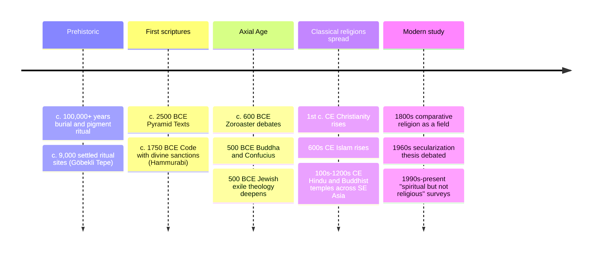

# 01 — What Is Religion — ศาสนาคืออะไร

> *"Religion is what someone does with their solitude." (William James, paraphrased)*

Religion (ศาสนา) is one of the oldest and most universal human activities, and yet surprisingly hard to define. Every definition either includes too much (is a football supporter "religious" about their team?) or too little (does Buddhism count if it doesn't worship a god?). This note (01) sets the comparative frame used by all the other religion notes in this folder: a working definition, a checklist of dimensions for describing any tradition neutrally, the major family groupings, and the current world map of who believes what.

An adult should care because religion is the single most commonly misunderstood driver of news, politics, neighbors, and business relationships on the planet. Roughly 84% of humans identify with some religion. Describing a tradition in its own terms (not your terms) is the literacy that makes travel, work, and citizenship legible.

---

## 1 | The Definition Problem

| Approach | Definition style | Example | Weakness |
|---|---|---|---|
| Substantive | Names the "stuff": gods, sacred beings | "Belief in a superhuman power" (Tylor, 1871) | Excludes non-theistic traditions (Theravāda Buddhism, some Daoism) |
| Functional | Names what it *does*: meaning, cohesion, orientation | "Instruments of ultimate concern" (Tillich); functional: binds society (Durkheim) | A flag or a fandom could count |
| Family resemblance | A cluster of overlapping features; no single essence | Most contemporary textbooks | Vague at the edges (deliberately) |

The working definition for this folder: **a religion is a tradition that organizes life around a perceived ultimate reality or dimension (sacred, transcendent, or liberating), expressed through shared beliefs, rituals, ethics, texts, community, and experience.** It is broad enough to include Buddhism and Shinto, narrow enough to exclude mere hobby.

## 2 | The Dimensions: how to describe any religion neutrally

Religion scholar Ninian Smart proposed seven "dimensions." When you want to understand a tradition without caricature, walk the list — this is the template the rest of this folder follows.

| # | Dimension | Thai | The question it answers | Example: Islam |
|---|---|---|---|---|
| 1 | Practical/ritual | พิธีกรรม | What do they do together? | Five daily prayers, Ramadan fasting |
| 2 | Experiential/emotional | ประสบการณ์ | What do members feel privately? | God-consciousness (taqwa), peace in submission |
| 3 | Narrative/mythic | ตำนาน/เรื่องเล่า | What stories carry the truth? | Quran creation narratives, Prophet's life (sira) |
| 4 | Doctrinal/philosophical | หลักคำสอน | What is the formal teaching? | Six Articles of Faith, tawhid (divine oneness) |
| 5 | Ethical/legal | ศีลธรรม/กฎหมาย | How should one live? | Sharia, halal/haram, zakat obligations |
| 6 | Social/institutional | สังคม/องค์กร | What community forms? | Ummah (world community), mosque, schools |
| 7 | Material | วัตถุธรรม | What do they build/use? | Calligraphy, mosques, no figurative sacred images |

> **How to use it:** when someone says "Religion X is violent" or "backward," run the dimensions. Usually one dimension (often narrative or social-political) is being generalized into the whole. The same trick works on your own tradition: what dimension do you actually practice?

## 3 | Major families and groupings

| Family | Core region of origin | Traditions in this folder | Shared "flavor" (not a rule) |
|---|---|---|---|
| Abrahamic | Middle East | [[04_Judaism]], [[02_Christianity]], [[03_Islam]], and partly [[09_Zoroastrianism]] | One God, revelation through prophets, scripture as center, linear history with a final judgment |
| Indian (dharmic) | South Asia | [[05_Hinduism]], [[06_Sikhism]] (Buddhism and Jainism taught elsewhere) | Karma, dharma, samsara (cycle of rebirth), liberation (moksha/nirvana) as aims |
| East Asian (Dao/dharma) | China, Japan | [[07_Chinese_Religious_Traditions]], [[08_Shinto_and_Japanese_Traditions]] | Harmony, ritual propriety, ancestor veneration, this-worldly focus + imported Buddhism |
| Indigenous/animist | Everywhere, pre-modern | [[10_Indigenous_and_Animist_Traditions]] | Living spirits in land, oral tradition, initiation, no separation of "religious" from daily life |
| Ancient (extinct/influential) | Mediterranean, Near East | [[09_Zoroastrianism]], [[15_Egyptian_Mythology]], [[16_Mesopotamian_Mythology]] | Recovered through archaeology; feed the mythologies and the Abrahamic family |

A classic question with no clean answer: is Buddhism "a religion or a philosophy"? The honest response: it has all seven Smart dimensions, so it behaves like a religion sociologically, and its non-theistic metaphysics makes a god-centered definition fail. The lesson generalizes: the category boundaries are the map, not the territory.

## 4 | Big numbers (current landscape)

Estimates use major demographic studies (Pew Research Center; World Religion Database). Adherent means someone who identifies with the tradition; practice varies widely inside every number.

| Tradition | Approx. adherents (mid-2020s) | Share of humanity | Fastest change |
|---|---|---|---|
| Christianity | ~2.5 billion | ~31% | Growing in Africa and Asia; declining in Europe |
| Islam | ~2.0 billion | ~25% | Fastest-growing major religion (demography + conversion) |
| Unaffiliated (atheist, agnostic, "nothing in particular") | ~1.2 billion | ~15% | High in East Asia, Europe, North America |
| Hinduism | ~1.3 billion | ~16% | Stable share; India's growth lifts absolute numbers |
| Buddhism | ~500 million | ~6% | Concentrated in Asia; Thai Theravāda is a major branch |
| Folk/indigenous religions | ~400 million | ~5% | Declining share; revival movements notable |
| Sikhism | ~30 million | ~0.35% | Diaspora growth (UK, Canada, US, Thailand) |
| Judaism | ~15–16 million | ~0.2% | Concentrated in Israel and North America |
| Zoroastrianism | ~60,000–120,000 | tiny | Parsi community in India, diaspora |

The single most misread fact: the unaffiliated are not mostly angry atheists — the global "nones" include huge numbers of people who keep folk practices, ancestor rites, or private spirituality. "Religious but not affiliated" is a real category; "religious and totally non-spiritual" is rarer than expected.

## 5 | Timeline of religion as a subject

## 6 | Key concepts to have vocabulary for

| Concept | Thai | Meaning you can rely on |
|---|---|---|
| Theism | การเชื่อว่าพระเจ้ามีอยู่ | Belief in a god or gods (mono: one; poly: many) |
| Non-theism | แบบไม่นับถือเทพเจ้า | Traditions without creator-god focus (Buddhism, Advaita-adjacent schools) |
| Pantheism | พระเจ้าคือธรรมชาติ | God = the universe itself (some Stoicism, parts of Advaita) |
| Animism | ความเชื่อเรื่องผีและวิญญาณ | Persons/sockets of power in animals, places, objects (Tylor's term; living among us: see [[10_Indigenous_and_Animist_Traditions]]) |
| Polytheism | นับถือเทพเจ้าหลายองค์ | Many distinct gods with roles (Greek, Norse, Hindu's deva layer) |
| Henotheism | บูชาเทพเจ้าองค์เดียวโดยไม่ปฏิเสธองค์อื่น | Worship one while admitting others exist (Vedic layer, some Israelite early practice) |
| Sacred/profane | สิ่งศักดิ์สิทธิ์/สิ่งสามัญ | The divide Eliade says is religion's signature move |
| Revelation | การไขแสดง | Truth disclosed from beyond: Abrahamic engine |
| Liberation/salvation | ความหลุดพ้น/ความรอด | The goal: from samsara (Indian) or from sin/death (Abrahamic) |
| Orthodoxy vs orthopraxy | ความเชื่อถูกต้อง vs การปฏิบัติถูกต้อง | Which matters more: right belief (most Abrahamic emphasis) or right practice (Confucian, Hindu ritual, Jewish halakhah) — useful lens for any tradition |

## 7 | Thai terminology

| Thai | English | Notes |
|---|---|---|
| ศาสนา | religion | from Sanskrit sāsana, "teaching/order" |
| ศาสนาเปรียบเทียบ | comparative religion | the field this note introduces |
| ความเชื่อ | belief; also folk belief | the everyday word — broader than "religion" |
| สิ่งศักดิ์สิทธิ์ | sacred things | spirit houses, amulets, powerful objects |
| ศรัทธา | faith, confident trust | Pali saddhā; in Buddhism the starting trust, not the finish |
| หลักธรรม | moral teaching | the ethical dimension above |
| พิธีกรรม | ritual | the practical dimension |
| นักบวช | monastic, holy person | generic for monks, priests, imams, pastors |
| ศาสดา | founder/prophet of a religion | the teacher a tradition follows |
| ลัทธิ | cult, sect, movement | sometimes pejorative in Thai press; neutral English: "school/movement" |
| มานุษยวิทยา | anthropology | discipline behind much religious studies |
| ทุนทางศาสนา | religious capital | Thai sociology term for temple networks as social assets |

## 8 | Why it matters today

- **Reading the news:** "the Middle East" or "the Taliban" or "Hindu nationalism" make no sense without knowing which dimension (doctrinal? political? social?) you're actually looking at, and who inside the tradition disagrees.
- **Work and travel:** a Thai business host, a Qatari partner, a Japanese client, and a Brazilian colleague all schedule life around a different religion's rhythm (Ramadan, Obon, Carnival, Sunday). Knowing the calendar is basic professional literacy.
- **Family conversations:** teenagers in Thailand increasingly ask "why do we go to the temple?" The comparative answer (what religion *is* for humans) is more durable than the authority answer ("because we always do"), and models respect for the non-religious at the same table.
- **Self-understanding:** the dimensions mirror back what *you* treat as ultimate. A person who never visits a temple but treats their nation or their sport with undoubting reverence is not outside the map — the map includes every human.

## 9 | Further reading

- *The World's Religions* by Huston Smith: the canonical respectful survey; this folder's spine for notes 01–11.
- *The World's Religions: Our Great Wisdom Traditions* (companion audio interviews with Smith): same material, easier to absorb.
- *God Is Not One* by Stephen Prothero: the counter-argument to perennialism; good for sharpening what "descriptive and respectful" is *not* (it doesn't mean "all the same").
- Pew Research Center, *The Global Religious Landscape* (pewresearch.org/religion): free, current numbers behind the table above.

## Related

- [[World Religions and Mythology - Overview|← World Religions and Mythology BOK Overview]]
- [[02_Christianity]], [[03_Islam]], [[04_Judaism]]: the Abrahamic family begins here
- [[11_Comparative_Themes]]: the themes across traditions, systematized
- [[12_What_Is_Mythology]]: the frame for the mythology half of the domain
- [[Social Studies/01 Religion/01_Buddhist_Principles|Buddhist Principles]]: the tradition Thai students learn first
- [[Social Studies/01 Religion/07_Religious_Tolerance_and_Interfaith|Religious Tolerance and Interfaith]]: Thai-school treatment of this chapter's civic side
- [[Philosophy/07_Medieval_Philosophy|Medieval Philosophy]]: faith and reason renegotiated in one tradition
