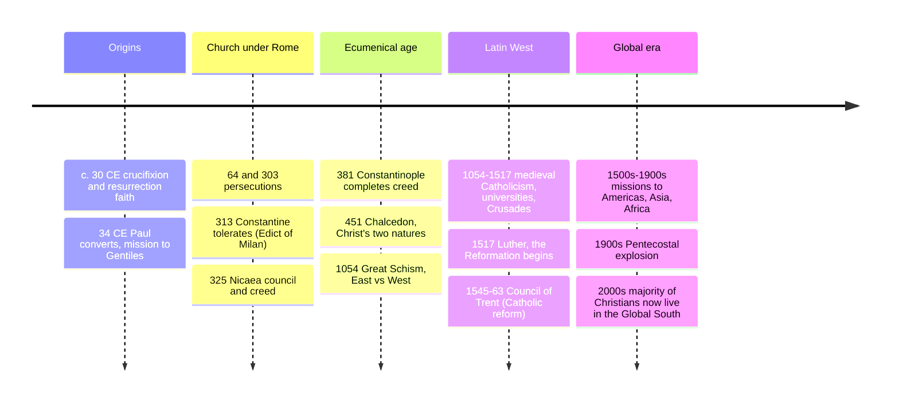

# 02 — Christianity — ศาสนาคริสต์

> *"I am the way and the truth and the life." (John 14:6)*

Christianity (ศาสนาคริสต์) is the world's largest religion, with roughly 2.5 billion adherents, about a third of humanity. It began as a small Jewish sect in Roman-occupied Judea in the 1st century CE and within four centuries was the official religion of the Roman Empire; within two more, it had shaped the entire Western world's calendars, laws, art, and universities. Its central claim is also its simplest to state and hardest to summarize: that in Jesus of Nazareth, God entered human history, died, rose again, and offered reconciliation and eternal life to anyone who trusts him.

An adult should care because the West's cultural grammar is Christian whether or not its people still believe: holidays, ethics ("the poor you will always have with you"), the very division of history into BC and AD. And in Thailand there is a small but old and influential Christian community (see §6), plus the denominational map is the key to reading anything from American politics to Nigerian news to Korean church culture.

---

## 1 | The person at the center: Jesus of Nazareth

| Fact | Christian view | Secular/historical view |
|---|---|---|
| Lived | c. 4 BCE – c. 30 CE, Galilee and Judea | A real Jewish teacher, broadly agreed by historians |
| Mission | Proclaimed the "Kingdom of God"; healed; forgave sinners | Same core, minus the supernatural frame |
| Death | Crucified by Rome; death was a sacrifice for human sin | Crucified by Rome, likely for sedition-adjacent claims |
| Resurrection | Bodily rose on the third day; the faith's foundation | Disciples sincerely *believed* they saw him risen |
| Identity | Son of God, second person of the Trinity (see §2) | A prophet (Islamic view); a sage (various secular views) |

The Gospels (the four biographies: Matthew, Mark, Luke, John) are the primary sources, written c. 65–100 CE by followers, not neutral reporters — like all ancient biography, they interpret while they record.

## 2 | Core beliefs

| Doctrine | Thai | Content |
|---|---|---|
| Trinity | ตรีเอกานุภาพ | One God in three persons: Father, Son (Christ), Holy Spirit. Not three gods; one being, three relations. |
| Incarnation | การเสด็จมาเป็นมนุษย์ | The eternal Son took on human flesh in Jesus ("God with us," Emmanuel) |
| Original sin | บาปกำเนิด | Humanity inherits a bent toward selfishness from Adam; all fall short (Augustine's reading, developed in §timeline) |
| Atonement | การไถ่บาป | Christ's death pays/remakes what sin broke; various theories (sacrifice, ransom, moral example) |
| Resurrection | การเป็นขึ้นมาจากความตาย | Bodily rising; victory over death; the guarantee of believers' own resurrection |
| Salvation by grace | ความรอดโดยพระคุณ | Recovered relationship with God as free gift through faith; a major Reform-era emphasis |
| Second coming | การเสด็จกลับมา | Christ returns to judge and renew creation; the "Kingdom come" of the Lord's Prayer |
| Afterlife | ชีวิตหลังความตาย | Eternal life with God, or separation from him; details (heaven, hell, purgatory) differ by branch |

## 3 | The book: the Bible

| Layer | Thai | Contents |
|---|---|---|
| Old Testament | พระธรรมเดิม | Essentially the Hebrew Bible: Law (Torah), Prophets, Writings; shared with Judaism (see [[04_Judaism]]) |
| New Testament | พระธรรมใหม่ | Gospels, Acts, Letters (Paul and others), Revelation; 27 books, written in Greek |
| Catholic extra | อธิกธรรม (Deuterocanon) | Catholics include 7 more OT books; Protestants do not — the main textual difference between branches |

The Bible is the best-selling book ever printed, translated into more than 3,000 languages (full Bible) and a further 3,000+ in part. It was read aloud more than silently for most of history; the idea that every individual should own and read one privately is historically recent (printing + Reformation).

## 4 | Timeline

## 5 | The three great branches (and the denominations inside them)

| Branch | Thai | Share of Christians | Signature | Authority |
|---|---|---|---|---|
| Catholic | คาทอลิก | ~50% | Sacraments (7), papacy, saints, Mary, tradition + scripture | Pope + bishops + scripture interpreted by Church |
| Orthodox | ออร์โธดอกซ์ | ~12% | Ancient liturgy, icons, no pope, national churches (Greek, Russian, Coptic) | Ecumenical councils + scripture + tradition |
| Protestant | โปรแตสแตนท์ | ~37% | "Solas" (scripture alone, faith alone, grace alone), no pope | Scripture as final authority; varied polities |

Protestant sub-families worth knowing: **Lutheran** (Reformation's first wave), **Reformed/Calvinist/Presbyterian** (sovereignty of God), **Anglican/Episcopal** (via media, English), **Baptist** (believer's baptism, local church autonomy), **Methodist** (Wesley, holiness and social witness), **Pentecostal/Charismatic** (speaking in tongues, fastest-growing branch globally), **Adventist, Jehovah's Witnesses, Latter-day Saints** (restorationist groups; some are counted separately from historic Christianity).

> **Catechism of the differences:** most Protestant/Catholic disputes are not about the core Creed (Nicene, §4) but about *authority* (who decides: pope, council, or each reader), *how many sacraments*, *what happens after death* (purgatory), and *how Mary and saints function*. Orthodox vs the rest turns heavily on the *Filioque* clause (does the Spirit proceed from the Father *and the Son*? West added it; East refused) plus papal claims.

## 6 | Christianity in Thailand and ASEAN

| Fact | Detail |
|---|---|
| Share of Thailand | ~1% (Roman Catholic ~0.4%, Protestant/evangelical ~0.6–0.8%) |
| History | Portuguese and French missionaries from the 1500s; strong 19th-c. Protestant work in the North and in education/medicine |
| Legacy | Holy Spirit University, Assumption and St. Louis schools, Bang Khun Kong and BNH hospital lineages; the 2000 Thai martyrs commemoration |
| ASEAN note | The Philippines is ~90% Catholic (largest Catholic nation after Brazil); Timor-Leste is overwhelmingly Catholic; South Vietnam and Korean megachurches are major centers |

Thai Catholics are largely in specific communities (e.g. historic Catholic villages along canals, migrant and hill-tribe churches in the North); Protestant growth in the 20th century was strong among northern and mountain peoples.

## 7 | Festivals and the year

| Festival | Thai | When | Content |
|---|---|---|---|
| Advent | ฤดูกาลรอคอย | 4 Sundays before Christmas | Preparation, hope |
| Christmas | วันคริสต์มาส | Dec 25 | Nativity, God becoming a child |
| Lent | ฤดูกาลเตรียมใจ | 40 days before Easter | Fasting, repentance |
| Easter | วันอีสเตอร์ | Spring (moves) | The Resurrection; Christianity's real center, not Christmas |
| Pentecost | วันเพ็นเทคอสต์ | 50 days after Easter | Birthday of the Church, the Holy Spirit's descent |

## 8 | Key concepts and vocabulary

| Term | Thai | Meaning |
|---|---|---|
| Christ / Messiah | พระคริสต์ / พระเมสสิยาห์ | "Anointed one"; Greek/Hebrew titles for Jesus |
| Gospel | ข่าวประเสริฐ / พระวรสาร | "Good news"; also the four books |
| Grace | พระคุณ | Unearned favor from God |
| Salvation | ความรอด | Rescue from sin and death; reconciliation with God |
| Sacrament / Ordinance | ศักดิ์สิทธิ์ / พิธีกรรม | A visible sign of invisible grace (Catholic/Orthodox); a memorial command (many Protestants) |
| Eucharist / Communion | ศีลมหาสนิท / พระกายาหารค่ำ | Bread and wine as Christ's body and blood |
| Baptism | บัพติศมา / ศีลล้างบาป | Initiation by water; infant or believer's depending on branch |
| Creed | หลักศรัทธา | The concise statement of belief (Apostles', Nicene) |
| Church | ศาสนจักร / คริสตจักร | The community, not the building, in formal usage |
| Prayer | การอธิษฐาน | Address to God; the Lord's Prayer is the model |
| Agape | ความรักต่อเพื่อนมนุษย์ | Self-giving love, the highest Greek love-word, taken up as the ethic |

## 9 | Why it matters today

- **Demography is destiny:** the "Christian world" is no longer European. Nigeria, Brazil, the Democratic Republic of Congo, the Philippines, and the United States hold the largest populations; the average Christian today is more likely to be a Global-South woman than a European man. Reading the news through "the West = Christendom" is obsolete.
- **Politics:** American elections, Brazilian legislation, South Korean civic life, and Polish public debates are all partly explained by which of the §5 families a population belongs to.
- **Ethics:** concepts like universal human dignity, the value of the individual, and care for the weak, now shared across Thai and global culture, were amplified by Christian teaching even where their origins are older.
- **Cultural literacy:** Bach, Dante, Michelangelo, Dostoevsky, and the Gregorian calendar assume this frame. [[World Literature/06_Shakespeare|Shakespeare]], [[World Literature/05_Dante_and_the_Medieval_World|Dante]], and [[World Literature/10_Russian_Literature|Russian literature]] all require it.

## 10 | Further reading

- *Mere Christianity* by C. S. Lewis: a layperson's case for the core, written by an intellectual convert.
- *Christianity: An Introduction* by Alister McGrath: scholarly and balanced across branches.
- *A History of Christianity* by Diarmaid MacCulloch: the sweeping narrative, fair to all sides.
- The four Gospels themselves (any readable translation, e.g. NIV or the World English Bible): the primary source, shorter than most novels.

## Related

- [[01_What_Is_Religion]]
- [[04_Judaism]]: Christianity's parent tradition
- [[03_Islam]]: the third Abrahamic faith; both honor Jesus, differently
- [[09_Zoroastrianism]]: heaven/hell and final judgment, ancient background to all three
- [[11_Comparative_Themes]]: golden rule, afterlife, pilgrimage across the family
- [[Social Studies/01 Religion/03_Other_Religions|Other Religions]]: the Thai-school treatment
- [[World Literature/05_Dante_and_the_Medieval_World|Dante]] and [[World Literature/06_Shakespeare|Shakespeare]]: the literary inheritance
