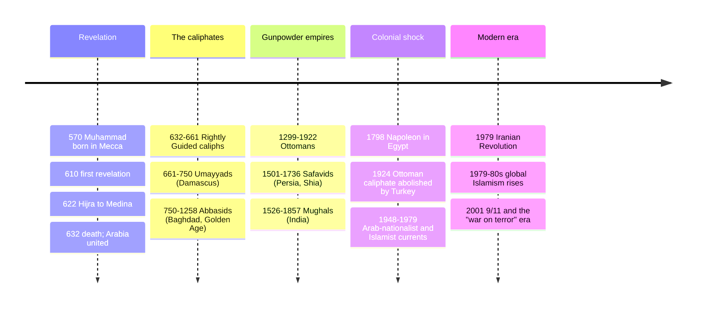

# 03 — Islam — ศาสนาอิสลาม

> *"To you your religion, and to me mine." (Quran 109:6)*

Islam (ศาสนาอิสลาม) is the world's second-largest religion and the fastest-growing, with about 2 billion adherents, a quarter of humanity. The word means "submission (to God)" and shares a root with *salaam*, peace; a follower is a Muslim (ผู้นับถือศาสนาอิสลาม), "one who submits." It arose in 7th-century Arabia through the Prophet Muhammad and within a century stretched from Spain to the borders of China. Its theological core is almost brutally simple: there is no god but God (Allah, อัลลอฮฺ), and Muhammad is God's messenger — no Trinity, no incarnations, no intermediaries, an absolute divine oneness (tawhid, โทวาฮิด) that shapes the law, the art (geometry and calligraphy instead of figures), and the daily rhythm of prayer.

An adult should care because Islam's calendar, food rules, and ethics shape the lives of a quarter of humanity, including Thailand's ~5% Muslim population and our ASEAN neighbors Indonesia and Malaysia (both Muslim-majority). Reading "Islam" as one monolith, or as automatically synonymous with extremism, is the most expensive misreading available in modern news.

---

## 1 | The Prophet Muhammad (c. 570–632 CE)

| Stage | Thai | Events |
|---|---|---|
| Early life | — | Orphaned; merchant in Mecca; known as *al-Amin* (the trustworthy); married Khadijah, his employer and first believer |
| First revelation | — | 610 CE, in the cave of Hira: "Read!" — the opening of what became the Quran |
| Meccan period | — | 13 years preaching monotheism and justice; persecution; the small community |
| Hijra | การฮิจเราะฮฺ | 622 CE: migration to Medina; becomes community leader; Hijri year 1, the Islamic calendar's epoch |
| Medina | — | Constitution of Medina (plural covenant); battles with Mecca; community consolidated |
| Return and death | — | 630: Mecca taken, idols cleared from the Kaaba; 632: Farewell Sermon ("no Arab has superiority over a non-Arab..."), death |

Muslims revere but do not worship Muhammad: he is the final in a chain of prophets that explicitly includes Adam, Noah, Abraham, Moses, and Jesus (see [[04_Judaism]] and [[02_Christianity]]). The sira (biography) and hadith (recorded sayings) shape practice alongside the Quran.

## 2 | Core beliefs: the Six Articles of Faith (อีมาน 6, หลักศรัทธา 6)

| # | Article | Thai | Content |
|---|---|---|---|
| 1 | Tawhid | ศรัทธาต่ออัลลอฮฺ | One God, absolute, incomparable, no partner, no offspring |
| 2 | Angels | ศรัทธาต่อมลาอิกะฮฺ | Created from light; Gabriel (Jibril) delivers revelation |
| 3 | Books | ศรัทธาต่อคัมภีร์ | Revealed scriptures: Torah, Psalms, Gospel, finally the Quran |
| 4 | Prophets | ศรัทธาต่อนบีและเราะสูล | Many, 124,000 in one tradition; Muhammad the "Seal of the Prophets" |
| 5 | Day of Judgment | ศรัทธาต่อวันกิยามะฮฺ | Resurrection, accounting, Paradise (Jannah) or the Fire |
| 6 | Qadar | ศรัทธาต่อกฎสรวงสวรรค์ | Divine decree/foreknowledge — paired with human responsibility |

## 3 | Practice: the Five Pillars (รุก่นอิสลาม 5, หลักปฏิบัติ 5)

| # | Pillar | Thai | Practice |
|---|---|---|---|
| 1 | Shahada | การปฏิญาณตน | The testimony: "There is no god but Allah; Muhammad is His messenger." Saying it with conviction makes one Muslim |
| 2 | Salat | การละหมาด | Five daily prayers facing Mecca; dawn, noon, afternoon, sunset, night; the spine of the day |
| 3 | Zakat | การจ่ายซากาต | Obligatory alms, ~2.5% of qualifying wealth annually; a right of the poor, not "charity" optional |
| 4 | Sawm | การถือศีลอด | Fasting dawn-to-sunset in Ramadan: no food, drink, marital relations; self-discipline and empathy |
| 5 | Hajj | การไปแสวงบุญ | Pilgrimage to Mecca once in a lifetime if able; see §7 |

## 4 | The Quran (อัลกุรอาน)

| Feature | Detail |
|---|---|
| Structure | 114 surahs (chapters), from 287 verses (longest) to 3 (shortest); roughly longest-to-shortest, not chronological |
| Language | Arabic; "the Quran" properly means the Arabic — translations are "interpretations of meaning" |
| Muslim view | Not authored by Muhammad: the literal speech of God dictated to Gabriel, recited over 23 years; inerrant |
| Compilation | Memorized by *huffaz* and written on scraps during his life; standardized under Caliph Uthman c. 650 CE |
| Style | Oratory, not narrative: rhythmic, direct-address, heavy on oaths, signs ("ayat"), and warning |
| Relationship to earlier scripture | Confirms the earlier books (Torah, Gospel) while holding that they were altered in transmission; the Quran is the correction and completion |

Companion sources: **hadith** (sayings/actions of the Prophet, graded by chain reliability) and **fiqh** (jurisprudential reasoning) fill in what the Quran doesn't legislate in detail — which is where most legal diversity between schools lives.

## 5 | Sunni and Shia (and beyond)

| | Sunni | Shia |
|---|---|---|
| Share | ~85–90% | ~10–15% |
| Root of split | After Muhammad's death (632): the community chose Abu Bakr as Caliph (leader) — succession by consensus | Muhammad designated his cousin and son-in-law Ali; leadership belongs to the Prophet's family (Ahl al-Bayt) |
| Key event | The "Rightly Guided" caliphs: Abu Bakr, Umar, Uthman, then Ali | Karbala (680): Ali's son Husayn martyred by the Umayyad caliph's army; the defining grief, commemorated at Ashura |
| Authority | Four legal schools (Hanafi, Maliki, Shafi, Hanbali); scholars consensus | Line of Imams (12 in the largest school); clerical hierarchy more formal |
| Today | Majority in most Muslim countries | Iran, Iraq majority; Bahrain, Lebanon, Azerbaijan, Yemen large populations; Thailand's Muslims are overwhelmingly Sunni |

Also present: **Ibadi** (Oman, Zanzibar), **Sufism** (the mystical dimension, not a sect — orders across both Sunni and Shia), **Ahmadiyya** (contested, Pakistan-origin missionary movement).

> **The Sunni-Shia split in one sentence:** it began as a political question (who should lead after Muhammad), became a theology of authority (who interprets God's law), and now marks identity across the Middle East, most violently in the 1979 revolution and the Iraq wars. Almost every headline about "Muslim conflict" is about this fault line or its manipulation by governments.

## 6 | Timeline

## 7 | Sharia, the sciences, and civilization

- **Sharia (ชะรีอะฮฺ)**: "the path to water" — God's guidance as discovered through the Quran, hadith, scholarly consensus, and analogy. Five legal categories for any act: obligatory, recommended, permissible, disliked, forbidden. Interpretation has always pluralized it (the four schools), which is why "Islamic law" is not one book.
- **The Golden Age (750–1258):** Abbasid Baghdad's House of Wisdom translated Greek, Persian, and Indian science; Muslim scholars (al-Khwarizmi, Ibn Sina/Avicenna, al-Razi, Ibn Rushd/Averroes) advanced algebra, optics, medicine, and philosophy (see [[Philosophy/08_Islamic_and_Jewish_Philosophy|Islamic and Jewish Philosophy]]). Europe's 12th-century renaissance ran through them.
- **Art and architecture:** aniconism (no sacred images of God or, in the strict view, figures) produced calligraphy, geometry, and the arabesque; the dome and minaret from Istanbul to Isfahan; the Alhambra, the Taj Mahal (see [[Social Studies/01 Religion/05_Religious_Art_and_Architecture|Religious Art and Architecture]]).

## 8 | Festivals and the year

| Festival | Thai | When | Content |
|---|---|---|---|
| Ramadan | เดือนเราะมะฎอน | 9th Hijri month | Month-long dawn-to-sunset fast; night prayers; the Quran's revelation month |
| Eid al-Fitr | อีดิลฟิตรี | 1 Shawwal | "Festival of breaking the fast": charity, feast, forgiveness |
| Hajj | การแสวงบุญ | 12th Hijri month | Pilgrimage days at Mecca, Arafat, Mina; see [[11_Comparative_Themes]] |
| Eid al-Adha | อีดิลอัฎฮา | 10 Dhul Hijjah | "Festival of sacrifice": Ibrahim's willingness; the animal sacrifice shared with the poor |
| Friday | วันศุกร์ | weekly | Congregational midday prayer (salat al-jumu'ah) with sermon (khutbah) |

## 9 | Islam in Thailand and ASEAN

| Fact | Detail |
|---|---|
| Thailand | ~4–5% Muslim: Malay-Muslim communities in the deep South (Patani legacy; the insurgency there is about citizenship as much as religion), Central Thai converts (many Cham descent), and Hindu-adjacent Siamese-Indian communities |
| History | Ayutthaya-era Persian and Malay trading communities; the Chakri kings' relationship with Malay sultanates; Islam officially recognized like other religions |
| ASEAN | Indonesia: world's largest Muslim population (~87%); Malaysia: ~63%, Islam is the federation's official religion; Brunei: sultanate with Islamic law; Singapore: ~15% Muslim, Malay community |
| Cultural touch | Thai Muslim (Buri) communities; halal certification is a household word across Thailand's economy |

## 10 | Key concepts and vocabulary

| Term | Thai | Meaning |
|---|---|---|
| Allah | อัลลอฮฺ | The Arabic word for God; Arab Christians use it too |
| Muslim | มุสลิม | One who submits; an adherent |
| Ummah | อุมมะฮฺ | The worldwide community of believers |
| Halal / haram | ฮาลาล / ฮารอม | Permissible / forbidden; the food usage is the visible tip of a legal iceberg |
| Djihad / jihad | การต่อสู้ในทางพระเจ้า | "Struggle": the greater is internal (against one's own lower self); the legal/military sense is the lesser and was regulated by classical law |
| Sunnah | ซุนนะฮฺ | The Prophet's exemplary practice; model for conduct |
| Hadith | ฮะดีษ | Recorded sayings, graded for reliability |
| Imam | อีหม่าม | Prayer leader; also (Shia) a divinely guided successor |
| Caliph | กาหลิบ | Successor/political leader of the ummah |
| Madhhab | สำนักกฎหมาย | School of jurisprudence (the pluralism inside Sunni Islam) |
| Taqwa | ตักวา | God-consciousness; the inner state the pillars build |
| Kaaba | บัยตุลลอฮฺ / กะอฺบะฮฺ | The cubic sanctuary in Mecca's mosque, direction (qibla) of all prayer |

## 11 | Why it matters today

- **ASEAN reality:** 240+ million of ASEAN's people are Muslim. Thai trade, diplomacy, halal industry, and border provinces run on Islamic norms daily.
- **News literacy:** Sunni/Shia, Sufi/Salafi, state-Islamist/militant-Islamist: the categories explain why "Islam" never appears in headlines as just one thing. Turkey, Iran, Indonesia, and Saudi Arabia are all Muslim-majority and almost nothing else alike.
- **Neighbors:** in Thailand, knowing that a Malay colleague's Friday prayer, Ramadan fast, or halal plate is pillar-number-three, not a personality quirk, is the exact tolerance the school strand teaches (see [[Social Studies/01 Religion/07_Religious_Tolerance_and_Interfaith|Religious Tolerance]]).
- **Civilizational debt:** algebra, algorithm, chemistry, hospital, pharmacy, and the numerals we type with arrived through the Islamic world (see [[09_Zoroastrianism]] for another Persian-layer contribution).

## 12 | Further reading

- *The World's Religions* (Huston Smith), Islam chapter: the respectful insider's frame.
- *Islam* by Karen Armstrong: concise, sympathetic, historically grounded.
- *No god but God* by Reza Aslan: the early history and the reform debates inside the tradition.
- *Muhammad: His Life Based on the Earliest Sources* by Martin Lings: the classic narrative biography, from a Muslim perspective.

## Related

- [[01_What_Is_Religion]]
- [[04_Judaism]] and [[02_Christianity]]: the shared Abrahamic family tree
- [[05_Hinduism]]: India's two great communities, interaction and tension
- [[09_Zoroastrianism]]: Persian ideas absorbed into Islamic civilization
- [[11_Comparative_Themes]]: fasting and pilgrimage compared
- [[Social Studies/01 Religion/03_Other_Religions|Other Religions]]: the Thai-school treatment
- [[Philosophy/08_Islamic_and_Jewish_Philosophy|Islamic and Jewish Philosophy]]: the Golden Age
