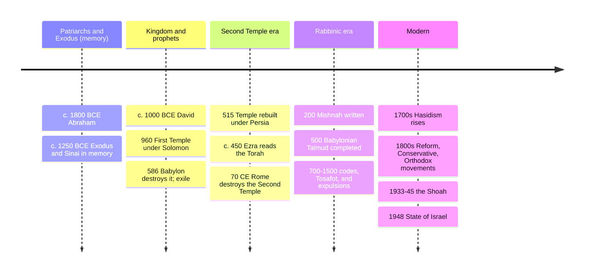

# 04 — Judaism — ศาสนายูดาห์

> *"Do not do to your neighbor what is hateful to you; that is the whole Torah. The rest is commentary. Go and learn it." (Talmud, Shabbat 31a, Hillel)**

Judaism (ศาสนายูดาห์) is the smallest of the three great Abrahamic faiths by numbers (~15–16 million) and the eldest by far: a covenant (พันธสัญญา) tradition tracing its story to Abraham (c. 1800 BCE by internal reckoning) and its religion's constitution to the Exodus and Sinai (c. 1300–1200 BCE in memory). It contributed ideas the rest of the world now treats as common sense: one God, history with a moral direction, the sabbath as a right of every worker, and the ethic of "the stranger" written into law 46 times. Christianity and Islam are both, in part, arguments with and about Judaism — which is why the family (notes 02, 03, 04) really has to be read from this end.

An adult should care because the Jewish people, little more than 0.2% of humanity, have punched far above proportion in scripture (the Hebrew Bible is most of the Christian Old Testament), thought (from Spinoza to Marx to Einstein to Arendt), and, unfortunately, news: Israel/Palestine cannot be read without knowing what the land, the covenant, and the diaspora mean to believers and non-believers alike.

---

## 1 | The covenant story in one table

| Episode | Hebrew name | What happened | Theological meaning |
|---|---|---|---|
| Abraham called | אַבְרָהָם / อับราฮัม | God tells one man to leave Ur for Canaan: "your descendants will be a great nation" | Election begins: a family, not an empire, carries the purpose |
| Exodus | יְצִיאַת מִצְרַיִם / ออกจากอียิปต์ | Moses (โมเสส) leads Israelites out of Egyptian slavery, through the sea | God hears the oppressed; liberation is the founding memory |
| Sinai | מַתַּן תּוֹרָה / รับธรรมบัญญัติ | Torah given through Moses; covenant ratified | Israel accepts the yoke of commandments; religion becomes law and peoplehood |
| Land and Temple | הַבַּיִת הַשֵּׁנִי / พระวิหาร | Kingdom under David/Solomon; First Temple in Jerusalem | Center of sacrificial worship; kings judged by prophecy |
| Exile and return | גָּלוּת / กาลุด | Babylon destroys the Temple (586 BCE); exile; return under Persia | Prophets reinterpret: catastrophe is discipline, hope survives |
| Second Temple destroyed | — | Rome burns the Temple in 70 CE | Rabbinic Judaism replaces sacrifice with prayer, study, and mitzvot |
| Diaspora | — | 2,000 years dispersed; persecution, expulsion, pogroms, Shoah (ฮอโลคอสต์) | The tradition becomes portable: text replaces land as home |
| 1948 and after | מְדִינַת יִשְׂרָאֵล | State of Israel founded; Holocaust's shadow; ~45% of Jews now live there | The political-religious tension that dominates today's news |

## 2 | Core beliefs

| Concept | Hebrew/Thai | Content |
|---|---|---|
| Shema (เชมา) | "Hear, O Israel: the LORD our God, the LORD is one" | Monotheism's tightest statement; recited morning and evening, on the doorposts (mezuzah), at death |
| Covenant (บริบท/พันธสัญญา) | בְּרִית / brit | Mutual obligation: God keeps faith with Israel; Israel keeps the commandments |
| Chosenness | being the chosen people (เลือกแล้ว) | Not privilege but responsibility: "a light unto the nations" — burden of more commandments, not racial claim |
| Torah (ธรรมบัญญัติ) | תּוֹרָה | The five books and, extended, the whole teaching; study is itself worship |
| Mitzvot (บทบัญญัติ) | 613 commandments | The daily practice: ethics and ritual together, no split between "religious" and "moral" |
| Tikkun olam (การซ่อมโลก) | "repair of the world" | Human partnership in completing creation; basis of Jewish social ethics |
| Olam haba / afterlife | โลกหน้า | This-world emphasis; afterlife is believed but underdefined (resurrection in some creeds, vague in others) |
| Messiah (พระเมสสิยาห์) | มศีฆ | A coming anointed king who gathers Israel and brings world peace — *not yet come*, which is precisely the difference with Christianity (see [[02_Christianity]] §1) |

## 3 | The Tanakh and the oral law

| Layer | Thai | Contents |
|---|---|---|
| Torah (Pentateuch) | โตราะ / เบญจบรรณ | Genesis, Exodus, Leviticus, Numbers, Deuteronomy — the constitution |
| Nevi'im | ผู้เผยพระวจนะ | Prophets: Joshua–Kings (former), Isaiah, Jeremiah, the Twelve (latter) |
| Ketuvim | บทเพลง/ธรรมราชนิพนธ์ | Psalms, Proverbs, Job, Ruth, Ecclesiastes, Esther, Chronicles |
| = Tanakh | ทานัค | The Hebrew Bible; Christians call most of it the Old Testament — same books, different order and reading |
| Mishnah | มิชนาห์ | c. 200 CE: first written code of the Oral Law (six orders: agriculture, festivals, family law, civil law, Temple, purity) |
| Gemara + Mishnah = Talmud | ทาลมุด | c. 500 CE (Babylonian): centuries of rabbinic debate on everything; the Jewish mind's home |
| Midrash and commentaries | — | Story-based exegesis (Rashi, Maimonides' *Guide* see [[Philosophy/08_Islamic_and_Jewish_Philosophy]]) |

> **The structure of Jewish authority:** Scripture → Oral Law (Talmud) → codes (Maimonides, then the *Shulchan Arukh*) → responsa (rabbis answering new cases) → community custom. Law is argued, not just obeyed; a page of Talmud is literally formatted with the debate on all sides.

## 4 | Timeline

## 5 | The branches today (mainly a diaspora phenomenon)

| Movement | Thai | Share (global/US) | Signature |
|---|---|---|---|
| Orthodox (รวม Haredi/ultra-Orthodox) | ออร์ทอดอกซ์ | ~20%/smaller | Full halakha as binding divine law; separate genders in prayer |
| Conservative | คอนเซอร์เวทีฟ | ~15%/US-heavy | Halakha binding but evolves historically |
| Reform | รีฟอร์ม | ~25%/largest in US | Ethics over ritual law; egalitarian; vernacular prayer; "progressive revelation" |
| Reconstructionist, Humanist | — | small | Judaism as evolving civilization; culture without theism |
| Hasidic (within Orthodox) | ฮาซีดิก | visible minorities | Ecstatic prayer, Rebbe dynasties, dress (Shtreimel), joy as command |

Inside all of them: Shabbat tables, Passover seders, and bar/bat mitzvah remain the identity glue even for barely-practicing families — Judaism is as much a peoplehood (an extended family with shared memory) as a belief system.

## 6 | Life-cycle and home practice

| Moment | Hebrew | What happens |
|---|---|---|
| Birth/covenant | บრიท มilah (circumcision, 8th day; girls welcomed) | The body marked with covenant |
| Coming of age | บาร์/มีตซ์วาห์ | Age 13/12; public reading; responsibility for mitzvot begins |
| Marriage |Kiddushin/กิดดูชิน | Canopy (chuppah), seven blessings, glass broken: joy bound to memory of the Temple |
| Death and mourning | ชีวา / Aveilut | Burial quick and simple; seven days (shivah) of home mourning; the kaddish (the mourning prayer) recited for eleven months |
| Home rituals | — | Mezuzah on doorposts, kashrut (kosher dietary law: no pork/shellfish, meat-milk separation), Shabbat candles Friday dusk |

## 7 | Festivals: the year in cycles

| Festival | Thai | When | Content |
|---|---|---|---|
| Shabbat | ชาบัต | every Friday sunset–Saturday dusk | The weekly sabbath: rest as theology (God rested; slaves deserve rest); the most important "holiday" |
| Rosh Hashanah | ปีใหม่ยิว | Tishrei 1–2 | New Year: introspection, shofar (เขาแกะ) blast, sweet foods |
| Yom Kippur | วันไถ่บาป | Tishrei 10 | Day of Atonement: 25-hour fast, confessional liturgy, "sealed for life" |
| Sukkot | เพิง | Tishrei 15 | Booths: wilderness years, harvest joy |
| Passover | ปัสกา / เปซาห์ | Nisan 15 | The seder meal retelling the Exodus; leaven removed — freedom's birthday |
| Shavuot | — | 7 weeks after Passover | Torah given at Sinai; harvest firstfruits |
| Hanukkah | — | Kislev/Tevet | 1st c. BCE Temple rededicated after Maccabean revolt; lights for 8 nights (a minor festival made major by diaspora history) |

Note how the calendar *re-lives* history: Exodus isn't remembered, it's undergone at the seder. The afterlife is comparatively muted; the sanctification of time is the main event (see [[11_Comparative_Themes]]).

## 8 | Key concepts and vocabulary

| Term | Thai | Meaning |
|---|---|---|
| YHWH (ยาห์เวห์) | the four-letter Name | God's personal name revealed at the Exodus ("I am who I am"); too holy to pronounce — Jews say Adonai, scholars write Yahweh, translations print LORD |
| Elohim | พระเจ้า | The generic Hebrew word for God |
| Rabbi (รับไบ) | teacher | Ordained interpreter of law; since 70 CE the authority figure |
| Halakha (ฮาลาคา) | "the way one walks" | Jewish law in full: the practical system of 613 mitzvot |
| Kashrut (การกินแบบคอเชอร์) | dietary law | "Kosher": what and how to eat |
| Teshuvah (การกลับใจ) | return/repentance | The path back during the High Holidays |
| Tikkun olam | การซ่อมแซมโลก | Repair the world; social action as covenant |
| Shoah (โฮโลคอสต์) | "the catastrophe" | The Holocaust; the 20th century's defining wound and the engine of both Israel's founding and post-war Jewish ethics |
| Antisemitism | การเกลียดชังยิว | Prejudice against Jews; the oldest continuing prejudice in the West (see [[11_Comparative_Themes]] on persecution) |
| Zionism | ลัทธิไซออน | The 19th-c. movement for Jewish self-determination in the ancestral land; contested, plural, and inseparable from today's news |

## 9 | Why it matters today

- **Scripture's source code:** the Hebrew Bible is the Old Testament of every church, the Quran's referenced "People of the Book," and the literary well for names and plots from Milton to *The Ten Commandments* to *Game of Thrones*. [[World Literature/02_Ancient_Epics|Ancient epics]] and [[16_Mesopotamian_Mythology|Mesopotamian flood myth]] meet here too: Genesis answers Babylon.
- **Reading Israel/Palestine:** the conflict is national/territorial at its root, but its languages (covenant, return, exile, chosenness, justice) are Jewish texts in political clothes. Both sides quote the same book.
- **The sabbath idea:** one day in seven when *nobody* works — no employer may take the worker's rest away — is Judaism's gift to global labor rights. In burnout culture, it's radical policy.
- **Ethics of the stranger:** "you were strangers in Egypt" grounds a whole moral philosophy of empathy through memory; the prophetic insistence that ritual without justice is an insult to God is the template all later reform movements copy.

## 10 | Further reading

- *The Jewish Study Bible* (eds. Berlin & Brettler): the Tanakh with essays; no better single entry point.
- *To Heal a Fractured World* by Rabbi Jonathan Sacks: Judaism as a public ethic, readable anywhere.
- *A History of the Jewish People* (ed. Ben-Sasson): the full sweep, scholarly.
- *The Chumash* (ArtScroll or any interlinear): the Torah itself with classic commentary.

*\* attribution traditional; phrasing is the Talmudic Hillel story.*

## Related

- [[01_What_Is_Religion]]
- [[02_Christianity]]: the sect that left and universalized Judaism's book
- [[03_Islam]]: the third cousin who claims the same Abraham
- [[09_Zoroastrianism]]: Persian contact during exile — where did Satan, heaven/hell, and resurrection ideas sharpen?
- [[16_Mesopotamian_Mythology]]: Genesis in dialogue with Babylon
- [[11_Comparative_Themes]]: law, covenant, afterlife across the family
- [[Social Studies/04 History/12_Ancient_Civilizations|Ancient Civilizations]]: the historical Near East frame
- [[Philosophy/08_Islamic_and_Jewish_Philosophy|Islamic and Jewish Philosophy]]: Maimonides and the medieval Jewish mind
