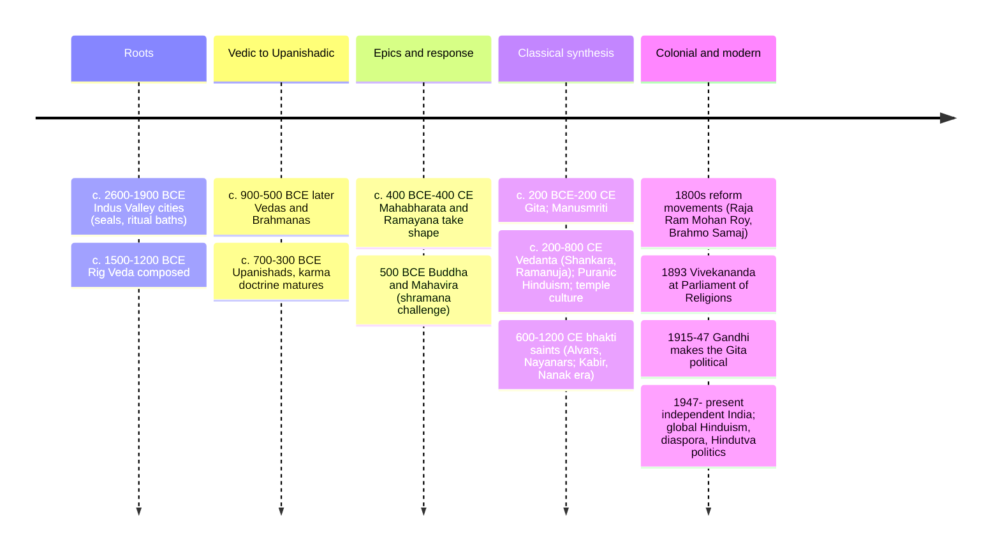

# 05 — Hinduism — ศาสนาฮินดู

> *"As different streams having different sources of their waters all become one sea, even so different paths lead to the same goal." (Vivekananda, paraphrasing a Hindu image)**

Hinduism (ศาสนาฮินดู) is the world's third-largest religion (~1.3 billion) and arguably its oldest living major tradition: a synthesis ("sanatana dharma," the eternal order, สนาตนธรรม) that grew over 3,500+ years in the Indian subcontinent from Vedic ritual, Upanishadic philosophy, epic devotion, and dozens of local and tribal traditions. Unusually, it has no single founder, no single scripture, and no central authority — a family of ways rather than one way. To a Thai reader this is not distant: Thai royal ceremony, the krathin/wihan iconography, Brahma (พระพรหม) shrines, the Ramayana (see [[17_Hindu_Mythology]]), and karma/dharma vocabulary (กรรม, ธรรม) all entered Thai culture through Hindu-Buddhist streams, and the Reamker/Ramakien tradition makes Hindu gods household names in Thailand.

An adult should care because a quarter of humanity, and India, the world's most populous country, live inside this frame; because the ideas of karma, reincarnation, and dharma are global common property now; and because Hindu nationalism is a major political force that the tradition's own pluralists contest.

---

## 1 | The name and the shape

| Question | Honest answer |
|---|---|
| Where does "Hindu" come from? | Persian: "people beyond the Indus (Sindhu) river" — a geography, not originally a theology. Adherents often say sanatana dharma or simply "dharma" |
| Founder? | None. A converging stream: Indus Valley residues, Indo-Aryan Vedic religion, shramana (wandering-ascetic) movements, tribal and devotional cults |
| One god or many? | Both and neither: most schools hold one ultimate reality (Brahman) that polytheistic devotion is a valid approach to; some schools are strictly monotheistic, some monotheistic-in-reverse (all gods are one), some non-theistic |
| Central authority? | None: no pope, no single council. Gurus, lineages (sampradaya), and regional custom decide — which is why "what Hinduism believes" needs a school-by-school map |

## 2 | Core concepts: the dharmic engine

These four ideas power most of the tradition (and, borrowed, much of the world — see [[Social Studies/01 Religion/01_Buddhist_Principles|Buddhist Principles]] for their shared ground with Buddhism):

| Concept | Thai | Meaning | Consequence |
|---|---|---|---|
| Brahman (พรหมมัน/พรหมัน) | the ultimate reality | The infinite, formless ground of being; not "a god" but what gods are faces of | The philosophical monotheism/monism beneath the polytheism |
| Atman (อาตมัน) | the self/soul | The innermost self; in Advaita Vedanta, identical with Brahman ("tat tvam asi," thou art that) | Liberation = realizing what you already are |
| Samsara (สังสารวัฏ) | cycle of rebirth | Existence as beginningless round of birth-death-rebirth | The problem all Indian traditions share (with Buddhism; Jainism too) |
| Karma (กรรม) | action and its fruit | Intentional acts condition future experience across lives | Ethics built into the structure of reality — no external judge needed |
| Dharma (ธรรม/ธรรมะ) | duty, order, law, righteousness | The right way to live one's role, stage of life, and nature; cosmic and moral order (Thai: ธรรม) | The reason caste duties, king's duty (ทศพิธราชธรรม), and personal ethics are one word |
| Moksha (โมกขธรรม/ความหลุดพ้น) | liberation | Release from samsara; merging/union/realization, depending on school | The fourth aim of life, above pleasure, success, duty |
| Purushartha (เป้าประสงค์ชีวิต 4) | the four aims | Kama (pleasure), artha (prosperity), dharma (duty), moksha (liberation) | A this-worldly realism: pleasure and wealth are legitimate within dharma |
| Avatar (อวตาร) | descent | A deity (esp. Vishnu) embodied in the world | Gods walk among humans: the epic layer's engine (see [[17_Hindu_Mythology]]) |
| Yoga / marga (ทางปฏิบัติ) | the paths | Four classic ways to liberation: knowledge (jnana), devotion (bhakti), action (karma), meditation (raja) | The pluralism is a feature: different temperaments need different doors |
| Darshana (สำนักปรัชญา) | the six schools | Nyaya, Vaisheshika, Samkhya, Yoga, Mimamsa, Vedanta | Formal philosophy inside the religion; Vedanta (esp. Shankara, Ramanuja) dominates today |

## 3 | The scriptures: shruti and smriti

| Class | Thai | Means | Texts | Authority |
|---|---|---|---|---|
| Shruti | สิ่งที่ฟังมา | "that which is heard" — revealed, authorless | Vedas (4: Rig, Sama, Yajur, Atharva); Brahmanas; Aranyakas; **Upanishads** (the philosophical end — Vedanta = "end of Veda") | Highest, but mostly studied, not recited by laypeople |
| Smriti | สิ่งที่จำมา | "that which is remembered" — composed, human | Epics (Ramayana, Mahabharata incl. **Bhagavad Gita**); Dharmashastras (law codes); Puranas (mythology encyclopedias); bhakti poetry | What most Hindus actually read, hear, and live by |

> **The Bhagavad Gita** (ภควัตคีตา, "Song of the Lord," c. 2nd c. BCE): 700 verses inside the Mahabharata. Prince Arjuna, facing battle against his kin, asks Krishna (god as charioteer) what duty means. The answer fuses the four yogas: act with discipline without attachment to fruit (karma yoga), with knowledge (jnana), and with devotion (bhakti). It is Hinduism's single most influential text — Gandhi's "dictionary," and the gateway book for Western readers (see [[World Literature/17_Asian_Literature|Asian Literature]]).

## 4 | Timeline

## 5 | The deity families: trimurti and the great Goddess

Most practice centers on a personal god (ishta-devata) with a chosen form. The major faces:

| Deity | Thai | Role | Icon / signature | Known for |
|---|---|---|---|---|
| Brahma (พระพรหม) | the creator | Creator in the trimurti | Four heads, four Vedas; rare temples | The trimurti (ตรีมูรติ: creation-preservation-dissolution) frame; worship is rare compared to Vishnu/Shiva |
| Vishnu (พระนารายณ์) | the preserver | Preserver; descends as avatars | Blue, four arms, conch/discus/mace/lotus, reclining on serpent Ananta | Ten avatars (dashavatara): esp. Rama ([[17_Hindu_Mythology]]), Krishna (the Gita), and (contested) Buddha |
| Shiva (พระอิศวร/พระศิวะ) | the destroyer/transformer | Dissolver and ascetic; Nataraja the cosmic dancer | Trident, drum, flame, third eye, bull Nandi, lingam | Yoga; the erotic-ascetic paradox; destruction as renewal |
| Devi / Shakti (พระแม่/ศักติ) | the Goddess | The active power of the divine; supreme in Shaktism | Many forms: Parvati/Durga/Kali/Lakshmi/Sarasvati | Feminine divine as energy; festivals Durga Puja (Calcutta), Navaratri |
| Ganesha (พระพิฆเนศ) | remover of obstacles | Elephant-head son of Shiva-Parvati | Elephant head, big belly, broken tusk | Prayed first at any venture; globally beloved; huge in Thai art and business culture |
| Hanuman (หนุมาน) | the monkey devotee | Ramayana's super-devotee of Rama | Mountain-carrying leaps | Strength+devotion; the bridge to the [[ภาษาไทย/วรรณคดีและวรรณกรรม/สมัยรัตนโกสินทร์/01_รามเกียรติ์|Ramakien]] (note 17) |

Pairs and family: Vishnu consorts with Lakshmi (fortune); Shiva with Parvati (and their sons Ganesha, Murugan/Kartikeya); the Goddess also reigns alone (Kali, Durga). The mythology's full narrative layer is note 17.

## 6 | Schools and currents

| Stream | Thai | Signature | Practice today |
|---|---|---|---|
| Vaishnavism |ลัทธิไวษณพ | Vishnu/K Rama/Krishna supreme; temples (Tirupati), avatars | Largest devotional family |
| Shaivism | ไศวะ | Shiva supreme; lingam, ash, tantra; Nayanar hymns | Second largest |
| Shaktism | ศักติ | Goddess supreme; tantra, Kali/Durga | Bengal, Assam, temple traditions |
| Smartism | สมาร์ตะ | Adi Shankara's equivalence: five gods, one Brahman; home worship | The "non-sectarian" Brahmin default |
| Vedanta (philosophy) | เวทานตะ | Advaita (non-dual, Shankara); Vishishtadvaita (Ramanuja); Dvaita (dualist, Madhva) | The philosophical grammar taught worldwide |
| Bhakti movements | ภักติ | Saint-poets (Kabir, Mirabai, Tukaram, Chaitanya): devotion over caste and ritual | The emotional core of lived Hinduism |
| Modern reform | — | Brahmo, Arya Samaj, Ramakrishna Mission, Gandhi, Vivekananda | Social reform, Vedanta societies abroad |

## 7 | Practice: the lived religion

| Setting | What happens |
|---|---|
| Home | Small shrine; daily lamp, incense, water, food offered (puja, บูชา); mantras; fasting days |
| Temple (mandir) | Darshana: seeing the consecrated image; bell, flower, prasad (blessed food); no weekly service requirement — come anytime |
| Priest | Performs puja on behalf; individual prayer doesn't need clergy (a structural difference from Abrahamic models) |
| Life stages (ashrama) | Student, householder, retiree, renunciant — dharma varies by stage |
| Pilgrimage | Varanasi, the Ganga, the Kumbh Mela (the largest human gathering on Earth), Tirupati, Badrinath; compare in [[11_Comparative_Themes]] |
| Festivals | Diwali (lights), Holi (colors), Navaratri/Durga Puja, Ganesh Chaturthi, Raksha Bandhan, Krishna's Janmashtami; plus regional new years — a festival per lunar day somewhere in India |
| Death | Cremation (Antyesti); ashes in rivers; the Ganga at Varanasi as liberation-portal; annual shraddha rites for ancestors (parallel to Thai, see [[10_Indigenous_and_Animist_Traditions]]) |

## 8 | Caste and its reform

The varna/jati system (Brahmin-priest, Kshatriya-warrior, Vaishya-trader, Shudra-servant, plus those outside: Dalits, "untouchables") is in the Dharmashastras, justified by karma/dharma language, and embedded in marriage and occupation for centuries. The reform arc is inseparable from the modern story: bhakti saints denied it, Gandhi called untouchability a sin and took the name "Harijan," and B. R. Ambedkar — the Dalit jurist who wrote India's constitution — outlawed untouchability (1950), abolished it legally, and finally left Hinduism for Buddhism (Thai readers: this is a major reason Navayana Buddhism exists in India today). Affirmative action and caste politics remain live in India and among the diaspora. Honest description means not whitewashing this; the tradition itself argues about it constantly.

## 9 | Hinduism's Thai footprint

| Thai form | Hindu origin |
|---|---|
| พระพรหม Four-Faced Brahma at Bangkok's Erawan | Vedic creator, now a pan-Thai wish-granting shrine |
| The Devas / เทวา and Three Great Gods (พระตรีมูรติ) in royal ceremony | Trimurti and deva hierarchy via Khmer and Ayutthaya reception |
| Wachirayan/Wihan ceiling devas and kinnaree | Puranic beings |
| ทศพิธราชธรรม (the king's ten duties) | The dharmaraja ideal |
| รามเกียรติ์, อิเหนา's Javanese-Hindu layer | The epics via Khmer-Javanese transmission (note 17) |
| "กรรม," "ธรรม," "โมกษะ," "นรก/สวรรค์" vocabulary | Dharma/karma vocabulary through Pali-Sanskrit |
| Loy Krathong and Songkran's Brahminical layers | Festival syncretism |

The Triyamway (trimurti) shrine, Ganesha statues in Thai banks, and the Brahmin priests at the royal ploughing ceremony show the religion's Thai afterlife is as art-and-ritual, not as belief — exactly what Hinduism's image-friendly polytheism made possible.

## 10 | Key concepts and vocabulary

| Term | Thai | Meaning |
|---|---|---|
| Puja (บูชา) | worship with offerings | The core act of devotion, home and temple |
| Darshana (ทัศนะ) | seeing (the deity) | Receiving the god's gaze — why image (murti) consecration matters |
| Murti (รูปเคารพ) | sacred image | The installed form God consents to inhabit |
| Mantra (มนตร์) | sound-form of power | Sacred syllables (Om; Gayatri); Om = Brahman in sound |
| Samskara (sanskar) | rite of passage | Namings, thread ceremony, marriage, cremation |
| Guru (ครู) | dispeller of darkness | The teacher who transmits; the authority vacuum's fill-in |
| Ashram (รมณี/สำนัก) | hermitage/stage | Renunciation's institution; a life-stage too |
| Sutra (สูตร) | thread | Aphoristic text form (Vedanta Sutra — note how Pali/Sanskrit cross here with the Buddha's "suttas") |
| Dharma (ธรรม) | duty/order/law | The tradition's master word, shared with Buddhism |
| Ahimsa (อหิงสา) | non-harm | The ethic that yields vegetarianism for many Hindus and Gandhi's method |

## 11 | Why it matters today

- **India's rise:** reading Indian politics, science ambition, and diaspora culture requires the dharmic frame — and the Hindu-nationalist (Hindutva) project that reinterprets it as identity politics, opposed by Gandhi's and Ambedkar's heirs.
- **Global inheritance:** yoga, meditation, Ayurveda, the Bhagavad Gita on every bookstore shelf, "karma" in every language: Hinduism is the most exported of traditions.
- **The Thai bridge:** the Ramakien (note 17) means the Ramayana's Rama, Sita, Hanuman are Thai-literary characters too; knowing the Hindu original adds a whole new dimension to the ภาษาไทย classroom text.
- **Pluralism's laboratory:** one religion holding monotheism, polytheism, and atheism (Charvaka school!) in one family is a standing argument that "religion" doesn't require a single creed — directly useful for interfaith living in Thailand.

## 12 | Further reading

- *The Bhagavad Gita* translated by Eknath Easwaran: readable, warm, with the classic commentary.
- *The World's Religions* (Huston Smith), Hinduism chapter: the philosopher's tour.
- *Hinduism: A Very Short Introduction* by Kim Knott: current, balanced, India-centered.
- *The Bedstream of the Ganges* or R. K. Narayan's *The Ramayana Stories*: the epics as literature (companion to note 17).

*\* attribution traditional; phrasing is Vivekananda's 1893 Parliament speech imagery.*

## Related

- [[01_What_Is_Religion]]
- [[06_Sikhism]]: born out of Hindu-Muslim (Sufi) dialogue in India
- [[17_Hindu_Mythology]]: the Ramayana and Mahabharata narrative layer — this note's sibling
- [[ภาษาไทย/วรรณคดีและวรรณกรรม/สมัยรัตนโกสินทร์/01_รามเกียรติ์|รามเกียรติ์]]: the Thai Ramakien (the gold bridge)
- [[Social Studies/01 Religion/01_Buddhist_Principles|Buddhist Principles]]: the shared karma/dharma/samsara ground
- [[Philosophy/20_Eastern_Philosophy_Beyond_Thailand|Eastern Philosophy Beyond Thailand]]: Vedanta among the Eastern schools
- [[World Literature/02_Ancient_Epics|Ancient Epics]] and [[World Literature/17_Asian_Literature|Asian Literature]]: the epics as world literature
- [[11_Comparative_Themes]]: avatar and incarnation compared
