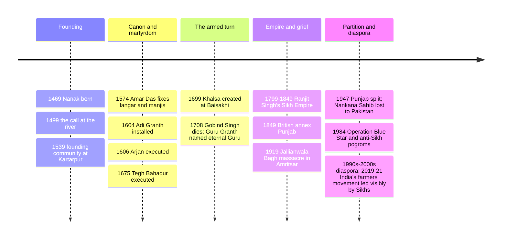

# 06 — Sikhism — ศาสนาซิกข์

> *"There is no Hindu, there is no Muslim." (attributed to Guru Nanak's first utterance after his mystical disappearance, c. 1499)**

Sikhism (ศาสนาซิกข์) is the world's fifth-largest organized religion (~30 million) and one of the youngest major faiths: founded by Guru Nanak (1469–1539) in Punjab at the end of the 15th century, in direct dialogue between Hindu bhakti devotion and Sufi Islam (see [[05_Hinduism]] and [[03_Islam]]). "Sikh" means disciple (ศิษย์); a Sikh is a learner who follows the ten Gurus. What makes Sikhism remarkable among world religions is how deliberately it fuses the contemplative and the combative: the same community worships with daily meditation and runs a free kitchen (langar) serving 100,000+ people a day anywhere in the world — and also carries the martial tradition of the Khalsa, the "pure ones," established by the tenth Guru. The Five Ks (see §6) make Sikhs one of the most visually distinctive religious communities on Earth, and the golden Harmandir Sahib (the "Golden Temple") in Amritsar is one of the century's most recognized houses of worship.

An adult should care because Sikhs are disproportionately visible in every country they've settled, including Thailand, where the Punjabi-Sikh community is long established in trade (see §8). Globally, Sikhs are prominent in transport, hospitality, agriculture, philanthropy, and the armed forces (the British and Indian armies); and the 1984 anti-Sikh violence and the Punjab question still shape South Asian politics.

---

## 1 | The ten Gurus ( guru 10 องค์)

| # | Guru | Dates | Why remembered |
|---|---|---|---|
| 1 | Nanak | 1469–1539 | Founder; the mystic call ("no Hindu, no Muslim"); travels (zamindawari) debating Mecca and Haridwar; householder, not ascetic |
| 2 | Angad | 1504–1552 | Standardized Gurmukhi script; collected Nanak's hymns |
| 3 | Amar Das | 1479–1574 | Organized manji (dioceses); condemned sati and purdah; instituted langar as equality-practice |
| 4 | Ram Das | 1534–1581 | Founded the pool-city that became Amritsar |
| 5 | Arjan | 1563–1606 | Compiled the Adi Granth (1604); built Harmandir Sahib with four doors ("open to all"); executed by Mughal emperor Jahangir — the first Sikh martyr (shahid) |
| 6 | Hargobind | 1595–1644 | Militarized the community: miri-piri (temporal and spiritual authority); built the first temple-of-the-sold saint (Akal Takht across from Harmandir) |
| 7 | Har Rai / 8 | Har Krishan | 1630–1661 / 1656–1664 | Preservation; child-guru who died defending the poor in Delhi |
| 9 | Tegh Bahadur | 1621–1675 | Executed in Delhi for defending Kashmiri Hindus' right to worship — Sikhism's public statement that a faith must protect other faiths |
| 10 | Gobind Singh | 1666–1708 | Created the Khalsa (1699); the Five Ks; declared scripture the eternal Guru |

## 2 | Guru Nanak and the founding insight

| Episode | Content | Meaning |
|---|---|---|
| Born | 1469 in Talwandi (now Nankana Sahib, Pakistan), Hindu family of officials | Would work as a storekeeper before the call |
| The river vision | c. 1499, vanished while bathing in the Vyen/Beas; found again speaking strange words | "There is no Hindu, no Muslim" — the One transcends labels |
| Life after | Spoke at Mecca (refused to face the Kaaba "which faces nothing"), at Hindu centers; worked with his hands at Kartarpur | God is not in directions or labels; honest labor and sharing are worship |
| Death | c. 1539; Hindu and Muslim disciples quarreled over funeral rites | The tradition's whole social ethic in one legend: the quarrel ended, in the legend, when both communities found flowers covering the body; each buried its own flowers |

## 3 | Core beliefs

| Concept | Punjabi/Thai | Content |
|---|---|---|
| Ik Onkar (เอกโองการ) | "One Being/one God" | Strict, formless monotheism (nirgun); the Mool Mantar opens the scripture. God is also with-form (sargun) in grace |
| Naam (นาม) | remembrance of the Name | Meditation on God's name (naam simran) as the central practice; the tongue's work |
| Guru (ครู/พระคุร) | the guide | The word means "dispeller of darkness." The Gurus are the channel; grace (nadar, เมตตา) is God's free gift, not earned |
| Haumai (ความ ego) | "I-ness" | The one real sin: ego, self-centeredness; the cure is the Name and seva |
| Sevā (การรับใช้) | selfless service | Serving humanity is literally serving God: the theological engine of langar |
| Vand shako (แบ่งปัน) | share your earnings | Honest living (kirat karni) + sharing = the householder's three-pillar dharma (naam, kirat, vand) |
| No renunciation | อยู่ครองเรือน | Sikh saints are householders; monkery rejected. Woman's full equality taught and practiced (no sati, women lead worship; see §2 Amar Das, §4) |
| Afterlife | โลกหน้า / the merging | Souls progress through cycles until the Name ends the round and merges with God like a drop into the ocean — liberation (mukti) as reunion |
| Rejection of rituals | ปฏิเสธพิธีกรรม | Empty rites refused: image worship, caste rites, fasting for show, pilgrimages to graves, the sacred thread; the Guru's "pilgrimage" is the pure heart |
| Equality | ความเสมอภาค 3 ชั้น | Before God, in the langar (everyone sits as equals), in the sangat (congregation elects/decides) |

## 4 | The scripture as living Guru (คุรุ ครานถ์ สาฮิบ)

- **Guru Granth Sahib** (1604 as Adi Granth by Guru Arjan; declared eternal Guru by Gobind Singh in 1708): 1,430 pages, ~5,700 hymns set to 31 classical and regional ragas (musical modes). It is installed in every gurdwara on a canopy-throne, "read" not merely recited, and treated as a living presence (waked, fanned, put to sleep at night).
- **Content:** hymns of the first five Gurus plus 36 other contributors — Hindu bhagats (Kabir, Namdev, Ravidas — a Dalit saint!) and Muslim Sufi-leaning bhagats (Sheikh Farid). Sikhism's holiest book quotes Hindu and Muslim saints as authoritative: the interfaith statement written into its spine (see [[11_Comparative_Themes]]).
- **Language:** "Sadh" — a composite medieval North Indian language, in Gurmukhi script.
- **The second scripture:** the Dasam Granth (tenth Guru's compositions) is respected, with debates over its authorship scope; not equal in status to the Guru Granth.

## 5 | The Khalsa ( Khalสา) and the Five Ks

In 1699 at Baisakhi, Guru Gobind Singh called for volunteers to give their heads for the faith, then revealed the "five beloved ones" (Panj Pyare) and instituted a baptism (Khande di pahul) by which anyone — regardless of caste, sex, or birth — could become a Singh ("lion," for all male Sikhs) or Kaur ("princess," for all female Sikhs), abolishing the surnames that mark caste and gender status. The initiated Khalsa wear the Five Ks (5 ก):

| # | Kakaar | Thai | Form | Meaning |
|---|---|---|---|---|
| 1 | Kesh | ผมไม่ตัด | Uncut hair, worn under turban | Accept God's will/natural form; the visible crown of sovereignty |
| 2 | Kangha | หวี | Small comb | Cleanliness and discipline: order the chaos of the uncut |
| 3 | Kara | กำไลเหล็ก | Steel/iron bracelet | Restraint: a reminder on the wrist that acts must be worthy |
| 4 | Kirpan | กริปัง (ดาบเล็ก) | Small sheathed sword | The duty to defend the weak; saint-soldier's license |
| 5 | Kachhera | กัจเฉรา | Cotton short undergarment | Chasteness, self-control; mobility for service and fight |

The turban (dastar) isn't one of the Five Ks but is their practical crown and the Sikh public identity; the saffron-blue "Nishan Sahib" flag flies at every gurdwara.

## 6 | Institutions and practice

| Institution | Thai | Function |
|---|---|---|
| Gurdwara (คุทวารา / ธรรมศาลา) | "door to the Guru" | Any building with the Guru Granth; open to all faiths; the Golden Temple's four doors literally |
| Langar (โรงทาน) | free community kitchen | Vegetarian (so no one is excluded by any food law) meals served by all, to all, seated on the floor — equality practiced daily; at the Golden Temple up to 100,000 people fed per day |
| Sangat (ชุมนุมศาสนิก) | congregation | The gathered community; decisions by consensus (panth, the "way/path") |
| Akal Takht (บัลลังก์นิรันดร์) | the temporal throne | The Guru's seat across from Harmandir for the community's worldly decisions; the five Takhts = authority centers |
| Daswandh / Kirat | ทศางค์/การหารายได้ชอบ | Ten percent of honest earnings to the community; the funding engine |
| Rehras / Kirtan | บทสวดประจำวัน | Morning-evening nitnem prayers; kirtan = hymn-singing as the worship form |
| Amrit Sanchar | พิธีรับน้ำอมฤต | The Khalsa baptism ceremony (§5) |

## 7 | Timeline

## 8 | Sikhism in Thailand

| Fact | Detail |
|---|---|
| Community | Small (~2,000–3,000) Punjabi-origin; arrived mainly late 19th–early 20th c. via the Burma/India trade |
| Institutions | Siri Guru Das Singh Sabha gurdwara (Bangkok, Pahonyothin road area; and older Song Khwae/Pahurat sites) serves langar and hosts the Vaisakhi festival; a gurdwara in Chiang Mai |
| Visibility | Sikhs prominent in Bangkok's textiles and trade (Pahurat "Little India" neighborhood); the turbaned Sikh trader is a long-standing Bangkok image; the community is well integrated with Thai society |
| State recognition | Like other religions, registered and treated as one of the faiths in Thai education (see [[Social Studies/01 Religion/03_Other_Religions|Other Religions]]) |

## 9 | Key concepts and vocabulary

| Term | Thai | Meaning |
|---|---|---|
| Guru (พระคุร) | teacher, weight that sinks into the heart | The human guides and, from 1708, the scripture itself |
| Waheguru (วาเฮคุร) | "Wonder-Lord" | The Sikh name for God; the mantra of prayer |
| Shabad (สทฺท) | hymn/word | The Guru's word in sung form; meditation on the Shabad |
| Simran (ซิมรณ) | remembrance | Repeating/meditating on the Name |
| Kirat karni | การทำงานซื่อสัตย์ | Honest labor as worship |
| Chardi kala (จardi คาลา) | ever-high spirits | The Sikh virtue: cheerfulness under any trial; the greeting |
| Sant-sipahi (นักบวช-ทหาร) | saint-soldier | The ideal: Arjan's devotion + Hargobind's sword |
| Miri-piri (อำนาจสองอย่าง) | temporal-spiritual | The twin authority of the community |
| Panth (พันธ์) | the way/people | The Sikh commonwealth; Sarbat Khalsa = all-hands council |
| Kaur (เการ์) | princess | The surname for every Sikh woman: status by design |
| Singh (สิงห์) | lion | The surname for every Sikh man |
| Baisakhi (ไวสาขี) | April 13-14 festival | New year + Khalsa founding; the big gurdwara day |
| Jorh mela / mela (เทศกาลชุมนุม) | fair | Community gatherings at takhts and shrines of martyrs (shahidi) |

## 10 | Why it matters today

- **The world's most practical equality experiment:** every visitor to a langar, any day, eats beside a billionaire and a sweeper — a 500-year running demonstration of caste- and class-abolition-in-practice that most political movements never attempted.
- **Defense of others' faith:** the ninth Guru was executed for protecting *Hindus'* right to worship. Sikhism's own constitutional memory is that a religion which lets another's persecution stand has failed — an idea in daily news still.
- **Diaspora literacy:** the 30 million are disproportionately in the professions, militaries (British, Indian, and historically Thai Punjabi officers), and philanthropy; in the 2020s the Punjab-diaspora network was decisive in India's farmers' protests and in Canadian and UK politics.
- **1984 is not ancient:** the assassination of Indira Gandhi by Sikh bodyguards and the anti-Sikh pogroms that followed, plus the Punjab insurgency, remain open wounds; understanding "the Sikh question" is required for India headlines.

## 11 | Further reading

- *A History of the Sikhs* by Khushwant Singh (Oxford): the narrative from Nanak to the present, by a Sikh novelist-historian.
- *The Promised Kingdom: Sikh Reflections on the Messianic Age* by Nikky-Guninder Kaur Singh: the theology, accessible.
- *The Sikh Religion* by Max Arthur Macauliffe (1909, still in print): the classic translation-and-commentary introduction.
- Any langar visit (gurdwara, open daily, no invitation needed): the fastest primary source in world religion.

*\* attribution traditional; the saying appears in the janamsakhi (life-story) literature.*

## Related

- [[05_Hinduism]] and [[03_Islam]]: the two streams Nanak stood between and beyond
- [[11_Comparative_Themes]]: equality and the golden rule; langar vs pilgrimage vs zakat
- [[Social Studies/01 Religion/03_Other_Religions|Other Religions]]: the Thai-school treatment
- [[Philosophy/20_Eastern_Philosophy_Beyond_Thailand|Eastern Philosophy Beyond Thailand]]: Nanak in the Indian-philosophy map
- [[World Literature/17_Asian_Literature|Asian Literature]]: the bhagat hymns as poetry
