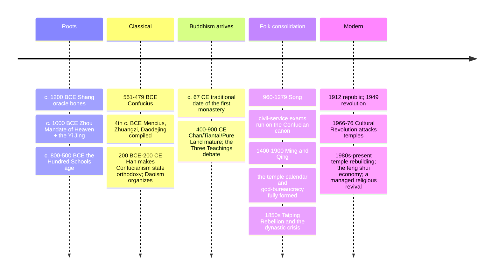

# 07 — Chinese Religious Traditions — ศาสนาประเพณีจีน

> *"The Master said: to devote oneself to what is right for the people — respect the spirits, but keep them at a distance. This may be called wisdom." (Analects 6.22)**

Chinese religious tradition (ศาสนาประเพณีจีน) is the world's great example of a civilization organizing its spiritual life around three overlapping streams rather than one exclusive truth: **Confucianism** (ขงจื๊อ, lǐ — ritual propriety, social harmony, ancestor reverence), **Daoism** (เต๋า, dào — the Way of nature, wu-wei, immortality arts), and **Chinese folk religion** (ผีเทพบรรพบุรุษ — the living practice of gods, ancestors, feng shui, and festival calendars that most Chinese actually do). Buddhism arrived from India around the 1st century CE and became the fourth leg (see [[Social Studies/01 Religion/01_Buddhist_Principles]]). The genius of the system is that "which religion are you?" makes no sense inside it: a Chinese person may be Confucian at the office, Daoist at the body, Buddhist at the funeral, and a folk-religionist at the temple, without contradiction. The "three teachings" (ซานเจียว, 三教) is the native frame for that pluralism.

An adult should care because millions of Thais have Chinese ancestry and every Thai city has a Chinatown whose gods (เจ้าแม่ทับทิม Mazu, เจ้าแม่กวนอิม Guanyin, เทพเจ้าแห่งความมั่งคั่ง the wealth gods) stand on Thai street corners; Chinese New Year, Qingming, and the Vegetarian (กินเจ) festival are now national events; and understanding China's official atheism plus its resurgent temple economy requires seeing the folk layer, not just the West.

---

## 1 | The shape: three teachings, one field

| Stream | Thai | Founder/text | Domain of life | Afterlife focus |
|---|---|---|---|---|
| Confucianism (ลัทธิขงจื๊อ) | Confucius 孔子 (551–479 BCE); the Analects (话) and Five Classics | Society and self: family, state, ritual, education, the gentleman (君子) | Ancestor veneration; spirits respected, not investigated |
| Daoism (ลัทธิเต๋า) | Laozi 老子 (semi-legendary); the Daodejing and Zhuangzi | Nature and the body: wu-wei, health, longevity, harmony, alchemy | Transcendent masters (仙人); an inner immortality |
| Chinese folk religion | No founder; the temple calendar | The gods and the household: local deities, ancestors, feng shui, fortune | A mirrored bureaucracy of heaven; rebirth influenced by feng shui |
| Buddhism (from India) | via the Silk Road, c. 1st c. CE | Chan/Zen (禅), Pure Land (净土) | Death, compassion, the mind |

> **Key idea: "orthopraxy over orthodoxy" (see [[01_What_Is_Religion]] §6).** Chinese tradition asks *what is the right ritual, at the right time, for the right relationship*, not *do you believe the correct creed*. That is why conversion barely exists — you're born into the calendar, and you can honor more gods than one.

## 2 | Confucianism: heaven, ritual, the humane person

**Context:** Confucius lived in the Spring-and-Autumn era's collapse (the Zhou order disintegrating, c. 500 BCE) and answered chaos by proposing that social order grows from cultivated personal relationships (see [[Philosophy/20_Eastern_Philosophy_Beyond_Thailand|Eastern Philosophy]] for its comparative place).

| Concept | Chinese/Thai | Meaning |
|---|---|---|
| Ren (仁, ใจมนุษย์ / ความเมตตา) | The cardinal virtue: humaneness, benevolence, "co-humanity" |
| Li (礼, พิธีธรรม/ความเหมาะสม) | Ritual propriety: the etiquette that trains virtue and orders society (also Confucius' answer to disorder) |
| Xiao (孝, กตัญญู/ความกตัญญูรู้คุณบิดามารดา) | Filial piety: the root of all virtue; the reason ancestor rites matter |
| The Five Relationships (ห้าความสัมพันธ์) | ruler-subject, father-son, husband-wife, elder-younger, friend-friend: reciprocal duties, each side owing the other |
| Junzi (君子, สุภาพชน/ผู้ดีมีคุณธรรม) | The exemplary person: moral aristocracy, replacing birth aristocracy |
| Tian (天, ฟ้า/สวรรค์) | Heaven as moral order that legitimates rulers: the "Mandate of Heaven" (โองการสวรรค์) justifying dynastic change |
| The Golden Rule, negative form | "Do not do unto others what you would not want done to you" (Analects 15.24) — Confucius' own summary; see [[11_Comparative_Themes]] |

- **The texts:** the Analects (คำสอนขงจื๊อ); the Four Books (Great Learning, Doctrine of the Mean, the Analects, Mencius) plus the Five Classics (incl. the Spring & Autumn Annals and Book of Changes). Mencius (371–289 BCE) argued human nature is inherently good; Xunzi argued it must be trained — the classic pair.
- **As a religion?** State Confucianism had temples, a cosmic mandate, and ancestor rites; scholars debate whether that's "religion" or "civil religion." It's the best test case for the §1 frame in [[01_What_Is_Religion]].

## 3 | Daoism: the Way, wu-wei, the immortals

| Concept | Chinese/Thai | Meaning |
|---|---|---|
| Dao (道, เต๋า/มรรคา) | The Way: the nameless source and pattern of everything; "the Dao that can be named is not the eternal Dao" |
| Wu-wei (无为, การไม่ฝืน/การกระทำโดยไม่กระทำ) | Non-coercive action: act like water, flowing around; the art of effective effortlessness |
| Yin-yang (หยิน-หยาง) | Complementary opposites generating all change (the bagua of the Yi Jing) |
| De (德, คุณ/พลังคุณธรรม) | The power/virtue the Dao radiates through a person who doesn't force |
| Qi (ชี่/ปราณ) | Vital energy; the basis of medicine, feng shui, and the inner-alchemy practices |
| The Three Treasures (สามสมบัติ) | Compassion, frugality, humility ("not daring to be first") — the Daodejing's ethics |
| Immortals (เซียน, the transcendent ones) | Adepts who refined body/spirit into longevity; the search for physical/spiritual immortality |

- **The texts:** Daodejing (คัมภีร์เต๋าเต็กเก็ง, ~5,000 characters, the most translated book after the Bible); Zhuangzi (จวงจื๊อ) — parables, butterfly dreams, the useless tree, skepticism as freedom.
- **Two Daoisms:** philosophical (Laozi/Zhuangzi as wisdom) and religious (organized since the 2nd c. CE: a priesthood, liturgy, talismans, alchemy, temple gods like the Jade Emperor and the Three Pure Ones).
- **Feng shui (ฮวงจุ้ย), Chinese medicine, tai chi, and qigong** all run on Daoist cosmology — the most exportable layer of the whole tradition.

## 4 | Chinese folk religion: the heaven mirrored on earth

| Feature | Detail |
|---|---|
| The pantheon | Local gods (Tu Di Gong, เทพเจ้าที่ดิน, at the threshold of every village/business), city gods, the Jade Emperor as heaven's bureaucrat, Kitchen God reporting the household's year |
| The bureaucracy metaphor | Heaven is a government: gods have ranks, can be promoted, demoted, or sued; petitioners burn reports, spirit money, and IDs |
| Ancestors | The dead are family members with ongoing needs: Qingming grave tending, Zhongyuan (ghost) offerings, food, and paper money at home altars |
| Divination | Fortune sticks, I Ching (易经) coins, moon-calendar auspicious days; the calendar itself is a ritual instrument |
| Festivals | New Year (Spring Festival), Lantern Festival, Qingming (เช็งเม้ง, ancestor day), Dragon Boat (แข่งขันเรือมังกร), Zhongyuan (สารทจีน, ghost festival), Mid-Autumn (ไหว้พระจันทร์) |
| Salvation groups | Syncretist sects (Yiguandao etc.) that fuse all three teachings — a big presence in modern Thai Chinese practice |

**Major gods a Thai person meets often:** Guanyin (พระโพธิสัตว์เจ้าแม่กวนอิม, the compassion bodhisattva, popular across all communities), Mazu (เจ้าแม่ทับทิม, sea goddess of sailors), Guangong (เทพเจ้ากวนอู, god of loyalty, wealth, and police/triads alike), the Caishen (เทพเจ้าแห่งความมั่งคั่ง, wealth gods), and the Kitchen God (เทพเจ้าเตาไฟ).

## 5 | Timeline

## 6 | Chinese religion in Thailand (คนไทยเชื้อสายจีน)

| Layer | Thai evidence |
|---|---|
| Population | Roughly 40% of Thais claim partial Chinese ancestry; Teochew, Hokkien, Hakka, Cantonese, Hainanese communities |
| Institutions | Thonburi's and Bangkok's old shrines (Leng Buai Ia, a 17th-c. Mazu/เจ้าแม่ทับทิม shrine in Talad Noi; Kuan Yim's many shrines), the network of "ศาลเจ้า" (Chinese-style shrines, distinct from Thai spirit houses, see [[10_Indigenous_and_Animist_Traditions]]) |
| Festivals now national | Trut Chinese New Year, the Phuket Vegetarian Festival (กินเจ, from Hokkien practice), the Qingming/เช็งเม้ง family grave visits, the Mid-Autumn moon offerings |
| Religion-as-family | Thai-Chinese families keep both the Buddhist temple and the Chinese ancestor/god altars — the "born into a calendar" principle in action |
| Politics and economy | Chinese temple networks underwrite chambers of commerce, the red-envelope economy, and the "merit culture" of Thai capitalism |

## 7 | Key concepts and vocabulary

| Term | Thai/Chinese | Meaning |
|---|---|---|
| Tian (天) | ฟ้า/สวรรค์ | Heaven as moral force and cosmic order |
| Shen (神) | เทพ/สิ่งศักดิ์สิทธิ์ | Spirits, gods, the numinous powers |
| Zu (祖) | บรรพบุรุษ | Ancestors; the family's continuing spiritual members |
| Xiao (孝) | ความกตัญญู | Filial piety; ancestor rites' engine |
| Jing qi shen (精气神) | three treasures of body | Essence, energy, spirit — the Daoist inner alchemy's materials |
| Huang (皇) | จักรพรรดิ/ฮ่องเต้ | Emperor; heaven's son (天子/โอรสสวรรค์) |
| Shehui (社会) | สังคม | The word for "society" — from the village earth-altar (社) assembly (会): religion is the social |
| Miao vs Si (庙/寺) | ศาลเจ้า/วัด | Folk-god temple vs (Buddhist) monastery — the two "houses" of Thai-Chinese religion |
| Ji (祭) | การเซ่นไหว้ | Sacrifice/offering to ancestors and gods |

## 8 | Why it matters today

- **Reading China:** the official "atheist" state presides over the world's largest religious revivals: temple-building, fortune apps, tai-chi, and Confucius Institutes abroad. The Communist Party's problem with folk religion (Falun Gong 1999; unregistered house churches) is a *sovereignty* problem — who organizes the sacred — not simple unbelief.
- **ASEAN and Thai business:** feng shui, the lunar calendar, and ancestor rites are the soft infrastructure of Thai-Chinese commerce; a negotiation in Yaowarat runs on red envelopes and auspicious dates.
- **The pluralism model:** "three teachings, one field" is the most durable example of living inside multiple traditions without war — directly useful to Thai religious coexistence (see [[Social Studies/01 Religion/07_Religious_Tolerance_and_Interfaith|Religious Tolerance]]).
- **Philosophy export:** wu-wei and Confucian role-ethics are live topics in Western virtue-ethics and "slow" philosophy — see [[Philosophy/06_Hellenistic_Philosophy|Stoicism]]'s parallels on what you can control.

## 9 | Further reading

- *Confucius: Analects* translated by Edward Slingerland (Hackett): readable, with commentary.
- *Dao De Jing* in Roger Ames & David Hall's translation (philosophical) or Stephen Mitchell's (poetic), then the *Zhuangzi* in Brook Ziporyn's version.
- *Religion in Chinese Society* by Tu Wei-ming: the three-teachings frame from a leading Confucian scholar.
- *Ancestral Leaves: A Family Journey Through Chinese Revolution* by Jie Gao: folk practice and ancestor rites seen from inside one family; pairs with the Thai-Chinese shrine studies in Richard O'Connor's *A Cultural History of the Thai Chinese*.

*\* attribution per the received Analects translation.*

## Related

- [[01_What_Is_Religion]]: the orthopraxy test case
- [[08_Shinto_and_Japanese_Traditions]]: China's neighbor, the other "born into a calendar" tradition
- [[Philosophy/20_Eastern_Philosophy_Beyond_Thailand|Eastern Philosophy Beyond Thailand]]: Confucius and Laozi in the philosophical map
- [[18_East_Asian_Mythology]]: Journey to the West, the Kojiki — the mythic layer next door
- [[10_Indigenous_and_Animist_Traditions]]: ancestor spirits and the living pantheon
- [[Social Studies/02 Civics/02_Thai_Culture_and_Traditions|Thai Culture and Traditions]]: the Thai-Chinese festival calendar
- [[11_Comparative_Themes]]: the golden rule; heaven and judgment compared
