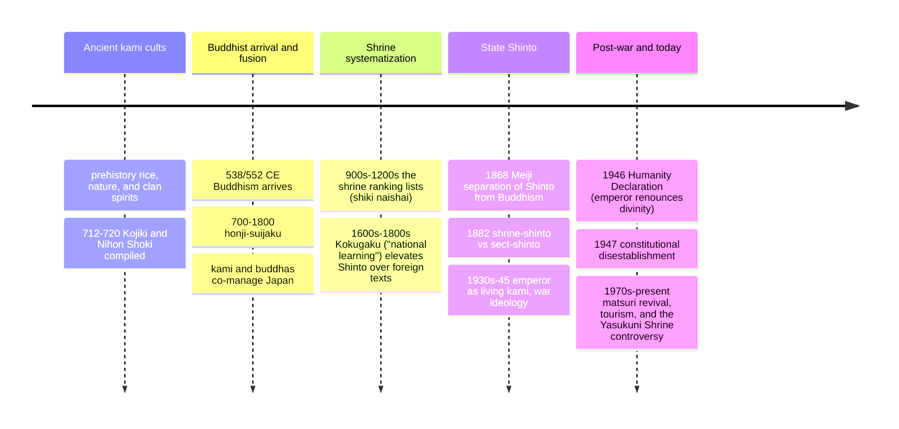

# 08 — Shinto and Japanese Traditions — ชินโตและประเพณีญี่ปุ่น

> *"Heaven and earth produce all things, and the kami preside." (Kojiki preface, adapted)**

Shinto (ชินโต, "Way of the Kami," 神道) is Japan's native, un-founded religion: a layered practice of reverence for the kami (เทพเจ้า/spirits) that inhabit and animate the world, from a spectacular mountain or an ancient tree to a revered ancestor, a local stream, or the dead of a family. There is no founder, no scripture that legislates, no sermon — instead shrines (神社, jinja) with their torii gates, purification, festival matsuri, and the great public rituals once tied to the imperial line. Japan's religious life is famously layered: most people are registered at a Shinto shrine (for birth and New Year), have a Buddhist family altar (for death and ancestors), and live by Confucian social norms (for etiquette) — the pattern called "Shinto for life, Buddhism for death." It is the clearest example after China of religion as calendar and belonging rather than belief (see [[07_Chinese_Religious_Traditions]] and [[01_What_Is_Religion]] §6).

An adult should care because Japan is a top travel, business, and cultural partner; because the anime, films, and games millions of Thais consume are dense with kami, torii, and Shinto imagery (Miyazaki's *Spirited Away*, see [[20_Mythology_in_Modern_Culture]]); and because the Meiji and WWII history of "State Shinto" is a serious case study in religion and nationalism — a warning every poly-religious society, including Thailand's monarchy-and-Buddhism relationship, can learn from.

---

## 1 | The kami: what they are and are not

| Point | Detail |
|---|---|
| Meaning of kami (神) | The numinous, the awe-worthy: spirits, powers, and sacred beings pervading nature and ancestry. Not "gods" in the omnipotent Western sense — they can err, be placated, or be elevated |
| Range | Natural features (waterfalls, mountains, old trees), natural forces (rain, growth), deceased people (ancestors, heroes), abstract qualities (the kami of a craft) |
| Famous kami | Amaterasu (天照, the Sun Goddess, source of the imperial line); Susanoo (the storm brother); Inari (rice and prosperity, the fox-messaged kami of thousands of sub-shrines); Hachiman (war and the people); Tenjin (learning, the deified scholar Michizane) |
| Relation to Buddhism | Syncretized for over a millennium (honji suijaku: kami as local manifestations of buddhas); separate "Shinto" and "Buddhism" are partly a modern (Meiji) cut |
| No creed | One can "do" Shinto without "believing" in kami in the Abrahamic sense; orthopraxy again |

## 2 | Core ideas and the ethics

| Concept | Japanese/Thai | Meaning |
|---|---|---|
| Kami-no-michi | ทางแห่งเทพ / the original phrase for the Way | "Way of the kami," older name for Shinto |
| Makoto (真心, ใจจริง) | sincerity of heart | The nearest Shinto has to a cardinal virtue — right feeling, not dogma |
| Kiyome / harai (การชำระ) | purification | The central act: water, salt, the hand-and-mouth washing at the temizuya; clearing kegare (pollution, not "sin") |
| Kegare (มลทิน) | ritual pollution | A state from contact with death, illness, etc., washed off — not moral guilt |
| Matsuri (เทศกาล) | festival | The community's celebration feeding and delighting the kami; the living heart of practice |
| Arahitogami / the emperor | พระจักรพรรดิ | The living kami-kin: the imperial line traced from Amaterasu (Kojiki); the basis of State Shinto and its post-war reversal |
| Yaoyorozu no kami (八百万の神) | แปดล้านเทพ | "Eight million kami": an idiom for their inexhaustible number; the source of Japanese reverence for craftsmanship and nature |
| Musubi (พลังชีวิต) | the generative/binding power of the kami: creativity, growth, connection |

Ethics: Shinto has no Ten Commandments. The "lessons" come from myth and the practice of gratitude, sincerity, purity, and reverence for nature and ancestors. The famous "Five Confessions" (covered with white cloth at shrines) are a modern formalization, not ancient law.

## 3 | The stories and the shrines

- **The mythology:** creation (Izanagi and Izanami churning the sea into the islands), the sun-cave of Amaterasu, Susanoo and the eight-headed serpent — covered as narrative in [[18_East_Asian_Mythology]].
- **The two oldest texts:** the *Kojiki* (712) and *Nihon Shoki* (720) compile the myths and the imperial genealogy; the *norito* are shrine prayers. None of these functions like scripture; they are ancestral charter.
- **The shrine:** a torii marks the sacred boundary; the sandō path, the temizuya for purification, the haiden hall, the hidden honden housing the kami's "mirror body" (a sacred object, often unseen). Worship: bow twice, clap twice, wish once.
- **Notable shrines:** Ise (伊勢, the Sun Goddess's great sanctuary, ritually rebuilt every 20 years for ~1,300 years, Japan's most sacred site; the old shrine is closed to the public), Fushimi Inari (thousands of vermilion torii), Meiji Jingu (Tokyo's forest shrine for Emperor Meiji), and Izumo (the "meeting place of the kami," marriage).

## 4 | Timeline

## 5 | The state-Shinto warning (religion and nationalism)

| Phase | What happened | The lesson |
|---|---|---|
| Meiji (1868) | The new state separated "Shinto" from Buddhism, made shrine ritual a civic duty above religion, and taught imperial divinity in schools | Religion can be recast as "non-religious" national duty to escape freedom-of-religion limits |
| 1930s-45 | State Shinto fueled wartime mobilization; soldiers died as "spirits enshrined" at Yasukuni | When a state makes its ancestors divine, dissent becomes blasphemy |
| 1946-47 | The emperor renounced divinity; the U.S. occupation issued the Shinto Directive disestablishing State Shinto | A constitutional wall between religion and state is possible and necessary |
| Today | Private, cultural, festival Shinto flourishes; the Yasukuni visits by politicians still draw anger from China and Korea (who see it as the war dead honored) | The same shrines read very differently across borders — religious memory is geopolitical |

The comparative note: Thailand's relationship of monarchy-Buddhism-state has its own dynamics; studying Japan's 1868-1945 arc is the clearest case in the modern world of what happens when the "protective" bond between a nation's top institution and its religion hardens into ideology. Useful reading for the civic strand (see [[Social Studies/02 Civics/06_Government_Structure|Government Structure]] and [[Social Studies/01 Religion/07_Religious_Tolerance_and_Interfaith|Religious Tolerance]]).

## 6 | Japanese religion in daily life

| Moment | Practice |
|---|---|
| Birth and first shrine visit | The baby is brought to a shrine ~30 days (also the seven-five-three festival, ages 3/5/7) |
| Hatsumode | The first shrine visit of the New Year: tens of millions, nationwide; omikuji fortunes, ema wish-plaques |
| Weddings | Shinto-style ceremonies (the couple's sake-sharing) are common; funerals are Buddhist |
| Setsubun | Feb 3: beans thrown out "demons"; New Year, cherry blossom viewing, Obon — the seasonal calendar is the practice |
| Obon | The Buddhist (but culturally Japanese) mid-August festival honoring returning ancestors — see [[19_Universal_Mythic_Archetypes]] |
| Nature and craft | The Shinto layer explains the reverence for materials, the small shrine on a factory grounds, the "kami of the workshop": a spiritual basis for craftsmanship culture |

## 7 | Japanese myth and the wider domain

- **The narrative layer** (Izanagi, Amaterasu, Susanoo, the cave) is in [[18_East_Asian_Mythology]]; **the modern-culture layer** (the way Shinto imagery runs through Studio Ghibli films, *Noragami*, *Inuyasha*, Pokémon's legendary beasts) is in [[20_Mythology_in_Modern_Culture]].
- The kami-and-pure-nature frame connects to [[10_Indigenous_and_Animist_Traditions]]: Shinto is often called "the animism that kept its shrines while becoming a world religion."
- Japanese Buddhism (Zen, Pure Land, Nichiren) is Japan's other half, taught here only in its Shinto-relationship, since Buddhist doctrine itself sits with the curriculum's Religion strand (see [[Social Studies/01 Religion/01_Buddhist_Principles]]).

## 8 | Key concepts and vocabulary

| Term | Thai | Meaning |
|---|---|---|
| Kami | เทพ/สิ่งศักดิ์สิทธิ์ | The sacred beings/powers |
| Shinto / Shinto | ชินโต | "Way of the kami" |
| Jinja | ศาลเจ้าชินโต | A shrine |
| Torii | ซุ้มประตูtorii | The gateway between ordinary and sacred (the vermilion arch) |
| Honden / haiden | ห้องบูชา/โถง | The inner shrine housing the kami / the worship hall |
| Temizuya | จุดล้างมือ | The water pavilion for washing hands and mouth |
| Kagura | ระบำเทพ | Sacred dance/music performed for kami |
| Miko | หญิงรับใช้เทพ | Shrine maidens, assistants and ritual dancers |
| Kannushi | พระ/เจ้าหน้าที่ศาลเจ้า | Shrine priest |
| Matsuri | เทศกาล | Festival; kami-feeding communal celebration |
| Ema | กระดานเขียนคำอธิษฐาน | Wooden wish-plaques hung at shrines |
| Omikuji | ใบเสี่ยงเซียมซี | Fortunes drawn at shrines (the Thai analog is เซียมซี too) |
| Kegare / kiyome | มลทิน/การชำระ | Ritual pollution / purification |
| Amaterasu | พระอาทิตย์/เทวีแห่งดวงอาทิตย์ | The Sun Goddess, the imperial ancestress |

## 9 | Why it matters today

- **Culture literacy:** *Spirited Away* (the bathhouse of kami), *Your Name* (shrine, kumihimo, time), the Shinto motifs in countless anime, games, and films are direct religious imagery; knowing them turns entertainment into a guided tour of a tradition (see [[20_Mythology_in_Modern_Culture]]).
- **Japan as partner:** business, tourism, diplomacy. The New Year's shrine queues, the craft reverence, the festival calendar, and the sensitivity around Yasukuni are all Shinto-inflected; a Japanese colleague's hatsumode is a cultural fact, not a superstition.
- **Nature and ecology:** Shinto's yaoyorozu no kami — the eight-million-sacred-beings view — is a living religious basis for nature reverence, and part of why Japan protects sacred groves and "celebrity" trees.
- **The nationalism lesson:** the State-Shinto arc is a compact study in how a religion of peace and purity can be converted into a war religion by the state, and how a society then builds the wall to prevent it. Every multi-faith country should read that case.

## 10 | Further reading

- *Shinto: A New Handbook* by Helen Hardacre: the scholarly standard survey, current.
- *The Religious Culture of Japan: Historical Perspectives* edited by Sokolov: the layering (Shinto-Buddhist-Confucian) in clear essays.
- *Kojiki* translated by Donald Philippi (or the newer Anne Goodkind version): the founding myths, primary source.
- *Inventing Japan's "Traditional" Culture* / the Kokugaku-and-modern-Shinto literature for the State-Shinto story (see §5).

*\* the rendering follows the Kojiki preface's cosmogonic language.*

## Related

- [[01_What_Is_Religion]]: the orthopraxy and "no founder" test cases
- [[07_Chinese_Religious_Traditions]]: Japan's other layered "born into a calendar" model
- [[10_Indigenous_and_Animist_Traditions]]: kami as a nature-spirit system
- [[18_East_Asian_Mythology]]: the Kojiki stories told as myth
- [[20_Mythology_in_Modern_Culture]]: Shinto in anime and games
- [[Social Studies/01 Religion/07_Religious_Tolerance_and_Interfaith|Religious Tolerance]]: the State-Shinto warning compared
- [[Social Studies/02 Civics/06_Government_Structure|Government Structure]]: religion and the state
