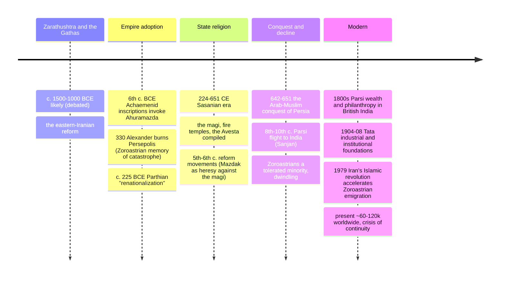

# 09 — Zoroastrianism — ศาสนาโซโรอัสเตอร์

> *"Good thoughts, good words, good deeds." (Humata, Hukhta, Huvarshta, the Zoroastrian triple motto)**

Zoroastrianism (ศาสนาโซโรอัสเตอร์) is the youngest of the world's oldest religions: founded by the prophet Zarathushtra (Greek: Zoroaster, โซโรแอสเตอร์) among the Iranians, likely between 1500 and 1000 BCE (scholars still argue; the Gathas, his own hymns, are among humanity's oldest religious poetry), it became the state religion of three Persian empires (Achaemenid, Parthian, Sasanian) for a millennium and was the majority faith of Iran until the Islamic conquest (7th c. CE). Today it survives as a tiny community (~60,000–120,000): the Zoroastrians of Yazd, and the Parsis (Parsi, "people of Persia") of Mumbai, who fled Islamic Iran around the 8th-10th centuries. It matters far beyond its numbers because it is the bridge in the history of religion: the first clearly prophetic, monotheistic-leaning faith with a cosmic battle between truth and falsehood, a final judgment, heaven and hell, a savior, and an end-time renewal, ideas the book-religions then absorbed (see [[04_Judaism]] §9, [[03_Islam]], [[02_Christianity]]). Its image of sacred fire, its moral dualism, and its absolute insistence on the individual's choice made it one of the most consequential religious experiments in history.

An adult should care because it answers a question every religious-history reader eventually asks — where did heaven, hell, Satan, the savior, the final judgment, and angels come from in the Abrahamic traditions? The honest scholarly answer runs through Persia, in the centuries when Jews lived under Persian rule after the Babylonian exile. And the Parsis' story is a parable every minority can read: a community that fled, kept its faith by refusing to assimilate fully, built enormous wealth and public good in its adopted land (Tata, Godrej — India's industrial dynasties), and now faces extinction by its own rules against conversion and interfaith marriage.

---

## 1 | The prophet and the problem of dates

| Question | What we know |
|---|---|
| Who | Zarathushtra (Zoroaster), a priest among the eastern Iranians who, in his telling, received a vision of Ahura Mazda (the Wise Lord) and the six divine attributes (Amesha Spentas) on a river at dawn |
| When | Two camps: "late" c. 628 BCE (near the rise of Persia, traditional Greek dating) vs "early" c. 1500-1000 BCE (linguistic dating of the Gathas to the Rig Veda's era). The Gathas' language points early; his life-narrative and the empire connection point late. This note: likely c. 1000 BCE or earlier, debated openly |
| Where | Eastern Iran / Central Asia (Bactria, the Oxus region), not Persepolis — the west's imperial Zoroastrianism adopted the eastern prophet |
| The reform | He inherited the same polytheism as Vedic India (the devas/asuras, the soma/haoma cult), and inverted/transformed it: one supreme Wise Lord; the old nature-demons demoted; cattle-raiding raids (the "robbers of cattle") as an abomination; individual conscience as the center |

## 2 | Core beliefs (หลักคำสอน)

| Concept | Avestan/Pahlavi/Thai | Content |
|---|---|---|
| Ahura Mazda (ออกห์ร มาสด, the Wise Lord) | The uncreated, good, omniscient creator; fire and light as his symbols (not "fire worship" — reverence through the purest visible element) |
| Amesha Spentas (อเมชา สเพนตา) | The "bountiful/holy immortals": six (sometimes seven) attributes/emanations of Ahura Mazda, each guardian of a creation (truth, good mind, power, devotion, wholeness, immortality) |
| Spenta Mainyu vs Angra Mainyu | The two spirits: Progressive/Beneficent Spirit and Destructive/Hostile Spirit. In the Gathas they are the twin choices within; in later (Pahlavi) cosmology an almost-dualistic cosmic battle between Ohrmazd and Ahriman |
| Dualism, ethical not absolute (หลักทวินิยม) | Good and evil are real forces, but evil is *not* co-eternal with God: it is a choice that will lose — Ahura Mazda wins at the end. This is optimistic dualism, unlike Gnostic pessimism |
| Asha vs Druj (อาชา/ความจริง vs ความเท็จ) | Asha: truth, order, the right way things are (cognate of Vedic Rta, related to dharma); Druj: the Lie. The whole cosmos is the fight between truth and falsehood |
| Free will (เจตจำนงเสรี) | Humans choose sides with thoughts, words, and deeds. No predestination; the individual stands alone at the judgment — one of history's first strong conscience-religions |
| Fravashi | The guardian/pre-existent spirit of each soul, venerated at the Hormuzd festival Farvardinan (the Zoroastrian "remembering the dead," like Qingming or Obon) |
| Eschatology (ที่สุดปลาย) | Death → the Chinvat Bridge (ชินวัด บรจ) judgment: the soul crosses by its deeds (wide for the righteous, knife-edge for the wicked) to the House of Song or the House of Lies; then, at the end, a savior (Saoshyant, โศษยันต์) is born, the dead are physically resurrected, a final ordeal of molten metal, and the world made permanently fresh (frashokereti) |
| Heaven and hell | Not eternal punishment for most: hell is corrective; the final state is all-good restoration. Yet "heaven/hell/judgment/savior" language was born here in the form the Abrahamic family inherited |
| Ritual purity and the sacred | Fire temples with ever-burning fires (Atash), the barsom bundle, the Yasna liturgy; earth, water, fire, and air are creations not to be polluted (hence the "sky burial" with vultures in the towers of silence — exposure, to avoid burying or burning defiling the elements; still practiced in Mumbai, now a crisis as vultures collapsed from diclofenac poisoning) |

## 3 | The texts

| Text | Language | Content |
|---|---|---|
| The Avesta (อเวสตะ) | Avestan | The scripture canon: the **Gathas** (17 hymns of Zarathushtra himself, archaic, dense, poetic), the Yasna (liturgy), Visperad, Vendidad (law/purity; also the anti-demon catalogue), Yashts (hymns to individual beings), Khorda Avesta (daily prayers) |
| Pahlavi / Zand literature | Middle Persian | The Sasanian-era commentaries and cosmologies (Bundahishn, "creation"), the era's priestly systematization |
| Greek and Persian witnesses | — | Herodotus, Plutarch; and Achaemenid royal inscriptions invoking Ahuramazda; Darius' boast: the temple rebuilt, the proper worship restored from the "Lie" |

## 4 | Timeline

## 5 | The influence question: what flowed to the Abrahamic family?

The exchange ran in both directions, but the Persian-side contributions are visible in the Jewish texts after the exile (when Cyrus the Great freed the Babylonian exiles in 539 BCE — the Hebrew Bible even calls him God's "anointed," the only non-Jew given that title).

| Idea | In Zoroastrianism | In the Abrahamic line |
|---|---|---|
| A personal devil / adversary as God's opponent | Angra Mainyu | Satan's evolution from prosecutor (Job) to cosmic enemy (post-exile and apocalyptic books) |
| Heaven and hell as reward/punishment chambers | The Bridge, the House of Song / House of Lies | Daniel, the Gospels, the Quran's jannah/jahannam |
| Resurrection of the dead | frashokereti, the body made new | Daniel 12; Pharisaic belief; Christianity's core claim; Islam's bodily resurrection |
| A final savior figure | Saoshyant | Messiah traditions in Judaism; the Second Coming in Christianity |
| Angelology and demons | The Amesha Spentas and yazatas; the daevas demoted | The elaborate angel/demon hierarchies of Second-Temple Judaism and Islam |
| Free will and judgment by individual choice | Humata/hukhta/huvarshta, the three deeds | The whole post-exilic and New Testament moral calculus |
| History as a linear story with a goal | The six-thousand-year scheme toward renewal | Abrahamic linear eschatology against older cyclical Indo-European time |

> **Scholarly caution:** "influence" is a mechanism, not a proof. Jews under Persia were in intensive contact, so transmission is highly plausible; but some ideas (a moral order, a judgment hope) arise independently everywhere. The fair statement: Zoroastrianism supplies the *earliest and clearest* full package, and the exile period is exactly when and where the Abrahamic traditions began assembling those parts. See [[04_Judaism]] §4, [[03_Islam]] §2, and [[11_Comparative_Themes]] on afterlife.

## 6 | Practice and the community today

| Institution | Detail |
|---|---|
| Fire temple (Atash Behram / Atash) | Three grades of sacred fire; the highest Atash Behram takes a year+ of ceremonies to install and must never go out; some Parsi fires burn centuries |
| The navjote / navjote / sedreh-pushi (พิธีรับศาสนา, investiture) | Initiation of children (~7-15): receiving the sacred shirt (sedreh) and thread (kusti), the Zoroastrian coming-of-age into personal responsibility |
| Towers of silence (dakhma) | Exposure burial on hills (the last Mumbai ones now mostly unused; many Parsis choose cremation/burial in electric or solar "dakhma-analogue" devices to avoid polluting earth/fire — the purity law still argues with itself) |
| Festivals | Nowruz (March equinox, the great new year — now Iran's secular-national festival too, 300M+ celebrate it), Midsummer (Tiragan (midsummer)), Farvardinan (commemoration of the dead) |
| Ethics in daily life | Prayers five times a day facing light/fire; honesty as sacred law (the Vendidad's "the Lie" is the enemy); environmental reverence modernized as a "green religion" claim |
| The demographic crisis | Parsi population ~50-60k and falling; orthodoxy bars conversion and (in most rules) interfaith marriage with community status, so emigration and late marriage shrink it — the world's smallest "major" ancient religion may vanish within two generations, which makes it a live conservation question for UNESCO-class heritage |

## 7 | The Parsis in India: a minority case study

- Landed in Sanjan, Gujarat (legend: they kept the local ruler's test — "be like sugar dissolved in milk, not water overflowing the glass"), then rose under British rule to become India's commercial and industrial avant-garde.
- The Tatas built India's first steel plant (1907), Indian Institutes of Science, the Taj Hotel (after being refused entry to a "whites-only" hotel, the story goes); the Godrejs, Wadias, Petit family (Dadabhai Naoroji, the first Indian MP in Britain, Parsi), and the philanthropy tradition.
- India's Parsis also famously kept the faith endogamously, which now endangers them: a "model minority" both thriving and self-extinguishing, and a legal case study when their interfaith daughters were barred from funeral rites ("the Pavri case," 2000s — a fight over who counts as Parsi).

## 8 | Key concepts and vocabulary

| Term | Thai | Meaning |
|---|---|---|
| Ahura Mazda | ออกห์ร มาสด | The Wise Lord, the creator |
| Zarathushtra / Zoroaster | โซโรแอสเตอร์ | The prophet |
| Avesta | อเวสตะ | The scripture |
| Gathas | คาถา | The prophet's own hymns |
| Asha | อาชา / ความจริง-ธรรม | Truth, cosmic order (cf. Rta, dharma) |
| Druj | ความเท็จ | The Lie, chaos, falsehood |
| Angra Mainyu / Ahriman | อังกร มันยู | The destructive spirit, the adversary |
| Spenta Mainyu | สเปนตา มันยู | The beneficent spirit, God's creative mind |
| Amesha Spenta | อเมชา สเพนตา | The Holy Immortals, divine attributes |
| Saoshyant | โศษยันต์ | The future savior |
| Frashokereti | ฟราโชเกรตี | The final making-wonderful of the world |
| Chinvat Bridge | สะพานชินวัด | The bridge of judgment |
| Yazata | ยะซาท | A being worthy of worship (→ the "yaz" in many names) |
| Barsum / barsom | กำต้นหญ้า | The ritual bundle of twigs |
| Parsi | ปาร์ซี | "Persian," the Indian Zoroastrians |

## 9 | Why it matters today

- **It is the missing link:** the Abrahamic eschatology (devil, judgment, heaven, hell, resurrection, savior) that billions believe didn't appear from nowhere. The Zoroastrian packet is the historically traceable source or parallel for most of it — and it reframes how a Muslim, Christian, or Jewish reader can honor the tradition that, in Cyrus' person, freed the Jews and rebuilt their temple.
- **Ethics before ritual:** a religion whose core is "good thoughts, good words, good deeds," where a non-Zoroastrian's honest work is a form of worship (the Tatas' founding ethic), is a clean example of a works-and-conscience religion without a conversion gate.
- **Environmental theology:** earth/water/fire as creations not to be polluted produced (some argue) the world's first "environmental" law code; modern eco-Zoroastrianism cites this.
- **The minority mirror:** the Parsi experiment answers "what does a community owe its adopted home, and what does it pay for keeping its identity?" — a question Thai Chinese-Thai, Thai Muslim, and any-diaspora readers recognize instantly.

## 10 | Further reading

- *A History of Zoroastrianism* (3 vols) by Mary Boyce: the definitive scholarly narrative; vol 1 (the early period) is the Gathas' world.
- *The Spirit of Zoroastrianism* edited by Prods Oktor Skjærvø: the religion's own texts in accessible modern translations.
- *Zoroastrians: Their Religious Beliefs and Practices* by Jenny Rose: the compact single-volume survey.
- *The Parsees* / the Parsi history literature (e.g., Hinnell, or Maneckji's studies) for the Indian chapter.

*\* the motto is the traditional summary of humata/hukhta/huvarshta in liturgical and popular form.*

## Related

- [[01_What_Is_Religion]]: the prophetic monotheism's earliest candidate
- [[04_Judaism]] and [[03_Islam]] and [[02_Christianity]]: the traditions that inherited its eschatology
- [[11_Comparative_Themes]]: heaven/hell/judgment compared across all families
- [[15_Egyptian_Mythology]]: the weighing of the heart vs the Chinvat Bridge (the same judgment image, independent invention?)
- [[Social Studies/04 History/12_Ancient_Civilizations|Ancient Civilizations]]: Persia and the Achaemenid world
- [[Philosophy/08_Islamic_and_Jewish_Philosophy|Islamic and Jewish Philosophy]]: the Persian afterlife of Zoroastrian ideas in Islamic philosophy (Suhrawardi's "School of Illumination")
