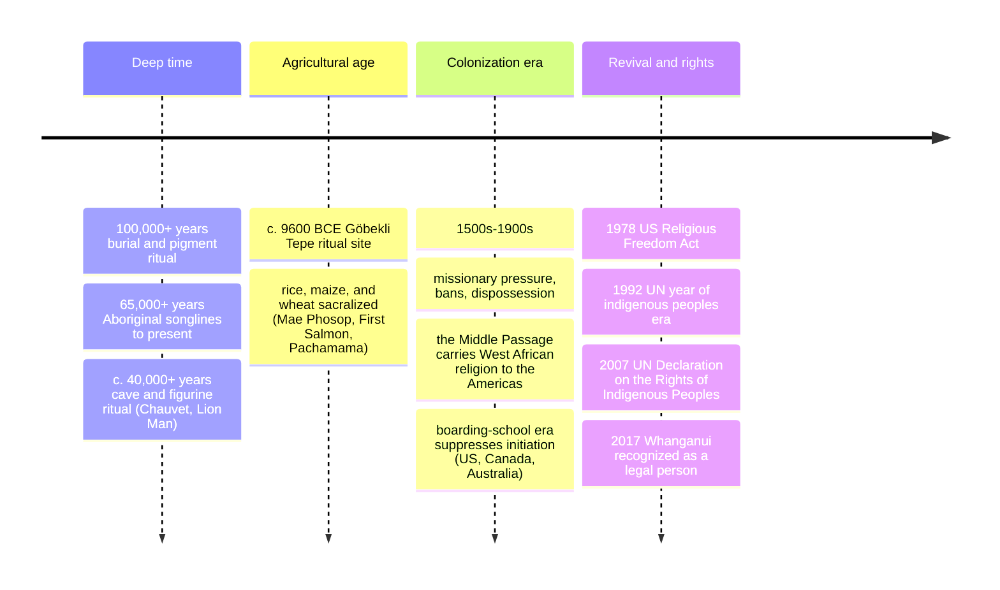

# 10 — Indigenous and Animist Traditions — ศาสนาพื้นบ้านและความเชื่อเรื่องผี

> *"The land is not a possession. We belong to it." (a refrain found in nearly every indigenous language of the Americas; cf. Chief Seattle's 1854 speech)**

Indigenous and animist traditions (ศาสนาพื้นบ้าน; ความเชื่อเรื่องผี) are not one religion but the world's largest family of religions by breadth: every continent's first peoples kept a sacred order, and together they predate and out surround all the "world religions." **Animism** (ลัทธิผี/ความเชื่อว่าสิ่งมีชีวิตทุกชนิดมีวิญญาณ) is their most common grammar: the world is full of persons, only some of whom are human — rivers, mountains, animals, trees, tools, weather, and the dead all have interiority, and life is a network of reciprocal relationships with them. The anthropologist Graham Harvey's short definition is the best working one: animists are "those who respect their relations with other-than-human persons."

An adult should care because these traditions are not museum pieces: Thailand's spirit houses (ศาลพระภูมิ), khwan/ขวัญ ceremony, house- and rice-souls, and village guardian spirits (เจ้าพ่อ/เจ้าแม่) are living animism inside a Buddhist country; the land, forest, and fishing rights of indigenous peoples from the Philippines to Peru are decided in courts and constitutions; and the ecological frame ("the river has rights," now law in New Zealand and Ecuador) comes straight from indigenous religion into 21st-century politics.

---

## 1 | What "animism" means (and the fair use of a bad word)

| Point | Detail |
|---|---|
| Coinage | Edward Tylor, *Primitive Culture* (1871): from Latin *anima* (breath, soul) — he defined it as "belief in spiritual beings" and ranked it as religion's first stage (a Victorian ladder now rejected) |
| The older caricature | "Primitive superstition worshiping rocks" — used to justify dispossession ("no one *owns* the land religiously, so we may take it") |
| The current scholarly view | Not a failed theology but a sophisticated relational ontology: a way of being a person among persons, with ethics, law, and ecology built in (Harvey; Irving Hallowell's Ojibwe studies; Eduardo Viveiros de Castro's Amazonian perspectivism — see note 19 for the Amerindian frame) |
| Definition that survives | The world is inhabited by more-than-human persons with whom humans must maintain right relations (respect, reciprocity, ritual) |
| Key distinction | Animism is a *grammar* shared by thousands of distinct traditions (Shinto has animist roots, see [[08_Shinto_and_Japanese_Traditions]]); the "religions" are the local languages of that grammar |

## 2 | Common structures across traditions (the family resemblance)

| Feature | Thai | Typical form | Examples |
|---|---|---|---|
| Sacred place | ที่ศักดิ์สิทธิ์ | Mountains, groves, rivers, crossroads; a built point of contact | Uluru; sacred groves (see §5); spirit house (ศาลพระภูมิ) |
| The sky/deity-above | ฟ้า/เทวดา | Often a high god or creator, sometimes distant ("deus otiosus," the idle god) | Tangaroa (Māori, sea/creator); Ngai (Maasai sky god) |
| Spirits of place and lineage | ผี | Local guardians and ancestors mediate daily life | เจ้าพ่อเจ้าแม่ village spirits; Filipino anito; Yoruba orisha (see §5) |
| The life-soul(s) | ขวัญ | Humans have one or more souls (body-soul, free-soul, road-soul) | Thai khwan ceremony (สู่ขวัญ); Lahu's seven souls |
| Reciprocity/offerings | การเซ่นไหว้ | Food, drink, blood, flowers, first-fruits: exchange, not charity | Rice-soul rites (Khwan Khao); first-fruits festivals; libations |
| Rites of passage | พิธีเปลี่ยนผ่าน | Initiation separating childhood into adult status (van Gennep; see [[12_What_Is_Mythology]] on liminality) | Vision quest (Lakota); Aboriginal initiation; Thai สู่ขวัญ |
| Specialist | หมอผี/ผู้นำพิธี | Shaman (travels to spirit world), priest, herbalist, diviner | Siberian shaman; Andean paqo; Filipino babaylan |
| Oral tradition | วรรณกรรมปาก | Myth, genealogy, law, and ecology memorized and performed | The Dreaming songlines; the Popol Vuh (Maya, written down later) |
| Cyclical time | วัฏจักร | Season, festival, generation — not a one-way history | Agricultural calendars everywhere (see [[11_Comparative_Themes]]) |
| Land as relative | แผ่นดินเป็นญาติ | Country "owns" the people (Māori: whenua = placenta/land) | "I do not own the land; the land owns me" |

> **Note the methodological rule:** every cell above has exceptions; there is no "indigenous religion" singleton. The honest approach is description in a tradition's own terms — exactly the tone contract of this folder.

## 3 | The Thai case: animism as the layer under everything

Thailand is the textbook example of stacked religion: an animist base, a Hindu superstructure (see [[05_Hinduism]]), a Buddhist frame (the curriculum's Religion strand), all three operating at once without contradiction.

| Living Thai animism | What it is |
|---|---|
| ศาลพระภูมิ (spirit house) | The land's owner housed respectfully beside every home, gas station, and condo; daily water and incense — a landlord relationship with the invisible |
| ขวัญ (khwan) | The soul-complex; สู่ขวัญ/เรียกขวัญ ceremonies call back a scattered khwan at births, illnesses, departures; the Baci ceremony of Laos/Isan is the same family |
| ผี (phi) | Spirits: ผีบ้านผีเรือน (household guardians), ผีตาแฮก (field spirit), ผีฟ้า (northern ancestor spirits of Tai elites); propitiated, not "exorcised" by default |
| ข้าวแม่โพสพ (Mae Phosop, rice mother) | The rice's soul: a strand left standing at harvest, a ceremony asking forgiveness for cutting the rice — animist agriculture in one rite |
| เจ้าพ่อ/เจ้าแม่ & trees | Village guardian shrines; monks' robe (ผ้าไตร) wrapped around big trees to protect them from loggers — Buddhist monasticism doing animist conservation |
| Royal rituals | The ploughing ceremony, the barge procession: the king as guarantor of rain and rice, a sacred-kingship pattern shared with old Khmer and Thai traditions (see [[05_Hinduism]] §9) |
| Amulets and "material religion" | Lucky cars' garlands, Buddha amulets, numbers from dreams: a power-technology that treats the world as transactional and animate |

A Thai student learning [[Social Studies/01 Religion/02_Buddhist_Ceremonies_and_Meditation|Buddhist ceremonies]] is studying Buddhism *as Thais practice it* — which is a Buddhist-animist hybrid. Naming the animist layer is not disrespect; it is the accurate description.

## 4 | Case snapshots (one row per continent, all with a signature idea)

| Tradition | Region | Signature |
|---|---|---|
| Australian Aboriginal | Australia | **The Dreaming (Tjukurpa):** the ancestral beings sang the world into being and remain in country; law, map, and liturgy are one songline; the oldest continuing religious culture on Earth (65,000+ years) |
| Māori | Aotearoa/New Zealand | **Whakapapa:** genealogy binding people to mountains, rivers, and gods (Ranginui sky-father and Papatūānuku earth-mother separated by Tāne); whenua = land = placenta; the hongi shares the breath of life |
| Lakota and Plains nations | North America | **Wakan Tanka (the Great Mystery) and the vision quest;** the Sun Dance; the Black Hills as sacred geography — the basis of the modern legal fights (see §6) |
| Andean (Quechua/Aymara) | South America | **Pachamama (earth mother) and ayni (reciprocity):** offerings (despacho) to the land; mountains as apus (guardian lords); "to feed the earth so it feeds us" |
| Yoruba and West African | West Africa and diaspora | **Olodumare (remote high god) with orisha as approachable powers** (Shango, Oshun); Ifá divination; carried to the Americas as Santería, Candomblé, and Vodou (the newest major "world" religions, via the Middle Passage) |
| Sámi | Northern Scandinavia | **Noaidi shamans and the sacred drum;** the sieidi stones; reindeer-herding sacred economy; the 20th-c. fight over Alta river damming — the "land and water" case in Europe |
| Amazonian peoples | South America | **Perspectivism (Viveiros de Castro):** all beings see themselves as human and the world as their village; jaguars see blood as manioc beer; the shaman travels between perspectives — a bold modern theory of indigenous thought |
| Ainu | Japan/Russia | **Kamuy (spirits) in all things;** the bear-festival sending the bear's soul back to the spirit world with gratitude; the 2019 Japanese state apology for the 1899 forced assimilation (compare to [[08_Shinto_and_Japanese_Traditions]]) |
| San/Bushmen | Southern Africa | **Trance dance healing;** the eland as power-animal; rock art as religious documentation; the oldest genetic lineages in humanity — animism's probable deep-time face |
| Philippine (anito/babaylan) | SE Asia | **Anito ancestor/nature spirits;** the babaylan (ritual specialist, usually women) suppressed under Spain, revived today among indigenous Mindanao groups — close cousin to old Thai ผี systems |

## 5 | Why "deus otiosus" matters

Many traditions (the Igbo sky god of Nigeria (Chukwu), the Finnish Jumala, the Mongol Tengri) hold a high creator god who made the world and then withdrew; daily religion goes to the accessible spirits around you. This pattern ("the idle god") explains a comparative puzzle: a people can be "monotheistic" in theory and thoroughly animist in practice. It also reframes the question "did primitive peoples believe in one God?" — sometimes, in a remote one, and they left the day-shift to the neighbors.

## 6 | The politics: rights, ecological law, and revival

| Development | Where | Significance |
|---|---|---|
| Native American Church / Sun Dance legality | USA | Centuries of bans on sacred practice (peyote and Sun Dance criminalized until the 1978 American Indian Religious Freedom Act); a case study in how states treat non-textual religions |
| Treaty fights | Black Hills (Lakota); Mauna Kea (Hawaiian); Standing Rock (water protectors) | When sacred land is property, courts must define "religion" — usually poorly |
| Legal personhood for nature | Whanganui River (Māori, NZ, 2017); Te Urewera; Ecuador's constitution (Pachamama rights, 2008); India's Ganges rulings | Indigenous cosmology converted into statute: the river is a living person |
| Land-back and language revival | Māori kōhanga reo (language nests); Hawaiian schools; Aboriginal songline recording | Religion and language inseparable: losing the words loses the world |
| The "eco-friendly noble savage" trap | everywhere | Praise can be its own stereotype; the respectful position is listening, not projecting |

## 7 | Timeline (a comparative one)

## 8 | Key concepts and vocabulary

| Term | Thai | Meaning |
|---|---|---|
| Animism | ลัทธิผี / ความเชื่อว่ามีวิญญาณทั่วทุกแห่ง | The world as full of persons |
| Shaman (หมอผี/ผู้นำพิธีผู้เดินทาง) | ผู้เดินทางระหว่างโลก | One who journeys to spirit worlds for healing and knowledge |
| Totem | เครื่องหมายประจำวงศ์ | A spirit-being/animal bound to a clan (Durkheim's study of Australian totemism) |
| Sacred (hierophany) | สิ่งศักดิ์สิทธิ์ | Eliade's term: the real showing through an ordinary object/place |
| Rite of passage (พิธีเปลี่ยนผ่าน) | แยก-เปลี่ยน-กลับ | Van Gennep's three-phase structure; Turner's "liminality"; see [[12_What_Is_Mythology]] |
| Initiation | การบวช/พิธีเข้าหมู่ | The tested induction into adult/mystery status |
| Divination | การเสี่ยงทาย/หมอดู | Reading the spirits' will (bones, entrails, shells, dreams, I Ching cousins) |
| Offerings (การเซ่นไหว้) | การเลี้ยงผี | The reciprocity: food, drink, first-fruits, tobacco, rum |
| World soul / Great Mystery | พลังสากล | The background sacred power (mana in Pacific languages; Wakan Tanka, "the Great Mystery") |
| Land-based spirituality | จิตวิญญาณผูกกับแผ่นดิน | The defining modern term: identity and law embedded in a specific place |

## 9 | Why it matters today

- **It's the majority of human religious history:** for ~95% of human existence, the ancestors of every person alive practiced some form of animist-relational religion. "World religions" are the recent, textual minority.
- **Ecology:** the rights-of-nature movement, forest and river defense, and "reciprocity" ethics (ayni, kaitiakitanga) are indigenous religious ideas winning in courts and climate conferences. Thai readers meet it every time a monk robes a tree.
- **Thai identity:** the spirit house, สู่ขวัญ, and phi calendar are the substrate under Thai Buddhism; understanding them explains more daily behavior than the doctrinal texts do (see [[Social Studies/02 Civics/02_Thai_Culture_and_Traditions|Thai Culture]]).
- **Justice:** from the Stolen Generations to Mauna Kea, "what is religion?" is being litigated right now in ways that decide who keeps their land and children. Respectful description (§2's method) is the first civic skill.

## 10 | Further reading

- *Animism: Respecting the Living World* by Graham Harvey: the humane, current redefinition; the best single entry.
- *Pattern in Comparative Religion* (Eliade): the classic thematic atlas; dated but generative.
- *Old Pathways, New Paths* (B. Bird-Bagain, Pacific): Oceanic religions as living systems, from a convert's own tradition.
- *Braiding Sweetgrass* by Robin Wall Kimmerer (Potawatomi): the relational ecology of the plant people and the gift economy, readable by anyone; pairs with the Thai rice-mother section (§3).

*\* the phrasing is the long paraphrase-tradition of the speech attributed to Chief Seattle, whose exact text is contested; the sentiment is documented across many continents.*

## Related

- [[01_What_Is_Religion]]: animism in the definition problem
- [[08_Shinto_and_Japanese_Traditions]]: the animism that built shrines
- [[05_Hinduism]] and [[07_Chinese_Religious_Traditions]]: ancestor veneration and spirit-bureaucracy
- [[11_Comparative_Themes]]: creation, afterlife, and ethics across the family
- [[12_What_Is_Mythology]]: myth as these traditions' carried form of knowledge
- [[19_Universal_Mythic_Archetypes]]: flood and trickster in indigenous America and Oceania
- [[ภาษาไทย/วรรณคดีและวรรณกรรม/นิทานและตำนาน/01_นิทานพื้นบ้าน|นิทานพื้นบ้าน]]: Thai folk tales as the oral layer
- [[Social Studies/01 Religion/07_Religious_Tolerance_and_Interfaith|Religious Tolerance]]
