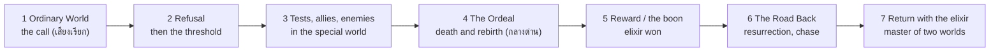
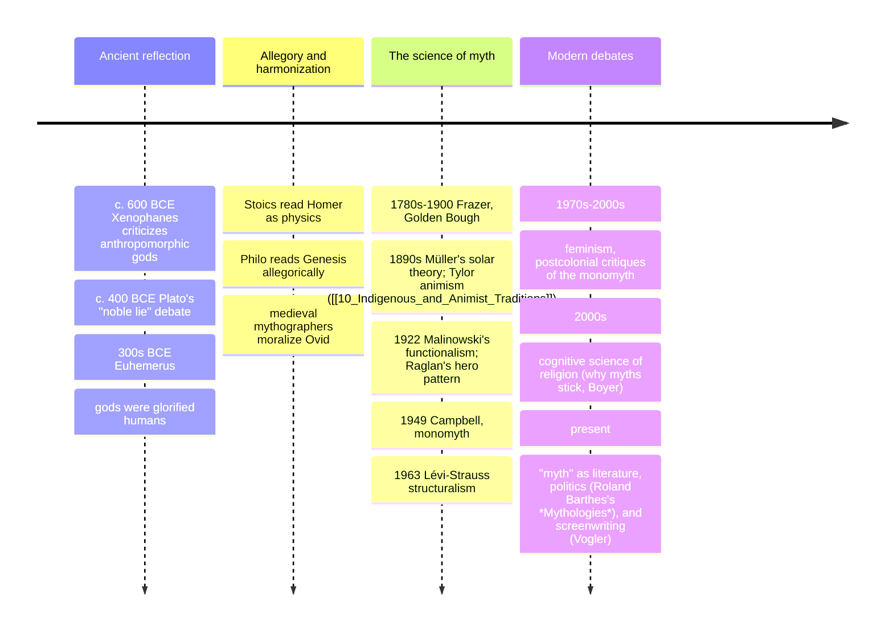

# 12 — What Is Mythology — เทพปกรณัมคืออะไร

> *"Myths are public dreams, dreams are private myths." (Joseph Campbell, paraphrased)**

Mythology (เทพปกรณัม) is the study and the body of sacred stories (นิทานปรัมปรา, myths) a culture lives by: accounts of origins, gods, heroes, monsters, and the shape of reality, told not as "fiction" but as the deep true. In everyday English "myth" means a false belief ("it's a myth that we only use 10% of our brains") — that usage is a modern insult to the word's oldest meaning. For the people who told these stories, myth was *history at the foundation level*: what happened before and beneath everything that happens again. This note (12) is the frame for the mythology half of this domain (notes 13–20): the distinctions (myth vs legend vs folktale vs fable), the functions (why every society keeps telling them), the big theories of what myth *does*, and the hero's journey (การเดินทางของวีรบุรุษ) as the most famous single pattern.

An adult should care because the stories of notes 13–19 are the source code of the culture you already consume: every Marvel film, video game, fantasy novel, advertisement narrative, and sports legend runs on myth grammar. Knowing the patterns is a decoder ring for mass culture — and the hero's journey, whatever its scholarly limits, is the shared skeleton of stories from Gilgamesh to Luke Skywalker.

---

## 1 | The word, and the three-genre distinction

The Greek *mythos* (μῦθος) originally meant simply "word, story, plot" (against *logos*, "rational account") and only later became "the irrational story." The scholarly distinctions that keep folklore tidy:

| Genre | Thai | Truth claim | Protagonists | Setting | Function |
|---|---|---|---|---|---|
| Myth (นิทานปรัมปรา) | "This really happened, before/behind the world" | Gods, cosmic beings | Another time and space (pre-human or elsewhere) | Explains and grounds reality itself |
| Legend (ตำนาน) | "This happened to real people, with memory and embellishment" | Humans (sometimes god-touched) | Our historical world, vaguely located | Identity, place, and value lessons |
| Folktale (นิทานพื้นบ้าน) | "A story for the telling" — no truth claim | Ordinary humans, tricksters, royalty | "Once upon a time, a certain village..." | Entertainment, moral training, coping |
| Fable (นิทานสอนใจ) | A pointed lesson with animals | Animals-as-types | Timeless and generic | Explicit moral (Aesop; see [[ภาษาไทย/วรรณคดีและวรรณกรรม/นิทานและตำนาน/03_นิทานอีสป|นิทานอีสป]]) |

The borders blur on purpose: the Ramayana is myth for a devotee, legend for a historian, literature for a reader; the Thai รามเกียรติ์ sits between legend and literature (see [[ภาษาไทย/วรรณคดีและวรรณกรรม/สมัยรัตนโกสินทร์/01_รามเกียรติ์|รามเกียรติ์]] and [[17_Hindu_Mythology]]). One story, three truth-claims — which is precisely the tonal point of this whole domain: describe, don't grade.

## 2 | What myths are *for*: the functions

Malinowski (the anthropologist of Trobriand magic) and later scholars agree myths do jobs, not just describe:

| Function | Who named it | What it does | Example |
|---|---|---|---|
| Metaphysical/mystical | Campbell | Awesomeness: wake you to the mystery of existing | The Nasadiya Sukta's "who really knows whence it arose?" ([[11_Comparative_Themes]] §1) |
| Cosmological | Campbell | Explain the universe in a shape you can live inside | Enuma Elish as Babylon's world-map ([[16_Mesopotamian_Mythology]]) |
| Sociological | Campbell, Durkheim | Validate and stabilize the social order | Mandate of Heaven legitimating (and limiting) kings ([[07_Chinese_Religious_Traditions]]) |
| Pedagogical/Psycho-logical | Campbell, Jung | Guide you through life's stages: birth, adolescence, marriage, death | Initiation rites retelling the myth you're dying-and-rising through ([[10_Indigenous_and_Animist_Traditions]]) |
| Charter | Malinowski's term | Make law, land-title, and ritual *old* and therefore *right* | Māori genealogies as legal title to land |
| Entertainment + coping | the folk function | Make suffering bearable and authority laughable | Trickster tales dethroning the powerful ([[19_Universal_Mythic_Archetypes]]) |

## 3 | The big theories: what myth *is*, four classic answers

| Theory | Key figure | Claim in one sentence | Strength | Weakness |
|---|---|---|---|---|
| Physical/nature | Max Müller | Myths are "a disease of language": ancient people mis-named sun, dawn, storm | Explains solar/dawn patterns everywhere | Reductive: not every myth is weather |
| Psychological | Freud / Jung | Myths are collective wish-dreams / expressions of the unconscious and archetypes | Explains cross-cultural recurrence (mother, flood, trickster) | Hard to falsify; risks saying anything "means" anything |
| Functional/sociological | Malinowski, Durkheim | Myths make society work: charters, cohesion, ritual fuel | Grounded in fieldwork; explains persistence | Weaker on why *these* stories, not any others |
| Structural | Lévi-Strauss | Myths are logic-machines thinking contradictions (raw/cooked, life/death) through binary mediation | Deep, mathematical elegance; works across unrelated cultures | Abstract; strips the stories of plot and feeling |
| Comparative/monomyth | Campbell (and Frazer's dying-god data) | One hero's journey underlies many myths; dying-and-rising gods as seasonal pattern | Reader-friendly, Hollywood-confirmed | Over-flattening: the "monomyth" misses as much as it finds (feminist and historical critiques) |
| Ritual | Frazer, the Cambridge school | Myth is the spoken part of ritual; perform first, explain later | Matches the festivals ([[11_Comparative_Themes]] §8) | Some myths have no local ritual; chicken-egg problem |

A healthy adult reads all six as lenses: the same flood story is *simultaneously* a memory-zone geology, an psychological horror, a social warning, and a ritual calendar anchor. That multi-seeing is the comparative-religion habit from [[01_What_Is_Religion]].

## 4 | The hero's journey (Campbell's monomyth)

Campbell read hundreds of myths (Gilgamesh, Osiris, the Buddha, Prometheus, Odysseus — his examples range from the Egyptian Book of the Dead to Hopi and Aboriginal Australian narratives) and abstracted one pattern in three acts, seventeen episodes in the full scheme; here is the working skeleton:

| Stage (short) | Thai gloss | The plot beat | Examples |
|---|---|---|---|
| Call to adventure | เสียงเรียก | Something breaks the ordinary | Gilgamesh after Enkidu's death; Rama's exile decree |
| Refusal / supernatural aid | ความลังเล/ตัวช่วย | Hesitation, then a mentor or magic | Athena/Heracles; Hanuman and the leap |
| Crossing the threshold | ข้ามเส้นแบ่ง | Into the special world | Odysseus to the sea; Aeneas to the underworld |
| Road of trials | บททดสอบ | Allies and enemies | Jason's tasks; the Pandavas' exile |
| The ordeal | ด่านอันตราย | The central death-and-rebirth | Perseus and Medusa; Rama vs Ravana; Jesus' crucifixion weekend |
| Reward | รางวัล | The boon (fire, elixir, knowledge, the princess) | Prometheus' fire (theft!), Gilgamesh's plant |
| The return | การกลับ | Refusal of return, magic flight | Odysseus' long way home |
| Master of two worlds | ผู้ครองสองโลก | Bringing the elixir to the ordinary | The Buddha under the bodhi tree, deciding to teach |

**The honest caveats:** the pattern is real but not universal — many traditions' central figures are heroines, tricksters, or communal heroes (and Campbell's "monomyth" was built almost entirely from male adventures; Vogler's Hollywood version added the heroine's-journey debates). The monomyth describes structure, not value: a culture's best story may be a *return-less* one. Still, its explanatory power over modern storytelling is unmatched ([[20_Mythology_in_Modern_Culture]]).

## 5 | Timeline: the study of myth

## 6 | Terms you need

| Term | Thai | Meaning |
|---|---|---|
| Pantheon | คณะเทพ | A culture's whole god-family (see [[13_Greek_Mythology]]'s Olympian tree) |
| Theogony | กำเนิดเทพ | A story of the gods' origins (Hesiod's; cf. Enuma Elish) |
| Cosmogony / cosmology | กำเนิดโลก/โครงสร้างโลก | Origin story / world-structure (Yggdrasil, Mount Meru) |
| Archetype | ต้นแบบ | A recurring story-figure/image (see [[19_Universal_Mythic_Archetypes]]) |
| Euhemerism | เทพเคยเป็นมนุษย์ | The theory that gods were remembered humans (ancient, still useful for legend) |
| Etiology | คำอธิบายที่มา | A myth explaining why a thing is so (why the leopard has spots, why we plant in April) |
| Dying-and-rising god | เทพที่ตายแล้วฟื้น | Frazer's category: Osiris, Dionysus, Baldr, Tammuz; the seasonal pattern (used and debated in [[15_Egyptian_Mythology]] and [[14_Norse_Mythology]]) |
| Axis mundi | แกนโลก | The world-center linking below and above: Yggdrasil, Meru, the Temple mount, the pole tree |
| Mythologem | หน่วยตำนาน | A basic myth-motif unit, for comparing fragments |
| Comparative mythology | เทพปกรณัมเปรียบเทียบ | The discipline; note 19's toolkit |

## 7 | Why it matters today

- **Mass culture runs on myth:** Star Wars (Campbell read Lucas read Campbell), Marvel's Asgard ([[14_Norse_Mythology]]), the Percy Jackson and Rick Riordan wave of Greek retellings, Disney's hero's-journey formula, and virtually every video-game quest structure ([[20_Mythology_in_Modern_Culture]]). Story literacy in the 21st century is myth literacy.
- **Political myth:** "the founding fathers," "the lost golden age," "the strongman savior" are myths in the technical sense — charters and cohesion. Reading §2's functions is a defense against being *mythed at*.
- **Personal myth:** the journey structure maps real transitions (moving, grieving, career changes) — this is why the hero's journey keeps being re-discovered by therapists and coaches. It's also why rite-of-passage ceremonies (บวช, graduation, vision quests) still feel right.
- **The Thai bridge again:** รามเกียรติ์, the Ramakien's journey of Rama as a Thai romance hero, is a living masterclass in how one myth (note 17) feeds literature, dance, and royal ideology across cultures; the ภาษาไทย classroom text is this note's syllabus.

## 8 | Further reading

- *The Hero with a Thousand Faces* (Joseph Campbell, 1949): the monomyth itself; read the preface and chapter 1 for the map, then pick episodes.
- *Myth: A Very Short Introduction* (Robert Segal): the theories in §3 done briefly and fairly.
- *Edith Hamilton's Mythology* (1942): the classic story-book; this vault's narrative spine for 13–16.
- *The Writers Journey* (Christopher Vogler): the monomyth as screenwriting — proof of §7's point and a fun second lens.

*\* the saying is a standard paraphrase of Campbell's line "myths are public dreams; dreams are private myths."*

## Related

- [[01_What_Is_Religion]]: the frame this note mirrors for story
- [[11_Comparative_Themes]]: the religion-side comparison
- [[13_Greek_Mythology]], [[14_Norse_Mythology]], [[15_Egyptian_Mythology]], [[16_Mesopotamian_Mythology]], [[17_Hindu_Mythology]], [[18_East_Asian_Mythology]]: the six mythology traditions
- [[19_Universal_Mythic_Archetypes]]: the pattern library this note introduces
- [[20_Mythology_in_Modern_Culture]]: where the myths moved
- [[ภาษาไทย/วรรณคดีและวรรณกรรม/นิทานและตำนาน/00_overview|นิทานและตำนาน]]: Thai folklore in this grammar
- [[World Literature/01_How_to_Read_Literature|How to Read Literature]]: the literary-side toolkit
