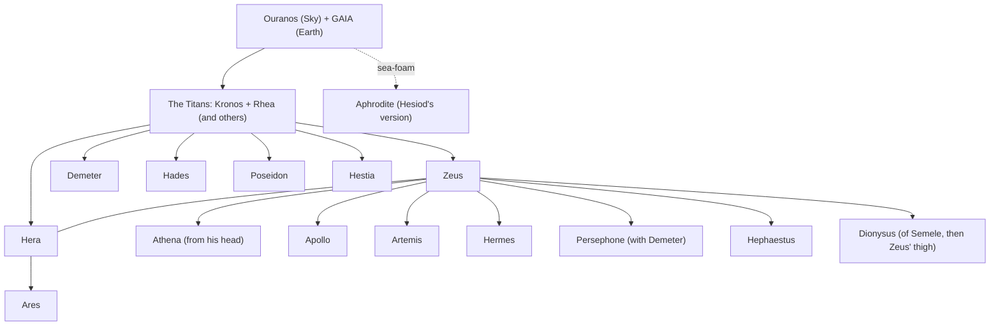
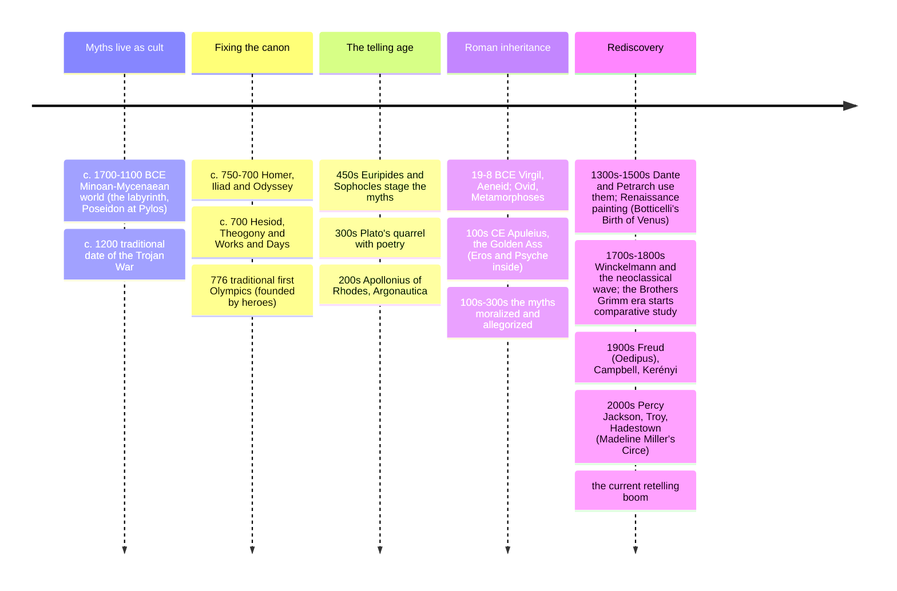

# 13 — Greek Mythology — เทพปกรณัมกรีก

> *"Sing, goddess, the wrath of Achilles Peleus' son, the accursed wrath which brought countless sorrows upon the Achaeans." (Iliad, opening line)**

Greek mythology (เทพปกรณัมกรีก) is the story-system of ancient Greece: the gods of Olympus, the Titan wars, and the age of heroes (Theseus, Jason, Perseus, Odysseus, Oedipus, Heracles), ending with the Trojan War and the wandering home. It is the most load-bearing mythology in Western culture: its vocabulary (chaos, panic, narcissus, muse, titan, oracle), its plots (the hero's quest, the doomed love, the trickster stolen-fire story retold), and its psychology (Oedipus, Electra, the sirens' choice) are embedded in European languages, and by extension in global film, literature, and advertising. Homer's two epics (c. 750–700 BCE) and Hesiod's *Theogony* (c. 700 BCE) fixed the canon; the tragedians (Sophocles, Euripides), the Alexandrian poets, and Ovid's Latin *Metamorphoses* kept re-telling it; the Romans renamed the gods (Zeus→Jupiter, Aphrodite→Venus) and passed the package to Europe.

An adult should care because the Greek layer is the single biggest mythic import into Western-derived pop culture (Percy Jackson, *Troy*, *God of War*, Marvel's Hercules), and because the Greeks themselves treated these stories as the serious framework of life: festivals, oracles, civic oaths, and the first philosophical attempts to *outgrow* myth (Thales onward — see [[Philosophy/02_Pre_Socratic_Philosophers]]) all happened inside it.

---

## 1 | Before the Olympians: the succession myth

The Greek cosmos begins as family violence, four generations deep (Hesiod's plot, which has Near Eastern parallels — see [[16_Mesopotamian_Mythology]]):

| Generation | Ruling power | What happens |
|---|---|---|
| Primordial | Chaos, then Gaia (earth) and Ouranos (sky) | Gaia's children (Titans, Cyclopes, Hecatoncheires) are hated and imprisoned by their father |
| Titans | Kronos, who castrates and overthrows Ouranos | Kronos then swallows his own children to dodge a prophecy |
| Olympians | Zeus, hidden at birth, forces Kronos to disgorge his siblings | Titanomachy: ten-year war; Titans cast into Tartarus; the world divided by lot (sky/sea/underworld to Zeus/Poseidon/Hades) |
| Humans | Five (or four) ages of metal: Gold, Silver, Bronze, Heroic, Iron | Each worse than the last except the Heroic; Hesiod's pessimistic present is the Iron Age |

## 2 | The Olympian family

The twelve-seat Olympian roster (with Roman names): Zeus/Jupiter (sky, king, guest-law), Hera/Juno (marriage), Poseidon/Neptune (sea, horses), Demeter/Ceres (grain), Athena/Minerva (wisdom, strategy-war, crafts), Apollo (light, music, prophecy, plague), Artemis/Diana (hunt, moon, childbirth), Ares/Mars (war's bloodlust), Aphrodite/Venus (desire), Hephaestus/Vulcan (fire, forge), Hermes/Mercury (messages, thieves, roads, psychopomp), Hades/Pluto (underworld — not an Olympian resident), plus Hestia/Vesta (hearth, sometimes giving her seat to Dionysus).

| God | Signature myth | Domain |
|---|---|---|
| Zeus | Prometheus and the theft of fire; Io; the Trojan judgment | Order, oaths, hospitality — and notorious infidelities that *cause* most plots |
| Athena | The contest with Poseidon for Athens (olive vs salt-spring) | Wise war, craft, the polis's patron |
| Apollo | Marsyas the flautist; Daphne; the Python at Delphi | Prophecy (the Delphic oracle), music, distance-kill plague-arrows |
| Dionysus | Pentheus in *The Bacchae*; the sailors who mocked him | Wine, ecstasy, theater's god — the god of *becoming other* |
| Hermes | The infant stealing Apollo's cattle | Boundaries, exchange, cunning (the trickster of the family; see [[19_Universal_Mythic_Archetypes]]) |
| Aphrodite | The Judgment of Paris (with Hera and Athena) — the Trojan War's root | Desire that defeats reason |

## 3 | The heroes: the great story cycles

| Cycle | Heroes | The stories |
|---|---|---|
| Theban | Cadmus (founding, the sown warriors), Oedipus (the riddle, the fate he flees into), Antigone (burial vs state) | The house of Laios: fate, pollution, and the tragic choice between law and conscience |
| Argonautic | Jason, Medea | The Golden Fleece: quest structure in miniature |
| Athenian | Theseus (the Minotaur, the labyrinth), Trittolemos and the ploughing kings | The city's hero: brains plus a thread (Ariadne) |
| Korinthian/Argive | Perseus (Medusa), Bellerophon (Pegasus), the Seven against Thebes, Heracles (the twelve labors) | The monster-slayer pattern; Heracles' madness-labors-redemption arc — endurance as heroism |
| Trojan | Achilles, Odysseus, Hector, Aeneas | The *Iliad* (wrath and mortality), the *Odyssey* (wits and homecoming), and the Aeneid's escape-founding-myth |
| Underworld-journeys | Orpheus (lost Eurydice), Odysseus (summoning the dead), Heracles (capturing Cerberus) | The katabasis: descending for what only death holds (see [[19_Universal_Mythic_Archetypes]]) |

**The hero's marks (Raglan's folk-pattern, useful as a lens not a law):** strange conception, exposure or transfer, return, wondrous victory, marriage/kingdom, and an unusual death (often on a high place). Some figures fit; many heroes refuse the mold.

## 4 | Timeline (the myth and its telling)

## 5 | Key concepts and vocabulary

| Term | Thai | Meaning |
|---|---|---|
| Hubris (ฮูบริส) | ความยโส Challenge to the gods/due limit — the Greek sin that the myths punish (Arachne, Niobe, Icarus, Cronos' own son nearly) |
| Nemesis (เนเมซิส) | การแก้แค้น/ลงโทษ appropriate response: the goddess who rebalances hubris |
| Moira / Ananke (โชคชะตา/ความจำเป็น) | Fate; even Zeus honors it — the moral architecture of Greek myth |
| Hamartia | ความผิดพลาด fatal flaw/missing-the-mark (the root of "tragedy's error") |
| Xenia | ไมตรีต่อแขกผู้มาเยือน | The sacred guest-host bond Zeus protects; broken xenia triggers divine punishment (the Trojan War's echo) |
| Kleos (เกียรติ) | imperishable fame — what Achilles buys instead of long life |
| Nostos (การกลับบ้าน) | homecoming; the *Odyssey*'s subject; "nostalgia" = pain of nostos |
| Oracle/mandate | คำพยากรณ์ | Delphi's ambiguous prophecy: the plot-engine of Oedipus and Croesus |
| Underworld (ฮาดีส) | แดนคนตาย | Neutral Hades for most; Tartarus (punishment), Elysium/Isles of the Blest (the exceptional) |
| Metamorphosis (การแปลงกาย) | transformation | Ovid's genre-god: Daphne→laurel, Arachne→spider, Actaeon→stag |

## 6 | Why Greek myth still runs the culture

| Domain | The Greek layer in it |
|---|---|
| Language and science | titan, panic (Pan), chaos, muse, echo (the nymph), narcissus → narcissism; the planets are its renamed gods |
| Psychology | Oedipus complex, Electra, the Jung-Hillman reading of the gods as psychic patterns (Eros, Thanatos) |
| Film and games | Troy; *O Brother Where Art Thou* (the Odyssey); *God of War*; *Hades* the game; Percy Jackson; *Clash of the Titans*; Madeline's *Song of Achilles*/*Circe* |
| Politics and ethics | Antigone as the template for civil disobedience; the Trojan Horse idiom; "Pandora's box" for unleashed technology; Cassandra (believed-but-too-late) |
| Literature itself | Joyce's *Ulysses* recast the Odyssey as one Dublin day ([[World Literature/14_Modernism|Modernism]]); *Hadestown* the Orpheus myth as a musical; the whole retelling-boom of note 20 is Greek-heavy |

## 7 | How the Greeks related to their own myths

They were not simple believers: the same culture that sacrificed at Olympia also produced critical allegory (the Stoics' physics readings), open skepticism (Xenophanes: "if horses had gods they'd draw them horse-shaped"), and philosophical outgrowth ([[Philosophy/02_Pre_Socratic_Philosophers|Pre-Socratics]]). Myth was for them more like heritage-literature-plus-civic-religion: you honored it, retold it, argued with it, but the altar and the festival stood. That layered relationship (belief + irony + civic duty) looks remarkably like how modern people relate to Star Wars or national founding stories — compare [[20_Mythology_in_Modern_Culture]].

## 8 | Why it matters today

- **Cultural access:** Western art from Botticelli to Disney is Greek-myth literate; not knowing the Jason-and-Medea painting tradition locks out a third of the Louvre and the National Gallery.
- **Story literacy:** the *Odyssey* is the template for the adventure-return; the *Iliad* is the anti-war book that makes glory look mortal; the tragedies (Oedipus, Medea, Antigone) are the origin of the Western drama form students meet in English class (see [[World Literature/03_Greek_Drama|Greek Drama]]).
- **Ethics of power:** Athens' Melian Dialogue ("the strong do what they can") was performed against the Trojan stories — myth as the debate-ground about empire, useful for reading any great-power foreign policy.
- **The Thai classroom:** Greek myths are the first "world mythology" most Thai learners meet through English books; pairing them with the hero's journey (note 12) makes the Western pop-culture stream legible.

## 9 | Further reading

- *Mythology* (Edith Hamilton): the classic story retelling, still the best first pass.
- *The Iliad* and *The Odyssey* (Robert Fagles or Emily Wilson translations): the sources themselves; start with the Odyssey.
- *Theogony and Works and Days* (Hesiod, trans. Caldwell): the cosmos and the five ages, short.
- *Circuit: A Short History of Greek Myth* or any good student Hesiod commentary; and Madeline Miller's *Circe* and *The Song of Achilles*: the modern novelistic bridges (see [[20_Mythology_in_Modern_Culture]]).

## Related

- [[12_What_Is_Mythology]]: the hero's journey this note exemplifies
- [[14_Norse_Mythology]] and [[15_Egyptian_Mythology]]: the sibling canons of Hamilton's book
- [[16_Mesopotamian_Mythology]]: the Near Eastern source-layers of the succession myth
- [[World Literature/02_Ancient_Epics|Ancient Epics]] and [[World Literature/03_Greek_Drama|Greek Drama]]: the literary versions
- [[19_Universal_Mythic_Archetypes]]: trickster (Hermes), flood (Deucalion), underworld journey
- [[Philosophy/02_Pre_Socratic_Philosophers|Pre-Socratic Philosophers]]: the first Greeks who argued with myth
- [[02_Christianity]]: the Greco-Roman world that received Christianity
