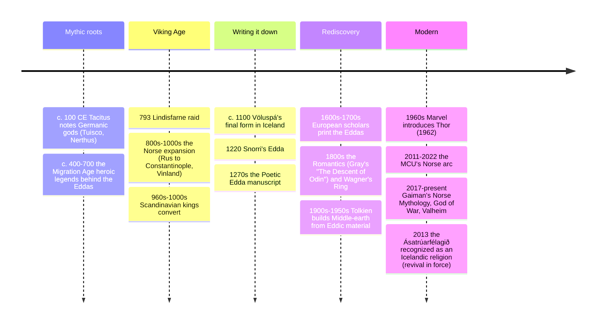

# 14 — Norse Mythology — เทพปกรณัมนอร์ส

> *"Cattle die, kinsmen die, you yourself die the same way. But one thing never dies: the reputation of each who has won it well." (Hávamál 76)**

Norse mythology (เทพปกรณัมนอร์ส) is the belief and story-system of the Germanic North: the gods of Asgard, the world-tree Yggdrasil, the nine worlds, the trickster-god Odin's hunger for wisdom, Thor's defense of humankind, and the terrible certainty of Ragnarök — the twilight of the gods in which Odin, Thor, and most of the pantheon die, the world sinks into the sea, and then emerges green and empty for a new beginning. It took shape among the Scandinavian peoples, was carried to Iceland (where the Christian scholar Snorri Sturluson wrote it down c. 1220, centuries after the myths were old), and reached us through two books named "Edda": the older anonymous *Poetic Edda* (mythological and heroic poems) and Snorri's *Prose Edda* (a handbook for poets, and thus a summary of the stories).

An adult should care because the Norse layer is everywhere in pop culture right now: Marvel's Thor and Asgard, the video games *God of War: Ragnarök* and *Valheim*, the Wagner operas, Neil Gaiman's novel, Tolkien's dwarves and elves (names directly borrowed from Eddic sources — see [[20_Mythology_in_Modern_Culture]]), and the everyday English calendar: Wednesday is Odin's day (Woden's), Thursday Thor's, Friday Freya's (or "free-man's"), and "scandal" and "skulduggery" and "law" carry Viking roots into Thai-English too.

---

## 1 | The cosmology: Yggdrasil and the nine worlds

The cosmos is an ash tree, Yggdrasil, with nine "worlds" arranged in three tiers around it, held in tension and slowly being eaten (a rat at the root, an eagle at the top, a squirrel carrying insults between them — the Eddas' dry humor).

| Tier | Worlds | Who lives there |
|---|---|---|
| Upper | **Asgard** (realm of the Aesir gods), **Vanaheim** (the Vanir: fertility gods), **Alfheim** (light elves) | Gods and noble spirits; Asgard is walled and guarded |
| Middle | **Midgard** (humanity's world, ringed by ocean), **Jötunheim** (the giants), **Vanaheim** (shared), **Álfheim** (dwarves in some lists) | Humans in an enclosed world; the giants (jötnar) beyond, older and wilder than the gods |
| Lower | **Hel/Niflheim** (the cold mist-world of most dead), **Muspelheim** (fire-world), **Svartalfheim** (dwarves) | Hel, the dish, rules the dead who don't die in battle; the fire-world's flames will end everything |

- **The three Norns** (Urðr, Verðandi, Skuld — "was, is, shall be") water the tree and carve fate for gods and humans alike; even Odin cannot escape wyrd.
- **The bridge Bifröst** (the rainbow, burning, guarded by Heimdall) links Midgard and Asgard — and will shatter at Ragnarök.
- **Two god-races:** the **Aesir** (Odin, Thor, Tyr — order, war, sovereignty) and the **Vanir** (Njörðr, Freyr, Freyja — fertility, sea, wealth); after an early war they merged and gave hostages, which is why the Vanir live in Asgard.

## 2 | The gods (and their cost)

| God | Thai | Domain | Signature story | The cost |
|---|---|---|---|---|
| Odin (โอดิน) | the Allfather, wisdom, war, poetry, the dead, magic (seiðr), runic knowledge | Hanged nine nights on Yggdrasil to win the runes; gave an eye at Mímir's well for wisdom; rides the eight-legged Sleipnir; accompanied by two ravens, Thought and Memory, who bring him the world's news | Wisdom is always bought with suffering |
| Thor (ธอร์) | thunder, storms, strength, protector of gods and humans | The fishing for the World Serpent; the journey to Útgarða-Loki (defeated by illusion — humility for the strong) | His hammer Mjölnir; the giants are his daily war |
| Loki (โลกิ) | trickster, blood-brother of Odin, shapeshifter | Slept as a mare to save Odin's stolen horse (Sleipnir's "mother"); cut Sif's hair and had the dwarves make Thor's hammer; bound with his son's venom for Baldr's death | The necessary chaos: helps the gods, destroys them |
| Freyja (เฟรยา) | love, beauty, fertility, seiðr, war-dead | Rides a chariot of cats; gets half the battle-slain (the other half to Odin); weeps tears of gold for her absent husband Óðr | A Vanic goddess more powerful in the old tales than Marvel admits |
| Baldr (บัลเดอร์) | the shining one, light, purity | The invulnerability-after-dream and the mistletoe: Loki learns only mistletoe was omitted from all things' oath not to hurt him, and tricks the blind Höðr into killing him | The death that starts the end |
| Tyr (ทิว) | law, oaths, heroic glory | Bound the wolf Fenrir by putting his hand in its mouth as a pledge — losing the hand to keep the god's word | Order's price |
| Heimdall (เฮมดัลล์) | the watchman | Born of nine mothers, needs less sleep than a bird, will blow Gjallarhorn at Ragnarök | The guard of the bridge |
| Frigg (ฟริกก์) | Odin's wife, foreknowledge, mother of Baldr | Knew her son's fate and extracted oaths from all things (forgetting the mistletoe) | Knowing and being powerless |
| The dwarves | smiths of the cosmos | Made Mjölnir, Odin's spear Gungnir, Freyja's necklace Brísingamen, and the golden arm-ring | Making the gods' treasures out of cleverness |

## 3 | Ragnarök: the twilight of the gods

| Stage | What happens |
|---|---|
| The Fimbulwinter | Three winters with no summer between; society collapses, brothers fight |
| The bonds break | Fenrir (the wolf grown huge) bursts free; the World Serpent Jörmungandr rises from the sea; Loki's binding ends |
| The sailing | Naglfar, the ship of dead men's nails, carries the giants to the plain of Vígríðr; Heimdall blows the horn |
| The battle | Fenrir swallows Odin; Thor kills the Serpent and staggers nine steps from its poison before falling; Tyr and the hound Garmr kill each other; Loki and Heimdall kill each other; Surtr's fire engulfs all |
| The sinking | The sun darkens, stars vanish, the earth sinks into the sea |
| The renewal | A new earth rises, green and fair; Baldr returns from Hel; two humans (Líf and Lífþrasir) hide in a wood and re-peopple; the surviving young gods inherit the world |

**Why it matters to the story-system:** unlike almost every other pantheon, the Norse gods *lose*. They know the ending and keep fighting anyway. This is the "Northern courage" theme (Tolkien's phrase) — a heroic pessimism that makes Odin's wisdom-hunger and Thor's endless war tragic and noble at once, and it's why Ragnarök reads so modern ([[12_What_Is_Mythology]]: the dying-and-rising pattern at cosmic scale; [[19_Universal_Mythic_Archetypes]]: the cosmic flood/fire).

## 4 | The sources (and their one big filter)

| Source | Who | Date | What it gives us |
|---|---|---|---|
| Poetic Edda (Codex Regius) | anonymous compilers | poems c. 900-1100, manuscript c. 1270 | The mythological poems (Völuspá, Hávamál) and heroic lays; the oldest voice |
| Prose Edda | Snorri Sturluson (Christian, Icelandic lawspeaker) | c. 1220 | The systematic narrative (Gylfaginning), poetics (Skáldskaparmál); Snorri's rationalizing frame: euhemerized gods as great human chiefs from the East ([[12_What_Is_Mythology]] §6) |
| Sagas | Sturlunga and family sagas | 1200s | Myth and pre-Christian practice embedded in prose fiction (e.g. Egils saga Skallagrímssonar) |
| Archaeology & runestones | — | 700-1100 | Blót sites, weapon deposits, the Oseberg ship-burial, runic inscriptions; the actual religion beneath the books |
| Adam of Bremen, Arab travelers | outsiders | 1000s | Temple descriptions (Uppsala), the Rus (Rus' trade routes), and Ibn Fadlan's famous ship-burial eyewitness report |

**Caution:** the sources are 200-400 years removed from the pagan practice they describe, filtered through Christian Icelanders. Reconstructing "what Vikings believed" is partly archaeology; the literature is the Norse memory of their myths, like the *Kalevala* is Finland's — beautiful, not a field report.

## 5 | Timeline

## 6 | The Norse world in language and daily life

| Carry-over | Example |
|---|---|
| Weekdays | Wednesday = Woden's/Odin's; Thursday = Thor's day (Old Norse Þórsdagr; English keeps Thor while Thai วันพฤหัสบดี names Jupiter instead: the same planet, two myth-layers); Friday = Freya's / "free day" |
| Place names | England's Danelaw (thwaite, -by, -thorpe), Normandy ("north men"), Iceland's entire map |
| Words | anger (Old Norse *angr*), sky, window ("wind's eye"), knife, law, egg, they/them/their (Norse pronouns replacing English ones), ragnarök itself |
| Culture-tourism | Reykjavík's Edda statues, the Uppsala and Jelling sites, Norse Revival tattoos and names — the myths are a living identity market, and sometimes a contested one (see §8) |

## 7 | Why it matters today

- **Pop-culture literacy:** Marvel's Thor, *God of War*, *Assassin's Creed: Valhalla*, *Vinland Saga*, and the Viking-heavy fantasy shelf all take their names and plot-shapes from the Eddas; the difference between the source and the screen version (Loki as a gender-fluid truth-teller, Freyja's true power, Odin as a not-nice Allfather) is a whole fun critical exercise ([[20_Mythology_in_Modern_Culture]]).
- **Tolkien's inheritance:** Middle-earth's dwarves, elves, the rune-lore, and the "Northern courage" ethos are direct Eddic borrowings; reading the myths is reading the source of modern fantasy.
- **Ethics of mortality:** the Norse frame — the gods will die, so make a good name — is one of history's bleakest and most honest religious offers; modern readers find it surprisingly clarifying.
- **History's contact with Thailand:** the Rus trade routes reached the Caspian and Baghdad; Viking silver hoards in Sweden, Arab coins found as far as Vietnam's Óc Eo, and Ibn Fadlan's report are evidence of the Viking world's reach across the very trading zone that shaped Southeast Asia.

## 8 | The problem to know: the Norse myths and the far right

The Viking imagery (Mjölnir, the runes, Vinland) has been repeatedly co-opted by white-supremacist and neo-pagan movements (the Eddas' racial misreadings; the "Odinist" fringe). Serious Heathenry/Ásatrú — a recognized Icelandic religion with a temple under construction at Öskjuhlíð, and pacifist, eco-focused congregations elsewhere — actively opposes this. Knowing the myths *well* is the best defense: the actual Eddas condemn the proud giant-killer who forgets his own limits, and their gods are flawed, mortal, and multi-ethnic by their own admission (the gods married giants and Vanir constantly). A comparative-religion reader brings the same skill to [[13_Greek_Mythology]]'s and [[16_Mesopotamian_Mythology]]'s modern misuses.

## 9 | Further reading

- *Norse Mythology* (Neil Gaiman, 2017): the BOK's essential retelling — accurate, funny, modern English; the best gateway.
- *The Poetic Edda* trans. Carolyne Larrington: the primary poems (Völuspá, Hávamál) in clear prose.
- *The Prose Edda* trans. Anthony Faulkes: Snorri's handbook, with the myths as narrative.
- *The Viking World* edited by James Graham-Campbell (Routledge): the archaeology underneath the literature.

## Related

- [[12_What_Is_Mythology]]: the hero's journey and dying-and-rising gods
- [[13_Greek_Mythology]]: the sibling canon (Hamilton treats them together)
- [[19_Universal_Mythic_Archetypes]]: trickster (Loki), world-tree, flood-ends-the-world
- [[20_Mythology_in_Modern_Culture]]: Marvel, games, Tolkien
- [[World Literature/13_American_Classics|American Classics]] (Tolkien and the modern epic of the North)
- [[Social Studies/04 History/02_World_History_and_Civilizations|World History]]: the Viking Age in the medieval world
- [[15_Egyptian_Mythology]]: the other afterlife-map religion (weighing vs the halls)
