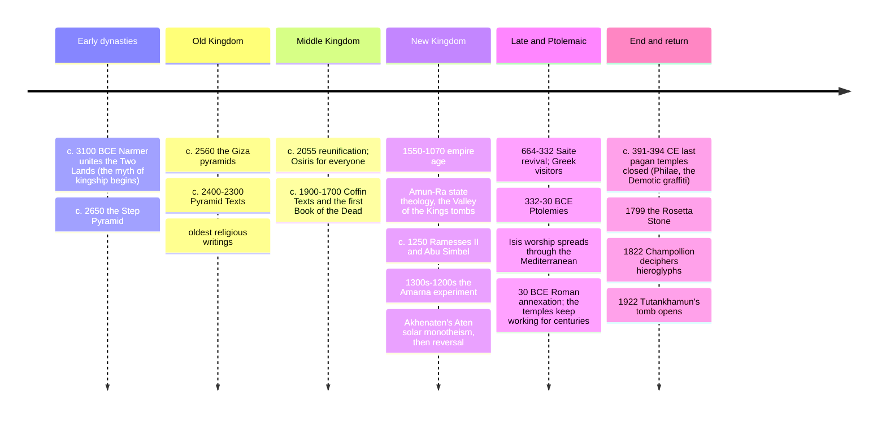

# 15 — Egyptian Mythology — เทพปกรณัมอียิปต์

> *"I have not done harm. I have not robbed. I have not lied... I know. I am pure." (the negative confession, Book of the Dead, spell 125, abridged)**

Egyptian mythology (เทพปกรณัมอียิปต์) is the sacred story-system of one of the longest-lived civilizations in history: three thousand years of pharaohs along the Nile (c. 3100-30 BCE), whose religion centered on the sun's daily death and rebirth, the annual flood's death and return of fertility, and — most intensely — the dead's journey past judgment into a preserved afterlife. Its gods are animal-headed because they carry *aspects of creation*: a sky-vulture, an ibis of measurement, a jackal of the cemetery's edge, a hippo of dangerous parturition. Its great myths are the Osiris cycle (murder, dismemberment, resurrection, and the first mummy) and the daily solar voyage through the underworld. Its most famous artifact, the Book of the Dead, is the world's oldest continuously used genre: a user's manual for dying, copied from the earlier Pyramid Texts (c. 2400 BCE, the oldest religious writings on Earth) and Coffin Texts.

An adult should care because Egypt is the mythology of monuments everyone visits — Giza, Luxor, Tutankhamun's mask — and each monument is a myth in concrete: the pyramid as a petrified sunrise, the tomb as a resurrection machine. It is also the best-documented ancient argument for moralized afterlife judgment (the weighing of the heart, §4), which connects directly to the comparative line traced from [[09_Zoroastrianism]] and [[11_Comparative_Themes]] §2.

---

## 1 | Why the myths look the way they do

| Feature | Explanation |
|---|---|
| Two lands | Upper (south, valley, vulture/crown) and Lower (north, delta, cobra/crown): the pharaoh's dual crown *is* a myth of unity — Seth vs Horus reenacted as civil war and healing |
| The Nile cycle | Akhet (inundation), Peret (growth), Shemu (harvest): religion as flood engineering in story form; Hapy, god of the inundation, a pot-bellied figure of androgynous plenty |
| Ma'at | Order, truth, justice, the proper weight of things — a goddess and the whole cosmic standard; the king's job is to hold Ma'at back against Isfet (chaos, the desert, Seth) |
| Syncretism | Neighboring gods merge into compound names (Amun-Ra, Ptah-Sokar-Osiris, Ra-Horakhty) and local theologies blend instead of replacing each other — a 3,000-year interfaith conversation |
| Animal heads | Not "animal worship": the head signals the being's nature (falcon = sky and speed; ibis = measurement and writing; jackal = the graveyard's edge; crocodile = the Nile's lethal power) |

## 2 | The great gods and goddesses

| Deity | Form | Domain | Key myth |
|---|---|---|---|
| Ra (Re) | falcon with sun disk | The sun: born at dawn, sails the day-barque, dies at dusk, voyaging the underworld (Duat) at night, reborn at morning | The daily battle with the chaos-serpent Apep; "the sun is Ra's eye" |
| Amun | ram; "the hidden one" | King of gods in the New Kingdom; merged as Amun-Ra (creator sun) | Karnak's state theology |
| Osiris (โอซิริส) | mummified green king | Death, resurrection, agriculture, judgment of the dead | Murdered and dismembered by Seth; reassembled and embalmed by Isis (the first mummy); rules the West (land of dead) and presides at the weighing (§4) |
| Isis (Isis / ไอซิส) | throne-sign or kite | Magic, healing, devotion, motherhood (nurse of Horus) | Searches and reassembles Osiris; conceives Horus by magic; later worshipped from Britain to Rome |
| Horus (โฮรุส) | falcon | Kingship, avenging son, the sky | The contest with Seth for the throne; the "Eye of Horus" (healed by Thoth), later a protection and healing icon |
| Seth (เซต/สุท) | the "Seth animal" | Storms, desert, foreigners, chaos — and strength; Ra's boat-guard at night | The murderer of Osiris, the divine ambivalent: villain and necessary power |
| Nephthys | house+basket sign | Mourning, the night, sister of Isis | Mother of Anubis (in some versions) |
| Anubis | jackal | Embalming, cemeteries, guiding and weighing the dead | Operates the scale in §4; "he who counts hearts" |
| Thoth (โทท) | ibis/baboon | Writing, wisdom, measurement, the moon, judgment's scribe | Invented writing; records the verdict; calms the gods' quarrels |
| Ma'at | woman with ostrich feather | Truth, order, cosmic balance | The feather against which every heart is weighed |
| Bastet | cat/lioness | Home, women, cats — and protective rage | From lioness Sekhmet (plague, war) to gentle cat: the dual nature of the goddesses |
| Sekhmet | lioness | Healing and plague, the sun's fury | Ra sends her against humankind; he stops her with red-dyed beer |
| Hathor | cow/horns+disk | Love, joy, music, drunkenness, motherhood, west (dead's comforter) | Ra's eye as daughter; the "Lady of the Southern Sycamore" |
| Ptah | mummified craftsman | Memphis creator-god who made the world by thought and word; patron of artisans | The Memphite theology (Shabaka Stone): creation as speech — a parallel to John's Logos (§7) |
| Khnum | ram | Potter who wheels-human bodies on the potter's wheel at Elephantine | Fashioning creation on the wheel |
| Hapi | androgynous pot-belly | The inundation itself; "lord of the boundless water" | The annual festival during the flood |

## 3 | The core myths

- **The Osiris cycle (note 15's spine):** Seth hosts a banquet and offers a beautiful chest fitted only to one guest; it is Osiris', who is sealed inside and cast into the river — death of the fertile king. Isis retrieves the body; Seth, furious, cuts it into pieces scattered across Egypt (the origin of the nome cults and of mummification itself). Isis reassembles and re-animates him long enough to conceive Horus; Osiris withdraws to rule the dead; the young Horus, after trials and a divine court, avenges his father and wins the throne — kingship restored, father honored, chaos bound. Every pharaoh was Horus when living, Osiris when dead; every Egyptian hoped to "become an Osiris" in the afterlife.
- **The Ra-Apep night voyage:** each dusk Ra enters the Duat through the western horizon; the dead and the gods aid the barque against the chaos serpent Apep who tries to swallow the sun-boat at the ninth hour; at dawn Ra is reborn as the scarab Khepri from the sky-cow Nut's body. The *Amduat* and *Book of Gates* are illustrated maps of this twelve-hour journey; tomb owners memorized the pass-phrases for each gate.
- **Nut and Geb:** the sky (Nut, stars on her body, arched over the earth) and the earth (Geb) separated by Shu (air) — a creation tableau copied on temple ceilings; the stars are her children swallowed at dusk and birthed at dawn.
- **The Weighing of the Heart (§4):** the judgment scene that made this mythology famous.

## 4 | Death and judgment: the weighing of the heart

| Step | What happens | The equipment |
|---|---|---|
| Preservation | The body kept by mummification so the ka (life-force) and ba (personality-bird) have a home | Natron, resin, canopic jars for the organs; the heart left in place, the brain removed |
| The negative confession | The dead declares innocence before 42 assessors: "I have not oppressed... I have not caused hunger... I have not polluted the river" | Spell 125's litany of specific social sins — an ancient ethical checklist |
| The weighing | Anubis tips the scale: heart (seat of conscience and memory) against Ma'at's feather; if they balance, the claim holds | Ammit (crocodile-lion-hippo, "the Devourer") squats by the scale — a second death for the heavy of heart |
| The verdict | Thoth records; the justified dead ("true of voice") pass to Osiris's kingdom | The Field of Reeds (Aaru): an idealized Egypt, but you still work the land unless you carry shabti figurine-servants |
| The journey's other option | The blessed may also sail with Ra in the solar barque, joining the gods' daily cycle | Pyramid Texts: the king as a star; "you shall not perish in this land" |

> **A note on the heart vs brain:** Egypt located thought and emotion in the *heart* (the ib); the brain was discarded as packing. This makes the judgment scene a direct ancestor of the moral intuition every culture later names: the heart is what gets weighed (compare the Zoroastrian bridge and the Abrahamic books of deeds, [[09_Zoroastrianism]] §2, [[11_Comparative_Themes]] §2).

## 5 | The Book of the Dead: the genre that lasted 2,000 years

| Period | Document | Format |
|---|---|---|
| c. 2400 BCE | **Pyramid Texts** | Carved in royal pyramids (Unas, Pepi II); spells for the king's ascent as a star, a falcon, or by ladder |
| c. 2100-1800 BCE | **Coffin Texts** | Painted on coffins; the afterlife democratized to non-royals |
| c. 1700 BCE onward | **Book of Coming Forth by Day** (what we wrongly call Book of the Dead) | Papyrus scrolls with vignettes (the weighing, the barque, the sycamore of Hathor) — bought to order, personalized with the owner's name |
| Famous spells | 15 (breathing), 26 (heart not testifying against), 30B (heart stand not against me), 125 (the great judgment chapter), 64 (defeating Apep), 17 (the "I am Yesterday and Tomorrow" Ra-hymn) | — |
| Afterlife practicalities | Shabti (answerers/servants), the Opening of the Mouth ritual (reviving the statue so the ba can eat), food lists forever | — |

## 6 | Timeline (myth, monument, rediscovery)

## 7 | Why it matters today

- **The oldest moral judgment scene:** the weighing of the heart is the earliest known image of the dead being judged *ethically*, not by fate or merit of blood: a template that runs toward [[09_Zoroastrianism|Zoroastrian]] and Abrahamic eschatology ([[11_Comparative_Themes]] §2) and still frames how modern cultures picture death.
- **Monotheism's rehearsal:** Akhenaten's Aten revolution (c. 1350-1336 BCE) — one sun-disc god, temples built in the desert, art thrown off its canons — reads either as history's first monotheism or its first personality cult; the debate touches the very questions of [[01_What_Is_Religion]].
- **Literary and film DNA:** Shelley's "Ozymandias," the mummy genre, *The Mummy* (1932, 1999), Rick Riordan's *Kane Chronicles*, Moon Knight (Marvel): Egypt is the myth-culture Western cinema treats as "ancient mystery," and every version is worth spotting against the real corpus (§3-§4).
- **Isis went global:** from a provincial Egyptian goddess to a temple on every Roman shore and possibly the cult that competed with early Christianity (the "Isis and baby Horus" imagery's influence on Madonna painting is debated but visible); understanding her is understanding how religion migrates — the same story as the Buddha's images in [[18_East_Asian_Mythology]] and the Ramayana's migration into [[ภาษาไทย/วรรณคดีและวรรณกรรม/สมัยรัตนโกสินทร์/01_รามเกียรติ์|รามเกียรติ์]].
- **Conservation now:** Nubian temples relocated to save them from Aswan's rising water (Abu Simbel sawn into blocks, 1964-68) — the world's first giant rescue of a mythic landscape, and the origin of UNESCO's World Heritage idea itself.

## 8 | Key concepts and vocabulary

| Term | Thai | Meaning |
|---|---|---|
| Ma'at | ธรรมะ/ความเที่ยงธรรม | Cosmic order and justice; also the goddess of the scale's feather (the Egyptian dharma, compare [[05_Hinduism]]) |
| Isfet | ความชั่ว/โกลาหล | Chaos, injustice, Seth's force: the opposite Ma'at holds |
| Ka | แรงชีวิต | The vital spark fed by offerings; survives with the body |
| Ba | จิต/วิญญาณนก | The personality-bird that flies by day and reunites with the ka |
| Akh | ผู้มีรัศมี | The transfigured, effective dead-one: the goal |
| Duat | แดนคนตาย | The underworld of the sun's night voyage and the judgment |
| Khepri / Ra / Atum | scarab / noon / setting | The sun's three phases as three gods (one Ra) |
| Pharaoh | ฟาโรห์ | Per-aa, "great house": the king as Horus living, Osiris dead, sole bridge to the gods |
| Mummy | มัมมี่ | The preserved house for ka/ba; a resurrection machine, not a curiosity |
| Sarcophagus / tomb / pyramid | หินบรรจุ/หลุมศพ/พีระมิด | The tomb types; the pyramid as the primordial mound and a sun-ray ramp |
| Nome | แคว้น | A province; each kept its god's cult and version of the myths |
| Heka | เวทมนตร์ | Magic as a primordial force even gods use; the third member of the creator triad with Ra and Ptah |

## 9 | Further reading

- *Egyptian Mythology: A Very Short Introduction* (Geraldine Pinch): compact and current.
- *The Complete Gods and Goddesses of Ancient Egypt* (Richard H. Wilkinson): the illustrated reference.
- *The Ancient Egyptian Pyramid Texts* / *The Book of Going Forth by Day* (Faulkner or the Taylor/Oakes translations): the primary voices.
- *1177 B.C.: The Year Civilization Collapsed* (Eric Cline) for the world the New Kingdom ended in — and the Amarna section for §7's monotheism debate.

## Related

- [[12_What_Is_Mythology]]: the dying-and-rising god (Osiris) as the monomyth's seasonal twin
- [[13_Greek_Mythology]]: Greeks meeting Egypt (Herodotus called much of their own mythology imported)
- [[09_Zoroastrianism]] and [[11_Comparative_Themes]] §2: the judgment-of-the-dead comparison
- [[16_Mesopotamian_Mythology]]: the other river-valley parallel (flood and afterlife)
- [[World Literature/02_Ancient_Epics|Ancient Epics]] and [[Social Studies/04 History/12_Ancient_Civilizations|Ancient Civilizations]]
- [[19_Universal_Mythic_Archetypes]]: the great flood vs Apep; death-and-resurrection patterns
- [[04_Judaism]]: the Exodus story's Egyptian backdrop and the Aten debate
