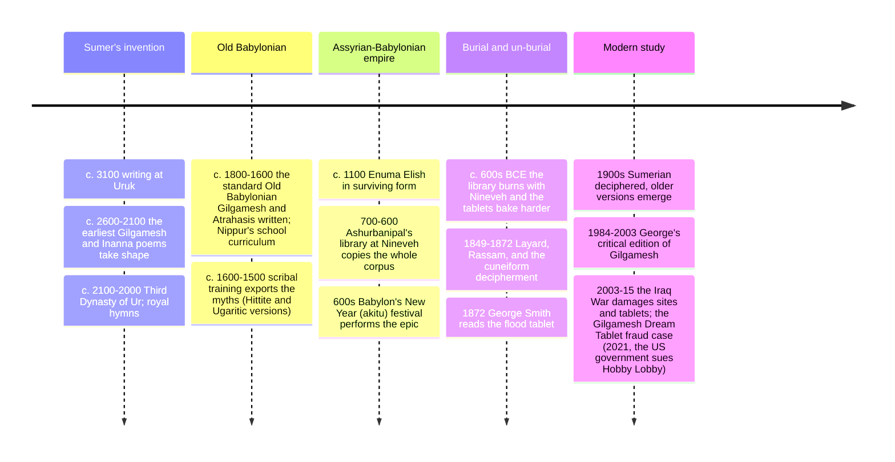

# 16 — Mesopotamian Mythology — เทพปกรณัมเมโสโปเตเมีย

> *"He who saw the Deep, the foundation of the land... came from afar, weary and bereaved. Gilgamesh, the great master of ritual, walker of roads, who sought out the mysteries of life and the final judgment." (Epic of Gilgamesh, opening, standard Babylonian version, abridged)**

Mesopotamian mythology (เทพปกรณัมเมโสโปเตเมีย) is humanity's first *written* mythology: the stories of Sumer, Akkad, Babylon, and Assyria, between the Tigris and Euphrates (modern Iraq), copied onto clay tablets from c. 3100 BCE onward and recoverable only from the 19th century CE. It has two monuments that changed how we read the Bible and every epic since: the **Enuma Elish** ("When on high"), Babylon's creation-by-combat epic, and the **Epic of Gilgamesh**, the world's first great literary hero — a king who oppresses his city, befriends a wild man, goes on quests, loses his friend, and then makes the first recorded journey in search of immortality and fails. When the Assyriologist George Smith read the flood tablet of Gilgamesh aloud to the Society of Biblical Archaeology in 1872, he reportedly stripped off his coat in excitement; the parallel with Genesis (which most of the audience knew by heart) has been argued about ever since.

An adult should care because this is the shared basement of Western myth: the seven-day creation rhythm, the ark story, the garden-and-serpent motif, the measuring of the world, and the "hero who fails" all excavate here; and because the civilizations that wrote these stories also invented the city, the contract, the school, and the library — myth and administration arrived together.

---

## 1 | The world and its gods

| God | Sumerian name | Domain | Mythic role |
|---|---|---|---|
| An(um) | An | Sky, the distant father | King-god in the oldest lists; begets the storm-god with the earth |
| Enlil | (Akkadian Elil) | Wind, air, kingship's giver, the Nippur chief | Decides fates; the one who sends the flood in the Atrahasis myth; too loud, too powerful |
| Enki / Ea | Enki (Akk. Ea) | Fresh deep waters, wisdom, cunning, craft, magic | The god who *always* saves humans: warns Atrahasis/the flood-hero, helps invent humanity, gives Gilgamesh the off-ramps — the Mesopotamian Loki-with-good-heart ([[14_Norse_Mythology]]) |
| Ninhursag / Aruru | Ninhursag | Earth, mother of gods and humans | Creates Enkidu from clay; mother in the paradise-myth of Dilmun |
| Inanna / Ishtar | Inanna (Akk. Ishtar) | Love, war, the planet Venus, the date-stores | Dual nature (sex and slaughter); descends to the underworld (§3); the most beloved and most dangerous goddess |
| Utu / Shamash | Utu | Sun, justice, the all-seeing | Divine judge and oath-guardian; helps Gilgamesh against Humbaba |
| Nergal / Ereshkigal | — | The underworld's lord and lady | The land of no-return ruled by Ereshkigal, sister of Inanna |
| Marduk | — | Babylon's patron, "king of the gods" after Enuma Elish | Slays Tiamat (chaos-sea); builds the world from her body; the theological reason Babylon replaced Nippur (§4) |
| Ashur | — | Assyria's national god | The empire's Marduk, without Babylon's universalism |
| Nabu | — | Writing, wisdom, Marduk's son | Records destinies on the tablets at the New Year festival (the akitu, §6) — the divine scribe, like Thoth in Egypt ([[15_Egyptian_Mythology]]) |

## 2 | The Enuma Elish: creation as coup d'état

The Babylonian epic (c. 1100 BCE in its surviving form, older at its core; recited in the New Year festival) in five moves:

1. **Beginnings:** nothing but mingled waters — Apsu (fresh) and Tiamat (salt), first beings born from them; the young gods' noise outrages Apsu, who plots to kill them; Ea outwits and imprisons him.
2. **The war:** Tiamat, avenging, raises an army and makes her new consort Kingu her general with the "tablets of destiny." The gods balk until young Marduk volunteers — on condition he becomes supreme.
3. **The duel:** Marduk nets Tiamat, shatters her with arrows and the evil wind; splits her body "like a dried fish": half as sky, half as earth; pins her legs to the mountain-sides; her tears the Tigris and Euphrates.
4. **Order:** Marduk fixes the year, months, days, stations of the stars, the moon's phases, the stations of the gods — creation as cosmological administration (compare Egypt's Ma'at, [[15_Egyptian_Mythology]] §1).
5. **Humans:** rebelling gods are punished; Ea, at the council, creates humankind from the slain rebel's blood and divine spirit "so the gods could rest." Humanity's purpose: temple service. The epic ends with Marduk's fifty names.

> **The pattern it names:** "chaos-monster combat" as creation (Marduk-Tiamat, Zeus-Typhon, Thor-Jörmungandr, Indra-Vritra in the Vedas, even Revelation's dragon: see [[13_Greek_Mythology]], [[14_Norse_Mythology]], [[19_Universal_Mythic_Archetypes]]) — order built by defeating a watery "she-dragon." Comparative mythologists still argue whether the shape is memory of real floods or a structure of the human mind (compare [[12_What_Is_Mythology]] §3).

## 3 | Inanna/Ishtar and the underworld

The most powerful single poem from ancient Iraq (Sumerian versions c. 1900 BCE): Inanna, dressed as her full cosmic self, descends through seven gates to visit her sister Ereshkigal, queen of the land of no-return. At each gate the warder strips one garment or crown; she arrives naked, "a corpse hung on a hook" on judgment. The gods arrange rescue; but the underworld demands a substitute: she returns to find her husband Dumuzi *not mourning* — and, in rage and grief, sends demons to take him in his place. (Two annual halves: he goes below, she lets his sister take his turn — hence the year's barren and fertile seasons.) The poem is at once an agricultural myth (shepherds and seasons), a love-and-loss story, and the fullest ancient map of descent, grief, and the price of returning: the template for every katabasis, Orpheus and Persephone included ([[13_Greek_Mythology]], [[19_Universal_Mythic_Archetypes]]). Ishtar's later Greek afterlife as Aphrodite-with-teeth is one of the most documented transmissions in religious history.

## 4 | Gilgamesh: the first novel in verse

| Tablet-group | Story | The meaning |
|---|---|---|
| I-V, Uruk | King Gilgamesh, two-thirds divine, tyrant of Uruk; the gods make Enkidu, wild man of the steppe; he is "civilized" by a temple woman (Shamhat), then wrestles Gilgamesh to a draw; they become soul-friends (the first written friendship, and arguably first love story) | Power balanced by wildness; friendship as the maker of humanity |
| IV-V | The pair travel to the Cedar Forest to kill its guardian Humbaba, the howling monster; Enkidu falters, Shamash helps, and they win — but the killing offends Enlil | Glory with guilt: the first hero who over-reaches against the divine order |
| VI-VII | Ishtar proposes to Gilgamesh; he refuses her, listing her destroyed lovers; she begs her father for the Bull of Heaven; the pair kill it; the gods sentence Enkidu to die | Civilization's bargains with love and violence; the curse of fame |
| VIII-XI | Enkidu's long dying and funeral; Gilgamesh, terrified of his own death, wanders the world in animal skins to find Utnapishtim, the flood-survivor granted eternal life; crosses the waters of death (with Urshanabi the ferryman and the stone things), learns of the plant of heartbeats at the ocean floor, gets it — a snake steals it while he bathes; "it was all for nothing" | The oldest treatment of grief, mortality-anxiety, and the failed immortality quest |
| XII (and frame) | Return to Uruk; the "stones" he carries are his own story; the epic circles to praise the city walls and the king's name | What survives a human is the city and the tale — kleos in Akkadian ([[13_Greek_Mythology]] §5) |

**The flood tablet (XI):** Utnapishtim tells how Enlil decided to drown humanity; the loyal-to-humans Enki leaked the plan through a reed wall ("listen, wall"), built him a cube-ark, and he rode the storm with seed of beasts; raven and dove return the same way as in Genesis 8; the gods, hungry from un-fed sacrifice, swarm like flies; and the gods give the survivors eternal life and scatter the rest. The direct parallels and the crucial differences (one capricious decision vs one righteous judgment; many gods vs one) make this the classic case study of Mesopotamian-Israeli influence ([[04_Judaism]] §9 and [[19_Universal_Mythic_Archetypes]] §2).

## 5 | Other first-class stories of the corpus

| Story | Content | Why it's kept |
|---|---|---|
| Atrahasis Epic | Humanity created as labor-saving; population noise annoys Enlil; plague, drought, then the flood plan, twice countered by Enki; ends with the invention of infertility, infant mortality, and taboo-priestesses so humans stay controllable — a sociology of divine irritation | The flood's full prequel; the oldest theodicy |
| Etana | A king ascends to heaven on an eagle for a heir's herb-of-life, falls for lying | Icarus' older brother; the oldest "spaceflight" myth |
| Adapa | The wise man offered food of life by Anu, refused on Ea's advice (a trick? or protection?), so loses immortality | The failed-eaten-paradise myth; Genesis-adjacent debates |
| Descent of Inanna (§3) and the marriage of Dumuzi | The love-and-season cycle | Liturgical basis of fertility cults |
| The Death of Ur-Nammu & Nergal and Ereshkigal | Underworld journeys and the making of the below | Sumerian chthonic geography |

## 6 | Timeline (the corpus and its recovery)

## 7 | Why it matters today

- **The Bible's neighborhood:** Genesis's creation days, its sabbath rhythm, the ark, the garden, the tower (Etemenanki, Babylon's ziggurat, the likely Babel image), even the "clay from the ground" anthropogony — all have Mesopotamian analogues or antecedents. Reading Gilgamesh next to Genesis is the clearest object lesson in [[12_What_Is_Mythology]] §3's theories, done with primary texts.
- **The first great failure:** the immortality quest teaches that the oldest surviving epic is about *losing well* — civilization, friendship, and memory as the consolation prizes for mortality. It is the anti-monster-slaying hero tale ([[12_What_Is_Mythology]] §4's honest caveats in practice).
- **Cultural property:** the 2003 looting of the Iraq Museum, ISIS's smashing of Mosul's Nergal gate (2015), the US government's 2021 seizure of the forged Gilgamesh Dream Tablet from Hobby Lobby's collection, and the returned Ark of the Covenant-style artifacts from US custody make the tablets the front line of the heritage-vs-nationalism argument (compare note 10 §6).
- **The legal layer beneath the myth:** the same culture that wrote the Enuma Elish wrote the earliest law codes and the first contracts; the Mesopotamian mind saw cosmos as administration (Marduk fixing calendars, Nabu's destiny-tablets — the heavenly bureaucracy reappears in Chinese folk religion, [[07_Chinese_Religious_Traditions]] §4).

## 8 | Key concepts and vocabulary

| Term | Thai | Meaning |
|---|---|---|
| Cuneiform | อักษรลิ่ม | Wedge-shaped script pressed into clay; the medium that saved the myths |
| Me | มี | The divine decrees/protocols: the operating system of civilization (Inanna steals them from Enki for Uruk) |
| Tablets of destiny | แผ่นจารึกโชคชะตา | The charter of kingship the gods transfer (Kingu to Marduk to Ashur) |
| Apsu / Tiamat | น้ำจืด/น้ำเค็มเดิม | The prime fresh and salt waters: the chaos couple |
| Anunnaki / Igigi | คณะเทพ | The sky- and earth-pantheons' collective laboring gods |
| Kabtu | ดาวเคราะห์/เทพ | The "binding knots" — the fixed stars as gods' stations |
| Kishar | ชักร | The totality of the heavens in the epic's theogony |
| Tunnug | เสียงกลองคำ | The great drum that summons the gods' assembly (Nippur) |
| Akitu | ปีใหม่ของบาบิโลน | The New Year festival (11 days) re-enacting the epic and re-enthroning the king |
| Lamassu | อสูรยาม | The winged bull-lion palace guardians |
| Ut-napishtim / Ziusudra / Atrahasis | ผู้รอดจากน้ำท่วม | The three names of the flood-survivor in the three versions |

## 9 | Further reading

- *Myths from Mesopotamia* (Stephanie Dalley, Oxford World's Classics): the whole corpus, well translated, readable; the single best entry.
- *The Epic of Gilgamesh: A New Translation* (Andrew George, 2003): the scholarly standard restored text.
- *A History of the Ancient Near East, c. 3000-323 BCE* by Marc Van De Mieroop: the historical frame for §§2 and 6.

## Related

- [[12_What_Is_Mythology]]: the oldest written case the monomyth-theorists start with
- [[13_Greek_Mythology]]: the succession-myth and flood parallels from east to west
- [[15_Egyptian_Mythology]]: the other river-valley system, neighbor and rival
- [[04_Judaism]]: Genesis read side by side with Babylon
- [[19_Universal_Mythic_Archetypes]]: flood, underworld journey, dying shepherd
- [[World Literature/02_Ancient_Epics|Ancient Epics]]: Gilgamesh's place in the epic canon
- [[Social Studies/04 History/12_Ancient_Civilizations|Ancient Civilizations]]: the historical Mesopotamia
- [[01_What_Is_Religion]]: the oldest written religion available for description
