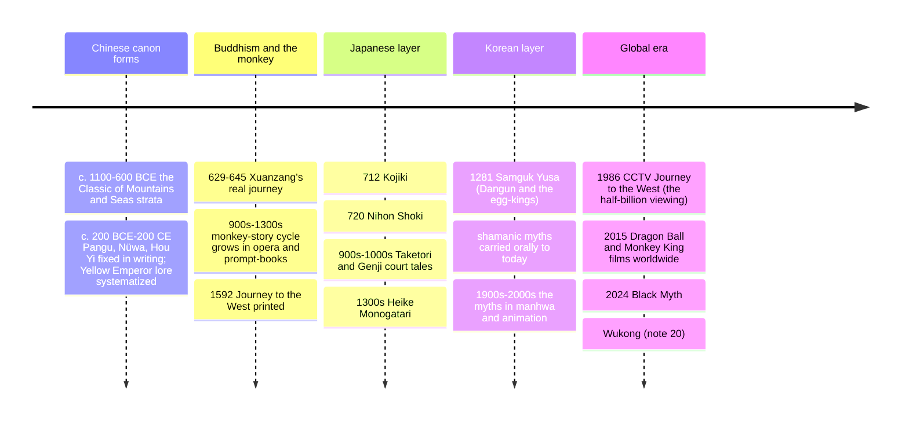

# 18 — East Asian Mythology — เทพปกรณัมเอเชียตะวันออก

> *"Heaven bore down with the task of government; the deities received the command and ruled." (Kojiki, on the first heavenly gods)**

East Asian mythology (เทพปกรณัมเอเชียตะวันออก) is the story-layer of the Chinese-Japanese-Korean sphere: the cosmic eggs and axe-work of Pangu (盘古), the emperor-culture heroes Yu the Great and the Yellow Emperor, the Jade Emperor's bureaucracy, the goddess Mazu and the eight immortals — and the greatest single adventure novel the region produced, **Journey to the West** (ไซอิ๋ว), the Monkey King's redemption-quest. Japan's side begins with the **Kojiki** (712), the oldest surviving Japanese book, whose kami-myths (Izanagi and Izanami churning the islands from the sea, Amaterasu hiding in the cave) underwrite the imperial line and Shinto ritual ([[08_Shinto_and_Japanese_Traditions]]), and runs through the court tales, the Heike war-epic, and the fox and dragon stories that still animate anime. Korea's foundation myth — the bear that kept a sacred fast, became a woman, and married heaven's son to found Gojoseon — completes the circle.

An adult should care because Sun Wukong (ซุนหงอคง), the Monkey King, is one of the most recognizable fictional beings on Earth (Dragon Ball's Son Goku takes his name, his cloud, and his extending staff), because the East Asian calendar millions of Thais follow is loaded with these myths (the Kitchen God's report, the Queen Mother's peaches, Chang'e and the Mid-Autumn moon), and because the Kojiki's cave-story and Izanagi's journey into death are among the world's most elegant creation-and-afterlife myths ([[19_Universal_Mythic_Archetypes]] has the comparison worksheet).

---

## 1 | Chinese creation and the culture-heroes

| Myth | Content | Meaning |
|---|---|---|
| Pangu (盘古) | The cosmic egg: Pangu grows inside for 18,000 years, separates heaven and earth with his body until they can no longer close; at death his breath becomes wind, voice thunder, eyes sun and moon, blood rivers, fur stars — and the insects from his body become humanity | Body-of-the-giant creation (the same pattern as Ymir in [[14_Norse_Mythology]] and Purusha in [[05_Hinduism]]: [[19_Universal_Mythic_Archetypes]]) |
| Nüwa (女娲) | The goddess molds humans from yellow clay (the nobles by hand, the masses by dragging a rope through mud); later patches the broken sky with colored stones after Gong Gong cracks the pillar-mountain in a rage | Creation by craft + cosmic repair; a female sky-savior rare in world myth |
| The Three Sovereigns | Suiren (fire), Fuxi (bagua, marriage), Shennong (agriculture, the herbal poison-tests; the "Burning Emperor") | Culture-kings who invent the arts — the Chinese etiology genre |
| The Yellow Emperor (黄帝, Huangdi) | The semi-historical warlord-god; defeats Yan at Banquan and Chi You (the metal-headed bronze-forehead rebel with fog-magic) at Zhuolu; his officials invent the calendar, medicine, silk (his wife Leizu), and writing (Cangjie, whose invention made ghosts weep at night) | Ancestor of the "sons of Han"; myth as the origin of civilization's toolkit |
| Yu the Great (禹, Da Yu) | Tames the Great Flood not by damming but by dredging channels, working thirteen years without going home past his own door; receives the Mandate of Heaven; founds the Xia and casts the nine cauldrons | Anti-Noe flood myth: water conquered by engineering and self-sacrifice (note 19 §2's flood comparison) |
| Hou Yi and Chang'e (后羿, 嫦娥) | Ten suns (the Jade Emperor's careless sons) scorch the earth; the archer Hou Yi shoots nine down; his wife Chang'e, fleeing or greedily, takes the immortality elixir and rises to the moon; they are granted one night a year (the Mid-Autumn) | The archer-who-repairs-the-cosmos; the moon as lover's exile; the festival Thais see at every Chinatown |
| The Weaver Girl and the Cowherd (牛郎织女) | Two stars in love, separated by the Silver River (the Milky Way); once a year the magpies form a bridge for one night | The Qixi festival: China's valentine from astronomy (see [[World Literature/20_Childrens_Classics_and_Folk_Tales|folk tale]]) |

## 2 | The Jade Emperor's bureaucracy

Chinese myth's signature move is administration: heaven runs like the Tang-Song state, with ministries, rank, audits, and paperwork.

| Institution | Mythic form | Story that shows it |
|---|---|---|
| The Jade Emperor (玉皇, Ngok Hoang) | Heaven's emperor-bureaucrat (from Song-era cult onward; older myth had Di or Shangdi) | The Monkey King's challenge — "heaven and earth change; nothing lasts" — is a revolt against paper-rank |
| The Kitchen God (เทพเจ้าเตา) | Reports each household's year to heaven at New Year; bribed with sticky candy so his words stick to sweetness | The family's annual audit; compare Anubis' weighing ([[15_Egyptian_Mythology]]) and the Zoroastrian bridge |
| The City God (chenghuang) | A real bureaucrat posthumously appointed to run the invisible half of a city | Chinese religion as mirror-government (see [[07_Chinese_Religious_Traditions]] §4) |
| King Yama (閻王, Yim Wong) and the ten courts | The Indian Yama re-made as China's death-court system: each court audits one sin; reincarnation by verdict | Buddhism's karma absorbed into a judicial bureaucracy; compare Qingming sustenance ([[07_Chinese_Religious_Traditions]] §4) |
| The Eight Immortals (โป๊ยเซียน/八仙) | A woman, a general, a disabled elder, a youth, an empress-figure, a beggar, a soldier, a scholar — the spectrum of humanity, each with a symbol | "Crossing the sea each on his own method": the Daoist proof that liberation is plural |
| Mazu (妈祖, เจ้าแม่ทับทิม) | A Fujian girl who saved sailors and was promoted through imperial ranks to heaven's navy | Gods can be *hired*: the bureaucratic logic of divinity; Thailand's old Leng Buai Ia shrine |

## 3 | Journey to the West (ไซอิ๋ว): the Monkey King

| Layer | Detail |
|---|---|
| The book | Novel attributed to Wu Cheng'en, 1592, in 100 chapters; based on the real monk Xuanzang's 629-645 CE silk-road trip to India for Buddhist scriptures, and centuries of opera and story cycles before it |
| The frame | The monkey born from a heaven-fruit stone wins the Water Curtain Cave, learns Daoist immortality tricks, gets the size-changing iron rod (a sea-calibration pillar), erases his name from death's ledger, then storms heaven, defeats its armies, and is trapped under Five Elements Mountain by the Buddha for 500 years |
| The quest | The monk Tang Sanzang (ถังซำจั๋ง) is sent to fetch scriptures from India; his disciples: Sun Wukong (ซุนหงอคง, Wukong the Aware-of-Emptiness — the name is the point), the pig-demon Zhu Bajie (ตือปาเจก, gluttony with a heart), the river-ogre Sha Wujing (ซัวเจ๋ง, steady), and the dragon-horse |
| The engine | 81 ordeals: each demon is a spiritual state or a heavenly servant's pet gone feral; the journey is a body trying to become a buddha; comic, violent, bureaucratic, and doctrinal at once (the three vehicles of Buddhism argued in comedy) |
| The ending | Wukong, once "Great Sage Equal to Heaven," becomes the Victorious Fighting Buddha; the monk's faithfulness, the pig's appetites, the ogre's patience — the team is one person's psyche |
| Afterlife | Every Asian kid's first hero: Dragon Ball's Goku (his name, his cloud, his extending staff), the 1986 TV series watched by half of China, the 2015 film *Monkey King: Hero Is Back*, and now Black Myth: Wukong (2024, see note 20) |

## 4 | Japan: the Kojiki and the narrative tradition

| Myth | Content | Function |
|---|---|---|
| The divine marriage and the islands | Izanagi and Izanami stir the sea with the jeweled spear; drops become the Japanese islands; their next children are the kami of everything (mountains, wind, food) — then fire kills Izanami | Cosmogony by generative act; the land is literally born of a divine couple |
| Izanagi's descent | He goes into Yomi (the dead-land) to fetch her, breaks the taboo of seeing her rotting form, flees, and purifies himself in a river — the washing produces Amaterasu (sun, from his left eye), Tsukuyomi (moon), Susanoo (storm) | The world's first death-pollution and purification; kiyome's origin myth ([[08_Shinto_and_Japanese_Traditions]]) |
| Amaterasu's cave | Susanoo's rampage breaks her loom-peace; she hides in the rock-cave and the world goes dark; the gods stage a bawdy dance (Ame-no-Uzume strips, everyone laughs) and lure her out with a mirror and the first rooster | Solar eclipse myth + the origin of ritual dance and theater — myth that founds performance |
| The rice-gift and descent | Her grandson Ninigi is sent to rule with the mirror, jewel, and sword (Japan's regalia) and a bride; his great-grandson is Jimmu, the first emperor (660 BCE traditional) | The imperial charter and the Japanese "age of the gods" periodization (compare the five ages in [[13_Greek_Mythology]] §1) |
| Susanoo and the serpent | The banished storm-god finds a family whose daughters the eight-headed Yamata-no-Orochi eats yearly; he gets the serpent drunk on eight vats of sake, slays it, and finds the sword Kusanagi in its tail | The chaos-monster combat on Japanese ground ([[16_Mesopotamian_Mythology]] §2's pattern) |
| Okuninushi and the land | The earth-ruler who builds Izumo and loves many wives, then "surrenders" the land to heaven's emissaries on condition of a great shrine | The political myth of Izumo vs Amaterasu: conquest retold as transfer |

**The court literature that grew from it:** *Taketori Monogatari* (the moon-maiden Kaguya, c. 900s — Japan's oldest tale), *Genji Monogatari* (Lady Murasaki, c. 1010, the world's first novel — see [[World Literature/17_Asian_Literature|Asian Literature]]), the fox-kitsune and dragon-king (Ryūgū-jō, where Urashima Tarō visits the sea-palace and loses 300 years while a single day passes above — Japan's Rip Van Winkle in the oldest form), and the war-epic *Heike Monogatari* (the impermanence chant, the Lotus Sutra's sound in a tale of one clan's fall). The ghost-story tradition (yūrei, the 47 rōnin's loyalty, the onryō tradition — vengeful spirits like the disgraced emperor Sutoku and the slandered scholar Michizane (Sugawara no Michizane), pacified into shrines as guardian kami) is the Japanese half of note 10's ancestor-religion.

## 5 | Korea (and the edges)

| Myth | Content | Note |
|---|---|---|
| Dangun (ดัน군) | Hwanung, son of heaven, descends to Baekdu mountain; a bear and a tiger seek to become human; the bear keeps the garlic-mugwort fast for 100 days and becomes a woman; their son Dangun founds Gojoseon (2333 BCE traditional) | The bear-founding myth; national-identity charter; still on Korean passports' imaginary |
| The egg-born kings | The Samguk Yusa's other charter myths: King Al of Gaya hatches from a golden egg from the sky; the three kingdoms' founders are heaven-sent | Founding myths as heavenly investiture: Korea's version of the divine-king motif (compare [[15_Egyptian_Mythology]]) |
| The Baridegi myth | The shaman-founder who dies, descends to the underworld, and returns to open the path of ritual for the living | Korea's katabasis and the charter myth of its mudang shamans; compare note 10's Siberian initiation |
| The East Sea Dragon King and Heung vs Bu | The benevolent dragon-king of the undersea palace rewards the generous brother Heung and punishes the greedy brother Bu | The dragon-realm shared with Japan's Urashima and China's Hai-Long-Wang (the Monkey King borrows his staff from that palace) |

## 6 | Timeline

## 7 | Key concepts and vocabulary

| Term | Thai | Meaning |
|---|---|---|
| Kami (神) | เทพ/สิ่งศักดิ์สิทธิ์ | The Japanese sacred beings ([[08_Shinto_and_Japanese_Traditions]]) |
| Xian (เซียน) | ผู้วิเศษ/อมตะ | The Daoist transcendent immortals |
| Long wang (มังกร) | พญานาค/มังกร | The dragon-kings of the four seas: water, rain, and treasure's authority |
| The Four Heavenly Kings | ท้าวจตุโลกบาล | 四大天王 | The direction-guardians borrowed from Buddhist cosmology, standing at every Chinese temple gate |
| Tian (天) | ฟ้า/เทวะธรรม | Heaven's moral mandate in myth and politics ([[07_Chinese_Religious_Traditions]]) |
| Fengshen (封神) | การเลื่อนเป็นเทพ | The deification register: the Investiture of the Gods novel makes the Shang-Zhou war a roster of new appointments to heaven | Myth as bureaucracy-making |
| Yōkai (โยไก) | อสูร/ผีญี่ปุ่น | The Japanese strange-beings catalog (kitsune foxes, tanuki, kappa) — animism as encyclopedia ([[10_Indigenous_and_Animist_Traditions]]) |
| Ryūgū (ราชวังมังกร) | ราชวังใต้ทะเล | The undersea palace: Urashima's visit, the source of the Monkey King's staff, keeper of the tide-controlling jewels |
| The Eighteen Levels | นรก 18 ขุม | The Chinese-Korean hell-court geography of eighteen punishment levels — popular Buddhism's underworld map |
| The headband | สร้อยรัดศีรษะ | The Monkey King's tightening fillet: discipline that is also protection; Buddhist practice rendered as plot device |

## 8 | Why it matters today

- **The Monkey King is world pop culture:** Dragon Ball (Goku = Wukong's reading), *Black Myth: Wukong*, the 86 version watched by hundreds of millions — the Monkey is Asia's Spider-Man, and he's a myth, not a comic ([[20_Mythology_in_Modern_Culture]]).
- **Thailand's calendar already carries it:** the Vegetarian Festival (กินเจ, with its nine-emperor Daoist gods), Mid-Autumn's Chang'e, Qingming, the Kitchen God in every shop, Mazu in Talad Noi ([[07_Chinese_Religious_Traditions]] §6): the East Asian myth layer is part of Bangkok's street life.
- **Anime and games are a myth system:** Ghibli's *Spirited Away* is kami and bathhouse folklore ([[08_Shinto_and_Japanese_Traditions]] §9); Genshin Impact and Onmyoji build playable Chinese-Japanese pantheons; your students' games already know these names.
- **The comparative payoff:** the body-of-giant creation, the trickster-heaven, the flood-by-engineering, the descent for the beloved: East Asia supplies every archetype note 19 lists, from fully independent literatures — the best evidence that some patterns are human, not borrowed.

## 9 | Further reading

- *The Journey to the West* (Anthony C. Yu's translation, or the abridgment Waley, *Monkey*): the novel itself.
- *Chinese Mythology: An Introduction* (Anne Birrell): a sourcebook of the fragments, translated and ordered.
- *Kojiki* translated by Basil Hall Chamberlain (classic) or Donald Philippi (scholarly): the Japanese source.
- *Handbook of Japanese Mythology* (Michael Dylan Foster): the yōkai-and-kami A-Z, current.

## Related

- [[07_Chinese_Religious_Traditions]]: the religions these myths serve
- [[08_Shinto_and_Japanese_Traditions]]: the Kojiki's living ritual world
- [[17_Hindu_Mythology]]: the Ramayana's eastward journey; Xuanzang's India
- [[12_What_Is_Mythology]] and [[19_Universal_Mythic_Archetypes]]: the trickster and the flood
- [[World Literature/17_Asian_Literature|Asian Literature]]: Genji, Journey to the West, and the modern retellings
- [[20_Mythology_in_Modern_Culture]]: Goku, Black Myth, and Spirited Away
- [[ภาษาไทย/วรรณคดีและวรรณกรรม/นิทานและตำนาน/01_นิทานพื้นบ้าน|นิทานพื้นบ้าน]]: SEA neighbors on the same myth-treadmill
