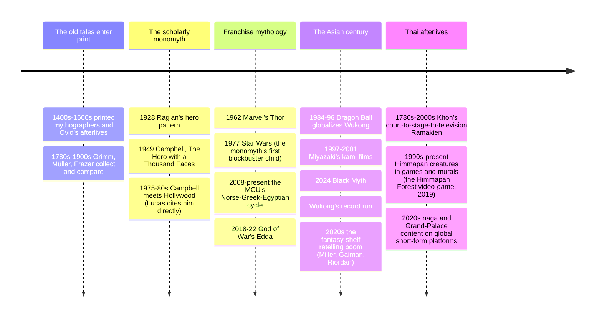

# 20 — Mythology in Modern Culture — เทพปกรณัมในวัฒนธรรมร่วมสมัย

> *"Myths are public dreams; dreams are private myths — and blockbusters are both, at a hundred million dollars a pop." (a modern mash-up of Campbell's line)**

The last note (20) of the domain asks where the mythology of notes 12–19 actually lives now. The answer: everywhere the story-business runs. The hero's journey is the secret scripture of Hollywood (Christopher Vogler's *The Writer's Journey*, the most-read screenwriting book alive, is applied Campbell); Norse gods headline billion-dollar films; Japanese studios animate kami and yōkai to global audiences; Chinese game studios rebuilt Journey to the West into a worldwide hit; and the Thai screen keeps Khon and Himmapan creatures on billboards. This is not a decline story ("we replaced religion with Marvel") nor a simple continuity story ("myths are myths"): it is a transformation — the same motifs doing the same work (identity, orientation, awe, coping with death) inside a commercial, secular, global media system.

An adult should care because the culture your children consume *is* their mythology curriculum, usually without the footnotes; this note is the guide-map back from the films and games to the sources in notes 13–19 — and the literacy that lets a family enjoy Marvel while knowing exactly what it changed about Loki, and why.

---

## 1 | Hollywood's screenplay scripture: the monomyth at work

| Beat (Vogler's version) | Function | The example everyone knows |
|---|---|---|
| Ordinary world → call | The hero's home and lack | Luke's moisture farm; Simba's pride |
| Mentor & threshold | Tradition hands over tools | Obi-Wan, Gandalf, Dumbledore, Miyazaki's witches |
| Trials, allies, enemies | The special world's school | The entire Marvel second act |
| Ordeal / death-rebirth | The center | Neo taking the red pill; the hero's public failure |
| Road back & resurrection | Cost confirmed | Frodo leaving the Ring at the fire |
| Elixir return | Gift for the village | The king restored, the fire returned |

**The critical view:** the pattern's dominance (Campbell → Vogler → every studio coverage note) also flattened things — the "hero with a flaw learns to believe" template is why so many blockbusters feel identical, and why the "retelling" wave (§5, feminist and trickster-perspective novels) exists: modern storytellers use the myths to *correct* the monomyth (whose journey? whose boon?). Compare [[12_What_Is_Mythology]] §4's caveats; this is where those caveats cash out.

## 2 | The franchise pantheons: which myths power which worlds

| Modern world | Mythic source | What it borrows | What it changes |
|---|---|---|---|
| MCU Thor & Asgard (2011-2023) | [[14_Norse_Mythology]] via Jack Kirby | Odin, Thor, Loki, Hel, Ragnarök, the Bifrost | The gods are alien engineers (S-F rereading); Loki's gender and loyalty fluidized; Ragnarök becomes repeatable |
| DC's Wonder Woman | [[13_Greek_Mythology]] | Amazons, Ares, Hippolyta | Peace-feminist Greece; Ares as the god *of war's horror*, not glory |
| Percy Jackson & Riordanverse | Greek, Egyptian, Norse, Hindu, East Asian (Riordan deliberately covers the whole domain) | Pantheons as living, plural, ADHD-hero-friendly | Gods as flawed relatives — the closest mass-culture mirror of this vault's tone contract |
| God of War (2018, 2022) | Greek then Norse | Kratos' revenge-then-repentance arc replays the hero's journey with an anti-hero raising a son through the Eddas' geography | Interactive katabasis: the player walks the nine realms as a parenting story |
| Black Myth: Wukong (2024) | [[18_East_Asian_Mythology]] | Journey to the West's bestiary and cosmology, boss-fight structure as scripture | Sold ~20M copies in months: the most commercially successful myth-game ever; it introduced the Iron Fan Princess, Yellow Wind Ridge, and Erlang Shen to a global audience (all names in note 18) |
| Zelda / Elden Ring / Final Fantasy | Amalgam: Yggdrasil, katanas-and-kami, katabasis, dying gods, world-trees and cycles | The "high fantasy" grammar built by Tolkien (below) remixed by Japanese studios | Myth as open world: exploration *is* the rite of passage |
| Tolkien's Middle-earth | Direct Eddic and Kalevala borrowing (the wizard-name, the dwarf-names from the Völuspá's list, the Northern-courage ethos: "the loss of the elves") | The modern epic of mortality-and-memory | Invented the template most fantasy still copies ([[World Literature/13_American_Classics|the modern-fantasy shelf]]) |
| Disney's Renaissance | Frazer-lite and monomyth: The Lion King's exile-and-return; Moana restoring the stolen heart of the sea-goddess; Hercules' labors | The hero's journey as family program (Vogler consulted on Mulan directly) | The myths arrive pre-credited: most viewers never learn "Hercules" the film isn't the myth |
| Anime and manga | Shinto kami (Spirited Away's bathhouse), yōkai (Naruto's tailed beasts, GeGeGe no Kitarō), Journey to the West (Dragon Ball wholesale: Goku, the cloud, the staff, the pilgrimage), Buddhist cosmology (many mecha end-of-cycles) | Myth as national popular language | Japan is the clearest case of notes 8/18 still *being* a myth-culture for its children |
| Thai screen and stage | Khon's Ramakien (National Theatre, live); the televised Khon revivals; Nang Yai; Himmapan creatures in brand advertising, Luk Thung music videos, amulet design, and festival décor; the 2020s naga documentary wave | The national epic and the folk-cosmology as living commercial iconography | Thailand's myth-culture runs on notes 17–18 directly, no translation layer |

## 3 | Literature's retelling wave (the scholars' shelf in a bookstore)

| Book | Myth source | The angle it takes |
|---|---|---|
| Madeline Miller, *Circe* (2018) and *The Song of Achilles* | [[13_Greek_Mythology]] | The witch and the lover, from inside the margins of the Odyssey and Iliad ([[World Literature/14_Modernism|the modern novel's empathy project]]) |
| Pat Barker, *The Silence of the Girls*; Emily Wilson's *The Odyssey* (translation) | Greek | The captives' and the translator's retelling: myth as who gets to narrate |
| Neil Gaiman, *Norse Mythology* (2017) and *American Gods* | Norse; immigrant gods | The BOK's essential retelling ([[14_Norse_Mythology]] §9); and the thesis that gods survive by migration and memory |
| R. F. Kuang, *The Poppy War* and *Babel* | Chinese-inflected mythic history; colonial-era towers | The Poppy War runs on a shaman-cult engine (note 18's Baridegi line); *Babel* on the politics of translation |
| Chigozie Obioma, *An Orchestra of Minorities* | Igbo cosmology | The chi-and-destiny frame as the novel's narrator ([[11_Comparative_Themes]], [[10_Indigenous_and_Animist_Traditions]]' living systems) |
| Anand Neelakantan, *Asura* (Ravana's side); Amish Tripathi's Shiva series | [[17_Hindu_Mythology]] | The demon-king's rebuttal and the god-cop: myth as contested politics inside India itself |
| Stephen Fry's *Mythos*/"Heroes"/*Troy*; the musical *Hadestown* | Greek | Light prose retelling and a jukebox Orpheus: comedy and country-blues as the new allegoresis |

## 4 | The advertising, sports, and politics of myth

| Sector | The mythic grammar | Example |
|---|---|---|
| Brands | Names and figures as instant meaning: Nike (the Greek victory goddess), Amazon (the world-river), Athena/Nike swoosh, the Starbucks siren (a [[19_Universal_Mythic_Archetypes]] sea-siren), Mars (war-god), Apollo programs, Thor's hammer on Marvel merchandise | The oldest etiology technique: borrow awe, skip the story |
| Sports | Club names as pantheons (Ajax, Sparta, Olympiacos); Thailand's Muay Thai wai khru and the Hanuman dance; the stadium as the arena of kleos ([[13_Greek_Mythology]] §5) | "Fame that outlasts death" is the professional athlete's explicit contract |
| National stories | Founding myths as charter ([[12_What_Is_Mythology]] §2): the American "city on a hill," Japan's unbroken imperial line, Thailand's king-as-Rama iconography; the "lost golden age" restored-slogan genre of recent electoral politics everywhere | The political myth is the sociological function wearing campaign clothes ([[10_Indigenous_and_Animist_Traditions]] §6's land-rights versions included) |
| Conspiracy culture | QAnon-style plots are Gnostic myth in internet grammar: hidden cabal, awakening, the war of light and dark — the structural reading (not polemic) that §6's Jung/Boyer cognitive answer predicts | Myth's persistence is not a religion-loss problem; the forms simply relocate |

## 5 | Why myths still sell (and what the buying means)

| Answer camp | Claim |
|---|---|
| The Campbell-Vogler camp | The patterns are wired; studios use the template because it measurably works (cross-cultural box-office recognition of the hero-arc) |
| The market camp | Myths are free, pre-sold IP with global brand recognition — franchises reuse them because copyright-expired prestige beats invention |
| The meaning camp | A secular age still faces death, transition, and injustice; the myth-corpus is the only shared library that treats them as ultimate — so people keep buying the retellings ([[11_Comparative_Themes]] §2: the afterlife questions don't disappear, they re-motel) |
| The correction camp | The retelling wave (women's, colonized peoples', monsters' perspectives) is the culture doing what Greek tragedy did to myth: arguing with the canon using the canon's own characters ([[13_Greek_Mythology]]) |

## 6 | Timeline: the migration of the myths into modern hands

## 7 | Key concepts and vocabulary

| Term | Thai | Meaning |
|---|---|---|
| Adaptation / retelling | การดัดแปลง | The transfer of a myth into a new medium; always also an interpretation |
| Palimpsest | การเขียนทับ | A new text over an old one, both visible: every franchise-myth is one |
| Monomyth in screenwriting | สูตรวีรบุรุษ | The Campbell-Vogler beat sheet (§1) |
| "Myth" (Barthes) | ตำนานเชิงวัฒนธรรม | Roland Barthes's *Mythologies* (1957): mass-culture images as modern myths that naturalize politics — the critical lens for §4 |
| IP (intellectual property) | ทรัพย์สินทางปัญญา | The legal frame that makes ancient myths "free": public domain = the gods' commons |
| Secularization | โลกียวัตร | The old theory that modernity would dissolve myth; §5's evidence says: it relocates it |
| Ostension | การชี้ให้เห็น | When culture points at a myth-figure and the crowd knows the reference (calling a whistleblower "Prometheus") |
| Fan-canon | ฐานแฟน | Fans editing and extending the myth (fanfic, lore videos): the oldest myth-practice — the oral storytellers' method with a subreddit |

## 8 | Why it matters today

- **This is most people's entire exposure to notes 13–19:** a teenager knows the MCU's Loki and Black Myth's Wukong before they know an Edda or a Ming novel. Whether the franchise is a doorway or a substitute is *the* question for educators and parents — walk them back to the source, which is this folder's job.
- **Critical literacy for myth-shaped politics:** §4's reading grid (charter, golden age, the savior, the demonized other) is the same tool that reads both a Ragnarök film and an election campaign; [[12_What_Is_Mythology]] §2's functions are the checklist.
- **Economic reality:** myth-franchises are among the largest content industries on Earth; Southeast Asian IP (Ramakien visuals, naga lore, Himmapan) is now a live market this generation's creators can own — the note-17 bridge becomes a career map.
- **The domain's closing thought:** the 20 notes began (01) with "what is religion?" and end with "the sacred stories, now in shopping-mall form." Whether the Diwali of a billion people or the superhero film of a billion viewers, the same seven dimensions ([[01_What_Is_Religion]] §2) run — belief, story, ritual (premieres and pilgrimages to Comic-Con), community, ethics, experience, and material culture. Myth did not die; it incorporated.

## 9 | Further reading

- *The Writer's Journey: Mythic Structure for Writers* (Christopher Vogler): the monomyth as the industry uses it.
- *Mythologies* (Roland Barthes): the essays on wrestling, cars, and the Eiffel Tower as modern myth — §4's method's source.
- *Norse Mythology* (Gaiman) beside the *Poetic Edda*: read the retelling and the source back-to-back — the best single exercise in what adaptation preserves and invents.
- *All the Gods' Mistresses* / better: any current study of game mythology — e.g. the essays around Black Myth: Wukong's 2024 reception and the Journey to the West's afterlives (the scholarly roundtables in *Asiascope*-family journals).

*\* the quotation is this vault's own paraphrase of Campbell (note 12 §9) — the mash-up is ours, the pattern his.*

## Related

- [[12_What_Is_Mythology]]: the theory this note's objects are built from
- [[13_Greek_Mythology]] through [[19_Universal_Mythic_Archetypes]]: the source corpora
- [[17_Hindu_Mythology]]: the Khon and Ramakien living tradition
- [[05_Hinduism]]: Diwali and Ramlila as contemporary performance
- [[08_Shinto_and_Japanese_Traditions]]: the kami behind the anime
- [[World Literature/14_Modernism|Modernism]], [[World Literature/17_Asian_Literature|Asian Literature]], and [[World Literature/20_Childrens_Classics_and_Folk_Tales|Children's Classics]]: the literary shelves
- [[Social Studies/02 Civics/12_Media_Literacy|Media Literacy]]: the civic companion to §4-§6
- [[11_Comparative_Themes]]: the festival and function comparisons
