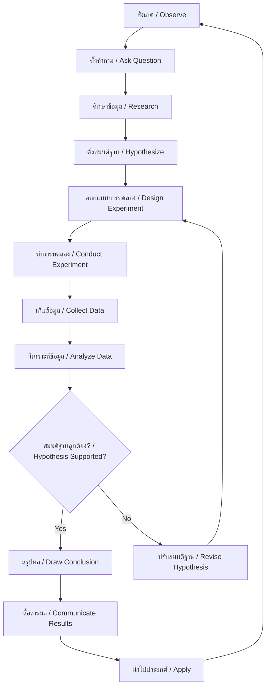

---
tags:
  - science
  - fundamental
  - scientific-method
  - process-skills
  - ipst
source: "IPST (สสวท.) Fundamental Science Curriculum, B.E. 2551 (2008, revised 2560/2017)"
created: 2026-07-26
course_codes: ["ว111", "ว112", "ว113", "ว121", "ว122", "ว123", "ว211", "ว212", "ว213"]
---

# Scientific Method — กระบวนการทางวิทยาศาสตร์

> *"Science is a way of thinking much more than it is a body of knowledge."* — Carl Sagan

This note covers the scientific method and process skills that form the backbone of all scientific inquiry. Students progress from simple observation and questioning in early grades to designing controlled experiments and analyzing data systematically by ม.3.

---

## 1 | Grade Band Breakdown

### ป.1–3 (Grades 1–3)

| Grade | Scope | Key Skills |
|---|---|---|
| **ป.1** | Observe and describe | Using five senses (ประสาทสัมผัสทั้งห้า) to observe objects; simple classification; asking "what?" questions |
| **ป.2** | Compare and contrast | Observing similarities and differences (เปรียบเทียบ); recording observations with drawings; simple measuring with non-standard units |
| **ป.3** | Simple investigation | Forming questions; making predictions (คาดคะเน); simple experiments with one variable; recording data in tables |

### ป.4–6 (Grades 4–6)

| Grade | Scope | Key Skills |
|---|---|---|
| **ป.4** | Process skills I | Observing systematically; classifying (จำแนกประเภท); measuring with standard tools; inferring (อ้างอิง) |
| **ป.5** | Process skills II | Hypothesizing (ตั้งสมมติฐาน); designing simple experiments; controlling variables (ตัวแปร); interpreting data |
| **ป.6** | Process skills III | Planning investigations; predicting outcomes; communicating results (สื่อสาร); drawing conclusions from evidence |

### ม.1–3 (Grades 7–9)

| Grade | Scope | Key Skills |
|---|---|---|
| **ม.1** | Scientific method formal | Full scientific method cycle; identifying variables (independent, dependent, controlled); forming hypotheses |
| **ม.2** | Experiment design | Designing controlled experiments; data analysis (mean, mode, range); error analysis; graphing data |
| **ม.3** | Advanced inquiry | Evaluating experimental validity; identifying sources of error; scientific argumentation; applying process skills across disciplines |

---

## 2 | Key Terminology

| Thai | English | Notes |
|---|---|---|
| กระบวนการทางวิทยาศาสตร์ | Scientific method | Systematic approach to investigation |
| การสังเกต | Observation | Gathering information through senses or instruments |
| สมมติฐาน | Hypothesis | Testable explanation for an observation |
| ตัวแปรต้น | Independent variable | Factor deliberately changed by experimenter |
| ตัวแปรตาม | Dependent variable | Factor measured/observed as a result |
| ตัวแปรควบคุม | Controlled variable | Factor kept constant during experiment |
| การทดลอง | Experiment | Procedure to test a hypothesis |
| การวิเคราะห์ | Analysis | Breaking data into parts for examination |
| การสรุป | Conclusion | Judgment based on evidence |
| การจำแนกประเภท | Classification | Grouping by shared characteristics |
| การอ้างอิง | Inference | Logical explanation based on observations |
| การคาดคะเน | Prediction | Expected outcome based on reasoning |
| ข้อมูล | Data | Facts and information collected |
| การวัด | Measurement | Comparing to a standard unit |
| ความแม่นยำ | Accuracy | Closeness to true value |
| ความเที่ยงตรง | Precision | Reproducibility of measurements |
| การสื่อสาร | Communication | Sharing findings with others |

---

## 3 | The Scientific Method (Full Cycle)



---

## 4 | Key Concepts & Properties

### 4.1 Process Skills Framework (ทักษะกระบวนการ)

**Basic Process Skills (ทักษะกระบวนการพื้นฐาน):**
1. **Observing (สังเกต)** — Using senses to gather information
2. **Classifying (จำแนก)** — Grouping objects/events by properties
3. **Measuring (วัด)** — Using tools and standard units
4. **Communicating (สื่อสาร)** — Describing observations clearly
5. **Inferring (อ้างอิง)** — Making logical explanations
6. **Predicting (คาดคะเน)** — Foreseeing outcomes based on patterns

**Integrated Process Skills (ทักษะกระบวนการเชิงบูรณาการ):**
1. **Identifying variables** — Recognizing independent, dependent, and controlled variables
2. **Formulating hypotheses** — Writing testable if-then statements
3. **Designing experiments** — Planning fair tests
4. **Interpreting data** — Reading tables, graphs, drawing conclusions
5. **Operational definitions** — Defining how to measure a concept

### 4.2 Variables in Experiments

```
Experiment: Does light affect plant growth?

Independent Variable (สิ่งที่เปลี่ยน): Amount of light
Dependent Variable (สิ่งที่วัด): Plant height (cm)
Controlled Variables (สิ่งที่คงที่): Water, soil type, pot size, temperature, plant species
```

### 4.3 Hypothesis Format

A good hypothesis follows the **If... then... because** format:

> **If** the amount of sunlight increases, **then** the plant will grow taller, **because** plants need light for photosynthesis.

### 4.4 Fair Test (การทดลองที่ยุติธรรม)

| Principle | Description |
|---|---|
| One variable | Change only ONE factor at a time |
| Repeat | Do multiple trials (≥ 3) for reliability |
| Control | Have a control group for comparison |
| Same conditions | Keep all other factors identical |

---

## 5 | Data Analysis Tools

### 5.1 Measures of Central Tendency (ม.2)

$$\text{Mean (ค่าเฉลี่ย)} = \frac{\sum x_i}{n}$$

$$\text{Mode (ฐานนิยม)} = \text{Most frequently occurring value}$$

$$\text{Range (พิสัย)} = \text{Maximum} - \text{Minimum}$$

### 5.2 Data Display Methods

| Method | Best For | Grade Level |
|---|---|---|
| Table (ตาราง) | Organizing raw data | ป.3+ |
| Bar graph (กราฟแท่ง) | Comparing categories | ป.4+ |
| Line graph (กราฟเส้น) | Showing change over time | ป.5+ |
| Pie chart (กราฟวงกลม) | Showing proportions | ม.1+ |

---

## 6 | Real-World Examples

1. **Testing fertilizer effectiveness** — Students grow plants with different fertilizer amounts, measuring height weekly
2. **Which paper towel absorbs most?** — Drop same amount of water on different brands, measure absorption
3. **Effect of slope on rolling speed** — Roll same ball down ramps at different angles, measure time
4. **Water quality testing** — Compare pH, clarity, dissolved oxygen in different water sources

---

## 7 | Cross-Links

- [[02_Living_Things]] — Applying observation skills to classify living things
- [[09_Matter_and_Properties]] — Measuring and comparing physical properties
- [[13_Forces_and_Motion]] — Designing experiments with variables
- [[14_Energy]] — Investigating energy transformations
- [[20_Weather_and_Climate]] — Collecting and analyzing weather data
- [[22_Technology_and_Engineering]] — Engineering design process parallels scientific method
