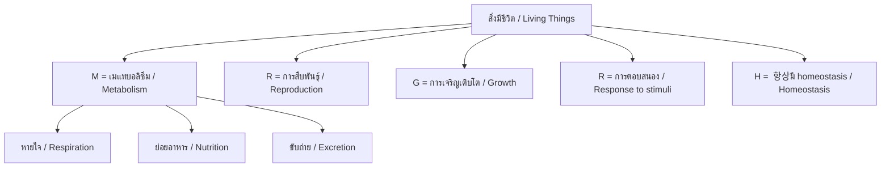
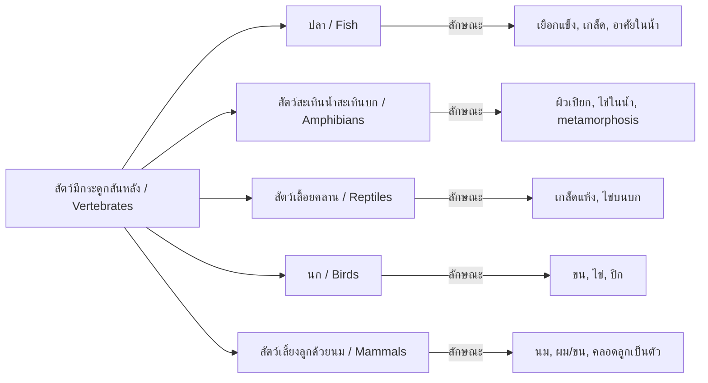

---
tags:
  - science
  - fundamental
  - life-science
  - living-things
  - ipst
source: "IPST (สสวท.) Fundamental Science Curriculum, B.E. 2551 (2008, revised 2560/2017)"
created: 2026-07-26
course_codes: ["ว111", "ว112", "ว113", "ว121", "ว122", "ว123", "ว211", "ว212", "ว213"]
---

# Living Things — สิ่งมีชีวิต

> *"In every walk with nature, one receives far more than he seeks."* — John Muir

This note covers the characteristics of living things, basic needs, and classification of organisms. Students progress from recognizing living vs non-living objects to understanding the hierarchy of biological classification.

---

## 1 | Grade Band Breakdown

### ป.1–3 (Grades 1–3)

| Grade | Scope | Key Skills |
|---|---|---|
| **ป.1** | Living vs non-living | Characteristics of living things (หายใจ อาหาร เคลื่อนที่ เจริญเติบโต ตอบสนอง); observing plants and animals in surroundings |
| **ป.2** | Basic needs | Food, water, shelter, air (อาหาร น้ำ ที่อยู่อาศัย อากาศ); growth and change (การเจริญเติบโต); life cycles of familiar animals |
| **ป.3** | Grouping organisms | Classifying animals by observable features (มีกระดูกสันหลัง/ไม่มีกระดูกสันหลัง); grouping plants (ไม้ล้มลุก ไม้พุ่ม ไม้ยืนต้น) |

### ป.4–6 (Grades 4–6)

| Grade | Scope | Key Skills |
|---|---|---|
| **ป.4** | Classification I | Vertebrates (สัตว์มีกระดูกสันหลัง): fish, amphibians, reptiles, birds, mammals; plant groups |
| **ป.5** | Classification II | Invertebrates (สัตว์ไม่มีกระดูกสันหลัง); 6 kingdoms concept; habitats and adaptations (การปรับตัว) |
| **ป.6** | Interdependence | Food chains and webs (ห่วงโซ่อาหาร); producers/consumers/decomposers; human impact on living things |

### ม.1–3 (Grades 7–9)

| Grade | Scope | Key Skills |
|---|---|---|
| **ม.1** | Diversity of life | Biological classification system (kingdom, phylum, class, order, family, genus, species); binomial nomenclature |
| **ม.2** | Body systems overview | Comparison of body systems across organisms; adaptation to environments |
| **ม.3** | Relationships | Symbiosis (ภาวะพึ่งพิง); competition; predator-prey dynamics; biodiversity (ความหลากหลายทางชีวภาพ) |

---

## 2 | Key Terminology

| Thai | English | Notes |
|---|---|---|
| สิ่งมีชีวิต | Living thing | Organism with all characteristics of life |
| สิ่งไม่มีชีวิต | Non-living thing | Lacks characteristics of life |
| การหายใจ | Respiration | Breaking down food for energy |
| การสังเคราะห์ด้วยแสง | Photosynthesis | Plants making food from sunlight |
| การเจริญเติบโต | Growth | Increase in size |
| การสืบพันธุ์ | Reproduction | Producing offspring |
| การตอบสนอง | Response | Reacting to stimuli |
| การขับถ่าย | Excretion | Removing waste products |
| การจำแนกประเภท | Classification | Grouping organisms by shared features |
| ไฟลัม | Phylum | Major classification group |
| สปีชีส์ | Species | Basic unit of classification |
| ชื่อวิทยาศาสตร์ | Scientific name | Binomial (genus + species) |
| ห่วงโซ่อาหาร | Food chain | Feeding relationships in sequence |
| สายใยอาหาร | Food web | Interconnected food chains |
| การปรับตัว | Adaptation | Trait that helps survival |
| ความหลากหลายทางชีวภาพ | Biodiversity | Variety of life in an area |
| ผู้ผลิต | Producer | Organism that makes own food |
| ผู้บริโภค | Consumer | Organism that eats other organisms |
| ผู้ย่อยสลาย | Decomposer | Breaks down dead matter |

---

## 3 | Characteristics of Living Things (ลักษณะของสิ่งมีชีวิต)



**7 Characteristics of Life (MRS GREN):**
1. **Movement** — เคลื่อนที่ (animals) or growth movement (plants)
2. **Respiration** — การหายใจ (energy from food)
3. **Sensitivity** — การตอบสนอง (react to environment)
4. **Growth** — การเจริญเติบโต
5. **Reproduction** — การสืบพันธุ์
6. **Excretion** — การขับถ่าย (remove waste)
7. **Nutrition** — การได้รับอาหาร (need energy)

---

## 4 | Biological Classification (การจัดจำแนกสิ่งมีชีวิต)

### 4.1 Linnaean Hierarchy

```
Domain (โดเมน)
└── Kingdom (อาณาจักร)
    └── Phylum (ไฟลัม)
        └── Class (ชั้น)
            └── Order (อันดับ)
                └── Family (วงศ์)
                    └── Genus (สกุล)
                        └── Species (สปีชีส์)
```

**Mnemonic:** **D**ear **K**ing **P**hilip **C**ame **O**ver **F**or **G**ood **S**oup

### 4.2 Six Kingdoms

| Kingdom | Thai | Characteristics | Examples |
|---|---|---|---|
| Archaebacteria | อาร์เคีย | Extremophiles, no nucleus | Methanogens |
| Eubacteria | ยูแบคทีเรีย | True bacteria, no nucleus | E. coli |
| Protista | โพรทิสตา | Single-celled, nucleus | Amoeba, Paramecium |
| Fungi | เห็ดรา | No photosynthesis, decomposers | Mushroom, yeast |
| Plantae | พืช | Photosynthesis, cell wall | Trees, grass |
| Animalia | สัตว์ | No cell wall, multicellular | Humans, insects |

### 4.3 Vertebrate Groups



---

## 5 | Food Chains and Webs

### 5.1 Trophic Levels

```
Level 4: ผู้บริโภคที่ 3 (Tertiary consumer) — นกอินทรี / Eagle
    ↑
Level 3: ผู้บริโภคที่ 2 (Secondary consumer) — งู / Snake
    ↑
Level 2: ผู้บริโภคที่ 1 (Primary consumer) — หนู / Mouse
    ↑
Level 1: ผู้ผลิต (Producer) — หญ้า / Grass
```

### 5.2 Energy Flow

$$\text{Energy transfer efficiency} \approx 10\%$$

At each trophic level, only about 10% of energy is passed to the next level. The rest is lost as heat through metabolism.

---

## 6 | Real-World Examples

1. **Mangrove ecosystems** — Classify organisms in Thai mangrove forests
2. **Rice paddy food web** — Rice → caterpillar → frog → snake → hawk
3. **Coral reefs** — Biodiversity hotspots with symbiotic relationships
4. **Thai wildlife classification** — Classify elephants, tigers, gibbons by taxonomy

---

## 7 | Cross-Links

- [[01_Scientific_Method]] — Observing and classifying organisms
- [[03_Cells]] — Cellular basis of all living things
- [[05_Plants]] — Plant classification and characteristics
- [[06_Animals]] — Animal classification and characteristics
- [[07_Ecosystems]] — Living things in their environments
- [[08_Heredity_and_Evolution]] — Why organisms differ and change
