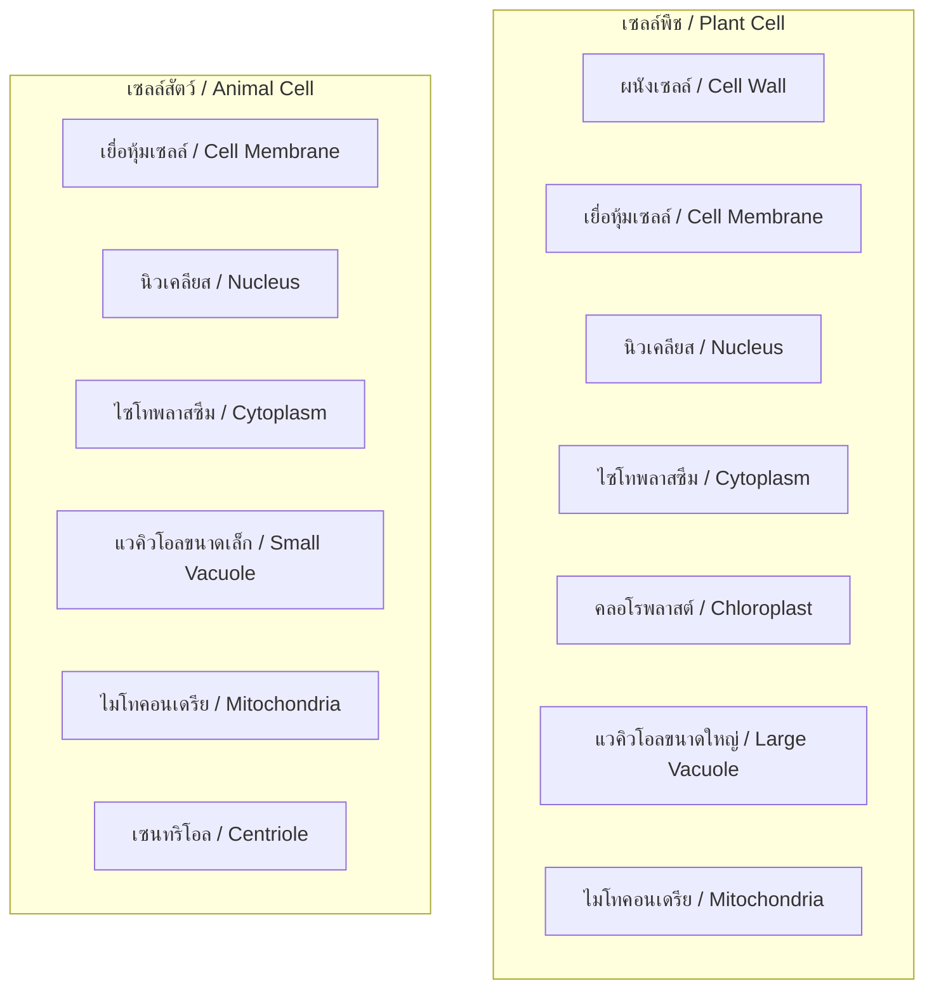
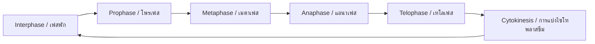

---
tags:
  - science
  - fundamental
  - life-science
  - cells
  - ipst
source: "IPST (สสวท.) Fundamental Science Curriculum, B.E. 2551 (2008, revised 2560/2017)"
created: 2026-07-26
course_codes: ["ว211", "ว212", "ว213"]
---

# Cells — เซลล์

> *"The cell is the basic unit of life."*

This note covers cell structure, function, and the differences between plant and animal cells. Students learn about cell theory, organelles, and how cells carry out life processes from ม.1 through ม.3.

---

## 1 | Grade Band Breakdown

### ป.1–3 (Grades 1–3)

| Grade | Scope | Key Skills |
|---|---|---|
| **ป.1–3** | Not directly covered | Students observe living things at macroscopic level; basic awareness that living things are made of parts |

### ป.4–6 (Grades 4–6)

| Grade | Scope | Key Skills |
|---|---|---|
| **ป.4–6** | Introduction to cells | Basic awareness that living things are made of cells; observing cells with simple microscope (กล้องจุลทรรศน์); simple cell diagram |

### ม.1–3 (Grades 7–9)

| Grade | Scope | Key Skills |
|---|---|---|
| **ม.1** | Cell structure | Plant vs animal cell comparison; organelles and functions; cell membrane, nucleus, cytoplasm |
| **ม.2** | Cell processes | Cell division (mitosis); diffusion and osmosis (การแพร่และออสโมซิส); photosynthesis and respiration at cellular level |
| **ม.3** | Cell specialization | Tissues, organs, organ systems; stem cells; cell differentiation |

---

## 2 | Key Terminology

| Thai | English | Notes |
|---|---|---|
| เซลล์ | Cell | Basic unit of life |
| ทฤษฎีเซลล์ | Cell theory | All living things are made of cells |
| เยื่อหุ้มเซลล์ | Cell membrane | Controls what enters/exits cell |
| นิวเคลียส | Nucleus | Contains DNA, controls cell activities |
| ไซโทพลาสซึม | Cytoplasm | Gel-like substance filling cell |
| คลอโรพลาสต์ | Chloroplast | Contains chlorophyll for photosynthesis |
| ผนังเซลล์ | Cell wall | Rigid structure outside membrane (plants) |
| ไมโทคอนเดรีย | Mitochondria | Powerhouse of cell; cellular respiration |
| แวคิวโอล | Vacuole | Storage compartment |
| ไรโบโซม | Ribosome | Makes proteins |
| เอนโดพลาสมิกเรติคิวลัม | Endoplasmic reticulum | Transport network |
| กอลจิแอปพาราตัส | Golgi apparatus | Packages and ships proteins |
| การแบ่งเซลล์ | Cell division | Mitosis and meiosis |
| การแพร่ | Diffusion | Movement from high to low concentration |
| ออสโมซิส | Osmosis | Water movement across membrane |
| การสังเคราะห์ด้วยแสง | Photosynthesis | Light energy → chemical energy |
| การหายใจระดับเซลล์ | Cellular respiration | Glucose → ATP energy |
| เนื้อเยื่อ | Tissue | Group of similar cells |
| อวัยวะ | Organ | Group of tissues with a function |
| ระบบอวัยวะ | Organ system | Group of organs working together |

---

## 3 | Cell Theory (ทฤษฎีเซลล์)

Three fundamental principles:

1. **All living things are made of one or more cells** (สิ่งมีชีวิตทุกชนิดประกอบด้วยเซลล์)
2. **The cell is the basic unit of life** (เซลล์เป็นหน่วยพื้นฐานของสิ่งมีชีวิต)
3. **All cells come from pre-existing cells** (เซลล์ทุกเซลล์เกิดจากเซลล์ที่มีอยู่ก่อน)

---

## 4 | Plant Cell vs Animal Cell



| Feature | Plant Cell (เซลล์พืช) | Animal Cell (เซลล์สัตว์) |
|---|---|---|
| Cell wall | ✅ Present (made of cellulose) | ❌ Absent |
| Chloroplast | ✅ Present | ❌ Absent |
| Vacuole | Large, central (แวคิวโอลกลาง) | Small, many |
| Shape | Fixed, rectangular | Irregular, round |
| Centriole | ❌ Usually absent | ✅ Present |
| Energy storage | Starch (แป้ง) | Glycogen (ไกลโคเจน) |

---

## 5 | Key Organelles and Functions

| Organelle | Thai | Function | Analogy |
|---|---|---|---|
| Nucleus | นิวเคลียส | Controls cell, contains DNA | Control center / ห้องควบคุม |
| Cell membrane | เยื่อหุ้มเซลล์ | Controls entry/exit | Security gate / ประตูรักษาความปลอดภัย |
| Cytoplasm | ไซโทพลาสซึม | Medium for reactions | Factory floor / โรงงาน |
| Mitochondria | ไมโทคอนเดรีย | Cellular respiration, ATP | Power plant / โรงไฟฟ้า |
| Chloroplast | คลอโรพลาสต์ | Photosynthesis | Solar panel / แผงโซลาร์ |
| Ribosome | ไรโบโซม | Protein synthesis | Assembly line / สายพานผลิต |
| ER | เอนโดพลาสมิกเรติคิวลัม | Transport system | Highway / ทางหลวง |
| Golgi | กอลจิแอปพาราตัส | Packaging & shipping | Post office / ไปรษณีย์ |
| Vacuole | แวคิวโอล | Storage | Warehouse / โกดัง |
| Cell wall | ผนังเซลล์ | Support & protection | Brick wall / กำแพงอิฐ |

---

## 6 | Important Processes

### 6.1 Photosynthesis (การสังเคราะห์ด้วยแสง)

$$6\text{CO}_2 + 6\text{H}_2\text{O} \xrightarrow{\text{light}} \text{C}_6\text{H}_{12}\text{O}_6 + 6\text{O}_2$$

**Location:** Chloroplast (คลอโรพลาสต์)
**Requirements:** Light, water, carbon dioxide
**Products:** Glucose, oxygen

### 6.2 Cellular Respiration (การหายใจระดับเซลล์)

$$\text{C}_6\text{H}_{12}\text{O}_6 + 6\text{O}_2 \rightarrow 6\text{CO}_2 + 6\text{H}_2\text{O} + \text{ATP (energy)}$$

**Location:** Mitochondria (ไมโทคอนเดรีย)
**Requirements:** Glucose, oxygen
**Products:** Carbon dioxide, water, ATP energy

### 6.3 Diffusion and Osmosis

| Process | Definition | Example |
|---|---|---|
| Diffusion (การแพร่) | Movement of particles from high → low concentration | Perfume spreading in room |
| Osmosis (ออสโมซิส) | Water movement across semipermeable membrane | Water entering root hairs |

---

## 7 | Cell Division

### Mitosis (ไมโทซิส) — Somatic Cell Division



**Result:** 2 identical daughter cells (2 เซลล์ลูกที่เหมือนกัน)
**Purpose:** Growth, repair, asexual reproduction

---

## 8 | Levels of Organization

```
เซลล์ (Cell)
  → เนื้อเยื่อ (Tissue)
    → อวัยวะ (Organ)
      → ระบบอวัยวะ (Organ system)
        → สิ่งมีชีวิต (Organism)
```

---

## 9 | Cross-Links

- [[02_Living_Things]] — Cells as the basis of all living things
- [[04_Human_Body_Systems]] — Cell specialization in human organs
- [[05_Plants]] — Plant cell structure and photosynthesis
- [[08_Heredity_and_Evolution]] — DNA in nucleus, cell division
- [[09_Matter_and_Properties]] — Substances that make up cells
