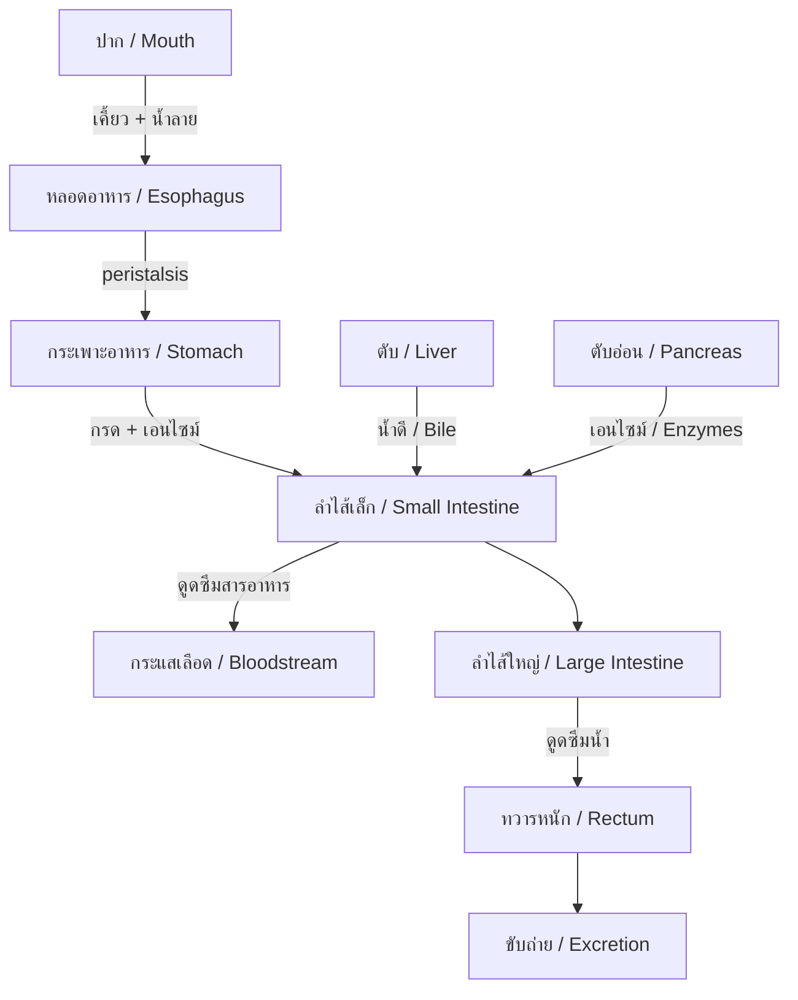
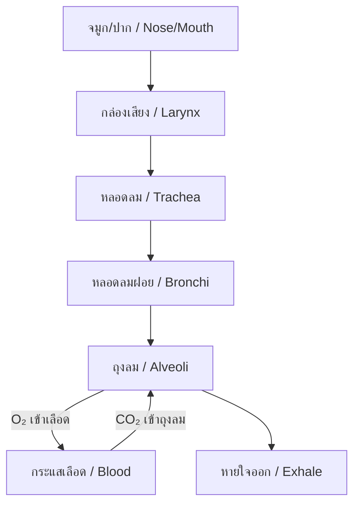
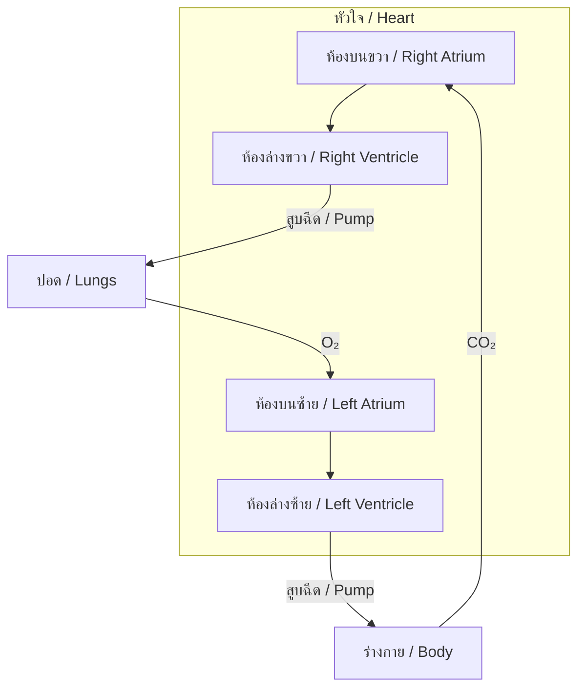
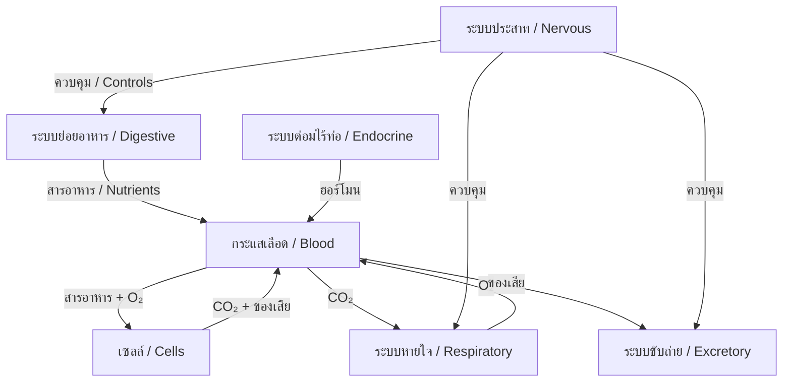

---
tags:
  - science
  - fundamental
  - life-science
  - human-body
  - ipst
source: "IPST (สสวท.) Fundamental Science Curriculum, B.E. 2551 (2008, revised 2560/2017)"
created: 2026-07-26
course_codes: ["ว111", "ว112", "ว113", "ว211", "ว212", "ว213"]
---

# Human Body Systems — ระบบต่างๆ ของร่างกาย

> *"The human body is the best picture of the human soul."* — Ludwig Wittgenstein

This note covers the major organ systems of the human body, their structures, functions, and how they work together to maintain life. Students progress from basic body parts to understanding complex system interactions.

---

## 1 | Grade Band Breakdown

### ป.1–3 (Grades 1–3)

| Grade | Scope | Key Skills |
|---|---|---|
| **ป.1** | Body parts | Naming major body parts; five senses (ประสาทสัมผัสทั้งห้า): sight, hearing, touch, taste, smell |
| **ป.2** | External features | Observing external body features; hygiene (สุขอนามัย); keeping body clean and healthy |
| **ป.3** | Basic body functions | Eating and digestion basics; breathing; exercise and health (การออกกำลังกาย) |

### ป.4–6 (Grades 4–6)

| Grade | Scope | Key Skills |
|---|---|---|
| **ป.4** | Skeletal & muscular | Bones and muscles (กระดูกและกล้ามเนื้อ); body movement; posture |
| **ป.5** | Digestive & respiratory | Food digestion path; breathing process; nutrition (โภชนาการ); food groups |
| **ป.6** | Circulatory & excretory | Heart and blood (หัวใจและเลือด); blood vessels; kidneys and waste removal; health practices |

### ม.1–3 (Grades 7–9)

| Grade | Scope | Key Skills |
|---|---|---|
| **ม.1** | Major systems | Digestive, respiratory, circulatory, excretory — detailed structure and function |
| **ม.2** | Nervous & endocrine | Brain and nerves (สมองและประสาท); hormones; senses; reflexes |
| **ม.3** | Immune & reproductive | Immune system (ระบบภูมิคุ้มกัน); diseases; reproduction; system integration |

---

## 2 | Key Terminology

| Thai | English | Notes |
|---|---|---|
| ระบบย่อยอาหาร | Digestive system | Breaks down food for absorption |
| ระบบหายใจ | Respiratory system | Gas exchange (O₂ in, CO₂ out) |
| ระบบไหลเวียนเลือด | Circulatory system | Transports blood, nutrients, oxygen |
| ระบบขับถ่าย | Excretory system | Removes waste products |
| ระบบประสาท | Nervous system | Controls and coordinates body |
| ระบบโครงกระดูก | Skeletal system | Support, protection, movement |
| ระบบกล้ามเนื้อ | Muscular system | Movement, posture, heat production |
| ระบบต่อมไร้ท่อ | Endocrine system | Hormone regulation |
| ระบบภูมิคุ้มกัน | Immune system | Defense against disease |
| ระบบสืบพันธุ์ | Reproductive system | Producing offspring |
| กระเพาะอาหาร | Stomach | Breaks down food with acid |
| ลำไส้เล็ก | Small intestine | Nutrient absorption |
| ลำไส้ใหญ่ | Large intestine | Water absorption, waste formation |
| ปอด | Lungs | Gas exchange organs |
| หัวใจ | Heart | Pumps blood |
| หลอดเลือดแดง | Artery | Carries blood away from heart |
| หลอดเลือดดำ | Vein | Carries blood to heart |
| สมอง | Brain | Control center |
| ไขสันหลัง | Spinal cord | Connects brain to nerves |
| ไต | Kidney | Filters blood, makes urine |
| ตับ | Liver | Detoxification, bile production |

---

## 3 | Major Body Systems

### 3.1 Digestive System (ระบบย่อยอาหาร)

**Key organs and functions:**

| Organ | Thai | Function |
|---|---|---|
| Mouth | ปาก | Mechanical (teeth) + chemical (saliva) digestion |
| Esophagus | หลอดอาหาร | Transports food via peristalsis |
| Stomach | กระเพาะอาหาร | Acid digestion, protein breakdown |
| Small intestine | ลำไส้เล็ก | Nutrient absorption (90%) |
| Large intestine | ลำไส้ใหญ่ | Water absorption |
| Liver | ตับ | Produces bile, detoxifies |
| Pancreas | ตับอ่อน | Produces digestive enzymes |

### 3.2 Respiratory System (ระบบหายใจ)

**Gas Exchange:** O₂ diffuses from alveoli → blood; CO₂ diffuses from blood → alveoli

### 3.3 Circulatory System (ระบบไหลเวียนเลือด)

**Blood components:**
- **Red blood cells (เม็ดเลือดแดง)** — Carry oxygen
- **White blood cells (เม็ดเลือดขาว)** — Fight infection
- **Platelets (เกล็ดเลือด)** — Blood clotting
- **Plasma (พลาสมา)** — Liquid part, transports nutrients

### 3.4 Nervous System (ระบบประสาท)

| Component | Thai | Function |
|---|---|---|
| Brain | สมอง | Thinking, memory, coordination |
| Spinal cord | ไขสันหลัง | Signal highway between brain and body |
| Nerves | เส้นประสาท | Carry electrical signals |
| Reflex arc | วงจรรีเฟล็กซ์ | Automatic responses |

**Reflex arc:** Stimulus → Receptor → Sensory neuron → Spinal cord → Motor neuron → Effector

### 3.5 Skeletal & Muscular Systems

**Skeletal functions (หน้าที่ของโครงกระดูก):**
1. Support (ค้ำจุน)
2. Protection (ป้องกัน) — skull protects brain, ribs protect lungs/heart
3. Movement (เคลื่อนที่) — with muscles
4. Blood cell production (สร้างเม็ดเลือด) — in bone marrow

**Muscle types:**
- **Skeletal (กล้ามเนื้อลาย)** — Voluntary, attached to bones
- **Smooth (กล้ามเนื้อเรียบ)** — Involuntary, in organs
- **Cardiac (กล้ามเนื้อหัวใจ)** — Involuntary, heart only

---

## 4 | Key Formulas

### Heart Rate and Exercise

$$\text{Maximum heart rate} = 220 - \text{age (years)}$$

$$\text{Target heart rate zone} = 50\%–85\% \text{ of max heart rate}$$

### Blood Pressure

$$\text{Blood pressure} = \frac{\text{Systolic}}{\text{Diastolic}} \text{ mmHg}$$

Normal: 120/80 mmHg

---

## 5 | System Integration

---

## 6 | Real-World Examples

1. **Food pyramid (ปิรามิดอาหาร)** — Applying nutrition knowledge to daily meals
2. **Exercise and heart rate** — Measuring pulse before and after physical activity
3. **Thai traditional medicine** — Comparing modern anatomy with traditional beliefs
4. **Disease prevention** — Handwashing, vaccination, healthy eating

---

## 7 | Cross-Links

- [[02_Living_Things]] — Humans as living organisms
- [[03_Cells]] — Cells that make up body tissues
- [[05_Plants]] — Comparing plant and animal systems
- [[09_Matter_and_Properties]] — Nutrients as chemical substances
- [[14_Energy]] — Body energy from food
- [[15_Heat_and_Temperature]] — Body temperature regulation
