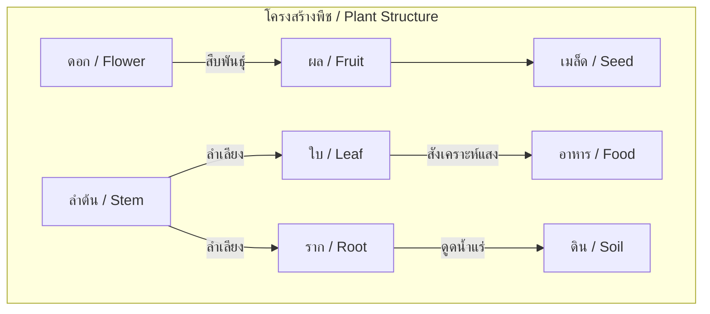
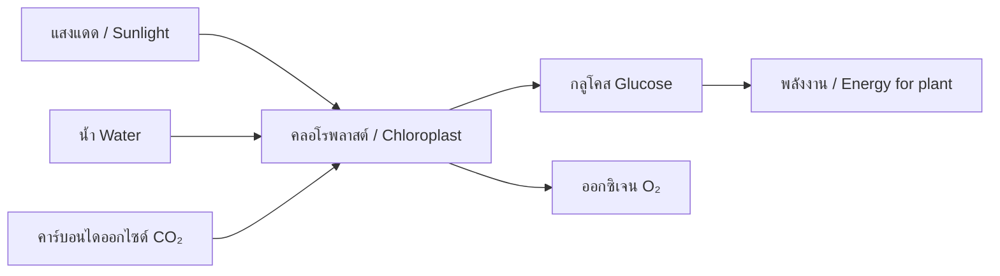
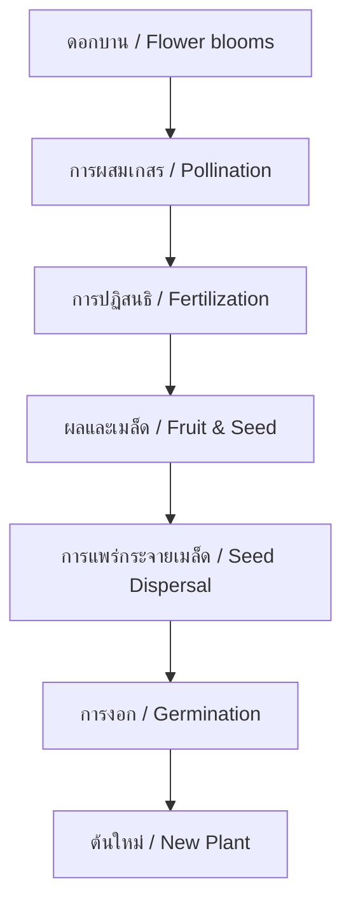

---
tags:
  - science
  - fundamental
  - life-science
  - plants
  - ipst
source: "IPST (สสวท.) Fundamental Science Curriculum, B.E. 2551 (2008, revised 2560/2017)"
created: 2026-07-26
course_codes: ["ว111", "ว112", "ว113", "ว121", "ว122", "ว123", "ว211", "ว212", "ว213"]
---

# Plants — พืช

> *"The creation of a thousand forests is in one acorn."* — Ralph Waldo Emerson

This note covers plant structure, function, classification, and the vital role plants play in ecosystems. Students progress from observing basic plant parts to understanding photosynthesis, reproduction, and plant biotechnology.

---

## 1 | Grade Band Breakdown

### ป.1–3 (Grades 1–3)

| Grade | Scope | Key Skills |
|---|---|---|
| **ป.1** | Parts of a plant | Root, stem, leaves, flowers (ราก ลำต้น ใบ ดอก); observing plants around school |
| **ป.2** | Plant needs | Water, sunlight, air, soil (น้ำ แสงแดด อากาศ ดิน); growing simple plants; observing growth |
| **ป.3** | Plant groups | Classification by size: herbs, shrubs, trees (ไม้ล้มลุก ไม้พุ่ม ไม้ยืนต้น); edible plant parts |

### ป.4–6 (Grades 4–6)

| Grade | Scope | Key Skills |
|---|---|---|
| **ป.4** | Plant functions I | Root functions (ดูดน้ำ); stem transport; leaf functions; transpiration (การคายน้ำ) |
| **ป.5** | Plant functions II | Photosynthesis basics; flower parts and pollination (การผสมเกสร); seed dispersal (การแพร่กระจายเมล็ด) |
| **ป.6** | Plant reproduction | Sexual vs asexual reproduction; seed germination (การงอก); plant growth and tropism (การหันเห) |

### ม.1–3 (Grades 7–9)

| Grade | Scope | Key Skills |
|---|---|---|
| **ม.1** | Plant structure | Tissue types; vascular vs non-vascular; monocot vs dicot |
| **ม.2** | Plant processes | Photosynthesis equation; transpiration pull; mineral absorption; plant hormones |
| **ม.3** | Plant ecology | Plant adaptations; economic plants of Thailand; plant biotechnology; GMOs |

---

## 2 | Key Terminology

| Thai | English | Notes |
|---|---|---|
| ราก | Root | Anchors plant, absorbs water/minerals |
| ลำต้น | Stem | Supports plant, transports substances |
| ใบ | Leaf | Photosynthesis site |
| ดอก | Flower | Reproductive structure |
| ผล | Fruit | Mature ovary, contains seeds |
| เมล็ด | Seed | Embryo plant with food supply |
| ชั้นเนื้อเยื่อลำเลียง | Vascular tissue | Xylem and phloem |
| ท่อลำเลียงน้ำ | Xylem | Transports water upward |
| ท่อลำเลียงอาหาร | Phloem | Transports sugars downward |
| การสังเคราะห์ด้วยแสง | Photosynthesis | Making food from light |
| การหายใจระดับเซลล์ | Cellular respiration | Using food for energy |
| การคายน้ำ | Transpiration | Water loss from leaves |
| การผสมเกสร | Pollination | Transfer of pollen |
| การปฏิสนธิ | Fertilization | Union of egg and sperm |
| การงอก | Germination | Seed sprouting |
| การหันเหเข้าหาแสง | Phototropism | Growth toward light |
| การหันเหตามแรงโน้มถ่วง | Gravitropism | Growth response to gravity |
| ไม้ล้มลุก | Herb | Soft-stemmed plant |
| ไม้พุ่ม | Shrub | Multi-stemmed, medium height |
| ไม้ยืนต้น | Tree | Woody, single trunk |
| พืชใบเลี้ยงคู่ | Dicot | Two seed leaves, net veins |
| พืชใบเลี้ยงเดี่ยว | Monocot | One seed leaf, parallel veins |

---

## 3 | Plant Structure

### 3.1 Parts and Functions



| Part | Thai | Functions |
|---|---|---|
| Root | ราก | Anchoring, water/mineral absorption, food storage |
| Stem | ลำต้น | Support, transport (xylem & phloem), storage |
| Leaf | ใบ | Photosynthesis, gas exchange, transpiration |
| Flower | ดอก | Reproduction (attract pollinators) |
| Fruit | ผล | Protect seeds, aid dispersal |
| Seed | เมล็ด | Embryo, food for germination |

### 3.2 Leaf Structure (ม.1)

```
Upper epidermis (ผิวใบด้านบน)
  ↓
Palisade mesophyll (เนื้อเยื่อพาริเซด) — main photosynthesis
  ↓
Spongy mesophyll (เนื้อเยื่อฟองน้ำ) — gas exchange
  ↓
Lower epidermis (ผิวใบด้านล่าง)
  → Stomata (ปากใบ) — gas exchange openings
  → Guard cells (เซลล์คุม) — open/close stomata
```

### 3.3 Vascular Tissue

| Tissue | Thai | Direction | Contents |
|---|---|---|---|
| Xylem | ท่อลำเลียงน้ำ | Upward (ราก → ใบ) | Water + dissolved minerals |
| Phloem | ท่อลำเลียงอาหาร | Bidirectional | Sugars (sucrose) |

---

## 4 | Photosynthesis (การสังเคราะห์ด้วยแสง)

### 4.1 Equation

$$6\text{CO}_2 + 6\text{H}_2\text{O} \xrightarrow{\text{light energy}} \text{C}_6\text{H}_{12}\text{O}_6 + 6\text{O}_2$$

### 4.2 Process



**Requirements:**
- Light energy (พลังงานแสง)
- Water (น้ำ) — absorbed by roots
- Carbon dioxide (คาร์บอนไดออกไซด์) — enters through stomata

**Products:**
- Glucose (กลูโคส) — food/energy storage
- Oxygen (ออกซิเจน) — released into atmosphere

---

## 5 | Plant Reproduction

### 5.1 Flower Structure

| Part | Thai | Function |
|---|---|---|
| Sepal | กลีบเลี้ยง | Protects bud |
| Petal | กลีบดอก | Attracts pollinators |
| Stamen (male) | เกสรตัวผู้ | Produces pollen |
| Pistil (female) | เกสรตัวเมีย | Contains ovules |

### 5.2 Reproduction Process



**Pollination types:**
- **Self-pollination (การผสมเกสรตัวเอง)** — Same flower
- **Cross-pollination (การผสมเกสรข้าม)** — Different flowers, same species
- **Agents:** Wind (ลม), insects (แมลง), birds (นก), water (น้ำ)

### 5.3 Seed Dispersal Methods

| Method | Thai | Examples |
|---|---|---|
| Wind | ลม | Dandelion, maple |
| Water | น้ำ | Coconut, lotus |
| Animals | สัตว์ | Burdock (hooks), cherry (eaten) |
| Explosive | การระเบิด | Touch-me-not (ไมยราบ) |

---

## 6 | Monocots vs Dicots

| Feature | Monocot (ใบเลี้ยงเดี่ยว) | Dicot (ใบเลี้ยงคู่) |
|---|---|---|
| Seed leaves | 1 | 2 |
| Leaf veins | Parallel (ขนาน) | Net/branching (ร่างแห) |
| Flower parts | Multiples of 3 | Multiples of 4 or 5 |
| Vascular bundles | Scattered | Ring arrangement |
| Root system | Fibrous (รากฝอย) | Taproot (รากแก้ว) |
| Thai examples | ข้าว, ข้าวโพด, หญ้า | ถั่ว, มะม่วง, ทานตะวัน |

---

## 7 | Thai Economic Plants

| Plant | Thai | Use |
|---|---|---|
| Rice | ข้าว | Staple food |
| Rubber | ยางพารา | Latex production |
| Cassava | มันสำปะหลัง | Starch, animal feed |
| Sugarcane | อ้อย | Sugar production |
| Palm oil | ปาล์มน้ำมัน | Cooking oil, biodiesel |
| Durian | ทุเรียน | Fruit export |
| Jasmine | มะลิ | National flower, fragrance |

---

## 8 | Cross-Links

- [[02_Living_Things]] — Plants as living organisms
- [[03_Cells]] — Plant cell structure (chloroplast, cell wall)
- [[06_Animals]] — Plant-animal interactions (pollination, seed dispersal)
- [[07_Ecosystems]] — Plants as producers in food webs
- [[14_Energy]] — Light energy conversion in photosynthesis
- [[16_Light]] — Role of light in photosynthesis
