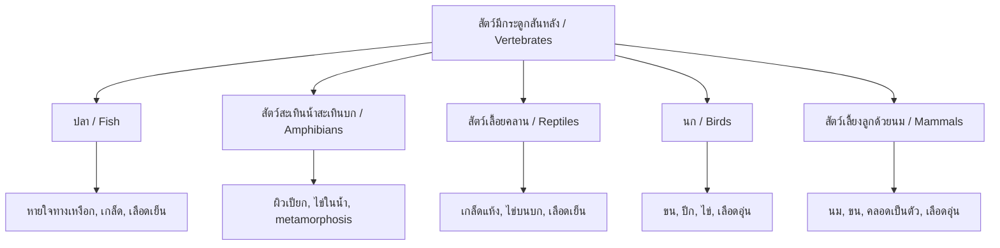

---
tags:
  - science
  - fundamental
  - life-science
  - animals
  - ipst
source: "IPST (สสวท.) Fundamental Science Curriculum, B.E. 2551 (2008, revised 2560/2017)"
created: 2026-07-26
course_codes: ["ว111", "ว112", "ว113", "ว121", "ว122", "ว123", "ว211", "ว212", "ว213"]
---

# Animals — สัตว์

> *"The greatness of a nation and its moral progress can be judged by the way its animals are treated."* — Mahatma Gandhi

This note covers animal classification, body structures, behaviors, and adaptations. Students progress from recognizing familiar animals to understanding complex classification systems and ecological roles.

---

## 1 | Grade Band Breakdown

### ป.1–3 (Grades 1–3)

| Grade | Scope | Key Skills |
|---|---|---|
| **ป.1** | Familiar animals | Naming common animals; identifying where they live (บ้านของสัตว์); animal sounds |
| **ป.2** | Animal features | Body coverings: fur, feathers, scales, skin (ขน ขนนก เกล็ด ผิวหนัง); movement types |
| **ป.3** | Animal groups | Vertebrates vs invertebrates; grouping by features (มีปีก ว่ายน้ำ เดิน 4 ขา) |

### ป.4–6 (Grades 4–6)

| Grade | Scope | Key Skills |
|---|---|---|
| **ป.4** | Vertebrate groups | Fish, amphibians, reptiles, birds, mammals — characteristics and examples |
| **ป.5** | Invertebrate groups | Insects, spiders, worms, mollusks, crustaceans; insect body parts |
| **ป.6** | Animal life cycles | Metamorphosis (การเปลี่ยนแปลงรูปร่าง); egg-laying vs live birth; animal behavior |

### ม.1–3 (Grades 7–9)

| Grade | Scope | Key Skills |
|---|---|---|
| **ม.1** | Classification | Taxonomic classification; phyla of invertebrates; comparison across groups |
| **ม.2** | Adaptation | Structural and behavioral adaptations; camouflage (อำพราง); mimicry |
| **ม.3** | Ecology | Animal roles in ecosystems; endangered species of Thailand; conservation |

---

## 2 | Key Terminology

| Thai | English | Notes |
|---|---|---|
| สัตว์มีกระดูกสันหลัง | Vertebrate | Animals with backbone |
| สัตว์ไม่มีกระดูกสันหลัง | Invertebrate | Animals without backbone |
| ปลา | Fish | Aquatic, gills, scales |
| สัตว์สะเทินน้ำสะเทินบก | Amphibian | Live in water and on land |
| สัตว์เลื้อยคลาน | Reptile | Scales, cold-blooded |
| นก | Bird | Feathers, wings, warm-blooded |
| สัตว์เลี้ยงลูกด้วยนม | Mammal | Hair/fur, milk, warm-blooded |
| แมลง | Insect | 6 legs, 3 body parts |
| แมงมุม | Arachnid | 8 legs, 2 body parts |
| หนอน | Worm | Soft, elongated body |
| หอย | Mollusk | Soft body, often with shell |
| กุ้ง ปู | Crustacean | Exoskeleton, jointed legs |
| การเปลี่ยนแปลงรูปร่าง | Metamorphosis | Body transformation during life cycle |
| การอำพราง | Camouflage | Blending with environment |
| การเลียนแบบ | Mimicry | Resembling another species |
| การอพยพ | Migration | Seasonal movement |
| การจำศีล | Hibernation | Winter dormancy |
| สัตว์เลือดอ้าง | Cold-blooded (ectotherm) | Body temp follows environment |
| สัตว์เลือดอุ่น | Warm-blooded (endotherm) | Constant body temperature |
| กระดูกสันหลัง | Backbone/Spine | Series of vertebrae |
| เหงือก | Gills | Breathing organs in fish |
| ปอด | Lungs | Breathing organs in land animals |

---

## 3 | Animal Classification

### 3.1 Vertebrate Groups

### 3.2 Comparison Table

| Feature | Fish | Amphibian | Reptile | Bird | Mammal |
|---|---|---|---|---|---|
| Thai | ปลา | สัตว์สะเทินน้ำสะเทินบก | สัตว์เลื้อยคลาน | นก | สัตว์เลี้ยงลูกด้วยนม |
| Body temp | Cold | Cold | Cold | Warm | Warm |
| Skin | Scales | Moist, smooth | Dry scales | Feathers | Hair/fur |
| Breathing | Gills | Gills + lungs | Lungs | Lungs | Lungs |
| Eggs | In water | In water | On land | On land | Mostly live birth |
| Young care | Little | Little | Little | Some | Extensive (milk) |
| Thai example | ปลาดุก | กบ | จิ้งจก | ไก่ | ช้าง |

### 3.3 Invertebrate Groups

| Group | Thai | Legs | Body Parts | Examples |
|---|---|---|---|---|
| Insects | แมลง | 6 | 3 (head, thorax, abdomen) | ผีเสื้อ, มด, แมลงปอ |
| Arachnids | แมงมุม | 8 | 2 (cephalothorax, abdomen) | แมงมุม, แมงป่อง |
| Crustaceans | กุ้ง ปู | 10+ | Varies | กุ้ง, ปู |
| Mollusks | หอย | 0 | Soft body | หอยทาก, ปลาหมึก |
| Worms | หนอน | 0 | Segmented or not | ไส้เดือน, พยาธิ |
| Echinoderms | เอคิโนเดิร์ม | 0 | 5-part symmetry | ดาวทะเล, เม่นทะเล |

---

## 4 | Metamorphosis (การเปลี่ยนแปลงรูปร่าง)

### 4.1 Complete Metamorphosis (การเปลี่ยนแปลงสมบูรณ์)

**Examples:** Butterfly (ผีเสื้อ), beetle (ด้วง), mosquito (ยุง)

### 4.2 Incomplete Metamorphosis (การเปลี่ยนแปลงไม่สมบูรณ์)

**Examples:** Cockroach (แมลงสาบ), dragonfly (แมลงปอ), grasshopper (ตั๊กแตน)

---

## 5 | Adaptations (การปรับตัว)

### 5.1 Structural Adaptations

| Adaptation | Thai | Purpose | Example |
|---|---|---|---|
| Webbed feet | เท้าเป็นพังผืด | Swimming | เป็ด, ห่าน |
| Sharp claws | เล็บแหลม | Hunting/climbing | เสือ, แมว |
| Thick fur | ขนหนา | Cold insulation | หมีขั้วโลก |
| Long neck | คอยาว | Reaching food | ยีราฟ |
| Streamlined body | ลำตัวเพรียว | Swimming | ปลา, โลมา |

### 5.2 Behavioral Adaptations

| Behavior | Thai | Purpose |
|---|---|---|
| Migration | การอพยพ | Finding food/warmth seasonally |
| Hibernation | การจำศีล | Surviving winter |
| Camouflage | การอำพราง | Avoiding predators |
| Mimicry | การเลียนแบบ | Warning or deceiving |
| Nocturnal activity | ออกหากินกลางคืน | Avoiding heat/predators |

---

## 6 | Thai Wildlife

| Animal | Thai | Status | Habitat |
|---|---|---|---|
| Asian elephant | ช้างไทย | Endangered | Forests |
| Tiger | เสือ | Endangered | Forests |
| Irrawaddy dolphin | โลมาอิระวดี | Endangered | Mekong River |
| Siamese crocodile | จระเข้สยาม | Critically endangered | Wetlands |
| Hornbill | นกเงือก | Threatened | Rainforest |
| Pangolin | ตัวนิ่ม | Critically endangered | Forests |

---

## 7 | Cross-Links

- [[02_Living_Things]] — Animals as living organisms
- [[03_Cells]] — Animal cell structure
- [[04_Human_Body_Systems]] — Humans as mammals
- [[05_Plants]] — Plant-animal interactions
- [[07_Ecosystems]] — Animals in food webs
- [[08_Heredity_and_Evolution]] — Animal adaptations through evolution
