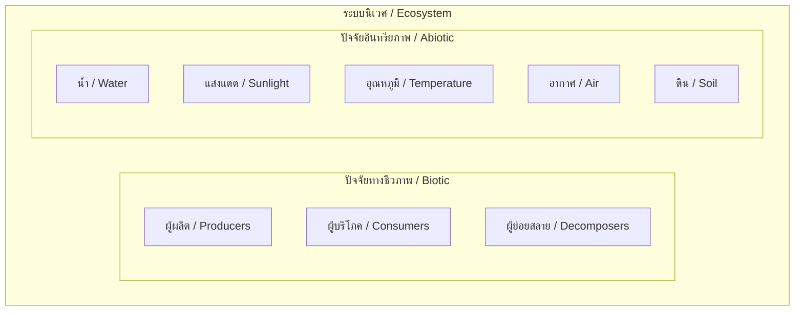
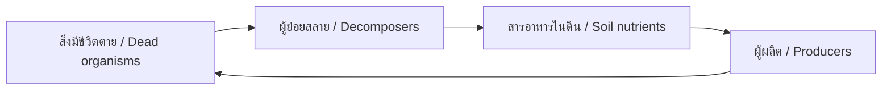
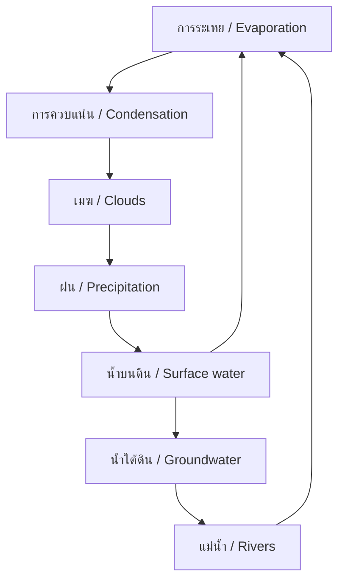

---
tags:
  - science
  - fundamental
  - life-science
  - ecosystems
  - ipst
source: "IPST (สสวท.) Fundamental Science Curriculum, B.E. 2551 (2008, revised 2560/2017)"
created: 2026-07-26
course_codes: ["ว121", "ว122", "ว123", "ว211", "ว212", "ว213"]
---

# Ecosystems — ระบบนิเวศ

> *"We do not inherit the earth from our ancestors; we borrow it from our children."*

This note covers ecosystems, food webs, energy flow, nutrient cycles, and the interactions between organisms and their environment. Students progress from observing local habitats to understanding global ecological processes.

---

## 1 | Grade Band Breakdown

### ป.1–3 (Grades 1–3)

| Grade | Scope | Key Skills |
|---|---|---|
| **ป.1** | My environment | Observing plants and animals in schoolyard; living and non-living things in surroundings |
| **ป.2** | Habitats | Where animals live (ที่อยู่ของสัตว์); matching animals to habitats; water, forest, garden |
| **ป.3** | Basic relationships | Simple food chains (ห่วงโซ่อาหาร); what eats what; predator and prey (ผู้ล่าและเหยื่อ) |

### ป.4–6 (Grades 4–6)

| Grade | Scope | Key Skills |
|---|---|---|
| **ป.4** | Food webs | Producers, consumers, decomposers (ผู้ผลิต ผู้บริโภค ผู้ย่อยสลาย); energy flow |
| **ป.5** | Ecosystem components | Biotic vs abiotic factors (ปัจจัยทางชีวภาพและอินทรียภาพ); habitats and niches |
| **ป.6** | Human impact | Pollution (มลพิษ); conservation (การอนุรักษ์); sustainable use |

### ม.1–3 (Grades 7–9)

| Grade | Scope | Key Skills |
|---|---|---|
| **ม.1** | Ecosystem structure | Trophic levels; energy pyramids (ปิรามิดพลังงาน); nutrient cycles |
| **ม.2** | Population ecology | Population dynamics; carrying capacity; succession |
| **ม.3** | Global ecology | Biomes; climate change; biodiversity; environmental problems in Thailand |

---

## 2 | Key Terminology

| Thai | English | Notes |
|---|---|---|
| ระบบนิเวศ | Ecosystem | Community of organisms + environment |
| ระบบนิเวศวิทยา | Ecology | Study of ecosystems |
| ปัจจัยทางชีวภาพ | Biotic factor | Living components |
| ปัจจัยอินทรียภาพ | Abiotic factor | Non-living components (water, light, temp) |
| ผู้ผลิต | Producer (autotroph) | Makes own food (plants) |
| ผู้บริโภค | Consumer (heterotroph) | Eats other organisms |
| ผู้ย่อยสลาย | Decomposer | Breaks down dead matter |
| ห่วงโซ่อาหาร | Food chain | Linear feeding relationships |
| สายใยอาหาร | Food web | Interconnected food chains |
| ระดับ trophic | Trophic level | Position in food chain |
| ปิรามิดพลังงาน | Energy pyramid | Energy decrease at each level |
| ปิรามิดจำนวน | Number pyramid | Organism count at each level |
| ปิรามิดมวลชีวภาพ | Biomass pyramid | Mass of organisms at each level |
| ความจุสิ่งแวดล้อม | Carrying capacity | Max population an area can support |
| การสืบทอด | Succession | Community change over time |
| ความหลากหลายทางชีวภาพ | Biodiversity | Variety of life |
| มลพิษ | Pollution | Harmful contamination |
| การอนุรักษ์ | Conservation | Protecting natural resources |
| แหล่งที่อยู่อาศัย | Habitat | Place where organism lives |
| ตำแหน่งนิเวศ | Niche | Role of organism in ecosystem |
| ภาวะพึ่งพิง | Symbiosis | Close species interactions |

---

## 3 | Ecosystem Components



---

## 4 | Food Chains and Webs

### 4.1 Trophic Levels

```
Level 4: Secondary consumer (ผู้บริโภคที่ 2) — นกอินทรี / Eagle
    ↑ 10% energy transfer
Level 3: Primary consumer (ผู้บริโภคที่ 1) — งู / Snake
    ↑ 10% energy transfer
Level 2: Primary consumer (ผู้บริโภคที่ 1) — หนู / Mouse
    ↑ 10% energy transfer
Level 1: Producer (ผู้ผลิต) — หญ้า / Grass
```

### 4.2 Energy Flow Rule

$$\text{Energy at level } n+1 \approx 10\% \times \text{Energy at level } n$$

This is why energy pyramids narrow at the top — there's less energy available for higher-level consumers.

### 4.3 Decomposers' Role



---

## 5 | Nutrient Cycles

### 5.1 Water Cycle (วัฏจักรน้ำ)



### 5.2 Carbon Cycle (วัฏจักรคาร์บอน)

| Process | Direction | Agent |
|---|---|---|
| Photosynthesis | CO₂ → organic carbon | Plants |
| Respiration | Organic carbon → CO₂ | All living things |
| Combustion | Fossil fuels → CO₂ | Humans |
| Decomposition | Dead matter → CO₂ | Decomposers |

### 5.3 Nitrogen Cycle (วัฏจักรไนโตรเจน)

$$\text{N}_2 \xrightarrow{\text{fixation}} \text{NH}_3 \xrightarrow{\text{nitrification}} \text{NO}_3^- \xrightarrow{\text{absorption}} \text{plants}$$

---

## 6 | Symbiosis (ภาวะพึ่งพิง)

| Type | Thai | Description | Example |
|---|---|---|---|
| Mutualism | พึ่งพาอาศัย (ได้ประโยชน์ร่วม) | Both benefit | Bee + flower |
| Commensalism | พึ่งพาอาศัย (ฝ่ายเดียว) | One benefits, other unaffected | Remora + shark |
| Parasitism | การเบียดเบียน | One benefits, other harmed | Tick + dog |

---

## 7 | Human Impact on Ecosystems

### 7.1 Environmental Problems in Thailand

| Problem | Thai | Impact |
|---|---|---|
| Deforestation | การตัดไม้ทำลายป่า | Habitat loss, flooding |
| Water pollution | มลพิษทางน้ำ | Fish kills, unsafe drinking water |
| Air pollution | มลพิษทางอากาศ | PM2.5, respiratory illness |
| Coral bleaching | ปะการังฟอกขาว | Marine biodiversity loss |
| Overfishing | การประมงเกิน | Fish stock depletion |

### 7.2 Conservation Efforts

| Action | Thai | Example |
|---|---|---|
| National parks | อุทยานแห่งชาติ | Khao Yai, Doi Inthanon |
| Wildlife sanctuaries | เขตห้ามล่าสัตว์ | Protection of endangered species |
| Reforestation | การปลูกป่า | Community forest projects |
| Marine conservation | การอนุรักษ์ทะเล | Coral reef restoration |

---

## 8 | Cross-Links

- [[02_Living_Things]] — Organisms in ecosystems
- [[05_Plants]] — Plants as producers
- [[06_Animals]] — Animals as consumers
- [[14_Energy]] — Energy flow through ecosystems
- [[19_Rocks_Minerals_Soil]] — Abiotic components
- [[20_Weather_and_Climate]] — Climate effects on ecosystems
