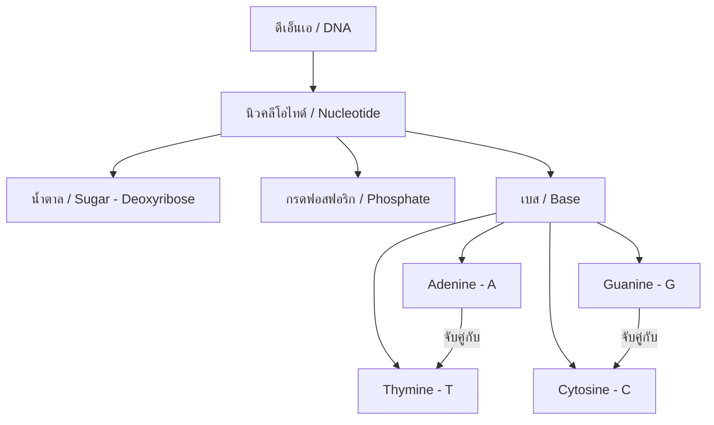
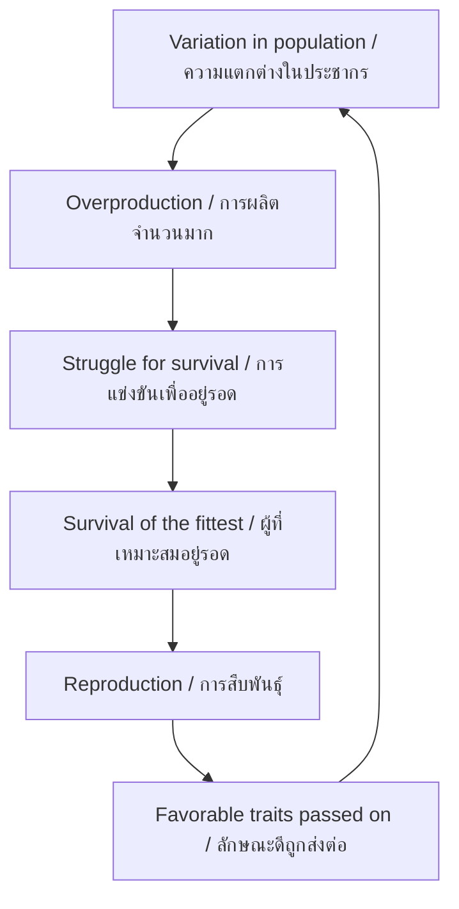

---
tags:
  - science
  - fundamental
  - life-science
  - heredity
  - evolution
  - ipst
source: "IPST (สสวท.) Fundamental Science Curriculum, B.E. 2551 (2008, revised 2560/2017)"
created: 2026-07-26
course_codes: ["ว211", "ว212", "ว213"]
---

# Heredity and Evolution — พันธุกรรมและวิวัฒนาการ

> *"Nothing in biology makes sense except in the light of evolution."* — Theodosius Dobzhansky

This note covers genetics, heredity, DNA, and evolutionary theory. Students learn how traits are passed from parents to offspring and how species change over time.

---

## 1 | Grade Band Breakdown

### ป.1–3 (Grades 1–3)

| Grade | Scope | Key Skills |
|---|---|---|
| **ป.1–3** | Basic awareness | Observing similarities between parents and offspring; noticing that children look like parents |

### ป.4–6 (Grades 4–6)

| Grade | Scope | Key Skills |
|---|---|---|
| **ป.4** | Similarities and differences | Comparing traits within families; inherited vs learned traits |
| **ป.5** | Life cycles | Reproduction in plants and animals; seed dispersal |
| **ป.6** | Variation | Differences within species; selective breeding (การคัดเลือกพันธุ์) |

### ม.1–3 (Grades 7–9)

| Grade | Scope | Key Skills |
|---|---|---|
| **ม.1** | Genetics basics | DNA structure; genes and chromosomes; dominant and recessive traits |
| **ม.2** | Heredity | Punnett squares; Mendel's laws; genetic disorders |
| **ม.3** | Evolution | Natural selection; evidence for evolution; speciation; Thai fossil record |

---

## 2 | Key Terminology

| Thai | English | Notes |
|---|---|---|
| พันธุกรรม | Heredity/Genetics | Passing traits from parent to offspring |
| ยีน | Gene | Segment of DNA coding for a trait |
| ดีเอ็นเอ | DNA | Deoxyribonucleic acid; genetic material |
| โครโมโซม | Chromosome | Structure carrying genes |
| ลักษณะเด่น | Dominant trait | Expressed when one copy present |
| ลักษณะด้อย | Recessive trait | Expressed only when two copies present |
| จีโนไทป์ | Genotype | Genetic makeup (e.g., Tt) |
| ฟีโนไทป์ | Phenotype | Physical appearance |
| พันธุ์แท้ | Homozygous | Same alleles (TT or tt) |
| พันธุ์ลูกผสม | Heterozygous | Different alleles (Tt) |
| การถ่ายทอด | Inheritance | Process of passing traits |
| การกลายพันธุ์ | Mutation | Change in DNA sequence |
| วิวัฒนาการ | Evolution | Change in species over time |
| การคัดเลือกโดยธรรมชาติ | Natural selection | Survival of the fittest |
| ฟอสซิล | Fossil | Preserved remains of ancient life |
| สปีชีส์ | Species | Group that can interbreed |
| การเกิดสปีชีส์ใหม่ | Speciation | Formation of new species |

---

## 3 | DNA and Genetics

### 3.1 DNA Structure



**Base pairing rules:**
- Adenine (A) pairs with Thymine (T)
- Guanine (G) pairs with Cytosine (C)

### 3.2 Genetic Hierarchy

```
DNA (ดีเอ็นเอ)
  → Gene (ยีน) — functional segment
    → Chromosome (โครโมโซม) — organized DNA + protein
      → Genome (จีโนม) — complete set of chromosomes
```

**Human genome:**
- 46 chromosomes (23 pairs)
- ~20,000-25,000 genes
- 22 pairs autosomes + 1 pair sex chromosomes (XX or XY)

---

## 4 | Mendelian Genetics

### 4.1 Gregor Mendel's Laws

| Law | Thai | Description |
|---|---|---|
| Law of Segregation | กฎการแยก | Alleles separate during gamete formation |
| Law of Independent Assortment | กฎการจัดเรียงอิสระ | Different genes assort independently |

### 4.2 Punnett Square (ตารางเพนเนตต์)

**Monohybrid cross: Tt × Tt**

```
        T       t
    ┌───────┬───────┐
T   │  TT   │  Tt   │
    │  Tall  │  Tall  │
    ├───────┼───────┤
t   │  Tt   │  tt   │
    │  Tall  │  Short │
    └───────┴───────┘
```

**Phenotype ratio:** 3 Tall : 1 Short
**Genotype ratio:** 1 TT : 2 Tt : 1 tt

### 4.3 Probability

$$P(\text{trait}) = \frac{\text{Number with trait}}{\text{Total offspring}}$$

---

## 5 | Sex Determination

```
Mother (XX) × Father (XY)

        X       Y
    ┌───────┬───────┐
X   │  XX   │  XY   │
    │  Girl  │  Boy   │
    ├───────┼───────┤
X   │  XX   │  XY   │
    │  Girl  │  Boy   │
    └───────┴───────┘
```

**Probability:** 50% female (XX), 50% male (XY)

---

## 6 | Evolution (วิวัฒนาการ)

### 6.1 Darwin's Theory of Natural Selection



### 6.2 Evidence for Evolution

| Evidence | Thai | Description |
|---|---|---|
| Fossils | ฟอสซิล | Preserved remains showing change over time |
| Comparative anatomy | กายวิภาคเปรียบเทียบ | Homologous structures |
| Embryology | ตัวอ่อนวิทยา | Similar embryonic development |
| DNA comparison | การเปรียบเทียบดีเอ็นเอ | Genetic similarity between species |
| Biogeography | ชีวภูมิศาสตร์ | Distribution of species |

### 6.3 Types of Evolution

| Type | Thai | Description |
|---|---|---|
| Divergent | วิวัฒนาการแยก | Common ancestor → different forms |
| Convergent | วิวัฒนาการมาบรรจบ | Different ancestors → similar forms |
| Co-evolution | วิวัฒนาการร่วม | Species evolve together |

---

## 7 | Genetic Variation Sources

| Source | Thai | Description |
|---|---|---|
| Mutation | การกลายพันธุ์ | Random DNA changes |
| Sexual reproduction | การสืบพันธุ์แบบอาศัยเพศ | Mixing of parental genes |
| Crossing over | การแลกเปลี่ยนชิ้นส่วนโครโมโซม | Chromosome segments swap |

---

## 8 | Real-World Examples

1. **Thai rice varieties** — Selective breeding for disease resistance
2. **Siamese fighting fish** — Artificial selection for color and fin shape
3. **Elephant evolution** — Fossil evidence in Thailand
4. **Sickle cell anemia** — Example of recessive genetic disorder
5. **Antibiotic resistance** — Modern example of natural selection

---

## 9 | Cross-Links

- [[02_Living_Things]] — Classification and diversity of life
- [[03_Cells]] — DNA in nucleus, cell division
- [[06_Animals]] — Animal adaptations
- [[07_Ecosystems]] — Natural selection in ecosystems
