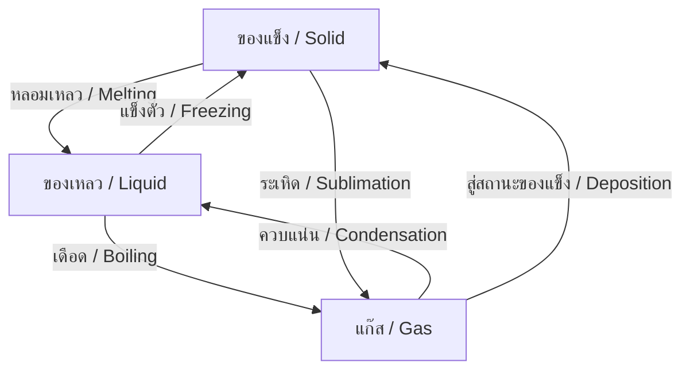

---
tags:
  - science
  - fundamental
  - chemistry
  - matter
  - properties
  - ipst
source: "IPST (สสวท.) Fundamental Science Curriculum, B.E. 2551 (2008, revised 2560/2017)"
created: 2026-07-26
course_codes: ["ว111", "ว112", "ว113", "ว211", "ว212", "ว213"]
---

# Matter and Properties — สสารและสมบัติ

> *"Nothing exists except atoms and empty space; everything else is opinion."* — Democritus

This note covers the nature of matter, states of matter, physical and chemical properties, and changes of state. Students progress from observing everyday materials to understanding molecular behavior and conservation of mass.

---

## 1 | Grade Band Breakdown

### ป.1–3 (Grades 1–3)

| Grade | Scope | Key Skills |
|---|---|---|
| **ป.1** | Materials around me | Identifying objects by material (ไม้ โลหะ พลาสติก แก้ว ผ้า); sorting by properties |
| **ป.2** | Properties of materials | Hard/soft, rough/smooth, heavy/light (แข็ง/อ่อน หยาบ/เรียบ หนัก/เบา); transparency |
| **ป.3** | States of matter | Solid, liquid, gas (ของแข็ง ของเหลว แก๊ส); observing melting, freezing, evaporation |

### ป.4–6 (Grades 4–6)

| Grade | Scope | Key Skills |
|---|---|---|
| **ป.4** | Properties I | Density concept (ความหนาแน่น); solubility (การละลาย); conductivity |
| **ป.5** | Properties II | Mixtures vs pure substances (สารเนื้อผสม vs สารเนื้อเดียว); separation methods |
| **ป.6** | Changes of state | Melting, boiling, freezing, condensation; evaporation vs boiling; conservation of mass |

### ม.1–3 (Grades 7–9)

| Grade | Scope | Key Skills |
|---|---|---|
| **ม.1** | Particle theory | Particle model of matter; Brownian motion; diffusion; density calculations |
| **ม.2** | Physical vs chemical properties | Extensive vs intensive properties; physical vs chemical changes |
| **ม.3** | Conservation laws | Conservation of mass; gas laws; pressure-volume-temperature relationships |

---

## 2 | Key Terminology

| Thai | English | Notes |
|---|---|---|
| สสาร | Matter | Anything that has mass and takes up space |
| มวล | Mass | Amount of matter (kg, g) |
| ปริมาตร | Volume | Space occupied (L, mL, cm³) |
| ความหนาแน่น | Density | Mass per unit volume |
| สถานะของแข็ง | Solid state | Fixed shape and volume |
| สถานะของเหลว | Liquid state | Fixed volume, takes container shape |
| สถานะแก๊ส | Gas state | No fixed shape or volume |
| สมบัติทางกายภาพ | Physical property | Observable without changing substance |
| สมบัติทางเคมี | Chemical property | How substance reacts with others |
| การเปลี่ยนแปลงทางกายภาพ | Physical change | No new substance formed |
| การเปลี่ยนแปลงทางเคมี | Chemical change | New substance formed |
| การละลาย | Dissolving/Solubility | Solute dissolving in solvent |
| สารละลาย | Solution | Homogeneous mixture |
| สารเนื้อเดียว | Pure substance | Single component |
| สารเนื้อผสม | Mixture | Multiple components |
| การหลอมเหลว | Melting | Solid → Liquid |
| การแข็งตัว | Freezing | Liquid → Solid |
| การเดือด | Boiling | Liquid → Gas (throughout) |
| การควบแน่น | Condensation | Gas → Liquid |
| การระเหย | Evaporation | Liquid → Gas (surface only) |
| การแพร่ | Diffusion | Movement from high to low concentration |

---

## 3 | States of Matter

### 3.1 Comparison

| Property | Solid (ของแข็ง) | Liquid (ของเหลว) | Gas (แก๊ส) |
|---|---|---|---|
| Shape | Fixed | Takes container shape | Fills container |
| Volume | Fixed | Fixed | Variable |
| Particle arrangement | Ordered, close | Close, random | Far apart, random |
| Particle motion | Vibrate in place | Slide past each other | Move freely |
| Compressibility | Very low | Low | High |
| Density | Usually highest | Medium | Usually lowest |

### 3.2 Changes of State

---

## 4 | Key Formulas

### 4.1 Density (ความหนาแน่น)

$$\rho = \frac{m}{V}$$

Where:
- $\rho$ = density (kg/m³ or g/cm³)
- $m$ = mass (kg or g)
- $V$ = volume (m³ or cm³)

### 4.2 Conservation of Mass

$$\text{Mass of reactants} = \text{Mass of products}$$

(In a closed system, mass is neither created nor destroyed)

### 4.3 Volume of Regular Objects

$$V_{\text{rectangular}} = l \times w \times h$$

$$V_{\text{cylinder}} = \pi r^2 h$$

$$V_{\text{sphere}} = \frac{4}{3}\pi r^3$$

---

## 5 | Separation Methods

| Method | Thai | Used For | Example |
|---|---|---|---|
| Filtering | การกรอง | Solid from liquid | Sand from water |
| Evaporation | การระเหย | Solute from solution | Salt from saltwater |
| Distillation | การกลั่น | Liquids with different BP | Water purification |
| Chromatography | การทำโครมาโทกราฟี | Colored mixtures | Ink components |
| Sieving | การร่อน | Different sized particles | Flour from lumps |
| Magnetic separation | การแยกด้วยแม่เหล็ก | Magnetic materials | Iron from sand |

---

## 6 | Physical vs Chemical Changes

| Physical Change | Chemical Change |
|---|---|
| No new substance | New substance formed |
| Usually reversible | Usually irreversible |
| Shape/state changes | Color change, gas production, precipitate |
| Examples: melting ice, dissolving sugar | Examples: burning wood, rusting iron |

---

## 7 | Real-World Examples

1. **Thai cooking** — Dissolving sugar in water; boiling water for noodles
2. **Gold vs iron** — Density comparison (gold: 19.3 g/cm³, iron: 7.87 g/cm³)
3. **Ice cream making** — Freezing point depression
4. **Rain cycle** — Evaporation and condensation

---

## 8 | Cross-Links

- [[10_Atoms_Elements_and_Compounds]] — Particle model of matter
- [[11_Chemical_Reactions]] — Chemical changes
- [[15_Heat_and_Temperature]] — Heat and changes of state
- [[14_Energy]] — Energy in phase changes
