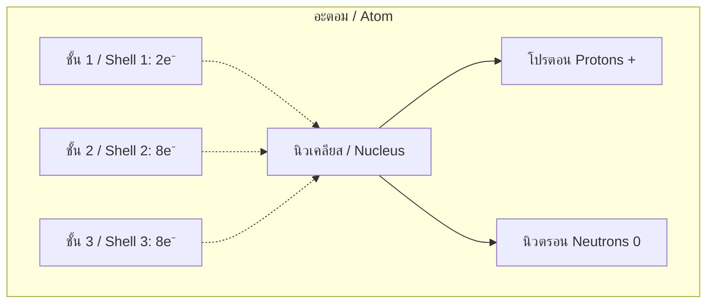
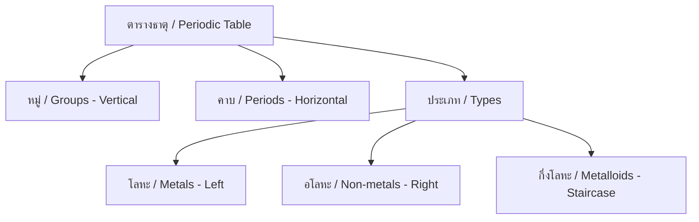

---
tags:
  - science
  - fundamental
  - chemistry
  - atoms
  - elements
  - compounds
  - ipst
source: "IPST (สสวท.) Fundamental Science Curriculum, B.E. 2551 (2008, revised 2560/2017)"
created: 2026-07-26
course_codes: ["ว211", "ว212", "ว213"]
---

# Atoms, Elements, and Compounds — อะตอม ธาตุ สารประกอบ

> *"All matter is made of atoms."* — Richard Feynman

This note covers atomic structure, the periodic table, elements, compounds, and chemical bonding. Students learn the building blocks of all matter from ม.1 through ม.3.

---

## 1 | Grade Band Breakdown

### ป.1–3 (Grades 1–3)

| Grade | Scope | Key Skills |
|---|---|---|
| **ป.1–3** | Not directly covered | Students observe different materials but don't learn atomic theory |

### ป.4–6 (Grades 4–6)

| Grade | Scope | Key Skills |
|---|---|---|
| **ป.5–6** | Introduction | Awareness that matter is made of tiny particles; basic concept of elements |

### ม.1–3 (Grades 7–9)

| Grade | Scope | Key Skills |
|---|---|---|
| **ม.1** | Atomic structure | Protons, neutrons, electrons; atomic number; mass number; electron arrangement |
| **ม.2** | Periodic table | Groups and periods; metals, non-metals, metalloids; valence electrons |
| **ม.3** | Bonding & compounds | Ionic and covalent bonds; molecular formulas; chemical names |

---

## 2 | Key Terminology

| Thai | English | Notes |
|---|---|---|
| อะตอม | Atom | Smallest unit of an element |
| ธาตุ | Element | Pure substance of one atom type |
| สารประกอบ | Compound | Two or more elements chemically bonded |
| โปรตอน | Proton | Positive particle in nucleus |
| นิวตรอน | Neutron | Neutral particle in nucleus |
| อิเล็กตรอน | Electron | Negative particle orbiting nucleus |
| นิวเคลียส | Nucleus | Center of atom (protons + neutrons) |
| จำนวนอะตอม | Atomic number (Z) | Number of protons |
| มวลอะตอม | Mass number (A) | Protons + neutrons |
| ตารางธาตุ | Periodic table | Organized chart of elements |
| หมู่ | Group | Vertical column in periodic table |
| คาบ | Period | Horizontal row in periodic table |
| โลหะ | Metal | Elements that conduct, are malleable |
| อโลหะ | Non-metal | Elements that don't conduct |
| กึ่งโลหะ | Metalloid | Properties between metals and non-metals |
| พันธะเคมี | Chemical bond | Force holding atoms together |
| พันธะไอออนิก | Ionic bond | Transfer of electrons |
| พันธะโคเวเลนต์ | Covalent bond | Sharing of electrons |
| สูตรเคมี | Chemical formula | Symbolic representation of compound |
| มวลโมเลกุล | Molecular mass | Sum of atomic masses in molecule |

---

## 3 | Atomic Structure

### 3.1 Model of the Atom

### 3.2 Key Numbers

| Quantity | Symbol | Formula |
|---|---|---|
| Atomic number | Z | = Number of protons |
| Mass number | A | = Protons + Neutrons |
| Neutrons | N | = A − Z |
| Electrons (neutral atom) | e⁻ | = Z (same as protons) |

**Example: Carbon-12**
- Z = 6 (6 protons)
- A = 12
- N = 12 − 6 = 6 neutrons
- e⁻ = 6
- Electron arrangement: 2, 4

---

## 4 | Periodic Table

### 4.1 Organization

### 4.2 Important Groups

| Group | Name | Thai | Properties | Examples |
|---|---|---|---|---|
| 1 | Alkali metals | โลหะอัลคาไล | Very reactive, soft | Li, Na, K |
| 2 | Alkaline earth | โลหะอัลคาไลน์เอิร์ธ | Reactive, harder | Mg, Ca |
| 17 | Halogens | ฮาโลเจน | Very reactive non-metals | F, Cl, Br |
| 18 | Noble gases | แก๊สมีสกุล | Very stable, unreactive | He, Ne, Ar |

### 4.3 Electron Arrangement

**Rules:**
- Shell 1: max 2 electrons
- Shell 2: max 8 electrons
- Shell 3: max 8 electrons (for first 20 elements)

**Examples:**
| Element | Z | Electron arrangement |
|---|---|---|
| Hydrogen (H) | 1 | 1 |
| Helium (He) | 2 | 2 |
| Carbon (C) | 6 | 2, 4 |
| Oxygen (O) | 8 | 2, 6 |
| Sodium (Na) | 11 | 2, 8, 1 |
| Chlorine (Cl) | 17 | 2, 8, 7 |

---

## 5 | Chemical Bonding

### 5.1 Ionic Bonding (พันธะไอออนิก)

**Process:** Metal transfers electrons to non-metal

$$\text{Na} \rightarrow \text{Na}^+ + e^-$$
$$\text{Cl} + e^- \rightarrow \text{Cl}^-$$
$$\text{Na}^+ + \text{Cl}^- \rightarrow \text{NaCl}$$

**Example:** Sodium chloride (เกลือแกง / NaCl)

### 5.2 Covalent Bonding (พันธะโคเวเลนต์)

**Process:** Non-metals share electron pairs

**Example:** Water (น้ำ / H₂O)
- Oxygen shares 2 pairs of electrons with 2 hydrogen atoms

### 5.3 Bonding Comparison

| Feature | Ionic | Covalent |
|---|---|---|
| Between | Metal + Non-metal | Non-metal + Non-metal |
| Mechanism | Electron transfer | Electron sharing |
| Structure | Crystal lattice | Molecules |
| Melting point | High | Low |
| Conductivity | When dissolved/melted | Poor |
| Example | NaCl, CaCO₃ | H₂O, CO₂ |

---

## 6 | Chemical Formulas and Names

### 6.1 Common Compounds

| Formula | Name | Thai |
|---|---|---|
| H₂O | Water | น้ำ |
| CO₂ | Carbon dioxide | คาร์บอนไดออกไซด์ |
| NaCl | Sodium chloride | เกลือแกง |
| O₂ | Oxygen gas | แก๊สออกซิเจน |
| N₂ | Nitrogen gas | แก๊สไนโตรเจน |
| H₂ | Hydrogen gas | แก๊สไฮโดรเจน |
| CaCO₃ | Calcium carbonate | แคลเซียมคาร์บอเนต |
| NaOH | Sodium hydroxide | โซเดียมไฮดรอกไซด์ |
| HCl | Hydrochloric acid | กรดไฮโดรคลอริก |
| H₂SO₄ | Sulfuric acid | กรดซัลฟิวริก |

### 6.2 Naming Rules

**Binary compounds (สารประกอบไบนารี):**
- Metal + non-metal: metal name + non-metal name + "ide"
- Example: NaCl = Sodium chloride (โซเดียมคลอไรด์)

---

## 7 | Real-World Examples

1. **Gold jewelry** — Element Au, atomic number 79
2. **Table salt** — Ionic compound NaCl
3. **Water** — Covalent compound H₂O, essential for life
4. **Steel** — Alloy (mixture) of iron and carbon
5. **Breathing** — O₂ in, CO₂ out

---

## 8 | Cross-Links

- [[09_Matter_and_Properties]] — Matter and its states
- [[11_Chemical_Reactions]] — Reactions between elements/compounds
- [[12_Acids_Bases_and_Salts]] — Acid-base chemistry
- [[18_Electricity_and_Magnetism]] — Electron movement
